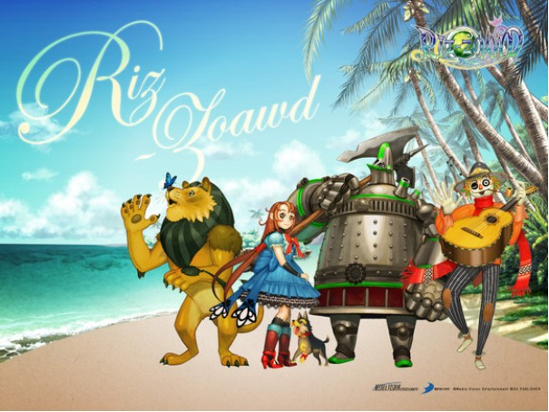

# ＜天玑＞小说集《奥兹的巫师》（四）：狮子王

**远处的高山上亮起了万家灯火宛若一座悬浮在空中的城邦。无尽的虚空使城市似乎扩展了几万倍，填充了半个宇宙。漆黑的森林已经被他们摔在身后，剩下的是漆黑的旷野。**  

# 狮子王

## 宁（天津科大）

 

“我说，咱们这是去哪？”

“翡翠城。”

“里面有大老虎不？狮子害怕大老虎。”

“你就是狮子！再罗嗦让托托咬你。”

“耀武扬威的。铁皮人你说句话。咬就咬吧，有了她，这辈子够了。哎呀，老鼠！”

话音没落，一只巨斧已经旋转着飞了过去，白光一闪中，不偏不倚砍掉了老鼠的头。

“吓死狮子了。”狮子长舒一口气。“你没事吧，桃乐丝？”

趴在它背上的小巧的金发女孩儿已经睡着了。

狮子尾巴灵活地转来转去为她驱赶蚊子，又用柔顺的毛抚摸着她的身体。忽然它感到小小的腿夹得很紧，而且在缓缓用力。

“你醒了？”

小女孩用手捂住它的嘴，示意不要说话，胯部轻轻蹭狮子的后背，脸上绯红一片。

狮子抬头看了一眼。

远处的高山上亮起了万家灯火宛若一座悬浮在空中的城邦。无尽的虚空使城市似乎扩展了几万倍，填充了半个宇宙。漆黑的森林已经被他们摔在身后，剩下的是漆黑的旷野。蟋蟀在吱吱的拉琴，声音一颤一颤，高低起伏。猫头鹰在咕咕地歌唱。能闻见风把青草的芳香吹散的气息，气息中还有萤火虫盘旋的微光。

狮子嘀咕了一声。没人知道它说的什么。那是心照不宣的暗示，暗示自己已经屈服于她滚烫的下体。接着它喊道：

“狮子要跑步前进！”

### 

### 伟大的征程

狮子问道：“你们不觉得那个奥兹的裤裆是湿的么？”

听了这话，铁皮人和稻草人面面相觑，尽管他们已经变成了破烂。

“奥兹是一颗人头，怪吓人的，哪有裤子穿。”

“同意，不过那是火球，不是头，虽然有一点像。”

狮子又问：“那他让我们杀人，会不会来救我们？” 

一堆破铜烂铁答道：“要救我，起码得两大桶黑油。”

一堆杂七杂八的稻草说：“我只要阳光，美美晒一会。”

狮子摸着砍掉一半的尾巴，沮丧地摇头：“别说了，睡觉。你俩没事，狮子明天得给魔女拉车。”

与此同时，城堡的最高处，女巫吃完晚饭，聚精会神地看书。不一会她大喊：“桃乐丝！灯油没了！”一个小女孩光着身子光着屁股从干草堆里爬出来，白皙如雪光滑如玉的腿上划出了一道道口子，渗出了鲜红的血花，好像大雪天里受伤了的豹子。她端着油，小心翼翼走过来。女巫说道：“别想了，你杀不了我。”

 

（采编：黄理罡 责编：黄理罡）
