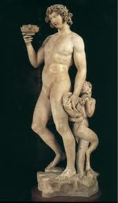
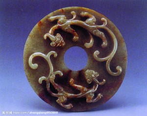

# ＜天玑＞少女藏刀（五）笑我太疯癫

**我们害怕的是自己的生命不是一天天生长，而是一天天萎缩下去。现代文明无所不在的规训与迎合之下我们惊觉自己生命本能的衰竭，从而怀念疯癫，我们好新骛奇、追求刺激，燃烧匮乏的内在，徒加速生命力的消亡。“世人笑我太疯癫，我笑他人看不穿”，这自得其乐的疯人之歌，如今沦为一声苦闷的自嘲。**

** **

# 笑我太疯癫

## 文/花爷（复旦大学）

 

“疯癫不是一种自然现象，而是一种文明产物。”米歇尔·福柯如是说。

作为一种社会现象，在我们意识到这一切是如何发生以前，疯癫已被贴上羞耻的劣等的疾病标签，遭到健全理智主宰下的现代世界的无情驱逐，于理性之光无法照耀的永夜，沉默着悲欢。而文化现象中的疯癫，却如尼采所说，“也许未必是蜕化、衰退、末日文化的象征”——当它褪下丑陋与病态的囚衣，那神秘而魅惑的胴体，瞬间颠倒众生。兼具诗性与哲思的艺术家是其最虔诚的信徒。

（一）

海洋环抱的古希腊，是一切西方文明之滥觞，福柯在梳理疯癫演化史时即指出：“古希腊与他们称之为‘张狂’的东西有某种关系。”远在苏格拉底、柏拉图的理性哲学出现之前，希腊人的艺术本能中里已然蕴含着非理性的冲动。尼采在其第一部著作《悲剧的诞生》中以日神阿波罗与酒神狄奥尼索斯来命名这两种艺术冲动。

日神是光明之神，它的光辉使万物呈现美的外观，“我们用日神的名字统称美的外观的无数幻觉”。可见日神是美的外观的象征，而在尼采看来，美的外观本质上是人的一种幻觉。梦是日常生活中的日神状态。酒神象征着情绪的放纵，其状态表现为“整个情绪系统激动亢奋”，“情绪的总激发和总释放”。酒神的象征来自希腊酒神祭，在此种秘仪上，人们打破一切禁忌，狂饮滥醉，放纵性欲。尼采认为，这是为了追求一种解除个体化束缚、复归原始自然的体验，因此酒神状态是一种痛苦与狂喜交织的癫狂状态。醉是日常生活中的酒神状态。

作为德行之神，日神以其“庄严的否定姿态”压抑着酒神，在其原始的癫狂上蒙上一层美和适度的面纱，而酒神的激流却长久涌动于希腊人内心，如尼采想象的情景：“酒神节的狂欢之声如何以愈益诱人的魔力飘进这建筑在外观和适度之上、受到人为限制的世界，在这嚣声里，自然在享乐、受苦和认知时的整个过度如何昭然若揭，迸发出势如破竹的呼啸；我们想像一下，与这着了魔似的全民歌唱相比，拨响幽灵似的竖琴、唱着赞美诗的日深艺术家能有什么意义！”——在醉的陶然忘我的狂喜面前，梦引以为豪的唯美与自律黯然失色。但这两者都植根于人的至深本能，前者是个体的人借外观的幻觉自我肯定的冲动，后者是个体的人自我否定而复归本体的冲动，均属非理性的领域，“日神与酒神在彼此衔接的不断新生中相互提高，支配了希腊人的本质。”

彼时，“疯癫与非疯癫、理性与非理性难解难分地纠缠在一起：它们不可分割的时候，正是它们尚不存在的时刻。”此后，理性与非理性的对话出现裂痕，“秩序、对肉体和道德的约束，群体的无形压力以及整齐划一的要求”开始主宰世界。文艺复兴时期，西方涌现大量以疯癫为题材的艺术创作，被赋予解放、奇迹、被隐藏的欲望与真理等种种意义，在福柯眼中，这是疯癫遭受理性话语洪流的灭顶之灾前最后一次的振臂呼喊——疯癫与文明的长途，就是疯癫从非理性中步步剥离的旅程，在此过程中，疯癫从与非理性合一处的审美疯狂、伦理疯狂、病理疯狂三者浑融的状态被抽空为单薄的病理疯狂，成为真正的精神疾病。

《疯癫与文明》一书中，福柯以其犀利独到的视角完成了对知识的清洗和质疑，批判了理性对非理性的压制与迫害，在描述戈雅的作品《疯人院》时，他以饱含深情的笔调写道：“在这个用旧帽遮羞的疯人身上，通过其健壮的身体所显示的野性未羁的无言的青春力量，透露出一种生而自由的、已经获得解放的人性存在。”从中我们可感受到福柯对疯癫所持有的一种审美化的态度，他将疯癫视作一种完整的真实自然的个体，一股未经驯服的生命力量，这与尼采所称颂的酒神精神一脉相承，后者曾写下这样的文字，如此壮丽磅礴而令每个读到它的人怦然心动：“……现代萎靡不振文化的沙漠，一旦接触酒神的魔力，将如何突然地变化！一阵狂飙席卷一切衰亡、残破、凋零的东西，把它们卷入一阵猩红的尘雾，如苍鹰一般把它们带到云霄。我们的目光茫然寻找已经消失的东西，却看到仿佛从金光灿烂的沉没处升起了什么，这样繁茂青翠，这样生气盎然，这样含情脉脉。”

（二）

不同于希腊文明山高海阔的自由浪漫，发端于黄土长河的中华文明，与礼乐制度的香火缭绕及诵经习史的朗朗书声相伴而生，以平稳、适度、和谐为核心的“中庸”之美向来是人们津津乐道的审美正统存在，而主张强烈、张扬、冲突的“疯癫”，不过是隐于历史黄钟大吕的正声之下一缕奇诡的异音。然而，在中国的历史上，却存在着一个崇尚疯癫的时代。

汉末魏晋六朝，社会动荡不堪，政治气候的变化无常促成了独特的魏晋士风，“正始名士服药，竹林名士饮酒。”服散后，要脱衣，以冷水浇身，吃冷东西，饮热酒。药性一发，痛苦异常，癫乎若狂，甚至丧命。“晋朝人多是脾气很坏，高傲，发狂，性暴如火的大约是服药的缘故。”竹林名士则以无节制饮酒而名，且其饮酒时多不着衣冠，不分居丧，打出“越名教而任自然”的旗号，追求放达。饮酒服散，“居丧之际，饮酒食肉，由阔人名流倡之，万民皆从之”，过往年代被斥为疯癫的行径，魏晋时期蔚为风尚。当时名士匪夷所思之举，更为世人所交口传颂。如《世说新语·任诞》中载：

诸阮皆能饮酒，仲荣至宗人间共聚，不复用常杯斟酌，以大瓮盏酒，围坐，相向大酌。时有群猪来饮，直接上去，便共饮之。

子曰“鸟兽不可与群”，魏晋名士却甘与猪同，乐在其中。至于扪虱而谈，裸体而卧，诸如此类行为，亦被目为风雅或率性之举而备受推崇。更有如阮籍者，醉卧邻妇身旁，母死却坚持下完棋，而后举声一号，吐血数升，每至穷途痛哭而返，大醉两月而不醒……如此种种，足见其“志气宏放，傲然独得，任性不羁，当其得意，忽忘形骸”，“时人多谓之痴”，却也博得后人仰慕的感叹：“看山柱颊，敢为晋士之清狂。”

魏晋时期，疯癫何以成为美谈？是因为从疯癫之中，我们看见的是一个个解放而自由的、饱满而鲜亮的人格——他们张扬个性，珍重自我，他们放纵不羁，旷达潇洒，他们哀乐过人，至真至诚，正是千载下懔懔如有生气！人格大解放的风气，同时也成就了后世难以逾越的艺术高峰，是以宗白华先生论及魏晋之美时发出如此赞叹：“这是强烈、矛盾、热情、浓于生命彩色的一个时代”，“最富有艺术精神的时代”。

同样地，我们也就不难理解，无论是杜丽娘之风月情痴，贾宝玉之似傻如狂，还是李贽之口出狂言，徐渭之苦闷自戕，那些状似疯癫者何以能够呈现惊心动魄的美态，皆因我们读出了那满纸荒唐言之间的一把辛酸泪，读出了其或痴狂酣醉、或乖张荒诞的疯态背后那洋溢着生命的自由而不屈的灵魂。

（三）

“自中世纪初以来，欧洲人与他们不加区分地称之为疯癫、痴呆或精神错乱的东西有某种联系。也许，正是由于这种模糊不清的存在，西方的理性才达到了一定的深度。……总之，理性－疯癫关系构成了西方文化的一个独特向度。在博斯之前，它早已伴随着西方文化，而在尼采与阿尔托之后仍将长久地与西方文化形影不离。”在《疯癫与文明》序篇中，福柯作出如此预言。

中国文化中的疯癫，则无从体现这种二元价值取向。不同于西方个体意识之强烈，中国古代社会根深蒂固的社会伦理道德意识，渗透于每个人精神与现实、过去至未来的方方面面，使之坚信个人与社会是同生共息，须臾不可分的。是以西方文化中的疯癫体现为自身的分裂，中国文化中的疯癫体现在个人与社会的分裂。这种疯癫更像一种自我放逐，以逃避或抗议现实之不堪，否则那些如梦似狂的呓语何以在魏晋、晚明、晚清等变局之际骤然响亮，太平盛世则趋于消沉：他们“弃圣作狂”，倜傥负俗，并非对社会道德意识的真正弃绝，而是世道伦常本身由真变伪，源流不一所作的负面抵御与适应。魏晋名士坚持礼乐根本的固守，明清狂人何尝不怀补天之志？

因此，西方式疯癫是“面具背后的疯癫，它吞食面容，腐蚀容貌”，中国式疯癫尚裹有悦目的皮囊；西方式疯癫真正瞥见了酒神之醉的狂喜，中国式疯癫尚沉湎于日神之梦的幻觉。与西方所致力达到的“打破外观的界限，释放完整的非理性情绪，直抵痛苦流转的情绪本源”相比，中国式疯癫仅限于突破礼教之束缚、冲决体制之罗网，而缺少了自剖心肝的深刻痛苦，以及世界真相的开阔气象。

此等差异由地域、历史及文化心理之迥别所致，在所难免，但有一点乃是中西如一、古今皆同的，亦即疯癫何以成为审美对象、何以激发人类审美愉悦的本质原因——无论是视疯癫为盛典的古希腊民族，为疯癫所征服的尼采、梵高或阿尔托等艺术家，还是自溺于疯癫的魏晋名士、明清狂人，疯癫必发自一颗敏感、欲望强烈而易痛苦的心灵，而敏感、欲望和痛苦，正是生命的活力之所在。疯癫体现了一种高度的强力感，如同一头皮毛亮滑花色斑斓的猛兽，生于自然而野性俱在，自诩文明之人出于怯懦的恐惧而力图缚之囚之，却无法不心折于那矫健生命的逼人美态。

说到底是人类遥远的生命本能在回应着疯癫的呼唤。我们爱慕那些有力的、激情的、高亢的生命，雄强之极，即美之极；我们渴望那些自由奔放、富于创造的生命，活泼之极，即美之极。如尼采所言：“生命中必须有一种朝气和春意，且有一种常驻的醉意。”我们害怕的是自己的生命不是一天天生长，而是一天天萎缩下去。现代文明无所不在的规训与迎合之下我们惊觉自己生命本能的衰竭，从而怀念疯癫，我们好新骛奇、追求刺激，燃烧匮乏的内在，徒加速生命力的消亡。“世人笑我太疯癫，我笑他人看不穿”，这自得其乐的疯人之歌，如今沦为一声苦闷的自嘲。

（采编：黄理罡 责编：黄理罡）
