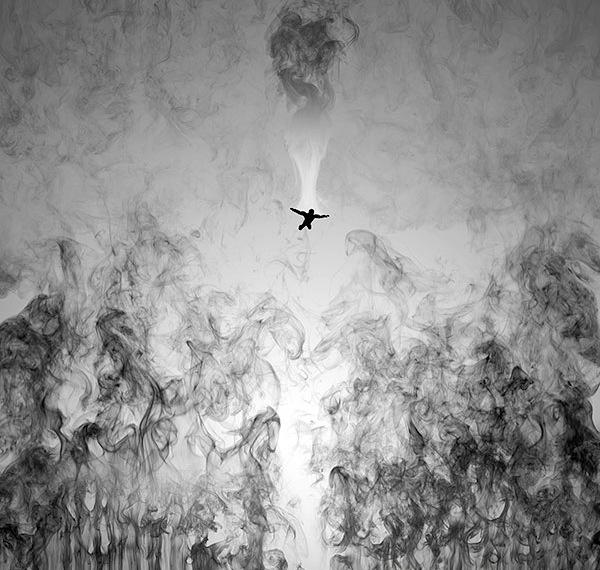

# ＜天玑＞少女藏刀（四）我们为何读福柯

****福柯为何一意孤行破坏常识，不在于揭示真相，不仅是好走偏锋，而在于追求生命的真正解放，坚持独立的、警醒的、永不驯服的反抗姿态，“绝对不能容忍任何不能改变的约束”；我们为何阅读福柯，为之惊心动魄，苦想冥思，既然明知无力抗拒那强大力量的摆布？因为，只要我们还拥有自由思考的能力，质疑批判的精神，便不至于丧失掉最后的尊严，即使已经沙土没颈，还能够昂首保持高贵的呼吸。**** **** ****

**** ****

# 我们为何读福柯

# ——《疯颠与文明》及《规训与惩罚》读书笔记

**** ****

## 文/花爷（复旦大学）

  初读福柯，思想的震撼如狂风呼啸扫荡平原，摧枯拉朽，日月无光。 一些道理似乎对于每个人是不言而喻的：从对疯人放逐驱赶，到将其纳入疯人院管理照顾，至现代精神病院诞生，为疯人提供舒适生活与精心治疗，无疑是文明的进步；从公开酷刑到隔离监禁，以有据可依、公正仁慈，取代任意专横、残暴严酷，更是人道的彰显。 我们向来如此看待社会，评判历史。福柯却说，这些你们从来当作天经地义、与生俱来的东西，全都是被权力塑造和生产出来的。像一个恶毒的玩笑，像一个荒唐的真相。而他写疯癫史，写监狱史，正向我们揭示了这神秘的权力是如何将人类蚕食鲸吞，所谓历史的进步，只是权力运作的自我调整。他告诉我们：疯癫不是自然现象，而是文明产物，“没有把这种现象说成疯狂并加以迫害的各种文化的历史，就不会有疯狂的历史”；刑罚严峻性的减弱，不过是将惩罚对象从肉体变为精神，不再制造肉体痛苦而是剥夺精神自由，因而是“现代灵魂与一种新的审判权力之间相互关系的历史”。二者均体现了权力的嬗变：从对肉体的征服上升至对思想的控制。 且看权力如何以文明之名改造疯癫：古典时期疯人受到所有港口城镇的排斥驱逐而被流放于茫茫大海，疯人完整而自由地支配了那人们所恐惧的未知世界。文艺复兴以后，人们开始强制疯人靠岸，并在陆地上对其进行监禁与镇压。18世纪末，新型精神病院诞生，病人被解除镣铐，受到“人道”对待。“疯癫逃脱了武断的处置，其结果是进入一种无休止的审判”，前者是赤裸裸的暴力，后者是假惺惺的伪善。在疯人院外清白无辜的人，在这里被规训为真正意义的“疯人”——精神上承认自己令人羞耻的疯癫，接受自己非理性的、不成熟的及有罪的屈辱地位，并甘愿为此受罚。这是更加难以反抗的压制：即使肉体得以逃离，他永逃不脱自我灵魂的冷峻审视。 监狱的演变史与之如出一辙。福柯首先提出权力改造非正常人两种基本图式：“麻风病”与“瘟疫袭扰的城市”。麻风病人被遗弃在一片无须加以分解的混沌之中，等待毁灭；瘟疫受害者被镶嵌在一个封闭的、被割裂的空间，一切活动被监视及记录下来。前者是隔离与禁闭，是被打上印记；后者是规训与分割，是受到解析和分配。这二者逐渐汇集为权力控制个人的双重运作模式：一方面二元划分和打上印记，另一方面强制安排和区别对待。 或许这些均不足以引起“正常”人们的警觉，疯癫、麻风病，非死即生的瘟疫城市，权力作用的情况太过极端，距离我们太过遥远。那么来看看诞生于19世纪初的“全景敞式模式”：四周是一个分割为许多小囚室的环形建筑，中心是一座瞭望塔。囚室中的每个人处于被隔绝与被观察的孤独状态，他们能够目睹瞭望塔高大的轮廓，却无法看清塔中情形，只能假设自己时刻受到窥视而自我制约。因此塔中可以是任何人，且不必时刻在场，亦能完美实现其监视功能——有什么外部监视能与灵魂的自我监视相媲美？“一种虚构的关系自动地产生一种真实的征服”，权力如水银泻地般得到最具体而微妙的实施而只需花费最小的代价。这种机制的生命力还体现在任何社会成员有权进入瞭望塔并了解其运作功能，于是这权力的中心受到民主的控制从而避免沦为暴政的危险，掩盖权力明显不平等的实情而貌似合理地维系其运作。 

 这种权力模式在运行中几乎毫无损耗，甚至对社会有所增益，意味着它作为一套规训方案能够普遍地运用于日常生活。“对于监狱与工厂、学校、兵营和医院彼此相像，难道值得大惊小怪吗？” 确实不值得惊讶。伴随我们一生的各种档案资料难道不是“永不结束的卷宗的裁决”？没完没了的阶段性考察评估难道不是“永无终止的审判”？繁琐具体的纪律、规则、条框难道不是“与冷酷好奇的检查交织在一起的精心计算的宽大刑罚”？从不止歇的被排列名次的彼此竞争难道不是“根据一种不可企及的规范测量差距又竭力促成无限逼近该规范的运动程序”？评判与记录我们的人无论是家长、教师、医生，不正是履行监视与登记职能的“法官”？ 当然我们生活中从不作如此想。这种权力机制胜利之处即在于这是一种自动的顺驯。肉体的枷锁内化为精神的镣铐，权力直接牵引大脑柔软的神经纤维，我们四肢听从大脑指挥而翩然起舞，却自以为正高唱灵魂自由之歌。我们总爱追问权力由谁行使，而福柯只关心权力如何产生及运作，因为在他看来，权力弥散而无形，而个人被精心编织于权力网络中。我们无从反抗——既无法挥拳攻击空气，也无法抓着头发将自己拔离地面——甚至我们从未想到反抗，不是吗？我们心甘情愿被打上印记，被区别对待，被监视记录，被评估审判，发自内心地，认为这是美好生活的意义。然后我们读到福柯的书，读到写于监狱史之前的这样一句话：“如果这意味着写一部关于现在的历史，那才是我的兴趣所在。” 像是猛地揭掉世界的面具，露出一张血肉模糊的脸，然后他若无其事地走掉了。留下我目瞪口呆，以为窥见某种真相，既兴奋，又痛苦，兼不知所措。他破坏一切，却未给予任何安慰。但福柯确实没有义务给出答案。他抛出问题，便是一切价值所在，若摧毁堡垒后又重建一个自认为更好的，那与他之前所执意破坏的又有何不同。甚至他呈现的也绝非真相。或者说根本没有什么真相。面具下面的脸也许没有眼睛嘴巴，一个虚空的黑洞，遥远地呼应着某个夜里深沉的梦魇，我们似乎都曾听见传来的隐约的厮杀，却转瞬淹没在现实的滚滚洪流。 说到底，这是为什么？疯人为何逃离，监狱为何暴动，“不在于环境是否太严酷或太令人窒息，太原始或太有章法，而在于其本身作为权力工具和载体的物质性”；福柯为何一意孤行破坏常识，不在于揭示真相，不仅是好走偏锋，而在于追求生命的真正解放，坚持独立的、警醒的、永不驯服的反抗姿态，“绝对不能容忍任何不能改变的约束”；我们为何阅读福柯，为之惊心动魄，苦想冥思，既然明知无力抗拒那强大力量的摆布？因为，只要我们还拥有自由思考的能力，质疑批判的精神，便不至于丧失掉最后的尊严，即使已经沙土没颈，还能够昂首保持高贵的呼吸。  

（采编：黄理罡；责编：黄理罡）
