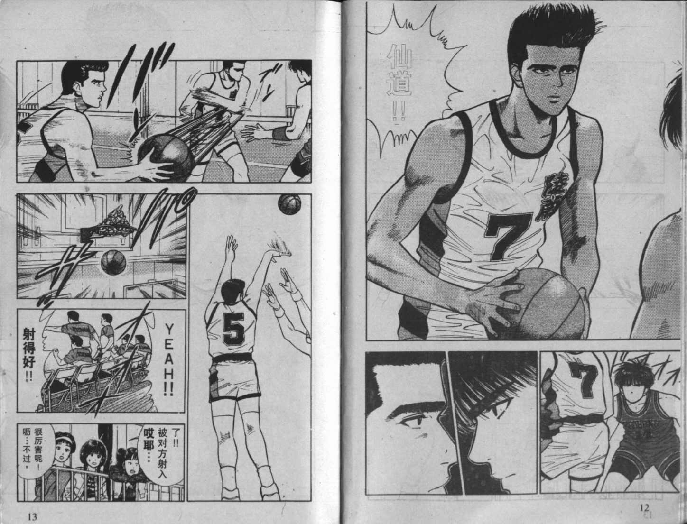

# ＜天玑＞带你进兔子洞，带你磕红药丸（一）：你只是个漫画人物罢了

**如果你想用“你想抬左手就抬左手，想抬右手就抬右手”来证明自己有自由意志的话，是远远不够的。因为谁又能保证这个抬手的意志不是别人放进你脑中的呢？让我们先回到二次元。你认为《七龙珠》里悟空最终能打败弗利萨的原因什么？是因为悟空多年来磨练出的实力么？当然不是！根本原因是鸟山明先生本来就是这么画的呀！** 

# **带你进兔子洞，带你磕红药丸（一）**

# **你只是个漫画人物罢了**

****

##  文/ 井越（华中科技大学）

 看到这个题目广大死宅们是不是觉得神清气爽了一下，但题目的意思绝不等同于你现在出门就能碰到童颜巨乳的大眼女生，而仅仅是个比喻。这个比喻基于这样一个问题：漫画人物知道自己生活在漫画里么？答案显然是否，因为你手中漫画里的角色如果知道他只是漫画里的人物，而且现在正有一大眼在盯着他看，那你觉得他还会淡定自若的去像演员一般通过表演把剧情呈现给你么？ 

那么，漫画人物凭什么不知道自己的真实身份呢？ 首先，由于维度的限制。目前流行把漫画世界叫二次元，这也说明了漫画人物的基本属性是二维的。他们之所以没有像关在牢中的犯人似的疯狂敲打这漫画的纸张，恳求你放他出来，是因为他们对三维的我们完全没有认知能力。这就跟我们想象不出思维中的图形一样（这里暂时不把时间算作第四维）。 尽管现在我们的量子力学弦论确实是在十一维，甚至更高维的空间中描述的，可是我们仍想象不到即使是四维时空的样子。但是我们可以通过降维法来对思维世界加以描述。 让我们先想象一个二维世界（如同漫画一般）。即所有生物都是在如同一张纸的空间上行动的。那么想要困住一个二维犯人，你要做的只是围绕着这个犯人画一个圈，就能把他关起来。他是没有能力“向上”跳出纸张，然后落在圈外的。假如一个二维人真的有突破维度的特异功能，即“向上”一跳的能力，那么对于二维监狱看守来说，二维犯人的越狱过程只是突然消失不见，然后又突然出现在牢笼（即你画的圈）之外。_（以上二维监狱比喻来自《超越时空》，加来道雄著）_ 那么现在回到我们自己的三维世界。当一个具有进入四维空间能力的人想要越狱时，他也只需要“向上”（你会发现这里的“上”完全没有实指意义）一跳，便会在看守面前突然消失。（跨维度旅行也是今后在虫洞中进行星际旅行的基本原理） 所以现在的问题是，即使有一双大眼在无时无刻的盯着我们，我们也可能全然不知，只要这双大眼处在四维空间中。 他在观察我们的一举一动：把你的情感生活当言情动漫，把你高中打架的过程当热血动漫，把你在篮球场上的表演当《灌篮高手》…..对了，亲，不知关于你的 H 动漫会不会使那双大眼充满血丝？ 

 这时候你可能会有个疑问，“漫画人物是被人为地创作出来的，而剧情发展，人际关系，等等都是作者编好的呀，说白了，漫画人为又没有自由意志，所以我怎么可能是漫画人物？” 额…..我没否定漫画里的人物不具有自由意志，我想说的只是我们自己也很可能同样不具有自由意志。这也就是漫画人物不知道自己身份的第二个原因： 如果你想用“你想抬左手就抬左手，想抬右手就抬右手”来证明自己有自由意志的话，是远远不够的。因为谁又能保证这个抬手的意志不是别人放进你脑中的呢？让我们先回到二次元。你认为《七龙珠》里悟空最终能打败弗利萨（_题外话：弗利萨的英文是__Freezer__，即“__冰箱”__而基纽特种部队的成员因为是他手下，其名字都是食物，比如巴特“Butter”__，即奶油_）的原因什么？是因为悟空多年来磨练出的实力么？当然不是！根本原因是鸟山明先生本来就是这么画的呀！ 但悟空自己肯定会一厢情愿地以为使自己打败对手的原因是实力的提高。_（他应该质疑，为什么长久以来遇见的不同对手的实力也随着自己实力的增强在增强，即为什么自己小时候没有遇见布欧？__..__嘿嘿）_。你跟悟空同样傻的地方就是，你以为自己举了左手是由自己支配的。 所以你的生命完全可以是一本小说或漫画，其中的奇妙之处更在于，你有了自己生的目的！ 

 你不再是茫茫历史里的一粒尘埃，不在随时会被冲向地球的陨石摧毁，因为在完成生命任务之前，你坚不可摧。 但这任务是什么呢？如果你存在于一个类似漫画的载体，或媒介中，是为了让谁读你呢？下面我们来探讨。 如果我们都是漫画中的人物，由于有了“作者”（即某种意义上的上帝）意志的参与，我们就必须对我们所谓的生命的目的做一个划分。首先是第一阶的目的，我称之为“归宿“，比如在《七龙珠》里，我们就能认为悟空存在的归宿，或是目的便是打败布欧（因为打败了布欧整个漫画就结束了）。但是还存在这第二阶目的，我称之为意义。即作者鸟山明的写作意图，他为了表达什么，为了写给谁看等等。所以以后当别人问你“你觉得自己的生活有什么目的？”时，你可以叹口气装逼地回答，“您问的是第一阶还是第二阶目的？” 

**附：作者井越，华中科技大学，大二从理工科转入哲学系，所以一直在寻找一个物理与哲学的平衡点。。。。。**

（采编：安镜轩；责编：陈锴）

 

