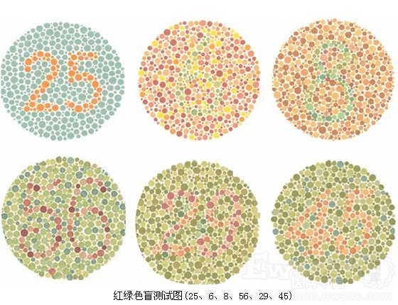
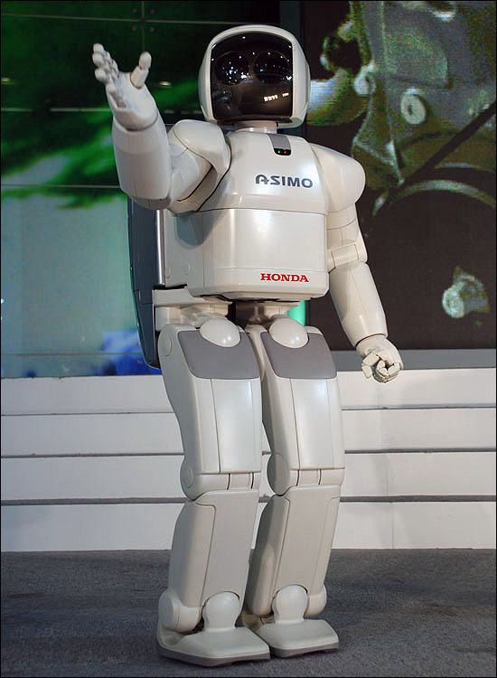

# ＜天玑＞带你进兔子洞，带你磕红药丸（二）：You are（not）alone

**你每天所面临的场景，包括起床，上学，运动，也许都是安排好的。你在做自己的事情时，会不会偶尔发现周围有陌生人在偷偷看你呢？你以为是你长得帅么？不要高兴的太早，也许当你转回头继续做自己的事儿时，你身后的所有陌生人都停下自己手中装模作样的活儿，一齐盯着你呢。而你刚发现的只是其中之一罢了。** 

# **带你进兔子洞，带你磕红药丸（二）：**

# **You are (not) alone **[1]

## 文/ 井越（华中科技大学）

让我们来做个思想实验，假设你得了一种特殊的色觉认知疾病，这种特殊疾病与色盲不同（色盲患者对三原色里某一种或两种颜色分辨不清，常与其它颜色搞混，从而无法对颜色正常分类），你对每一种颜色的敏感程度都与正常人毫无差别，但某两种颜色给予你的**感觉**却与正常人完全相反。比如“绿色”给予你的感觉正是“红色”给予其他人的感觉，反之，“红色”给你的感觉也是其他人眼中的“绿色”。 这个思想实验的重点问题是：你怎么知道自己现在没有患这种疾病？ 

 换句话说，我认为这种色觉认知“障碍”并不能成为一种疾病，不是因为它不存在，而是因为人们根本无法发现它的存在。如果你还不能理解，我举个例子：近期科学家研究发现，女性对色彩的敏感度强于男性，也就是说，在女生眼里，整个世界是更加缤纷夺目的。但是在这个研究在被科学器械诊断得出结论之前，我们并没有通过经验，或是男女生之间的语言交流，来发现这一事实。所以，同样，也许在你眼中所有消防栓的颜色都是我眼中所有邮筒的颜色，但这并不妨碍你我寄信和救火。 在我小时候，我最喜欢的颜色是绿色，我甚至对一切绿色的东西产生好感。可是当我问其他小朋友喜欢什么颜色时，得到的答案却五花八门。这是为什么呢？最终我做出的解释是：大家其实喜欢的都是“绿色”的感觉，只是我们对它的称呼不一样罢了。 长大一点后我对这个想法做了更精确的表达：**我和小朋友们讨论的其实不是颜色，而是光的反射波长。大家喜欢同一种感觉，只是这同一个感觉对已不同人来说对应着不同波长罢了。而由于人类的局限性，我们只能为波长命名（如****500~550****纳米波长的反射光波为绿色），而不能为感觉命名。** 扯这么多有关颜色的话，只是想引出一个哲学观点，即“唯我论”（solipsism）。唯我论的主要怀疑是，你如何确定外部世界作用于你的感觉也以同样的方式作用于其他人呢？或者，再往想深一步，除了你自己，也许根本没有人能感受到色彩，疼痛，温度，味道，气味等感受。 把唯我论放在当代讲很容易被理解，依然用颜色举例，以目前的科学技术，人类已经制造出了能分辨色彩的机器人。可是在机器人眼里并不存在色彩世界，他只是一味的分析波长而已。 同样，一个机器人能更加容易的来模仿人的疼痛。只要它感受到压力或撞击时程序自动输出尖叫，闪避，狰狞的表情等一系列动作就可以了。 这些例举可以无限说下去，换句话说，只要面对的是事物的第二性质[2]，机器人就没有丝毫感受的能力。 

 所以，同一个世界，在机器人和你眼中，是以两种截然不同的方式呈现的，但当你与它谈论这个世界时，你丝毫不会有一点察觉，你们的聊天会如同平时与室友卧谈时一样随心而自然。 **恩，我的重点是，既然如此，你如何确定你的室友不是个机器人？** 你确定不了，但是每每当人类解决不了“是什么”的问题时，我们通常会转向“为什么”。所以，你可以反驳我：为什么我的周围会充满机器人呢？而且很显然，这些机器人还都不愿透露自己身份，装作跟我是同一物种，如同潜伏在我身边的间谍。这丝毫给不出一个理由嘛。 不过，我的回答是，我们没必要拘泥在“机器人”这类日常经验中的概念。我给出的一个代替机器人的超经验概念是，天使（当然你也可以说是魔鬼，我只是想给个超自然的概念）。 对，你只能保证自己是广义概念上的人，而我现在有充分理由假设你周围的人都是潜伏在你身边的天使。 接着让我来解释“为什么”的问题。 之所以有这么多超经验的东西围绕在你周围，是因为你自出生以来便在接受一场考验。而你周围的天使都是在充当记录员和演员。他们一方面来设置重重场景来考验你面临它们所想要的情况时会有什么举动，一方面作为记录员来记载。 你每天所面临的场景，包括起床，上学，运动，也许都是安排好的。你在做自己的事情时，会不会偶尔发现周围有陌生人在偷偷看你呢？你以为是你长得帅么？不要高兴的太早，也许当你转回头继续做自己的事儿时，你身后的所有陌生人都停下自己手中装模作样的活儿，一齐盯着你呢。而你刚发现的只是其中之一罢了。 说到这儿你可能觉得我扯淡扯的有点儿过了，也有人会嘲笑地说，反正基于“唯我论”出发，你可以设想任意一个场景来吓唬大家。 好吧，我承认这确实是我编造出来的场景，但是我仍要明确，这个场景并不是完全仅仅只建立在哲学中“唯我论”基础上的。下面让我们转向物理学的前沿，量子物理，以其中的一个基本理论来“证明”我刚提到的略带恐怖色彩的假设。 量子物理提出，我们平时所看到的所有物体，都只是以一种概率波（即德布罗意波）[3]的方式存在的。换句话说，在你没有看见确实的物品时，你是不能肯定地说出物品的位置的（根据海森堡测不准定律）[4]。再换句话说，除非你亲眼看到咖啡杯，你是不能确定地仍准咖啡杯并拿起它的，因为你的咖啡杯的位置只是一种概率罢了。直到你看见，也就是说你意识参与进咖啡杯系统中，整个概率波才坍缩成一个具体事物，即你的咖啡杯。你也可以想想那只可怜的薛定谔的猫吧（次猫在Sheldon的T恤上经常出现），直到你观察它之前，它的死活完全是一种概率[5] 对不起大家，我又没收敛住自己的话唠，我的重点是：量子力学（注：主要是其中的哥本哈根学派[6]）告诉我们，当你没有回头看你身后时，你身后的所有东西都是他妈的浮云！ 也许你们还不知我说这个跟上文中那个被天使们考验的你有什么关系。那么请仔细想想，我说过天使们都是“演员”，那么你周围的事物（包括你接触的和身边“人们”接触的）不都是道具嘛，当你不用那些道具时，那些道具是不是可以被收走了呢亲？ 一切如同电影一般，不出现在镜头里的道具是没必要继续摆在那儿的，而之所以这部电影还没有穿帮，是因为你只能主观的来观察世界，你永远看不到镜头（你的眼睛）之外的事物，随着镜头（你的眼睛）地移动，道具也在不断重新摆好你认为理所当然的位置。 

 接下来，我进一步假设，如果这些道具会随时被撤走，那么整个监视你的场地会不会也是有限的。也许只有一个城市这么大。什么？你说你出过国？…请问你如何保证你乘坐的飞机只不过是在原地晃动，而窗外的景色只是些投影和布景，你身边的乘客，作为旅伴的父母，都是是观察人员（即上文的天使），想通过这次“旅游”的机会来进行新的一轮对你的测试呢？ 但是你还是会问“为什么”，为什么全天下的人费那么大力气来测试你呢？ 回答是我不知道，因为我懒得继续想下去，即使我给你个所谓的猜测，你也会凭着自己的经验继续问为什么，这必然引起了无穷后退的尴尬场景，而事实又很可能是超经验的。所以现在就此打住把。 用一句话总结一下：作为人类，也许你真的很孤独。（未完待续）  附：  **体现****“****唯我论****”****哲学思想的经典影片《楚门的世界》** ****

****

** ** **** **注释：****** [1]： 文章标题出自EVA新剧场版副标题 [2]： **第二性质**，由英国哲学家约翰洛克提出，洛克主张感官的性质可分为“第一性质”和“第二性质”。物质的第一性质包括了[形状](http://baike.baidu.com/view/1105819.htm)、运动或静止、数目等和物质不可分离的那些性质，而次性质则包括了颜色、声音、气味等其他各种性质。洛克认为主性质就在物体里，次性质只在知觉者中。 [3]：: **德布罗意波**，又称物质波，属于概率波，指空间中某点某时刻可能出现的几率其中概率的大小受波动规律的支配。量子力学认为物质没有确定的位置，它表现出的宏观看起来的位置其实是对几率波函数的平均值，在不测量时，它出现在哪里都有可能，一旦测量，就得到它的平均值和确定的位置。由[法国](http://baike.baidu.com/view/64741.htm)物理学家--德布罗意提出的概念。 [4]： **海森堡测不准定律**，是量子力学的一个基本原理，由德国物理学家海森堡于1927年提出。该原理表明：一个微观粒子的某些物理量（如位置和动量，或方位角与动量矩，还有时间和能量等），不可能同时具有确定的数值，其中一个量越确定，另一个量的不确定程度就越大。 [5]：**薛定谔的猫**（:**Erwin Schrodinger's Cat**）是奥地利物理学家埃尔温·薛定谔试图证明量子力学在宏观条件下的不完备性而提出的一个思想实验。实验内容如下：把一只猫放进一个封闭的盒子里，然后把这个盒子连接到一个包含一个放射性原子核和一个装有有毒气体的容器的实验装置。设想这个放射性原子核在一个小时内有50％的可能性发生衰变。如果发生衰变，它将会发射出一个粒子，而发射出的这个粒子将会触发这个实验装置，打开装有毒气的容器，从而杀死这只猫。根据量子力学，未进行观察时，这个原子核处于已衰变和未衰变的叠加态，但是，如果在一个小时后把盒子打开，实验者只能看到“衰变的原子核和死猫”或者“未衰变的原子核和活猫”两种情况。  Sheldon 在《生活大爆炸》第一季最后一集中拿“薛定谔的猫”来调侃Penny和Leonard的关系，原文是： In 1935,Erwin Schro Dinger in an attempt to explain the copenhagen interpretation of quantum physics.He propose an experiment where a cat is placed in a box with a sealed vial of poison that will break open at random time.Now ,since no one knows when or if the poison has been released until the box is opened.The cat can be thought of as both alive and dead.Just like Schro Dinger 's cat,your potential relationship with Leonard right now can be thought of as both good and bad.It is only by opening the box that you will find out which it is. [6]：**哥布哈根学派**是20世纪20年代初期形成的。其中玻恩、海森堡、泡利以及狄拉克等都是这个学派的主要成员。是当时世界上实力最雄厚的物理学派，不过因为其理念太过“惊人”，所以很多观点不被爱因斯坦接受。  

（采编：安镜轩；责编：陈锴）

** **

