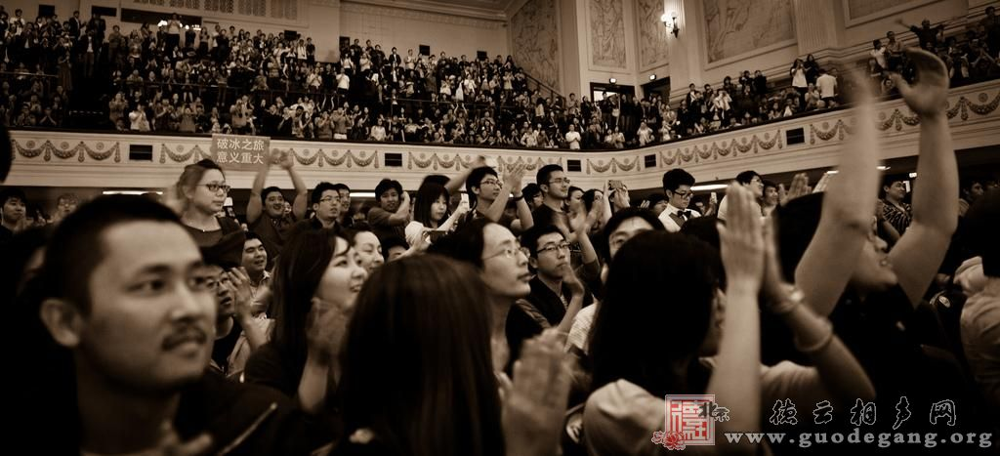
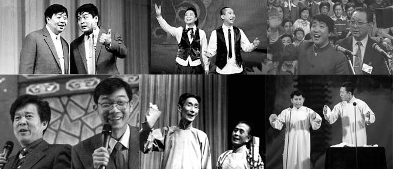

# ＜天玑＞從春晚相聲說開去（五）：2006-2011

**現在的中國，一大群赫胥黎的背後，站著九個奧威爾，我們多希望董卿的那一句不是口誤，多希望馬季能夠回來，更希望馬季的那個年代，也能回來。**

# 從春晚相聲說開去（五）：2006-2011

## 文/馬軍（國立台北大學）

 

05年，中國第十三億個公民誕生。十三億，不知道這是不是點燃地火的最後一個火苗，民間的力量在這一年也噴薄而出。中國一個草根火了，她叫李宇春。春哥是第幾個登上時代雜誌封面的中國人，這個我沒做過統計，不好亂講，然而除去政治人物，以純粹民間人物的姿態登上時代的，即便再有先例，李宇春也應該是前幾名。

那一年，火爆程度不次於李宇春的，在文藝圈，恐怕只有郭德綱了。放在一年以前，如果有人認為世界上還存在著會販賣相聲票的黃牛，那這個人的智商應該比牛還要低。然而郭德綱火了之後，天橋德雲社的劇場外的黃牛們，都恨不得自己真的是牛，可以吃一頓飽三天地天天守在德雲社的門口，買一張郭德綱的票。

於是乎，中國的民間開始呼喚著能在春晚上看到郭德綱。

從那時候起，民眾的呼喚還是變得有效而激烈，而且是越有效越激烈。除了年紀打到民國時期就成年的老人們，大部份中國人雖然一輩子都沒見過選票長什麼樣子，連居委會主任是誰，都無法決定。但是隨著草根力量的崛起和網絡通訊手段的普及，中國人可以決定電視臺上的漂亮姑娘帥小夥子們誰是冠軍誰被淘汰了。於是中國人的選舉熱情在這一點上爆發，據說有人花50萬賣手機卡，就是爲了給李宇春增加幾千長票數。那一年的長沙，經常有粉底團上街為自己的偶像拉票，聽說不同的粉絲團見面時還爆發了衝突動了粗。由此也能得出一個結論：別總笑話台灣的立法院，等咱也有了能吵架的議會，打架的事情，不會比台灣少。

面對著民眾的呼聲，郭德綱顯然比周立波更沉穩，也更聰明。郭德綱從未說過自己只是“京津人民的小菜”，不當“全國人民的水餃”。而是用了更草根的方式從根兒上斷了自己上春晚的可能，那就是一個《我要上春晚》的段子。

於是我們便知道了，郭德綱是不會上春晚的了，但是不知道是有意安排，還是無巧不成書。那一年的春晚央視從台灣找來了一個叫做朱德剛的演員，像模像樣地穿著大褂說了出《繞口令》，如果沒記錯，上一次春晚還有人穿著大褂說相聲，應該要追溯到1999年的超級新人奇志和大兵。不知道這裡頭是不是包含著一種隱喻：我們丟掉的自我，只能去台灣，才能尋得到。

這幾年的中國大師隕落，中國相聲最大的兩個團——中廣和鐵道的頂樑柱馬季和侯耀文時隔半年先後去世。象徵著主流相聲圈子最高水平的旗子倒下之後，相聲在民眾的心中，徹底地和郭德綱畫上了等號。那時候的郭爺窮人乍富，十幾年的存貨一夜之間倒給了中國的觀眾，徹底給01年過去，08年未到這樣一種精神上青黃不接的時代集體補了HIGH。而下一次中國人在文化上集體狂HIGH，應該都要排到《讓子彈飛》了。

中國的未來在民間，中國的未來在草根。草根不及想讓誰火誰就火的體制，草根想出頭，靠的必須是自身的真本事。草根郭德綱的興起，除了時代之外，更多的原因，還是自身的能耐足夠HOLD住觀眾。可惜有的人就是認不清楚這一點，剛半火不火，就想揚名立萬。郭德綱的大徒弟何雲偉和郭的師弟李菁單飛之後上春晚說的段子，除了段子不好笑之外，一切都充滿了諷刺的幽默感。春晚想借捧紅兩個“叛將”來跟郭德綱叫板，結果更加鞏固了郭爺的地位。他們不知道，郭德綱早把觀眾們的口味養刁了，相聲圈子再也不那麼好混，沒點真絕活，真的沒辦法上臺混了。不知道何雲偉李菁二人現在是不是懂了這個道理，不過不懂也沒關係，因為還有人兒比他倆更不懂，比如李偉健和武斌，比如賈玲和白凱南，還有一個我看到就會轉臺的小白臉，周煒。

人民的口味越來越刁，春晚也越來越難做。難做的原因不只人們早已厭煩春晚將近三十年基本沒變過的形式，更是因為眾所周知的原因，能說的東西越來越少，不能說的東西越來越多了。92年維族演員克裡木還在春晚上說過相聲夸過黨中央的民族政策。現在來看，即便是一個亞克西，都顯得無比諷刺。相聲脫離了諷刺，也便沒了生命力，著不僅是相聲的悲哀，也是整個時代的悲哀。當年馬季的《五官爭功》多麼的犀利，而轉而回想下馬東的《新五官爭功》，最能讓人記住的，似乎還是董卿把馬東說成馬季的那個口誤吧。

現在的中國，一大群赫胥黎的背後，站著九個奧威爾，我們多希望董卿的那一句不是口誤，多希望馬季能夠回來，更希望馬季的那個年代，也能回來。

 

（采编：麦静；责编：麦静）

 
