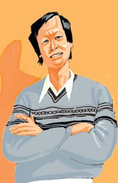
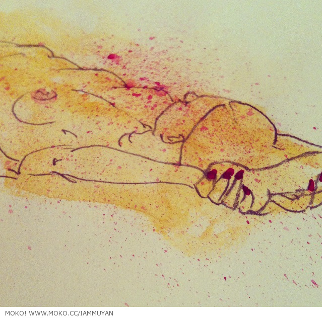
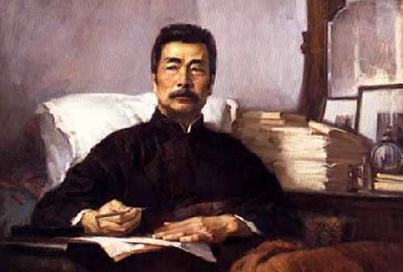

# ＜天玑＞性与革命（二）

**按照这位朋友的回忆，三十而立，性欲旺盛的鲁迅每天晚上都靠穿长裤、睡硬板床来压抑性欲。我的结论是，鲁迅先生所谓如椽之巨笔，还有近乎苛刻的批评当下，几乎骂遍了身边的同行，最后是激发了革命的斗志，一生著作颇丰，意志顽强……以上所述，都与他被压抑的性欲有关。所以，论题是：被压抑的性欲可以通过某种途径被转化为无限的革命热情。就像濒死的审判可以带来对生的渴求，而从某种角度，性=生。性只是生的另一种转换形式。**  

# 性与革命（二）

##  文/张畅（浙江大学）

 

也许是小波死掉了。读死掉了的人的文章心中总是毛毛糙糙。和态度没关系，这里不讲政治挂帅阶级斗争。这种感觉不包括读四书五经读资治通鉴，只属于读那些鲜活的生命的故事的时候。比如，王小波，比如三毛，比如子尤。不知道为什么，总觉得子尤和我的生命有狭窄的通道，看到他的侧脸的相片，觉得仿佛前世有过什么交集。多恶心！我讨厌前世就相识的故事，我想一方面是因为前世相识听得太多了，像梁山伯与祝英台、像贾宝玉和林黛玉。可是结果总是悲剧不堪。谁还信得过前世？另一方面，可能是觉得这是搭讪才用的通俗庸俗的把戏，带着那么点儿八十年代言情小说的诡辩的逻辑。不喜欢。

但是和子尤，总是有那么点儿瓜葛。读到他的诗他写他的情书的时候，我就不正经地想这个少年情人是多么可爱啊。可惜他走了，在红色的玫瑰丛里走了。我们估计以后才能相见。

我喜欢神童的故事。不包括伤仲永之类。我只是喜欢那些天生早慧的案例，无论是音乐、文学还是其他。都喜欢。拿来读的时候，一边慨叹自己不是，一边欣赏别人是。这种感觉相当奇妙。我想我的生活总是平淡无奇的，也从来懒得做天才梦。天才也不总是昙花一现，他们的躯干和头脑里，总是有点儿常人无法破解的密码。你越好奇越好奇。当天才泯然众人的时候，多半大家都打着鸡蛋，挥着手臂说，我早知道会这样！早知道什么！天才永远是天才。就算变成众人了也是天才，至少还有天才的记忆。我们这些人，有什么？快乐的记忆？

我想我不是天才，不是神童。按照物以类聚人以群分的道理，我的周围大概也没有。可是天才的定义究竟是什么，我都分不清楚。刚上小学的第一天，我后桌的女孩子能用铅笔一口气写出小学的名字，我趴在桌子上盯着她看，羡慕极了。因为那两个字那么复杂。我觉得她是天才。后来一同上小学、上初中、上高中，到了大学，才发现她只不过比我早学会怎么写那两个不太复杂的字。天才总是有数不清的神奇，她的神奇我数到小学毕业就懒得数了。

后来，我遇到很多英语一流、成绩超棒的人……有点儿数不胜数了。天才的标准似乎变高了。也许，当天才聚集到一块的时候，你就会怀疑，他们都不是。天才与你要有一段距离，不能太远，太远了就像神话，像杜撰。不能太近，太近了就知道他们是怎么为了那么一点儿才能抛头颅洒热血的。你就想，我当初要是和他一样，也……但，生物组合千千万，总不能周全。只有一件事实：你不是天才。

读王小波的东西，就觉得自己也能写小说。我暗自觉得自己有这潜力，可是写什么，就是问题。于是，我又得出一个只符合我自己逻辑的结论：写小说，关键是要写什么主题，不在乎用什么技巧，什么手段。手段和技巧都是暂时的，主题才能长久。不要写政治，一是比较复杂、水平不够写不出来；二是比较危险，胆量不够写不出来。写人，写人的故事。人可以超脱于政治存活，可是政治没有了人就是一个空架子。我试图用最简单的数学模型来说明，可惜有心无力，已经不学数学好些年了。

再回到昨天晚上。昨天晚上我一个人躺在床上，四周一片漆黑。我想，以前的事情就像梦一样在脑子里过滤，喜欢的、不喜欢的，留恋的讨厌的，都在。一遍又一遍。我后悔没有把陪了我十年的兔子带过来，只要抱着这个小东西，和她说话，就不会胡思乱想了。绝望的时候也就不绝望了。这么些年，她几乎成了我的精神支柱。考试失败、失恋、想家的时候，只要她在身边，就不那么绝望。可是，这一次来英国，我不忍心把她塞到我狭小的背包里，就让她安安稳稳地睡在我床上了。结果就是，在英国一个人的孤独和绝望无处发泄，变成了一种病，就是神经病。或者就是极端的偏执狂和中度的抑郁。

把依靠的感觉物化总是好的。比如我的兔子，比如我曾经的男友。因为你拥有他们的时候，你紧紧抱住他们的时候，是最真实的满足感。真的不需要多说什么，任何都不需要。危险就是，当他们全部不在了之后，你暂时还无法找到依靠的时候，精神就趋于崩溃了。没人理解他们曾经带给我什么好处，包括现在。没人知道我为什么怀旧到固执的地步。认识我的、不认识我的，相信只要听了我的故事就会说一个字，艹。可现实就是现实。爱上了难以脱身，感情经不起自己左右而沉沦于他人，是我这辈子至今遇到最大的灾难。灾难不够灭顶，但是灾难足够让我郁闷到死。死不是灭顶的同义语，死比灭顶要好一点。死后自有一个世界，灭顶后什么也没有。这是我的理解。

既然大家都喜欢用成功和失败衡量所谓价值者云云。那偶尔用一下作为自己的也不无过错。高中的同桌喜欢读《飘》，在临近高考最后的冲刺阶段也依旧爱不释手。她的成绩就如同“飘”一样起伏跌宕，刺激非常。班主任是教历史的年轻老师，我记得她经常在历史课上对我的同桌说，你就“飘”吧，看你以后能“飘”到哪里去！这大概相当于是东北人的冷幽默，嘲笑别人的快感是其他人体会不到的。结果是，这个同桌高考时发挥超常，考进了上海某著名大学的经济系。后来见面的时候，这家伙半开玩笑地说，老师后来说她“傻人有傻福”。

我是这样理解这句话的。虽然我早就不做阅读理解这一类坑蒙拐骗的题目了。说她是傻人，证据是高考大家复习你不复习，你读课外书。说傻福的意思是，最后得了一个没有看课外书的人都达不到的结果。这全在意料之外。如果她失利了，这句话理应改写。

这件事如果尚可理解为是老师对学生的爱之心切的话。那么成功即标准，存在即合理在另外的领域里则为谬论了。做一个不恰当的比喻，如果性爱的结果不是怀孕造人的话，那么这次性爱是失败的。这显然是不合逻辑的。但是如何衡量性爱的成功，我尚且没有经验。如果是我的话，应该可以说是享受过程，别出乱子。如果每个人都像王二（王小波《黄金时代》的主角）一样把精液射到庄稼地里，并一次又一次期待未来不同的感受的话，世界还是美好的。现实是，王二生活在个人意识和生命意识最淡泊的年代，他的承受远超出射精和简单性爱的需求。至于，他是如何把这些不相干的事情转化到生理激情的。我也不得而知。这要以后才能知道。

就像，我和几个同学讨论鲁迅。（站在正常人的立场是大不敬的讨论，这里写出来只为记录，毫无亵渎之意）。我曾经看到过鲁迅的一个好友回忆说，鲁迅和他第一任妻子的关系很僵，可能是天生的叛逆心作祟，鲁迅拒绝和妻子同房。最后远走他乡，留学日本。按照这位朋友的回忆，三十而立，性欲旺盛的鲁迅每天晚上都靠穿长裤、睡硬板床来压抑性欲。我的结论是，鲁迅先生所谓如椽之巨笔，还有近乎苛刻的批评当下，几乎骂遍了身边的同行，最后是激发了革命的斗志，一生著作颇丰，意志顽强……以上所述，都与他被压抑的性欲有关。所以，论题是：被压抑的性欲可以通过某种途径被转化为无限的革命热情。就像濒死的审判可以带来对生的渴求，而从某种角度，性=生。性只是生的另一种转换形式。

我们几个毛头孩子大声地在饭馆里讨论鲁迅和革命志士的性欲转换问题。几个学长甚至引用了卢梭等人的哲学理论作为论证，在头脑里搜寻到各国革命时期的稀奇古怪的实例作为论据。最后出现了逻辑谬误，几个人头脑不甚清楚，就呆坐在那里意淫。企图找到一点儿灵感。这些，都是后话。

（未完待续）

 

（采编：应鹏华；责编：麦静）

 
