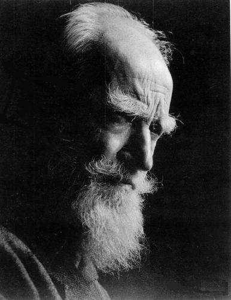

# ＜天玑＞性与革命（四）

**但是，当你从书中醒来回到现实，听到门外轰鸣的汽笛和窗外飘落的雨点的时候，你才逐渐找到你自己。而你读到的这些东西，其实是不需要刻意记忆的，它们会自动地融化成你血液中的一部分，在很漫长的日后决定你一个行动和决策，也许微小也许庞大。但是，我一直无比坚信你所读的思想，是可以在某个时候左右你的言行的。这就是文字的魔力。**  

# 性与革命（四）

## 文/张畅（浙江大学）

 

在曼大上课的时候，中国文化传媒，一个英国学生问老师，是不是中国政府进一步开放网络作为人们表达思想的渠道的结果之一，是中国人都将政治热情和各种想法转化成文字了，就没有对现实的愤怒或是反抗了？我惊讶于这名英国学生的思辨，却没有什么底气回答。如果按照这样的逻辑来讲，开放网络又称为一项政治手段，一切的一切都淹没在无穷的政治话语体系中，又全部丧失它们真实可感的意义了。我想了很久，企图推翻，企图佐证，企图辩论。可是结果是，依旧是无话可说。我讨厌这种无话可说，尽管原初的责任或许并不在我。

我突然想起有一夜，我梦见自己在月黑风高的夜晚和其他三个同伴爬上了敌军的城楼。我在第一个的位置，爬到一半的时候迎面撞见了两个敌兵。他们都似梦游一样睡眼朦胧，手里都举着枪。其中一个举起枪冲着我，不开火。我清晰地看见了枪眼的样子，我的心脏似乎停止了……惊醒，我想起那大概是辛亥革命武昌起义的战场。我说不清为什么一定是这个战场，但是我坚信在梦里，我是历史的一部分。王小波说，在革命时期没有人为死了人而伤心，在革命时期没有人会真的死。杀掉了对方一个人，就如同在工商社会力赚到十几块钱一样高兴，自己失掉了一个人，就如同损失了十几块钱有点伤心。我有点儿沮丧。因为如果在梦里，我真的死掉了，也没什么人替我伤心。但伤心又如何呢？我疑心好多事情就是在这样的质问中变得微不足道，最终意义丧尽。人就成了只追求“有用”，不管任何其他的动物了。

无论怎么说，我总是认为最好的方法不是围追堵截，而是疏导扩散。让全部的言论都在人们的视野中进行，让全部的观点都在公众的眼皮底下扩散。这样，当有一天，大家突然醒悟，发现自己所接受的种种言论都不一而足，就必须依靠自己的判断力来决策了。这个时候才是国民的自主意识觉醒的时候，才是整个社会去面对真正意义的转型的时候。如果说了真话，但没有呈现真话的全部，那么和说假话造成的结果，从某种程度上而言，是一样的。我绝没有任何反叛的意味，尽管我也曾担心自己因为说错话在若干年之后被指控“反革命”……但这都是电影里的镜头了，我只是想说我的看法，尽管它们不一定正确。

照我的看法，所有的人心里其实都有一种英雄主义情结的。尽管害怕战争和死亡，但是我们宁愿都成为无所畏惧的战士，去杀人，杀敌人，然后战死沙场。可现实是，我们都在极度丰富的物质时代诞生，享受着几乎是前所未有的幸福生活，却始终被一种凋谢的英雄主义所折磨。人总在期待做大事情，成大事业，振臂一呼应者云集。于是就站在现实空旷灭寂的空气中喘息，为了这个英雄主义，搭上了全部的梦境作为抵押，结果依旧一无所获。

追求原初的美的东西，那种感觉可以覆盖全部的沮丧。比如，我时常回忆起小的时候，自己一个人盯着一件东西，比如沙堆或是天上的云彩，你会觉得自己将全部的全部都忘记，你不记得你叫什么，不记得自己现在在何处，将往何处去。你觉得，你自己就是沙堆里的一粒沙子，或者是云朵里的一滴水，或者是天空里的一抹颜色，总之你变成什么东西，整个世界都是光明无比的。这种情况经常在儿时出现，后来越来越少，直到今天，日日面对着电脑屏幕忙得不亦乐乎的时候，你还是在自己制造的漩涡里斗争，始终都忘不掉你自己。

小学的时候，一个加拿大学中国哲学的老师问我，什么是“坐忘”。我说，没有这个词吧。后来，很多很多年之后，我突然读到了这个词，才发觉自己过于浅薄了。不知道不等于不存在。而坐忘，大概是一直以来我心里的一块疙瘩，也许是由于小时候变成一朵云的美妙的回忆，也许是由于在英国的课堂上被卷入了一场讨论却无话可说的窘迫。

我想我不敢动手写小说，是因为曾经的一个老师说，你的文章语言还可以，就是衔接太突兀了，叫人疑惑。从那以后，我一直留下这个毛病，直到今天。我喜欢把我想说的东西变成一堆毫无规则的石块，然后用自己最爱的姿势撒到海水里，是一片无边无际的辽阔的海，是一片自由阳光灿烂的海。我不等待这些石块的回声，我只等待我撒完它们时自己心绪的平静。也许，这注定我成不了一个小说家，至少是一个对读者负责的小说家。我搜集起这些石块的时候，我是自恋式地快乐，当我抛出这些石块时，我是无比地满足。我从不期求从大海那里得到什么，我只从这个动作里获得无尽的快感。

不知道是不是所有的作家都可以获得这样的快感，我不是作家，我不知道。

对我而言，我总觉得，你所知的东西越多，越是对你和这个世界沟通的阻遏。我知道这不合逻辑，但是我还是坚持。这是我能够解释梵高身后盛名，解释尼采后世的膜拜以及司马迁流芳千古的最直接的方法。他们，都是胸中藏有丘壑，在天地间行走的人，可是却没能在活着的时候克服孤独。由此可见，知道得越多，并没有把你带入到光明的通衢，反而可能将你引向生命的苦难和无限的孤独中。人于是就在追求这种孤独的过程中走向死亡，寻找永恒和意义。我于是，看到了很多希望，是伟大的希望。

有人说，读书能够帮你找到自己。我倒觉得，读书的时候是没有自己的。比如在你读一本对你产生极度共鸣的书的时候，你是可以如同小时候看云的时候一样是忘记自己的。你已经自然而然地和书中的某一种元素结合，或是一个人物，或是一种思想，或是一个言论，抑或仅仅是一句话一个字，总之你已经察觉不到自己的存在。但是，当你从书中醒来回到现实，听到门外轰鸣的汽笛和窗外飘落的雨点的时候，你才逐渐找到你自己。而你读到的这些东西，其实是不需要刻意记忆的，它们会自动地融化成你血液中的一部分，在很漫长的日后决定你一个行动和决策，也许微小也许庞大。但是，我一直无比坚信你所读的思想，是可以在某个时候左右你的言行的。这就是文字的魔力。

假如有一天，有人读了我这篇很烂的东西，完全在呓语的文章，他觉得和他的生活有一个交集。那就是我没有结局的胜利了。如果有一天，当我再一次看到我这篇很烂的东西，还是觉得它很烂，甚至更烂。那就是我没有结局的胜利了。因为我很可能早已经变成了文字世界以外的人，一个空空追求荣誉却无法让自己内心饱满的人。没有人知道，包括我自己，写这样的文章做什么。

我甚至终于不能明白，革命和性爱是怎样扯上关系。这不是论文，我没有论点，也没有完整的有说服力的论据。我只是在讲一个我自己思维跳动的故事，讲一段也许自己都不甚明了的逻辑。

所幸的是，这确是一个说不完的故事，一个讲不清的逻辑。

 （本专栏完）  

（采编：应鹏华；责编：麦静）

 
