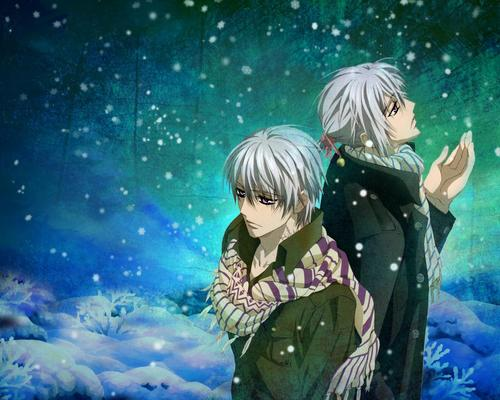

# ＜天玑＞我们不能再被批评了（二）：双生子

**“不会的，我想爸爸妈妈不会发现的。否则，他们不会给我们穿上不同颜色的衣服。”**  

# 双生子

## 文/阮卒（南京大学）

 

旧市里没有人不知道“早死鬼比科蒂”的。自从因破产离开西西里岛起，比科蒂这个姓氏似乎就被肺结核缠上了。连续很多代，这个家族的成员无不因为这种可怕的疾病而过早死去。

“离那些早死鬼远一点，”，旧市码头边的鞋匠对刚上岸的水手说，“比科蒂家做棺材的木料都够造一艘帆船了。”

可不是这样？兴许还不止呢。这个晦气的家族！但他们又那么的出名。所有人见到他们都尽量绕开，但又忍不住看看他们的脸——没有经历过死亡的人，大概都会很好奇：快要死的人是个什么模样。

并没有人把他们当作旧市居民的一部分。在他们眼里，比科蒂家族的大事小事更像是用墓碑雕刻的街头小报，作用仅限于填充起旧市居民空虚的生活——

“什么？她不知道他姓比科蒂吗？她到底想做什么？想跟死亡结婚吗？”

“孤儿？我就说，只有死人才会把自己的女儿嫁到比科蒂家——想再见到自己的女儿，没有比这更方便的办法了。”

“比科蒂家生了一对双生子？喔，真不错，这些孩子可以拿骨灰盒当积木了，可以搭得比他们自己还高。”

“真是个细心的母亲，给哥哥穿黑色的上衣，弟弟穿绛红色的上衣。他们以后的棺木也是这两种颜色吗？这样死了也不会被弄错。”

关于这些闲聊里的丈夫或是父亲，我们需要记住的是：他姓比科蒂，他刚刚三十五岁，他还活着，他的寿命已经是巨大的成功——当然，他也许很快就要死掉了。他的家庭成员除了妻子，还有一对双生子，哥哥桑德罗和弟弟马西莫。当然，这也是比科蒂的最后四个活人了。

对于他们来说，活着已经不属于基本的要求，如何才能不像其他家族那样死去才是最值得关心的问题。年纪尚小的桑德罗和马西莫对过去的事并不太清楚。不过，父母缄默而忧伤的脸已经足够让他们的童年与众不同了。

“童年？要什么童年，疯了么？让他们带着比科蒂的姓氏活着离开那该死魔鬼才是最重要的事！”

这个被死亡的阴影震慑得不知所措的父亲是这么说的，他的确也是这么做的：桑德罗和马西莫除了上学就必须呆在家里严格按照医生的要求吃药休息。不过，鉴于桑德罗的身体比起弟弟要显得更健壮一些，他偶尔也会被父母带着一起去散步。尽管如此，像别的孩子那样的嬉戏是绝对不允许的——桑德罗也很清楚这一点。

桑德罗很关心自己的弟弟，这大概是出于作为一个兄长天然的责任感。但他似乎把父母的区别对待误解成了对自己的偏爱。

“不，这样不对。”，桑德罗想。

想了很久，桑德罗终于向弟弟提出那个建议。马西莫欣然接受，兄弟俩便交换了上衣，同时交换的还有名字。当然，这只是为了让弟弟也得到相同的爱。

“嗯，哪怕只是几天也好。”——他们说好几天后就换回来，他们的父母会发现么？

“不会的，我想爸爸妈妈不会发现的。否则，他们不会给我们穿上不同颜色的衣服。”

 

（采编：应鹏华；责编：应鹏华）

 
