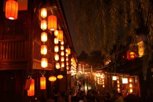
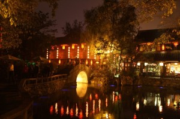
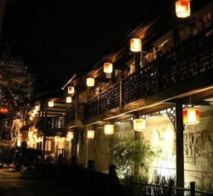

# ＜天玑＞我的记忆是一座城之一·锦里

**她的白色丰田路过琴台路、浣花溪、滨江路，一直到双流国际机场。她说她最喜欢沿途盛开的大片大片向日葵，毫无征兆的从道路两旁呼啸而来，自己连人带车陷进金色海洋。像一片残花败叶，不系之舟，丢了浆，没了锚，漂浮在海里，无依无靠，随时可能触礁身亡。**  

# 锦里

## 文/张亮（北京大学）

 

有没有一个夜晚，让你无法忘记；有没有一个夜晚，让你无法睡去；有没有一个夜晚，让你在静默的城市里游荡，漫无目的；有没有一个夜晚，你关上电脑，戴上耳机，静静等着一座城市另一个方向的声音。 

“漫听锦江拍岸去，红炉小锅煨香忙”。最后一条短信发出，我正收好我的行李，满腹狐疑，准备离开这座城市。我热爱这座城市的夜晚，胜过爱它的白天。白天是喧嚣、吵闹和争斗，是西装革履、尔虞我诈、正襟危坐，是连绵不绝的堵车，是公车上层出不穷的白色短裙与巴士阿叔。夜晚堙没了一切，无论美丑，人们三三两两，烧烤摊、串串香边围坐，开宝马的女子从车中伸出半条肥美的大白腿，穿短裤拖鞋的男子，在烧烤摊的煤气灯中露出香烟熏黄的牙齿，散落锦江岸边的藤椅，在茶香袅袅中醒来，掏耳朵的男人，擦皮鞋的女人，背着背篼卖空心菜的老者都一同对着你灿然微笑。 

我走那天，给月月发过去那条短信那天晚上，正准备在一分钟后睡去。我之所以发这条短信，不过因为我确信，不会有回信。这座城市让我欢喜，却又让我惶恐，我爱这里的每一片夫妻肺片、冷锅串串，就像爱着夜间，一个红色连衣裙的女子，把着自行车，与我并辔前行。路灯下，车影里，来到她的房间，那里有美宝莲，香奈儿，还有佳洁士，一捆一捆摆放的黄瓜，据说为美容而用，空气里弥漫无法言状的逸乐与欢愉，她告诉我她的父母今夜都已离去，在远离市区一个叫都江堰的角落，忙乎着一种叫做麻将的国粹，愁眉紧锁，忘乎所以。自然的我说起，在这种游戏里，我通常是一个相公，多摸一张少摸一张牌，我还是一个炮手，给对手发出一击必杀的糊牌，我们纵声欢笑。凌晨一点树影浓郁的绿杨阴里，在门窗紧闭空无一人的小区房间里，终于，我逃离了这逸乐、这欢愉、这红衣女子妖娆摇摆的身体，翻过无人把守的铁栅栏，逃回我空荡荡的屋里。 

我深深的爱着这座城市、这个女人，我深深的害怕这座城市、这个女人，我深深的爱着这里的夫妻肺片、冷锅串串、麻将和红衣女子，就像我深深的害怕我变成这个女人身体的一部分，变成夫妻肺片里的一颗花椒，冷锅串串里的一根串串，或者是，这座城市本身。 

我害怕一种一眼看的穿的变化，害怕这种命中注定的终点，我决定逃走。 

我走的那个夜晚，月月回给我短信，问我还没有走么。 

我说是。 

那我送你吧。她说 

好的。于是我说。 

我见到她时，她嘴边还残留着一丝半星薄荷女士烟的余味，她的眼影浅淡合度，仿佛刚刚卸妆的舞台演员，她微微下弯的眼角，像一对弯弯的月亮，镶嵌在银盘一样明亮的脸上。她从白色小车里走出，依旧是那件粉红色的连衣裙，她在我身边坐下，橑起她的长裙，递给我一瓶蓝剑薄荷水，淡淡道：“我们走吧”。 

她的白色丰田路过琴台路、浣花溪、滨江路，一直到双流国际机场。她说她最喜欢沿途盛开的大片大片向日葵，毫无征兆的从道路两旁呼啸而来，自己连人带车陷进金色海洋。像一片残花败叶，不系之舟，丢了浆，没了锚，漂浮在海里，无依无靠，随时可能触礁身亡。 

“那就找一个港口，一条绳子嘛。”我说。 

“哪里去找？找不到。哇，锦里到了，你去过锦里没？”月月说。 

我说我没去过。 

月月说她经常来，心情不好就来，反正时间还早，要不下车转转？我说好。 

月月领着我走过两边都镶上木门板的老街，路过张飞牛肉老店，说，你去北京的时候，应该带一点，记得四川的味道。我说好。 

月月领着我走过不知道多少座小桥，每条小桥底下都曲水流觞，每一条桥上都竹影婆娑，每一座影子里都有两三竹椅，每张竹椅上都有一对或者两对热恋中的男女，每对男女都静静张合着嘴唇，吐露着旁人听不到的信息。月月说，我们是不是应该坐下来歇会儿？我说好。 

我们经过一张宽大的深纹长椅，坐下。我们看到旁边儿有家小吃店，卖白菜卷心的麻辣豆腐鱼，月月说，要不要来点儿？我说好。 

于是我们坐下，看有人提着张飞牛肉一拨儿一拨儿走过，有人勾肩搭背，一圈儿一圈儿走过，有人窃窃私语，一阵一阵，随风飘过。 

月月提醒我向后看，一个大概五十多岁的金发老外，十米开外。面前围一群青春靓丽的美女，清一色披肩发，笑容可掬。 

“他们在干嘛？”我问。 

“这个老外是个艺术家，他环游全球，专门给人画肖像。” 

“他画的怎么样？”我问。 

月月于是站起来，拉着我的手去看。有屏风、有团扇、有茶壶，有手绢儿，有钢笔，有铅笔，甚至还有半透明的鸡蛋。 

“鸡蛋上是什么？”我问。 

“是美国总统吧，他们说是克林顿，你看像不像。” 

“真像，真厉害的艺术家。他在这儿呆多久？下次我来的时候，他还在不在？” 

“肯定还在。” 

“你确定？” 

“我确定。” 

“为什么？” 

“他决定不走了。” 

“为什么决定不走了？” 

“他遇到了一个人，一个成都女人。于是，他决定留下来。” 

月月安静的端详作画中的美国佬，我像一片儿稀薄的清气，从她身边儿飘过，转瞬间，渺无踪迹。 

 

（采编：董一儒；责编：徐海星）

 
