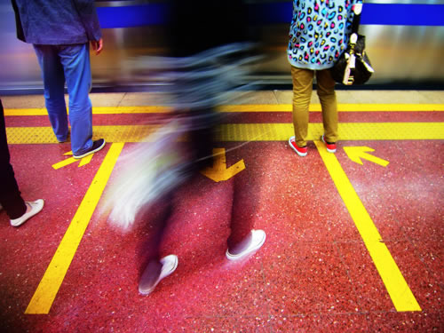
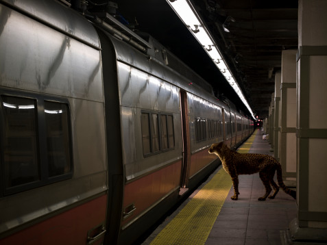

# ＜天玑＞我的记忆是一座城之三·游荡

**记忆里，我们都习惯游荡，班上组织野游，湖心岛，铁索桥，两三百米，摇啊摇。她攀上我的腰，在两三百米的持续尖叫声里，漫无目的地游荡，好像我们可以走一万年。**  

# 游荡

## 文/张亮（北京大学）

 

我总是习惯游荡，漫无目的地游荡。简单因为喜欢一个人，一件事情，一个地方，无目的地游荡。

在北京，我总的感觉是，目的性太强。

2006年夏天，我在北京，高中同学J站在北京地铁站人头攒动的洞口向我招手，记忆中熟悉的长辫子化身齐耳短发，目光端正，气息平稳，在京城对外经贸大学修炼已久。记忆里，我们都习惯游荡，班上组织野游，湖心岛，铁索桥，两三百米，摇啊摇。她攀上我的腰，在两三百米的持续尖叫声里，漫无目的地游荡，好像我们可以走一万年。

我见到她时，“游荡”二字在她身上已永别。她身后没有了那条永远摇不到尽头的桥，没有了那条垂到腰际的长辫。她恰到好处的微笑，向我伸出手，轻轻握了握。她应该永远不会再惊声尖叫，她白色的衬衫领子竖立在黑色的西服领口，她带我走上地铁，为了和一个久违的高中同学吃一顿老鸭汤。她轻描淡写地说，路还长，地铁、电车，最后是公交，她让我安静地靠在窗边，把耳塞的一端递给我，自己戴上另一端，把陈奕迅或者周杰伦的歌曲循环播放，要我跟她一样，进入梦乡。半睡半醒中，她对我说，每天每夜，北京的地铁上有成千上万的人，都这么淹没在耳塞里，转一道地铁、一道公交，或者还有一道地铁，全都面无表情，目光肃穆，在这种循环播放的音乐里，步调一致，宛如成千上万集体蹈海的座头鲸，勇敢无畏，奔向同一个目的地。

“这还有两个多小时，可怎么过，在成都，到任何地方，吃饭也好，过夜也好，即便是逃犯，也不用公交转车，一路杀到。这北京，吃个饭，也要花两三小时？”

“这里是北京，不是成都。不要说话，节省能量，还有两个多小时路程。”在这种步调一致的沉默与喧嚣里，她渐渐沉入梦乡。

“好想一个人散散步，随便走走啊。”我不自觉说。

“你说什么。”

“没什么。”

“嘘，什么都别说，好好睡觉。”

于是我一个人开始做白日梦，开始怀念不用目的明确奔向目的地的岁月。

那是2000年，我刚刚来到一个崭新的世界，一个上学不用按时起床的学校，一个没有父亲母亲的学校。我喜欢无目的的游荡，始于那座城市。

我们在学校旁边的好吃一条街游荡，台湾糕饼小吃店里，人们通常只扣两颗扣子，强风鼓舞，如花蝴蝶上下扑飞。小吃店里巨型风扇大如巨钟，可以放进一个整人，风力强劲，轻一点的纸巾、筷子、塑料小勺，都要被秋风扫落叶，七零八落，风卷残云。

我们在课堂上游荡，统一的三十块日式木屐，短裤，T恤，穿过满当当三百多人木质地板阶梯教室，不顾全场三百多双眸子齐刷刷的目光，体验一把：“脚着谢公鸡，身登青云梯”。

我们在百脑汇音像超市盗版碟窝点游荡，收摊的大妈对我们微笑，目露凶光。翻出世界十大禁片：《我唾弃你的坟墓》，《切肤之爱》，《操我》，《杀人不分左右》，《魔法圣婴》，《感官世界》，《罗马帝国艳情史》，《不可撤消》，《下水道的美人鱼》，《索多玛120天》。

我们在九眼桥旧书市场整整两大层，数十家盗版书商中间游荡，花三块钱买一套商务印书馆的《亚里士多德的三段论》，花五十块买一套《金庸全集》，还有论斤卖的《周国平散文集》、《文化苦旅》和《山居笔记》。

直到有一天，我们不打算再游荡，一起站在阳台上，一朵一朵白云，军舰一样一艘一艘缓慢穿过天空，穿过我们高高扬起的军用望远镜。我们往下探去，穿蓝色牛仔裤的女孩儿正在在体育馆的阴翳下解开束缚她头发的红果穗子发卡，散开一头长发。她交错着甩手，离开体育馆的阴影，走到阳光里去。

她在阳光里移动，慢跑，擦干了身体，跟一只缓慢用力正在发动的摩托，脚步渐渐大起来，长起来，直到望远镜里，充满她一前一后摆动的手臂和大腿。

转瞬间，强烈的阳光刺痛了我们的眼，一片白光。

几分钟后，所有人都下楼去，或前或后，隔着那女孩几米远的距离，在沉默里伴随她，匀速前进，和她保持同一个方向。有如大大小小的舰艇，簇拥了它们的航母，前前后后，向海洋深处奔去。

她穿过林荫道，穿过综合教学楼，穿过一丛丛灌木，穿过一左一右两个满池绿玉的荷花池，她来到九眼桥大学北门，人海如潮，转瞬间无影无踪。

我们失去了目标，但是我们继续游荡，在那个夏天里，我们有无穷的热力，好像比天上的太阳还要强。

我们来到天府广场，华灯初上，人民南路两边儿一排一排都是参天蔽日，政治正确的法国梧桐，夏天正藏在主干道的树林里，一只只麻雀翻越法国梧桐的阴翳，飞过毛主席像、省展览馆，像多年以后，遮天蔽日飞过筒子河、东四十条胡同的鸽哨。那时候，没有这么多汽车、路障、此起彼伏的立交桥，春熙路宛如少女，情窦初开，永不肯把胭脂涂满青春痘的脸。

我们一人一瓶啤酒，在毛主席塑像下纵情大笑，把身上仅有的两三块钱，扔给路边乞讨的老人、妇女、儿童，在一个书吧间里，要一杯绿茶，一本一本摩挲书垛上的书，像钢琴家抚摸她的琴弦，画家抚摸他的画布，雕塑家抚摸他的模特，恋人抚摸他爱人凹凸有致的躯体。或坐或卧，人人捧了一本书看。

那个夏天，就这样被定格，又缓慢平稳的度过。

“你想啥呢。到站了，惠新西街北口，赶紧的下站。”

J从人群中站起，挡在我面前，像一只张开翅膀的鹏鸟，巨大的阴影笼罩我，迫使我从回忆中醒来。

“想啥呢。痴的，赶紧的，不抓紧就来不及了。”她边说边拉我往外冲去。

“我在想地铁。”

“什么？地铁？”我们已经站在地铁口，四下里霓虹眼影，我们四下里目无目的的张望。寻找计划中公交车站的方向。

“恩，我在想，我们遇到一个人，或者我们爱上某个人，是否是像，在一列高速行驶的地铁上，上上下下的乘客的遭遇。不同的人，有着不同的目的地，凑巧在同一时间同一地点上车。可能会贴着面站在一起，会坐到一块，会面面相觑。会攀谈，会热烈。而当目的地的钟声敲响，一切终结，各自奔向各自的站台。爱情也好，世事也好，似乎都是一切偶然性。若真如是，那么只需要等待下一站。然而，若真是一种偶然性，为何没有发生在同车的其他的人身上，虽千万人不都俱往矣吗？若是偶然，便是命定的偶然。或者，若真的相遇，原本在知春里下站的你，不也可以去往国贸吗？所以说，一列地铁不只有一个站台，人生不只是有一个目的地。偶然性只存在站台与站台之间，必然的却是，你无法挣脱你所遭遇到的世界。”

“搞不懂你在说什么。你怎么还像小时候一样，我每天考虑什么时候饭局，什么时候上班，什么时候聚会，该找什么人办事不该找什么人办事，都能把人想死，哪有时间像你这么成天胡思乱想。赶快，赶快，帮我看车站啊。来不及了快。”

于是我又陷入沉默。

三个小时后，我们终于吃到了老鸭汤，吃饭中间，我靠在椅子上，睡过去了两次。

 

（采编：应宁康；责编：徐海星）

 
