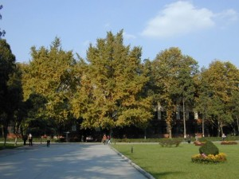
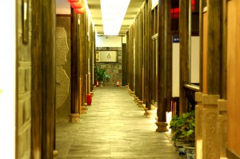

# ＜天玑＞我的记忆是一座城之二·国色天香

**我生活在这种无声息的缓慢和孤独里，总比别人慢半拍。我唯一的爱好是思考自己未来干什么，高考失败把我扔到这里，我无时不刻想要逃走。当周遭的人们在谈论吃回锅肉还是鱼香肉丝，我感到世界乏善可陈。在一个巨大的黑屋子里，唯一的生趣，就是把自己交给食物与肉体。这种无声息的缓慢让我感到窒息，闷在蒸笼里的窒息，过不了多久我就会变成一个蒸熟的馒头或者包子，我希望自己把自己吃掉。**  

# 国色天香

## 文/张亮（北京大学）

2000年左右，我的头发还很浓密，胡须还很稀疏，不像现在，胡须日渐浓密，头发日渐稀疏。我有大把时间考虑中午饭吃鱼香肉丝还是回锅肉的问题。从小，对吃什么的问题我就漠然置之，在馒头上涂抹一层稀薄的豆腐乳，或者早晨享用一杯无糖的豆浆，就是我全部的奢望。一切物质，于我而言，都索然无味。我的室友来自北方辽阔的土地，老少边穷地区，他们凑钱买唯一的电脑，他们争先恐后，排队整齐，聚集在传说中出产美女的各大高校门口搜寻妖娆的女子，独行的萝莉，肆意搭讪，他们大清早起床，共同在QQ上结识异性朋友，在激情聊天室与一个素不相识的天外来客聊一聊番茄炒鸡蛋是该放糖还是不该放糖，然后是，第一部BP机，第一台手机。这一切，于我，都恍如隔世。只有我妈做的回锅肉让我无法忘怀。我的躯体摆在床上整整一天，任凭耳朵里的许巍从头唱到尾，从尾唱到头，任凭室友们又在谈论约见某个即将到来的网友，任凭他们一天接一天到把某个盗版VCD批发市场把岛国艺术家们成批团购，任凭他们冲出宿舍，迎接某个人烟稠密，烟味、屁味混杂的通宵上网时间。我总是一个人躺在床上，听成都交通人民广播电台的“午夜末班车”，他们总有讲不完的鬼故事，夜不归宿的人都会被吃掉，这让我万分庆幸。

我生活在这种无声息的缓慢和孤独里，总比别人慢半拍。我唯一的爱好是思考自己未来干什么，高考失败把我扔到这里，我无时不刻想要逃走。当周遭的人们在谈论吃回锅肉还是鱼香肉丝，我感到世界乏善可陈。在一个巨大的黑屋子里，唯一的生趣，就是把自己交给食物与肉体。这种无声息的缓慢让我感到窒息，闷在蒸笼里的窒息，过不了多久我就会变成一个蒸熟的馒头或者包子，我希望自己把自己吃掉。于是我把自己的名字改成虹桥猪儿粑，又改成虹桥猪头，都是为了祭奠渐行渐远的老家的吃食，打发这无聊的岁月。到最后，我逢人便说，叫我“虹桥”吧。我父亲的答案很简单，做官。他是一个师范学校的校长，文人中的小官僚，官僚中的小文人。工农兵大学生面试，他刚刚从工作的粪坑里爬出，带着粪桶赶到现场，朗诵了一首诗“伟大的毛主席啊，伟大的毛主席啊，您是天空中的苍鹰，我们就是你们的翅膀。”十分钟后，他扔掉了粪桶，面向苍天欢呼：“老子有饭吃了！”要抓住命运的瞬间。我在这种谆谆善诱中沉默了很多年，直到有一天，父亲在成都的一个学生，仕途上飞黄腾达的前辈，给我打来电话，说，虹桥，今天晚上去国色天香，吃一顿晚饭，让你认识一些人。

似乎不能不给父亲的得意门生面子，毕竟我还是父亲供养的，尽管我对吃什么饭向来无甚兴趣，但应该跟一些陌生的人谈谈天，让孤独稍稍驱散。那天晚上，师兄的黑色桑塔纳停在国色天香，成都城最宏大隆重的酒楼门口。这座大红灯笼高挂的仿明清酒楼建筑，仿佛烟雨朦胧中的秦淮八艳的藏身之处，屏风起处，无不手捧琵琶小鼓，轻启朱唇，用嗲到酥麻的声音，唱一曲：“白头宫女在，闲坐说玄宗”。

国色天香门口一溜儿停满奥迪、宝马或者奔驰，绝对没有奥拓或者夏利的份儿，你要是停一桑塔纳，也不好意思停中间儿，只好捡个树荫浓密的地儿，免得阳光底下自惭形秽。披红挂彩、身形高挑的礼仪小姐，一字儿穿大红锦绣旗袍，胸部绷紧，在门口两旁花丛中排列开来，人人双峰中间深陷的部分都别上金叶一枚，见到客人进来就一齐鞠躬，柔声道：“先生您好”，咬字很准，分得清楚平翘舌音，绝对不会像绿满家的女服务员，把“先生”念成“先森”，清脆中带点儿奶气，口感颇似水果沙拉，听得人耳根子直痒痒。四川女子皮肤都白，那是托了老天爷的福气，云遮雾绕，天然阻挡紫外线，这一抹淡淡的红是胭脂，映日荷花别样红。师兄告诉我，那里是市长大人请客的地方，这里是书记大人请客的地方，再远处又是秘书大人请客的地方，而今天的国色天香，是他请客的地方。每个人请客的地方，都是熟人熟户的地方。

我师兄请客的地方，那里的酒店大堂经理姓李，叫李莹，四川人不发后鼻音，经常读成“你淫”，在我听来怪不好意思的，但她一点儿没有不好意思过，都是春风拂面，笑容灿烂。李莹是典型的成都人，圆脸，大眼睛，微凸，走起路来风生水起，头发卷而长，一波儿一波儿，尾端微微上翘，让人想起秀兰邓波儿的卷发，握在手里一定很舒服。“风乍起，吹皱一池春水”说的就是这个手感。可惜我不能把一池春水握在手里，也不能把大堂经理的波发握在手里。

我们在名为“巴山夜雨”的包间坐下，一桌子七八个人，全是三四十岁的大叔大婶儿。我在喧嚣中变得沉默。墙壁上一边儿挂着幅《巴山夜雨》水墨画，一边挂着幅《国色天香》油画，满纸白牡丹肿胀丰满，随时可能破墙而出。一桌人都在等候，见我和师兄进去后，立刻很殷勤的站起身，伸出手，叫“领导好”，颇似民国题材电影里国军将士集体立正，欢迎“委员长”的肃穆庄严。师兄穿一身黑色风衣，虽然戴着眼镜，一米八的个头下，和众人一一握手。可见，师兄是这里面来头最大的。狐假虎威，我的腰围也跟着粗了半圈儿。我走在师兄前面，按照去电影院看电影的惯例，我径直坐到大圆桌的对面，正对着门的中间位置。这个位置左边坐了一个胖胖的秃顶男子，看上去三十出头，满脸堆笑，仿佛和尚庙里的弥勒佛。右边儿坐个女子，戴金丝边眼镜，瓜子脸，腿挺长，挺胸抬头，外八字，不自觉的挺胸抬头，像一只引吭高歌的鹅，一看就是从小练过舞的。二人见我坐下，空气对视一眼，脸色微变，再看看我师兄，似乎有什么话想说，又说不出来。

师兄只对他们二人笑笑，示意大家坐下，在剩下唯一一个位子，门边上的位置坐下，和我隔了大圆桌面对面。

“这位是我的小师弟。我恩师的公子，现在在九眼桥大学读书。是个才子。”

我的师兄向众人介绍我，我猛地站起来，四下里乱鞠躬，挣扎着想说：“不好意思，我不是才子。”却怎么也说不出来。被人当众称作“才子”，必须拿出有才的证据，但是我拿不出来，好比当面被脱光裤子表演，有一种被捉奸在床的尴尬。

那天晚上，整桌上的男人女人都在疯狂夸赞我是个才子，并且从屈原李白一直说到苏东坡，说才子都是学富五车，斗酒三百。他们让桌子上摆满了国窖1573，少说也价值上万，他们说要尝试最新式的“海鲜川做”，比书记市长秘书长的还洋盘，他们一个劲儿的催促身材颀长的服务员报菜名：

“迎春火焰龙虾，请慢用。”

“泡椒鳜鱼球，请慢用。”

“天天开门红，请慢用。”

“金牌宝塔扣，请慢用。”

“紫砂香酥肉，请慢用。”

“泡椒墨鱼仔，请慢用。”

“双椒鲍鱼，请慢用。”

“连鲍鱼都能做成红椒和青椒味？”

“是的，本店一绝，先生请慢用。”

“接下来是家常招牌菜，狮子头系列。”

“红烧狮子头，请慢用。”

“清炖狮子头，请慢用。”

“国宴狮子头，请慢用。”

我不停的吃，学习净坛使者，吃到麻木，吃到涂糜，失去味觉，只是为了不被劝酒，这是在绿满家吃火锅自助养成的习惯。我从不喝酒，啤酒也不沾，三两酒就能上头，别人觥筹交错，我埋头吃肉。

我要填满我的胃，让酒精没有借口。肉只是一种工具，让我不和这个外部世界发生关系。

“虹桥，来，我敬你一杯，你一个泸州来的，酒乡来的人，哪能光吃饭，滴酒不沾，不够意思哦。”秃头男子不放过我。

我一看，国窖1573，满桌子的国窖1573，这密密麻麻的国窖1573，我这一杯酒至少也得100多块，我不喝，这100多块人民币就浪费了，我对不起人民我。

“喝吧，虹桥，这是我最好的哥们儿，难的尽兴。”

我仰脖子一饮而尽。

“虹桥，来，我也敬你一杯。”套装女人不放过我。

“喝吧，虹桥，这是我最好的姐们儿。”

我感到四周一片寂静，所有人都在盯着我看，好像我只剩下最后一条裤衩，不喝下这杯酒，就会正面全裸。

一仰脖，辛辣的味觉直透喉咙，一阵冷战。

“虹桥，你听我说。”师兄这时已经有几分醉意，他埋下头，咬我的耳朵，一股酒气灌入我的耳蜗，直入我体内，灌了我个透心凉：“要做事，先做人。这位是学校部吴部长，是你们顶头上司。你这个在校学生，这个酒你得喝”。

没话说，仰脖子一饮而尽。

那天晚上，我喝了许多酒，听了许多黄色笑话，第一个是“某晚，一裸男叫了一辆出租车，女司机目不转睛盯着看他，裸男大怒，吼道：你他妈没见过裸男呀！”第二个是“某个食人族有一对父子出去打猎，其子擒一瘦子。其父曰：放，没肉！其子又擒一胖子，其父曰：放，太腻！其子又擒一美女，其父曰：带回家，晚上把你妈吃了！”

师兄醉意朦胧，执意要讲第三个笑话，他嘴里喷出大团大团的酒气，全喷到李莹的脸上、嘴上。李莹一副很享受的表情，好像他喷的不是酒气，是仙气。

“我问你们大家，啥叫爱情？”

“男欢女爱呗，那还能有啥。”秃头男人一直色迷迷的瞪着李经理。

“错，骗呗。”

众人一乐，

“那什么是温柔？”

“贱呗。”

“那什么是勇敢？”

“二呗。”

“那什么是幽默？”

“贫呗。”

“那什么是艺术？”

“脱呗。”

“那什么是仗义？”

“傻呗。”

“那什么是小猪？”

“你呗！”

“哈哈，错了。罚酒三杯。”

“为啥？”

“我不是小猪，你才是小猪，我是大灰狼，我要吃小猪。”

师兄往空中挥了李莹一下，指尖恰好滑过她温润细腻的脸颊，这一下兔起鹘落，惹起一抹飞红。

一股巨大的恶心混合着酒精，从胃部一直冲到我的喉头，手一挥，筷子掉到地下。我终于忍不住冲进洗手间。

到师兄讲第三个笑话时，我已经陷入无法知觉的状态，我腹中的各种狮子头，海参、龙虾、墨鱼仔结束了在胃中的旅游，它们本来不属于我，我也无意挽留，此刻终于尘归尘，土归土。假如此刻，有人敲开我的脑壳，把我的脑子切成一片一片，放到锅子里烤，放到我嘴边，我将无法抗拒，分不清楚这是人脑，还是猪脑，狗脑，一口吃下去。为了逃离这个地方，我会毫不留情的吃掉整个自己的脑子。这一切的一切，国窖1573、狮子头、海鲜川做，都让我感到恶心，正因为我刚刚享用过了，格外感到恶心。但若你要问我，这些放到嘴边的价值成千上万的珍馐美味，是否刺激了我的食欲，俘获了我的肉体，我却也不能不承认，是的，在这种无比盛大的愉悦与纠结里，我想要逃走，我要想从这个酒池肉林的欢宴中逃走，正如那个董卓酒席上想要逃走的古代官员，即便有人摸出两尺长的大刀，割掉他的头，盛放在馥郁芬芳的酒缸里，殷红的酒水一杯一杯舀在在场每一个人的面前，我也想要逃走，我想我被砍下来的头，会漂浮在那酒水中间，一张一合眨巴眼，说：“我想喝一碗绿豆汤”。

在那个疯狂的夜晚里，我唯一的念想，就是回到九眼桥大学的万年青绿荫底下，和那帮裸露着脊背的男人们一起，打一盘斗地主，喝一碗绿豆汤，我原以为我要逃离的愿望是如此强烈，地震海啸雪崩杀头放火毁灭全人类都无法阻挡我，我以为在那个夜晚里，我只是一个孤独的存在，在空无一人的冰海沉船旁边，我是一个被遗忘的人，直到那高跟鞋的“笃笃”声由远及近，像菜刀剁在菜板上一般麻利深刻，那气场十足的笑声由远及近，从大厅外面直接穿透几层墙壁，把巴山夜雨包间里的空气搅得暖热无比。直到那时，我在模糊中看清，李莹的身材紧紧包裹在青色绣金花的旗袍里，像一具宋代官窑烧制的青花瓷，由远及近，由淡而浓，带了一种雨后洗过的绿色，扶风弱柳般，慵懒而悠闲的摇摆到我们面前。

我看巴山夜雨包间里的人们继续狂欢，像看着另一个世界里的表演，突然想要逃走，跟那个夏天，想要从东区六舍逃走一致的普遍冲动。而我的身体还在这包间里。我在心底里一遍接一遍的默念着“逃之夭夭，灼灼其华”。在我心里，那是一个“逃”而非“桃”。但李莹的一抹青绿色向我走来，晃晃悠悠，好像永远在梦境里，在我一手之外的距离里，永远触摸不到的颜色里，又好像是“桃”而非“逃”。她的面孔珠圆玉润，如雕刻般精致，她的发髻高高盘在脑后，像是青铜酒爵的把儿，中间一根金簪穿过，她从门框里走来，悠悠然漫不经心的笑，她的背后是一副巨大的水墨山水画，取李商隐“巴山夜雨涨秋池”意境，淡妆浓抹，淡妆是那抹水墨写意巴山夜雨，浓抹是那位丰姿绰约窈窕熟女。

“虹桥，能行吗？”她在我身旁坐下，香气混合了酒气，徐徐喷到我的脸上，她从贴身小包里掏出一包烟来，她的笑容让我面红耳赤。

“还行。”我点点头，看她的笑容依旧像是被定格一番。这个画中的仕女，从电影里剪辑出来的某幅断片，永远定格在一个瞬间，娉娉婷婷的瞬间，永远这么娴雅的笑，这么慵懒的说，她抽出一支长长的女士烟，放到嘴里，她自然的从旁边儿的柜子里取出一样东西，递到我手里。

“来，喝点酸梅汤吧，解酒。你一个学生，还是少喝点的。把这酸梅汤喝下去，就能好很多。”

突然之间，李莹失去了先前爆棚的气势，她银盘一样的脸，居高临下的望着醉梦中的我，她的手里端着满满一杯酸梅汤，她的笑容不再妖冶，却变的慈祥，像一个婴儿刚刚出生不久的妈妈，她应该比我大了八九岁，但此刻，却让我想起了妈妈。

“但是我师兄……”

“没事，你先这么着吧，你师兄，我会跟他说的。我看出来了，你不喜欢这儿。”

突然之间，我想站直身体，和她的双目对视，问她一句，她喜欢不喜欢这儿，但我烂醉如泥，无法动弹，说不出一句话来，我感到沉重的身体被她扶起，一股柔软的热浪穿过我的身体，浑身酥麻。

那天晚上，李莹为我打了个车回九眼桥大学。进车的一刹那，风吹进车厢，我沉重的躯体与头脑，被猛灌进的冷风吹醒，那时我看着她在车灯明灭中，整个人淹没在黑夜里，只剩下那动人的曲线，于是我挣扎着问她：“你喜欢在这里吗？”

她没有回答我，只是让出租车司机把我送走。夜色里经过的每一幢宿舍楼，每一棵梧桐树，都无法停止我对这个问题的疑惑，酒意中，我趴在车窗上向外望去，每一个行人和建筑都像杨柳般摇摆的青花瓷，意韵生动，国色天香。

 

（采编：董一儒；责编：徐海星）

 
