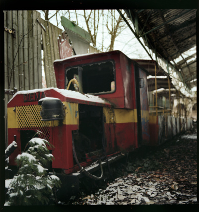
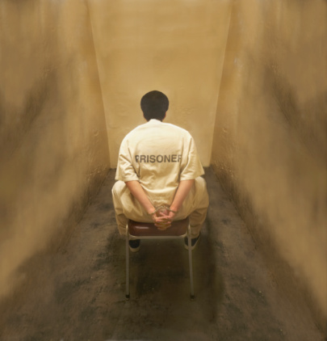

# ＜天玑＞我的记忆是一座城之六·知足

**在我心底里，明白这所有的一切都很可能是借口。每个人都有自己的生活，仙人掌长在湖里就会淹死，荷花长在沙漠里就会干死，有的人是仙人掌，有的人是荷花，甚至只是，有的人想做仙人掌，有的人想做荷花，他们只是在为自己不做什么和做什么找到充足的理由。**  

# 知足

## 文/张亮（北京大学）

 

从小，我就不太喜欢旅行。老妈单位组织的海南游大理游丽江游，我总是提不起兴趣，老爸单位组织的欧洲游新马泰游也让我索然无味。我似乎天生是一个宅男，坐在电脑前码字，躺在沙发里看书，站在窗边望风景，一只空中飞行的麻雀，突然被天空降下的石头击中，或者一辆自行车后座上匀速摆动的大腿，都能被我准确的捕捉，让我陷入沉思，下一秒会发生些什么。 

我不排斥旅行，但我排斥安排好的井井有条地旅行，我喜欢平淡无奇生活中突然发生的，让人防不胜防的事件，正如在流逝的生活中，突然被石头击中的麻雀，被我捕捉到的自行车上垂下的匀速运动。 

每次从北京到成都，或者从成都到北京，我都更习惯坐火车，而不是飞机。除了经济的考虑，还因为你在火车上从北京一路奔驰，历经24个小时的日夜不眠，窗边瞬息万变的风景，一幕一幕从华北变换到四川。你总会遇见一些人，认识一些人，这些人中间，有的是流星，划破长天，转瞬即逝；有的是彗星，不期而遇，从此徘徊在你的生活里，再也无法抹去。 

而以下发生的一切，都是突然地。 

“帅哥，我想问你一个问题，可以么。”当时，坐在T7次卧铺车厢靠窗位置，我对面的女人叫月月。她让我叫她月月，她的眼睛弯弯像一对月亮，笑起来嘴角微微上翘，眼角稍稍弯下，像一对上弦月与下弦月，稳当当挂在面庞上，碧空如洗。 

我的第一感觉是，无法拒绝这种微笑，就像一个死刑犯无法拒绝被执行枪决的命运。四川人民懂得礼貌，表现之一就是，但凡遇见陌生的男子，或者陌生的女子，都要喊一声帅哥，或者美女，不管他到底是齐天大圣孙悟空，还是春光灿烂猪九妹，特别是，当你有求于他。 

成都开往北京的T7次列车，车窗外星光与灯火齐飞，随车轨忽而沉重忽而轻飘的撞击明灭变幻，在月月的脸庞上游移变换。当她的脸庞变得明亮，突然问了我第一个问题，以后，她还会问我许多问题，但明确无误，最关键的一个，却是在T7次列车的卧铺车厢里的那一个。她问我，可以把我的铺位换给她妈否？ 

那时，我对她，不过是一个陌生的旅人，中铺是她，下铺是我，上铺是她妈。通常，火车行进中，她细长白皙的小腿高悬在我头顶，像一柄达摩克斯之剑，晃晃悠悠，随时要落下，斩取我的狗头。而我在这无所不在而又无可逃避的恐惧里，旁若无人的摆弄手机，拨开香蕉，递给对面上中下三个铺位的三个人一人一牙苹果。对面上铺是一个瘦警察，下铺是一个胖警察，中间一位满脸络腮胡，眼珠凸起的囚犯，他的手和脚都铐在床铺的边缘横杠上，背对墙壁，时而磨牙，时而呜咽沉吟，像条患病的狗，捆成一团，努力挣扎，缓慢睡去。因为春运紧张，警车也跟着紧张，又不能上飞机，便押着这个从成都逃亡北京的逃犯，上了T7次。警察们把逃犯夹在中间，尽量不让他动弹，吃饭上厕所都不能动弹，跟粽子一样捆成一团。人啊，怎么可以像一条狗，大庭广众的。我一边感慨，一边跟瘦警察攀谈。瘦警察来自昆明一支著名的部队，据说曾经荣获昆明军区大比武标兵，可以用机枪打掉放在固定靶位上的鸡蛋，而靶位本身却毫发无损，纹丝不动。退伍后去了成都做公安，当我嘲笑他故事的真实性，他笑着说你懂个球，然后拍拍我肩膀，“还是你们读书人懂的多”。胖警察是一个温和安静的片儿警，拖着腮帮听瘦警察给我们讲黄色笑话，面露微笑。瘦警察的黄色笑话跟卧铺车厢里的铺位那么多，望也望不到头，让我们忘记了睡眠；忘记了整个车厢有无数人在听着我们爆笑的乘客；忘记了整个车厢就像一个巨大的监狱，硬座车厢里挤满了抱着小孩的少妇，抱着头打盹的打工者，都蜷缩了身体，狗一样坐在小折叠椅上，旁人的脚上，大腿上，甚至是人的肚子上；忘记了厕所聚集着将要临盆的孕妇，一前一后卷起裤管的民工，嘴里都叼着烟，前胸贴后背，随列车节奏前后起伏，引发人们不洁净的遐想。春运时期的T7次列车，人们像待宰杀的鸡鸭，任意捆绑扔放，烟味、屁味鱼龙混杂，亏得一个星期前的早晨六点，我提前在北京西站排过的整整一天队，到晚间六点，出票的刹那，五秒钟内，排在第三位的我于千万人中，声嘶力竭，一声怒吼：“要一张1月28号去成都的T7次卧铺，下铺，对下铺！！”但是，当月月对我说起那个问题：“帅哥，请问，可以跟我妈换一个位置么，她有高血压，睡上铺不方便，谢谢了，帅哥。”我竟然毫不犹豫的被她秒杀，从裤兜里摸出我那张早被揉皱了的车票。我像一个试图越狱的囚徒，在最后关头，却把正在挖土的铁锹奉送给另一个狱友，一个叫月月的女人。 

跟许多年以后的那个分别的晚上一样，她面前放着一杯水雾蒸腾的清茶，脸上挂着悠远的笑容。她的母亲在不远处沉睡，她向我低声抱怨那个胖警察瘦警察还有戴着镣铐的囚犯，她说害怕这躺列车，盼望早早到家，切勿夜长梦多。她毕业后在北京打拼日久，日日觉得北京是一个巨大的监狱，而自己，是个无法越狱成功的判了无期徒刑的刑犯。没日没夜的工作，盼望加薪，升职，望不尽的跳槽之路，职场之路似乎像是一条卖春之路，每次跳槽，都得端正脸庞，画好眉黛，扮好笑容，争取做一个人人仰望的头牌。殊不知，仅仅一份报表上的标点符号错误，就能让老板暴跳如雷；殊不知，一个资金流老板的奔驰，就想要把她载往不知名的欢场；殊不知，她早已厌倦了后海北海中南海地铁4号10号线人艺小剧场，那些一切沉没在黑夜里的事物。同事们习惯下班后的酒肉争逐，三里屯某次艳遇的遐想，国际机场某次策划已久的重逢，筒子河畔某次蓄谋已久的邂逅，与上地餐厅某次正襟危坐的相亲一样，全都是失去了欢愉与痛楚的麻木。她对我叹息，自己欲望的翅膀折断了，但她并不遗憾，她向我伸出她的左手，展示那据说被峨眉山上高僧上开过光的玉镯，此刻熠熠生辉。上面刻着一个“霂”字，她说这是她的幸运之字，看到这个字，她就觉着，内心的满足，而与从前的生活一刀两断。今后，最大的幸福，就是在锦江边的茶馆里，有一壶永远沏不完的盖碗茶。 

在我心底里，明白这所有的一切都很可能是借口。每个人都有自己的生活，仙人掌长在湖里就会淹死，荷花长在沙漠里就会干死，有的人是仙人掌，有的人是荷花，甚至只是，有的人想做仙人掌，有的人想做荷花，他们只是在为自己不做什么和做什么找到充足的理由。但是当月月对我诉说，她所想逃离的这座城市与她逃离的理由，我总是保持沉默，轻轻颔首。在话语里，我热烈赞扬她决定的明智，赞同她回到那个熟悉而又陌生的地方，寻找旧时玩伴，恢复他年乡音。我与她一同回忆锦里的张飞牛肉，豆腐鱼，回忆洛带的伤心凉粉，回忆黄龙溪的渡船，温江的世博园，杜甫草堂的茶馆，宽窄巷子里的麻将，当谈到活水公园时，她差点从座位上跳起来。 

月月说，小时候，当她还是一个小女孩，有一对小牛角辫儿和无尽遐想，最爱的便是活水公园。每次回成都，都要去活水公园转转。那是城市中最清澈的地点，她来到那里，仿佛见到童年从身边流过。水静止与凝固，生命休止。河流的上游和下游，苍蝇们游向水底，忙于腐败与繁殖。空间中弥漫了茂密的树木与假山，她把纸折的小船，塞满岩石缝隙里穿越流淌的水面，风则帮她鼓满纸船的腮帮。从前，每天早晨，月月都会慢跑到这里，她坚持说女人胖了就是一个字“死”。那时，贝贝特书店在锦江上空升腾的薄雾里飘荡，清浊制造的空中花园，连同河流和树木，徐徐张开夜晚紧抱的双臂。月月就在这水汽朦胧中跑完一圈，两圈，三圈，大步流星的跑向正在早读中的学校教室。她坚持说，气喘吁吁的她总会发现男生搁在她桌子抽屉里的小纸条，每张小纸条都会让她兴奋半天直到麻木。她把所有中学时期收到的情书和小纸条编织成册，埋在活水公园的假山底下，一棵木芙蓉脚下。她坚信她的青春美丽从此被木芙蓉所吸纳，再也不会离开了。那时，她觉得自己永远不会老去，永远不会失去生活的趣味。水总是最先催醒生命，祖先们来自大海的游行，我们自己，来自子宫中精子的觅食。在这个浑浊的世界里，活水是唯一清澈的世界，站在树木的阴翳底下，怀念一亿年以前第一只哺乳动物离开水体，怀念二十年前父亲的精子找到了母亲。流动的水不会腐败，那里会有生命。 

我与月月一同回忆活水公园的晚上，T7次列车正以每小时两百公里的速度呼啸而过，把所有远离故乡的事物抛在脑后，一点一点，又大步流星地奔向童年，奔向最初的起点。我们在这种猝不及防的快乐里，永无休止的交谈。时而爆发出无法遏抑的笑声，时而又陷入沉默，黑夜里，把对方眼睛里的些许亮光，静静注视，发不出一点声响，直到第二天早晨，阳光重又照进一夜未眠的车窗。 

如果不是一个声音响起，我们一定永远不会从这如醉如梦中醒来。 

“同志，不好意思，我们刚送他去上过厕所，他突然说想坐在这儿晒晒阳光，可以么？” 

瘦警察和胖警察，一左一右夹着那个从未露面的犯人，正站在我们面前。他一直朝里蜷缩身体，此刻，那宽大的额头，黝黑的肤色，一寸长的头发，憨厚的笑容一一展现在我面前，如果不是站在两个警察中间，如果不是那副手铐，如果不是在这人头攒动的T7次列车卧铺车厢中，我一定会毫不犹豫的判定，这就是一个老实巴交的农民，与所有田野里工作的农夫一样，有一种土地的朴实。 

这是无法拒绝的邀请，何况我跟警察们都已经这么熟络。 

“可以可以，你坐这儿吧。”月月瞬间从迟钝与空白中醒来，第一时间跳起来，闪到一边，抱了枕头打盹去。 

“哈哈，本来不想打搅你们二位聊天的，要不。”胖警察对我眨了下眼。 

“谁在乎这点时间呢，请坐吧。” 

我对囚犯笑笑，伸出手请他坐下。 

囚犯一脸胡须，满脸慈祥，对胖警察微笑，对瘦警察微笑，对月月微笑，对我微笑，对每一个他见过的人微笑，露出洁白的牙齿。他坐下时，闭上眼睛，面朝窗外，任凭刺眼的阳光笼罩他的每寸皮肤，贪婪地呼吸每一寸阳光。他的脚被铐在床腿上，粗壮的镣铐委顿于地，像一堆庖丁解牛解下的牛肉，他从手铐里艰难伸出两只手，抱住一瓶农夫山泉，喝完了，然后又转过头，对着窗外发了会呆，然后他突然说很无聊，问我有没有兴趣下一盘象棋。身为一个宅男，只有写东西这件事情上，个体完全胜过集体。所以这也是我最擅长的事情。其余的事情，比如谈女朋友，打群架，竞选班长，凡是两个人以上参与的，都不是我的强项。下象棋这个事情，是两个人的事儿，也不是我的强项，但我见他兴致很高，不忍心扫了他的兴，就大声道：“来就来！不过我没有棋哦。” 

他马上说，可以用自己的钱去买。他转头问警察可以不可以，胖警察嘴唇蠕动了一下，看似不满。瘦警察动了动嘴唇：“让他买吧，以后从他家里留下的一笔钱里扣。” 

胖警察花十块钱买了一副象棋。囚犯听说我在北大读书，连忙说自己棋技其实很差，也就跟小学生过过招。他时而紧锁双眉，时而开怀大笑，时而又对我狡黠的眨眨眼，跟所有精明或者自大或者悠闲的赌棋客一样娴熟自然。我接连输了三盘，喝完了整整一瓶农夫山泉。 

“不错啊，棋艺很棒！”我拍拍他肩膀，像瘦警察拍我肩膀一般自然。 

“侥幸侥幸，哪比的上你们读书人。哈哈。”他一边说自己是侥幸，一边开怀大笑，仿佛幸福像花儿一样。 

下完棋，他感到困倦，想要躺一会儿，两个警察又把他抬粽子一样弄到中铺，结结实实铐住。整躺车上，他只喝了一点点水，因为上厕所非常不方便。似乎从刚才的比赛中受到鼓励，他不再一直面对墙壁，却翻过身体，兴高采烈与我讨论，抛出“恐龙为何灭绝”，“中国近代为啥落后挨打”，“地球会不会灭亡”这些无比宏大关键饶有趣味的问题，仿佛我是一本《十万个为什么》。我只有告诉他，我所学尚浅，无法解答。 

之后的时间，我们都感到疲倦，一直睡到下车。下车时，我无意间递给胖警察一根烟。随口问一句：“这个人是什么罪啊。” 

“死刑。至少也是死缓。”胖警察小声说：“我们赶急回来。囚车不够使了。” 

“不是吧，竟然是——” 

“恩，就是为了偷运一车盗窃来的电线，把阻挡的人轧死了。人啊，就是三个字，不知足。其实，归根到底，都是会死的。” 

我还想说什么，瘦警察轻轻捂住我的嘴道：“我们下了，要不跟我们一起走？” 

“不用了，刚才那个女生说有车来接，顺便送我一程。” 

“哈哈，善有善报，恶有恶报。”胖警察又朝我眨眨眼，好像要笑掉下巴。 

“这，其实是，她妈妈硬要送我一程。” 

“一样一样。祝福你哦，后会有期！”瘦警察又是猛的一击，砸在我肩膀上，好像我们是久已熟悉的老友，其实却是永远不再见面的分离。 

那时，犯人正站在车门口，朝我抱了一个拳，又朝我招招手。估计他还在为赢我三盘棋沾沾自喜。 

我也向他挥挥手。 

当然，我再也没有见过他。 

然后我回过头，月月跟她妈妈正站在出站口的灯光下，向我挥手，大笑，好像刚刚从监狱里越狱得出的囚犯，欢喜快乐。 

我们决定，明天一起去活水公园。月月后来说，她之所以当时做出那个决定，就是因为我跟犯人下过的那三盘棋。  

（采编：孙梦予；责编：徐海星）

 
