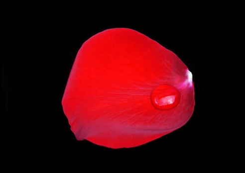

# ＜天玑＞我的记忆是一座城之十三——黑色奔驰里的女人

**月月不再说话，我的回答让她有些意外，或许还有些恼火，我没有向她的梦想表达足够的敬意，却自顾自削起苹果来。那时，车窗外一切的事物都如月月的眼神，平淡的流过，一切欲望与可能湮灭在一一幕缓慢日常的影像里。法国梧桐上一只惊飞的麻雀，因为贪恋某类夜晚成群结队低低飞行的蚊虫，在一池枯荷败柳中流连往返。只是因为欲望，它不肯回家，或者说不敢回家，家，意味着囚笼，意味着重重的禁锢，以及，岁月安详。**  

# 黑色奔驰里的女人

## 文/张亮（北京大学）

 

月月跑来说，一起去滨江路打麻将那天傍晚，我正躺在成都市人民公园的草坪上晒太阳。黄昏时刻的阳光照在我头顶，形成一个巨大耀眼的光圈，让人睁不开眼。每到学校放暑假，我总是从北京回到成都，躺在成都市人民公园的草坪上晒太阳。我右手拿着一把折叠水果刀，左手拿着苹果，肚子上摊开着一本波德莱尔的《恶之花》。 

那时，我攥着水果刀的手正横在空中，我和月月之间。 

水果刀的刀面上，我模糊的脸被缓慢地拉长，隔着刀面，我对着月月做出各种丰富的表情，呲牙、裂开嘴笑、拼命地眨眼睛，所有表情在刀面上徐徐拉伸，直到与青白色的反光融为一体，整整一个下午，我都竭力想从这种反光中发现自己洁白的牙齿，但我发现，这是徒劳。刀面太狭小了。 

“我跟你说话呢，麻烦你把你的刀拿远点，看着我，谢谢。” 

“你不要生气嘛，不是我不想打，而我是不会打，要不然就是相公，多模一张牌，要不就是当炮手,你向我对你放炮么？”我把拿刀的手完全放下，嘴里含着半个苹果。从这个角度仰视，月月的红色高跟鞋在离我头部一寸的地方铲动草皮，一股淡淡的香水味顺着高跟鞋的根部，充斥我的耳鼻，赶走我午间朦胧的睡意。我忍不住向空中望去，丰满白皙的双腿矗立在我面前伸手可及的距离，大腿根部的黑色阴影若隐若现，粉红色的短裙，腰身被黑色皮带紧紧箍住。更上方，头发慵懒随意垂落于微微起伏的胸部，饱满的乳房几乎要遮住所有向下散射的阳光，形成一个巨大阴凉的圈。阳光正一点一点蚕食她浅淡的脂粉，把所有青春痘的残余，鱼尾纹的雏形，全都一扫而空，只剩一张皎洁如明月的脸。 

“哎呀，正因为你不会打才要走嘛，三缺一。” 

“不得行啊，真勒不得行啊。下回嘛，下回我请你吃烧烤。” 

我就在这个巨大阴凉的光圈底下，舒展开我疲倦的躯体，MP3耳塞里，柴可夫斯基的胡桃夹子组曲正震荡耳膜乃至胸腔，我丝毫没有站起来的意思。 

“毛线烧烤，我车都开到这儿了。你到底走不走？你到底在听啥鬼东西，我跟你说话呢。”月月一把扯下我的耳塞。 

“柴可夫斯基的《胡桃夹子》，多么欢快的舞曲。美女，麻烦你让开一点，你把阳光全挡住了。” 

我享受这种无拘束的黄昏，正像许多人梦想享受在月月胸前阴影下的某个下午。柴可夫斯基的《胡桃夹子》驱走我在这无聊世界里全部的寒意，温暖的阳光给我编织一个没有边际的窝，我是一只晒太阳的乌龟，慢吞吞向目的地爬行，周遭的世界对我全无意义。 

“张亮，我最后再问你一次，走不走。” 

“改天嘛。”我转过身体，沉入柴可夫斯基《胡桃夹子》的挽歌中。 

话音未落，一个尖锐的物体深陷进我臀部，我尖叫着跳起来，大喊：“疯子，你想让我断子绝孙吗？” 

“要真断子绝孙，早就换个角度了。” 

那天黄昏，我稀里糊涂被胁迫着上了月月的红色丰田车，车前盖上有一只巨大的黑色蝎子，月月说，这是她的幸运星座。华灯初上，车窗外一盏一盏街灯闪过，月月的身体一明一暗，像一幕一幕快速闪回的镜头。有时，沉没在一片黑暗的寂静中，有时，闪现在一片明亮的喧嚣里。我把《恶之花》摊开在膝盖上，就着车内昏黄的光线看。偶尔抬起头，月月的脸映照在后视镜上，冷然，淡定，目视前方。 

“请把你的刀收起来，给别人看了，还以为你是打劫的。” 

“我就是削个苹果吃，别人管的着么。” 

“你说你这么大人了，一天到晚也不务正业。不是我说你，这么大人了，一天到晚跟小孩儿似的，就知道玩儿水果刀，你也不赶紧毕个业，找个女朋友，生个娃，还读啥博士，你爸没催你，你妈估计也想要抱孙子了吧。你说你这书要读到猴年马月啊。” 

“抱孙子什么的，我一点不着急，宁缺毋滥。我不像你，明明说不喜欢做这事儿，还非得硬撑着去做。我觉得，人一辈子，就得图个快乐。” 

“你懂个屁，我这叫为了梦想而奋斗。” 

“你到底有啥梦想？你就说说，你究竟有啥梦想？” 

那个在丰田车的晚上，月月缓慢的向我讲述她的梦想，每一个有点闲钱有点文艺有点健康有点时间的女青年，都有背着包袱环游世界的梦想。不是因为她们有梦想，有梦想的人不会环游世界，梦想在现实中已经完蛋，她们要生活在别处，这是她们唯一的梦想。月月明白自己现实生活的梦想已经完蛋，每天面对如山的财务报表，养猪饲料、烂尾楼、排污工程，所有这些项目全都归她处理，拉拢一批朝秦暮楚的客户，时时刻刻维持自己的客户存款1000万以上，为了这个目标她要佛挡杀佛，鬼挡杀鬼，风姿绰约，胡吃海喝，夜夜笙歌，化烟熏妆，旗袍开叉比正常礼仪小姐高一寸，会跳探戈，会跳国标，一夜能喝两瓶黑方帝王泸州老窖，还必须保持清醒，捍卫贞洁，横扫千军。 

她咬牙切齿，30岁前要升上财务总监，30岁前要钓到金龟婿，不等人老珠黄，年老色衰，把自己嫁出去。30岁前要有车有房，35岁前存款到500万，六位数，40岁之后就要金盆洗手，浪女回头，跑乡村小学当民办教师，腾出时间和子宫，创造人类，然后带着老公孩子环游世界，吃三七汽锅鸡，菌舒园的野生菌、广州沙姜白切鸡、肉肉烧烤茄子、泰国炼乳馒头、日本酱油芥末蔬菜、青枣、生核桃、临沧的甜芒、超甜的梨、外婆桥的川菜、芋头鸡、炭烧鱼、花椒鸡，喝松茸鸡枞瑶柱汤、枣花蜂蜜青柠汁、泰国椰浆木瓜露、越南咖啡、花旗参水，玩攀岩，抱石，网球，飞镖，跟小学同学玩杀人、三国杀、看上影咏华的电影、练瑜伽、冥想、到世界上任何一个地方的咖啡厅血战麻将、非洲的手鼓、丽江歌手的清雅之音、印度的禅教音乐、湄公河的超长独木舟、恒河边的日出日落、巴黎的莎士比亚咖啡馆、伦敦塔、圣索菲亚大教堂，最后在巴黎，阿波利奈尔描写的蜜腊波桥下，挽着老公孩子一起看太阳落下，不知睡眠已至。 

“这就是你的梦想？” 

“是啊。” 

“对我完全没有任何诱惑力。” 

“我知道，你就是一个死宅。” 

“什么叫死宅，毛主席说得好，坐地日行八万里，巡天遥看一星河，毛主席也是死宅？” 

“那你说你的梦想是什么？” 

“我的梦想？我没有什么梦想，我最大的梦想，就是有一天能躺在人民公园的草坪上，想晒太阳就晒太阳，想削苹果就削苹果，看自己想看的书。” 

“你就这点追求？唉……” 

月月不再说话，我的回答让她有些意外，或许还有些恼火，我没有向她的梦想表达足够的敬意，却自顾自削起苹果来。那时，车窗外一切的事物都如月月的眼神，平淡的流过，一切欲望与可能湮灭在一一幕缓慢日常的影像里。法国梧桐上一只惊飞的麻雀，因为贪恋某类夜晚成群结队低低飞行的蚊虫，在一池枯荷败柳中流连往返。只是因为欲望，它不肯回家，或者说不敢回家。家，意味着囚笼，意味着重重的禁锢，以及，岁月安详。 

我在这一幅幅缓慢沉寂的图景中昏昏睡去，直到被月月激烈的吵闹声惊醒。 

“曹总，我不是跟你说了多少回？我们行小梁对您很有一点崇拜，你们上次不是一起去K歌了吗？没感觉？没感觉关我屁事，我只是红娘，我不是崔莺莺。崔莺莺？你以为你是张生啊？你是吗？” 

月月干净利落的掐断电话，前面路口红绿灯一闪一闪。她停下车，点上一支烟，摇开车窗，任冷风充斥了车厢，一头长发随风飘散。她头手伸出窗外，对着后面儿的黑色大奔大呼小叫：“别挡道儿啊！”挥挥手，让它靠后，然后把着方向盘，把车掉了个头，和大奔面对面隔了十米左右，像是狭路相逢的刀客，商量着决斗。 

“这家伙，居然半路杀出来了。” 

“什么人？” 

“我们行的一个客户，四十几岁的人了，有老婆有孩子，还天天想着出来玩，玩毛线玩。” 

“玩什么玩？” 

“上个星期给我寄了两个东西做礼物。” 

“什么礼物？” 

“一个是奔驰车的钥匙。” 

“那不是很好吗？天上掉馅饼儿唉。第二个是啥？宝马的？” 

“第二个是房间钥匙。” 

“送房子啊，更好。” 

“毛线，是望江宾馆的钥匙。” 

“他家开宾馆的？” 

“瓜娃子啊，你真是瓜娃子啊？他想跟我开房！” 

“那你……怎么办？” 

嘴里正在咀嚼的半个苹果瞬间凝固，车厢里沉默的像坟墓。 

“我当然是全部扔回给她了。这人这么大岁数了，怎么这么不要脸呢。你呆在车里别出来啊。”月月低声命令我。 

我看着月月向外走去。那一刻，夜色与车灯交织中的月月分外妖娆。 

她的话像是一块磁石，死死的将我定在地上，无法动弹。我的心在憔悴，苍老，像被冥王哈迪斯击倒的星矢，像被人造人打成白痴的孙悟空，像飞跃疯人院里被真疯子掐死的小混混。我是一张白纸，我的惨白正在渐渐染红，我两只手攥出汗水，一边儿是水果刀，一边儿是半个苹果，我的膝盖上摊开着波德莱尔的《恶之花》，我的手心里满是汗水。我最喜欢看的武侠片是《双旗镇刀客》，我最喜欢的角色是堂吉诃德，为什么这个妖娆的女人让我血脉喷张？为什么这辆黑色大奔让我想要血溅当场？ 

我合上我的《恶之花》，停止我对苹果的咀嚼。 

一分钟后，我走下红色丰田。 

我敲响黑色大奔车门时，月月正坐副驾位上跟亿万富翁谈判。双手抱胸，面色凶险。我看不清楚曹总的脸，一副宽边墨镜挡住我的视线。月月向我摆手，我也摆手，向我摇头，我也摇头，冲我大吼，隔了车窗我也听不到。于是她摇下车窗，问我想干什么？我脑子一团浆糊，手心一阵酥麻，竭力淡定道：“我可以进车里吗？有点事儿想跟你说。” 

“什么事儿不能当场说，你是不是脑子进水了。” 

“别管，给我开门。” 

“插！”我心里重复这个字，这个字给我勇气和力量，让我学习《曹刿论战》里的曹刿，拉住春秋霸主的衣裳，威胁他说：“五步之内，我可以血溅当场。” 

月月被我“插”得平静了，打开车门。 

“你是谁？”躲在黑暗中的曹总发话了，平稳而包含不屑。有多少素不相识的男人为这黑色大奔点头哈腰，有多少风姿绰约的美女为这部车的主人神魂颠倒，有多少男盗女娼被轻描淡写，有多少黑暗中的无声电影，颠鸾倒凤，此刻都在曹总心头闪过，一幕幕倒放，他想不到，面前这个半疯的男子，手里还有一把水果刀。 

“我是她的男朋友，我们刚刚在车里吵了一架。您有什么事儿要对我女朋友说？说完了没？曹总，来，吃个苹果吧。” 

我把顶着半个苹果的水果刀，递到曹总鼻子面前，我能感到，这个竭力镇定的中年男子，呼吸逐渐散乱。 

“月月，你不是说你没有男朋友吗？” 

月月下了车，睁圆眼正要说话，我一把抱住她，给了她一个完整的一分钟长吻。一股湿润的气流钻进口腔，一丝清香薄荷的味道，后味儿稍显苦涩。 

完事时，月月惊魂未定，大口大口的喘粗气，像刚从水底打捞上来，大口大口合不拢嘴的鱼。我转身钻进车厢，坐在副驾位，和曹总握了个手。我掏出水果刀敲打方向盘，微笑着询问曹总今晚的安排，要不要一起出去玩。世界很安静，我很快活。曹总笑的很惨白，偶尔开过两三小车，曹总的脸色在车灯闪烁里明暗变换，好似出色彩斑斓的皮影。 

“晚上，呵呵，晚上去找我老婆，还有几个朋友，打麻将。小子好福气哈，找了个这么漂亮的女朋友。”曹总像阔别多年的老朋友，用力拍我的肩膀。 

月月继续在沉默中，载着我往滨江路驶去，到岔口时，红灯亮了，于是她停住，突然问我： 

“原来以为你是个读书人，想不到你其实也是个流氓。” 

我是一个手无缚鸡之力的书生，最大的乐趣就是有一个明朗的下午，躺在草坪上晒太阳，削苹果，最好还有一本书。但这天晚上，面对这个女人跟这辆黑色大奔，突然有无穷的热浪从我心底涌起。 

“我是流氓，但我是一个有梦想的流氓。” 

“切，梦想，不就是躺在草地上削苹果么？” 

“还有一个梦想，我没有说。” 

“什么？” 

“ 爱情。大人物没有爱情还可以有奸情，小人物没有了爱情人生就苍白无力。爱情是小人物的底线，执子之手与子偕老是小人物的梦想。为了这个梦想，我愿意赴汤蹈火。” 

这时，绿灯亮了，月月把车重新开动，她突然说车里很热，把车窗摇开，全然不顾空调正开着的事实。然后她又说车厢里太闷，音乐被打开，柴可夫斯基《胡桃夹子》的旋律顿时把车厢内搅的轻快无比。 

最后，她转过头，把没有握方向盘的手放在我拿着刀的手上，说：“把水果刀收起来，别做你的流氓了。” 

之后的时间，她的手一直在我手心里，再没有拿开过。 

很多时候，人们都生活在自己欲望的陷阱里，他们只是需要一把水果刀。  

（采编：孙梦予；责编：徐海星）

 
