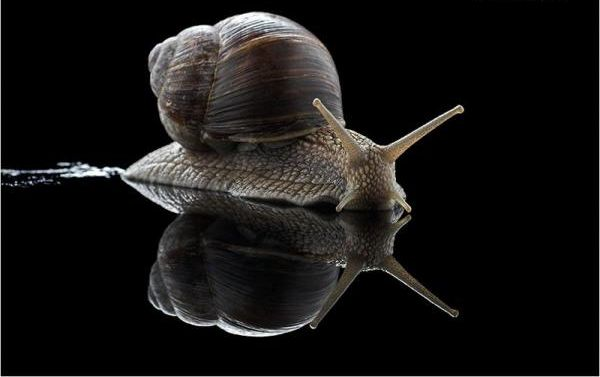
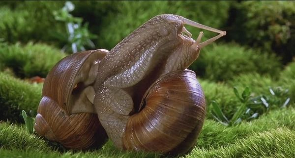

# ＜天玑＞我的记忆是一座城之十二·网络如何毁了我的一生

**我差点被吓个半死，对自己说，这一切都不是真实的。床头柜上有一把小镜子，我想要看清楚自己全部的身体，到底变成什么样了。于是我鼓足浑身力气，头和整个躯干使劲往镜子的方向伸去。一下，两下，到第三下，我感到躯干正缓慢然而有力的从半透明的壳里挤出。我低头看了一下，又被自己吓了个半死。我整个的躯干正从壳子里一点一点挤出，变成和蜗牛和蛞蝓一样半透明的肉质吸盘，牢牢吸附在竹凉席上，好像有生命似的，向床头柜上爬去。**  

# 网络如何毁了我的一生

## 文/ 张亮（北京大学）

 

**（一）**

跟往常一样，我从中午11点的手机铃声中醒来，盯着天花板看了十秒钟。我在考虑，今天是先打开人人网，还是微博？是先跟QQ上聊了半个月的美女打个招呼，还是用微信搜索方圆一公里内跟我一样寂寞的人类？最终我决定先打开手机，放一段在线酷我音乐。贝多芬的《致爱丽丝》，它能舒缓我昨晚熬夜紧张的神经，激起对一天生活的兴趣。手机就放在我床头柜上一尺的距离，下巴上成公斤的肥肉让我头部的转动十分困难。十年前，我刚刚习惯坐在电脑面前，成为一个宅男。从那时起，细长的下巴一点一点积聚，像滚雪球一样慢慢膨胀，到昨天晚上关掉魔兽世界为止，已经开始形成第三个重叠的下巴。

三分钟以后，我终于把拖着三重肥肉下巴的头转过床头柜的方向，手机就在离我头部一尺的距离。我下意识地想要伸出右手，却空荡荡没有任何反应；再想伸出左手，也毫无动静。我的头上渗出一丝冷汗。我缓慢低下头，差点被自己吓死。我的左手和右手都不见了，除了头部和脖子，整个身躯深陷在巨大肥硕的躯体里。而我的躯体，却被一个巨大半透明的壳包裹着。从这层半透明的壳状物里，我整个的心脏、肺叶、肝脏、食道、胃，甚至是大肠的蠕动，都清晰可辨。在这层半透明物质的包裹下，一切都呈现出粉红色。昨夜凌晨打完魔兽，跟朋友一起吃了两个烤羊腰子和二十个烤鸡翅。此刻，鸡翅形状的残骸正沿着我的胃部向大肠的部位缓慢移动，像一只慢吞吞爬行的蜗牛。

我差点被吓个半死，对自己说，这一切都不是真实的。床头柜上有一把小镜子，我想要看清楚自己全部的身体，到底变成什么样了。于是我鼓足浑身力气，头和整个躯干使劲往镜子的方向伸去。一下，两下，到第三下，我感到躯干正缓慢然而有力的从半透明的壳里挤出。我低头看了一下，又被自己吓了个半死。我整个的躯干正从壳子里一点一点挤出，变成和蜗牛和蛞蝓一样半透明的肉质吸盘，牢牢吸附在竹凉席上，好像有生命似的，向床头柜上爬去。

这时，我够着了镜子，我被自己吓了个半死。我的头发已经掉光，眼睛凸出，变成两个细长条，在空中灵活的转动。头顶耳朵以上的部分，伸出来两只肉肉的触角，跟两条活蹦乱跳的蠕虫一样，在空中嗅弄。

我变成了一只蜗牛。

**（二）**

很快，我恢复了镇定，决心爬到床底下去。今天约好了，我要去见一个网友。开始费了我很大的劲儿，但很快，我发现我适应了这种蜗牛的生活，并且喜欢起它来。一种紧实的满胀感充实了我的躯干和下体，让我时时有射精的快感。我憋住一口气，用嘴衔起我的IPHONE4S，刚刚在网上花2500块买的水货，沿着床爬下去。爬到门边，我的触角条件反射的向微掩的房门伸去，力量在我体内聚集，门开了。

彻底解放的快感通遍全身。客厅里空荡荡没有人。暑假，当老师的父母都跟同事约好打麻将去了。我沿着光滑的木质地板缓慢爬行，一直爬到我养了十四年的猫灰灰面前。像往常一样，我爬到她面前去，大声叫她的名字。她从睡梦中醒来，睁大眼睛望着我这个怪物，一只巨大的蜗牛。她显然陷入了沉思：从气味上判断，我应该是她的主人，但是从体型上，我已经变成了一只没有手脚，拖着巨大硬壳的爬行怪物。但我顽强的生命意志趋使我向她爬去。她一声不吭，喉咙里发出低沉的呜呜声，跟生气或者见到荤腥时一样冲动而恐惧。

正当我想跟她继续亲热，IPHONE4S微信响了，是今天约见的女网友。刚刚从英国回来的海归，约我在成都春熙路上见面。我跟她是在微博上认识的，英文名叫JANE，应该是我所有微博好友里最HOT的一个。她给我发过一个胸部的特写，没有露出脸，只露出木瓜般硕大无比的胸部，包裹在黑色蕾丝睡衣里，随时准备瓜熟蒂落。她号称有36D的尤物让我欲罢不能，辗转反侧。我迫切想要见到她本人，证明真伪。PS技术的发达，让你无法确认电脑屏幕上的到底是母猪还是貂蝉。那时我是一个政治控，正在疯狂转发BBC对奥运会的负面报道。我的微博被删除了好几次，但是我锲而不舍。到发第五次时，这个女海龟发现了我的疯狂举动，颇为赞许。从微博上看，她是一个留着长发，身材傲人的姑娘。蓝天白云大海，哥特式建筑，满桌子的意大利面条，半个人高的意大利沙拉，还有一只烘烤得通红的大龙虾。她举着这个大龙虾，分开它的两只螯，脑袋夹在中间，对我露出迷人的微笑。

心底里，我想变成这只蜗牛，用我的两只腿夹住她的脖子，再射她一脸。遗憾的是，我的腿现在没有了。我现在想爬到约定的地方，春熙路的动物乐园咖啡馆，跟她喝一杯咖啡。

**（三）**

当我爬到动物乐园咖啡厅时，身后已经集聚了上百号人，我感到羞怯而紧张。

此刻，在动物乐园咖啡厅门口，我身后，跟着黑压压几百号人，都静默地关注我，窃窃私语，却没有一个人大声喧哗，显然他们都被我这个似人非人的怪物吸引了。但我想，他们应该不会特别惊奇，网络时代，S造型的芙蓉姐姐，天下无双的罗玉凤姐姐，脱光以后搞艺术的苏紫紫，直到全露洗浴的干露露，在床上惊声尖叫的兽兽，前段时间还有人在广泛传播跟狗干的视频，分尸以后再奸尸的男子，他们已经对我见怪不怪了。

他们只是兴奋的注视我，想知道我想干些什么。

一分钟后，我到靠窗户的座位坐下。按照约定，我在靠窗的位置坐下。动物乐园咖啡厅里响彻了杨提尔森轻柔欢快的旋律《在堤岸上》。前头的开场白轻柔甜美：“他们彼此深信，是瞬间迸发的热情让他们相遇。这样的确定是美丽的，但变幻无常更为美丽。”在这空灵的气氛里，传说中的美女对我徐徐展露魅惑：火红的晚礼服低胸开衩，雪白的傲人酥胸，乳沟深陷处，贴了朵粉色的菊花。这朵粉色的菊花夺走了我全部的记忆，我全然忘记我已不再是一个人类，而是一只蜗牛。我默默爬上红色沙发，低头注视自己身体底下一条白浊液体形成的痕迹，跟所有蜗牛爬过的痕迹一样，区别只是它大概有一手掌宽。我盯着这奇特的现象足足有半分钟，对面的美女突然笑起来：“你怎么了？湿了么？”

我越发不敢发话了。跟所有网络上很活跃的人一样，现实中我很沉闷。特别是，当一个性感美丽的女神就坐在你面前，对你微笑，询问你是不是湿了，我就下体充血，越发沉闷。

我的沉默持续了有十分钟。期间，JANE饶有兴致地观察我，好像我并非是一只蜗牛。尽管她面前盘子中的熏肉香气扑鼻，这种观察却持续了十分钟。我一直低头关注我的IPHONE4S，终于，到第十分钟结束的时刻，JANE说了她此次约会的第二句话：“你满可爱的。”

“啊！”我惊讶地抬起头，以为她在说笑。但她镇定地以灿烂的笑容打消了我的疑惑，好像在说每天早上吃一个法式蛋糕或者喝一杯波尔多红酒那样自然。

我鼓起勇气，一字一顿地问：“你真的觉得我很可爱？”

“是的，从来没有见过像你这么可爱的人。你知道，现在的男人，都不懂得尊重女性。像你这么可爱，长得像蜗牛的男生，我还是第一次见到。”

“但是，我这身材不是很难看么？”

“你知道么，在我看来，你就像一个可爱的宠物，可以抱在怀里亲一亲，挠一挠。很多人都说我很爷们儿。他们不懂的，我们这种独立自主的女性，就喜欢你这样可爱的生物。”

“真的么，你真的喜欢我这样的人么？”

“是啊，不过我很奇怪，你怎么会变成一只蜗牛的？”

“今天早上，我起来就这样了。”

“没有任何征兆？”

“没有。”

“真的没有？头发是什么时候开始秃掉的？”

“十年前吧。”

JANE的再三问话引发了我的沉思。我想起，十年前，那时是在九眼桥大学，我开始迷恋网络，同时厌倦人类。班上组织去青城山玩，我不去；班上组织男女生联谊，我不去；班上组织毕业班旅行，我不去。我习惯躲在网吧里玩一种叫《传奇三》的游戏。游戏里，我是一个英雄的武士。我花掉一半的生活费，节衣缩食，整了身超级变态的装备，手提屠龙宝刀，身穿霸王铠甲，佛当杀佛，鬼挡杀鬼。我的兄弟都受我保护，听我指挥。所有游戏里的人，见了我都毕恭毕敬，叫我“带头大哥”。我找到了自己的真爱，一个37级别的女法师。每逢打怪，群P，我都身先士卒，用51级的厚重身躯和一身善良耀眼的装备为她充当肉盾。我为她整备了一身耀眼的装备，从37级升到了49级，与她举行了盛大的婚礼，交换了结婚戒指。我幸福得晕了过去。我这个沉默寡言的人，感到了爱情的力量。终于，我抵挡不住这种幸福的膨胀，提了一斤家乡产的荔枝，冲向金飞燕网吧，九眼桥大学南门闻名遐迩的地方。当我在人群中叫了三次“小红辣椒”，她的网名后，一个秃顶的中年男子从人群中站了起来，向我微笑，露出被烟熏黄的牙齿。

从那以后，我更加习惯沉默。无论在网络中，还是在现实里，没日没夜的通宵，一根接一根地抽烟，夺去了我一根一根乌黑闪亮的头发。

我变成了一个秃子。

“那什么时候开始发胖的？”女神拖着脑袋继续发问。

我又想起，人人网刚刚盛行那会儿，我开始天天端坐在电脑前，寻找各种关于美女的蛛丝马迹。我足不出户，相信世界上所有美女都栖居于此，如鲜嫩水草茁壮生长。我的足迹遍及所有男装女装变装的女生页面。饿了，就打电话叫一个便当；渴了，就打电话叫一瓶鲜橙多。我和每一个我发现的美女打情骂俏，讨论如何进行盛大的人类创造。层出不穷的重口味笑话填充了我的生活。我的眼里只有网络中的女神。每当夜幕降临，是苍井空，是小泽玛利亚，是泷泽萝拉，让我一次次在卧室里，浴室中，空荡荡的双人床上，一次又一次达到高潮。我相信真正的女神有朝一日一定会降临人间，而之前，一切都只是取经所例行的九九八十一难。

终于，我等来了微博时代，谩骂网络上自以为是的傻逼，阐述我对时局精辟的见解。什么中国应该为贪官准备3000架断头台啊，什么不顶这个帖子不是中国人啊，什么中国应该迅速组建一支航空母舰舰队啊。政治就像做爱，权力就像春药。在无数口诛笔伐，骂娘与被骂中，我仿佛是网络中的无冕之王，指点江山，挥斥方遒。我居高临下，将精液倾泻而下，众人匍匐于地，如饮春酿。从那时起，我的下巴从一个变成两个，再变成三个，我的腹部脂肪满胀，压坏了两张弹簧床，三根板凳，一个体重秤。

我变成了一个大胖子。

“眼睛呢？不用说，是因为长期在电脑面前伏案造成的吧。”女神最后总结道。

我狠狠的点点头，把头伸进面前的咖啡杯里，狠狠吸了一口。

**（四）**

今天，真正的女神就坐在我对面不过半米的距离，对我展露魅惑的微笑，我却已经变成了一只蜗牛。

有一段时间，她保持了短暂的沉默，从面前的盘子里叉起一小块熏肉，放进嘴里，轻轻咀嚼，就了一口红酒，吞咽下去，喉部转瞬即逝的轻微鼓起让我凝神忘言。

“你发什么神，也吃点东西吧。”JANE的眼睛慢慢鼓起，似乎随时准备夺眶而出。

“我这怎么——”面前一块面包大小的烤肉，我不想在JANE面前失去绅士风度。

于是JANE微笑着切了一小块熏肉，隔了桌子叉到我面前。我伸过头去，把脖子伸得比天鹅还要长，在空中接了。

“味道怎么样？”

“不错，一种很奇怪但是很鲜美的味道。有点像鸡肉，又有点像……像奶酪。说不清是什么，反正是好吃的东西。”

“不错，这里面有奶酪，也确实像鸡肉，看来你味觉不错。会做饭么？”

“会啊，当然会，我会鱼香肉丝，会回锅肉，会水煮肉片，会宫保鸡丁，会……”

“不错，真可爱，再吃一块。”

这次我连忙提前把头伸了过去，整个身体快要爬上桌面。

“不过，有一个问题，你真的喜欢蜗牛么？”

“喜欢啊，蜗牛的样子比人的样子更可爱。人往往很自恋，不知道自己的分寸。但是蜗牛，懒洋洋的，让他做啥他就做啥，很听话。你是不是很听话？”

“是啊，我很听话的。”我竖起了两只触角，专注地听。

“除了会做饭，你还会做什么？”

“我会洗衣服，会洗碗，还会带孩子。”

“哈哈，你生过孩子么，怎么还会带孩子？”

“没有生过，但是我带过我表妹的孩子，我外甥女。”

“好了，我都知道了，打住，你还会什么？”

“我还会什么？一时想不起来了。”

“我来教你，来，到我这儿来。”

我遵从女神的意愿，沿着木质地板，爬上她的腿，牢牢吸附在她大腿外侧的部位。

“蹲在我大腿上。”女神命令道。

我十分顺从，面对女神，我理应如此。我硕大无比的肉足铺展在女神合拢的双腿上。我的触角伸出，被女神拿在手中轻轻抚弄。我光秃的头部轻轻在女神的身上蹭弄，无比愉悦犹如射精的快感，再次真实地充斥我全身。现在，此刻，我只是女神怀里的一只蜗牛，享受着与她独处的微妙时刻。《在堤岸上》循环播放，柔媚入骨的音乐与女神浓郁的芳香，让我沉入无边无际的梦乡。

我以为这种温柔会持续到永远，我以为我终于找到了爱情。就在这瞬间，一个圆滚粗大的躯体，毫不客气地把我挤到一边，那是一个跟我一样粘稠湿润的身体。

又一只巨大无比的蜗牛！正跟我并排躺在女神的大腿上！

一种巨大的恶心感从我的胃部翻起。所有今天、昨天和前天吃过的东西，一股脑儿地往我喉头涌来。那透明的躯壳，慢慢蠕动的肠胃，在我身上时，我觉得惬意并自然，当它们换到别人，不，别的蜗牛身上，却是如此地恶心。特别是，它也用粘稠的触角轻轻蹭弄女神的下巴，引发女神阵阵清脆的笑声。

“滚下去！”我大声吼起来。

“你才跟我滚下去，哪里来的野种！”那只比我还要硕大的蜗牛，一点不肯后退。

我伸出我矫健有力的触角，向这个不识趣的家伙发起进攻。我要捍卫我的领土、主权与独立的完整性。

但是他更加巨大的身躯，更长更有力的触角击败了我，把我打翻在地。

“JANE！你帮帮忙啊。”我发出愤怒的嚎叫。

“我说你啊，怎么不懂规矩。”JANE突然换了一副铁青的面孔，不再妩媚。

“什么规矩，我不懂？”

“你抬头看看。”

一分钟后，我的世界观崩塌了。周围无数缓慢爬行的巨大蜗牛，突然从地底下冒出，都朝我射来充满敌意的目光，露出狰狞的笑容，像要把我吃掉。

“他们都是谁，服务生，把他们都赶走！”我大叫起来。

“对不起先生，我们这里叫动物乐园咖啡厅。既然允许您这只蜗牛进来，就不能拒绝别的蜗牛。”

服务生的声音让我感到绝望，动物园咖啡厅里所有人类与非人类的目光让我战栗。“他们彼此深信，是瞬间迸发的热气让他们相遇。这样的确定是美丽的，但变幻无常更为美丽。”《在堤岸上》的开场白依旧温柔甜美。面前，沙发坐垫上，吊灯上，地摊上，天花板上，甚至门窗上，服务生的肩膀上，密密麻麻爬满了无数我的同类，也许是因为同样原因变成蜗牛的人。

我应该不是他们的对手，于是我挣扎着往外爬去，门外就是我活命的地方。

“吃了他！吃了他！”无数蜗牛的嚎叫在我身后回荡。

当我爬到门口，刚才温文尔雅的服务生挡在门口。他手里托着那盘JANE刚刚吃剩的熏肉，露出狰狞的微笑。他的身后，门已经合拢。

“关灯。”我听见JANE的命令。

动物乐园咖啡厅里，一盏一盏高挂的吊灯，瞬间熄灭了，整个世界安静了。

“这肥的正好可以做熏肉。”在我被一记闷棍击中前，这是我听到的最后一句话。

 

（采编：黄梅林；责编：徐海星）

 
