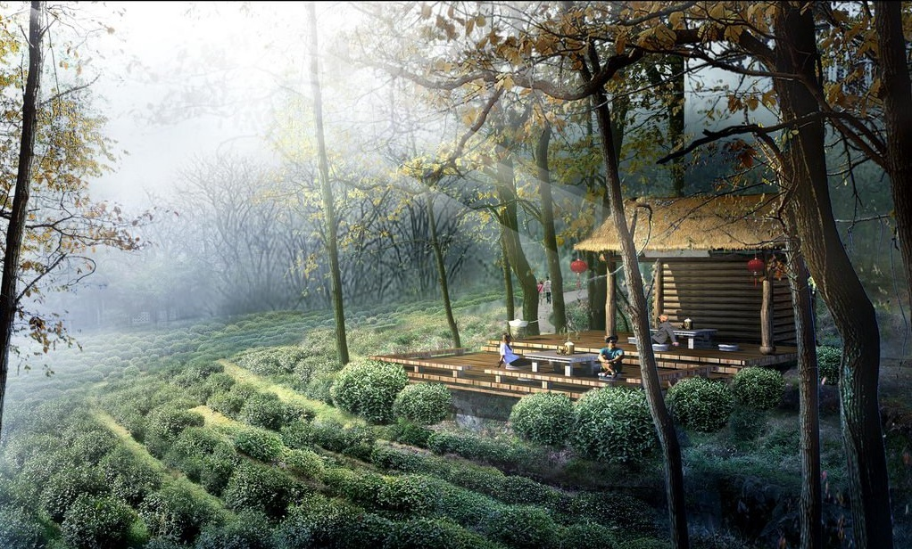

# ＜天玑＞我的记忆是一座城之四·村姑

**我一定要衣衫褴褛，孑然一身，内心澄澈，坐火车，坐汽车，坐自行车，一路飞跑，回到那个山涧小店，回到天堂坝，若是那个女生还在桌边，还是那么青葱翠白，对我微笑，我一定要捉着她的手，为她默诵《庄子。秋水》：****“****秋水时至，百川灌河，径流之大，两岸之间，不辨牛马，于是焉河伯欣然自喜，以天下之美为尽在于己****”****。**

 

# 村姑****

## 文/张亮（北京大学）

 

“先生，这个花篮要100块。”

“要了。”

“先生，这蓝水果，品相正宗，估计也的要100块。”

“全要了。”

“胖子，你疯了吗。买这么多东西干嘛。”同行的猪头望了我发呆。

“你别管，帮我提着就行了。”

“你要干嘛。”

“去见一个人。”

2006年夏，我从北京回到成都，每当我对北京感到厌倦、乏味，甚至是愤怒，都会跑回成都。北京是一个巨大的工地，每时每刻都喷吐着欲望的火焰，每时每刻都在标榜着雨后春笋般的成功人士，在北京，我只愿意在燕园游荡，每一个日新月异的胡同口，都停满了香车宝马，每一个霓虹眼影的新街口，都站满了翘首以盼的梦想家。有人爆发，有人沉沦，北大西门外又有加长劳斯莱斯停下，门打开，端着酒杯的老者满头银发，却是一个酒吧，有穿着入时的女郎。西苑的贫民窟里，打工仔打工女们守在山寨版苹果手机与NIKE运动服面前，为十块钱讨价还价，世纪华联的金首饰店面里写着“概不退货”，干洗店的门口挂着牌子“成人保健”。北京，这个光怪陆离的利维坦，一边是挥金如土的酒池肉林，一边是这酒池肉林的底部，一个巨大的贫民窟。

在北京城普遍的抑郁里，我总是逃回成都，每一个男人都有做乌龟的时刻，成都就是我的乌龟壳。记忆里，我已经忘记，如何认识了她，只记得，有天晚上，当我在陌生已久的网吧里游荡，打开百年未遇的QQ，突然有一个人抱了一个西瓜，给我看。一刹那，我被那澄澈的笑容迷惑，心中的巨石落下，我突然体会到，美猴王历经五百年磨难，从五行山下蹦出的喜极而泣，洗心革面。那样一个女孩，毫无征兆的，给你端出一个小西瓜。她就像那只青翠欲滴的西瓜，好像还在瓜蔓上闪着昨日晚间的雨露。

我沉埋的记忆破土而出，幼芽萌动，好像仅剩最后一滴水的水囊，沙漠里独行的骆驼客，在咽气的最后关头，闻到了不远处椰果的芳香。我突然意识到，我是那么的爱着村姑，爱着早已远离我的世界。

在我十二岁那年的一个傍晚，与同学去福宝原始森林的暑假，我追逐过一只天堂坝里的天堂鸟整整三个钟点，它撑开金色尾羽，竹林间嬉戏盘旋。我追过十里溪流，漫山杜鹃，没有汽车没有摩托只有五颜六色天堂鸟雄飞雌从绕林间。我追过岸边少女梳洗，山间牧童骑牛，澄碧深潭。我在潭边稍事休息，看钓叟莲娃，把鱼儿桶中装满，看各色水桶纷纷而下，布满山涧。

我追到炊烟袅袅处，天堂鸟杳无踪迹，店家正埋锅做饭。天色向晚，腹中饥渴，拣河边农家小店坐定。野菜，野猪、狍子，更有野羊佐酒。寻窗眺望，竹影婆娑，溪边少女淘洗野菜，潺潺水声在她指间拨动蜿蜒，一如琴弦。少女提篮上楼，桌边坐下，把野菜一一摘净。她的五官玲珑精致，她的手腕温润如玉，她的琥珀翠绿玉镯映衬肌肤胜雪，她的青色长裙白色上衣青葱翠白，平添食欲。

一夜未眠，我怀想那位青葱翠白的少女，想象自己是被那被她洗濯的野菜，在她纤纤指尖盘旋。微熹初露，少女为我熬好绿豆粥，我坐在昨晚靠窗的位置，听她讲她的童年。那个山里的女孩在泸州城的一所学校念中学，趁暑假之机回乡玩耍，帮助父母打点农家小店。我希望那山间的女孩，就这样盛开在山崖间，如杜鹃沉静怒放。而终有一天，那女儿要离开这天堂，离开这土地。她说她向往山外的世界，向外北京，让我心酸。太阳升起老高，天空中又响起天堂鸟雄飞雌从的鸢鸣。我终要告辞，不知今后，还能否遇见这山间小店，能否见到这溪边洗濯的少女。

若有一天，她离开天堂坝，就有如离开了此间的天堂鸟，到了人间。到了人间，是否还有梦幻？我见她在窗口处，向我微笑招手，不禁怔立，双眼模糊。我将眼镜忘记在店家的桌上。我不顾一切冲向小店，那张靠窗的桌边。少女安静的坐着，冲我掩面而笑，把眼镜递给我，凄凉有如天堂永别。

此刻，在那视频里，不施粉黛的笑颜，让我仿佛回到昨天，那个天堂坝，小村口，青葱翠白的少女。她有深黑而睫毛浓密的眼睛，清晨的露珠在她眼眸中滚动，她有洁白整齐的牙齿，常常被不经意的笑容撩起一角，她还有两条灵动的小辫，舒服的搭在瘦小的肩膀上，她的身影娇俏，就像天堂坝里满山开放的山杜鹃，白里透红，令人微醺。

在这种无法克制的狂喜里，我约定在她工作的地方，成都市发动机厂门口与她见面。跟所有离家打工的工人们一样，她过着整齐有序的三班倒生活，我想象，她应该不是穿着洁白的工作服，就是戴着前方有帽檐的小帽，我想象着和她的会面，她会不会手里捧着一个西瓜，就像在电脑中一样对我微笑，露出洁白的牙齿，把垂落到眼畔的发丝轻轻撩开。因为她说过，要请我吃西瓜。

那天晚上，我一个人站在成都市发动机厂厂门口，手里提着一篮子从福宝古镇带回的荔枝，在鱼贯而出的人群中，翘首盼望，不断拨打她的电话，却无人应答，两个小时过去，空荡荡的厂房摆在我面前，干燥的手机被我捏出汗水，湿漉漉的像是一只刚刚拨开的水蜜桃。我失望的站在落日余晖里，像一个挑战风车巨人刚刚失败的唐吉可德，我一个人坐在街道旁万年青丰茂的花园石坎上，把整整两斤荔枝吃了个精光。

我打了个车，颓唐的回到住处，没有洗澡，没有吃饭，躺倒在宽大的双人床上，迷蒙中我起了一次身，两斤荔枝开始在腹中作祟，我起了三趟厕所，到第三趟时，手机响了，一个中年女人的声音：“喂，请问你是可儿的什么人？”

“一个朋友。您是？”

“哦，我是她的师傅，她今天下午在车间晕倒了。”

“啊，不严重吧，怎么会事？”

“初步判断是急性肠炎，现在住院了。应该没有什么大事吧。”

“您可以告诉我住院地址吗？”

“成都市第三人民医院急诊病房305室。”

那一刻，我火急火燎的冲出住所，冲到空荡荡的街道上，我给外号猪头，同在北大读书，一同回成都的高中同学打了电话，我问他有没有空，和我一起去买点东西。

那个漫长的晚上就这么过去，我花了半个小时，跟猪头提着一大篮子鲜花，一大篮子各色水果，杀往成都市第三人民医院急诊病房，我和猪头在人群诡异的目光中，不自在的踱步。可儿的师傅，电话中那个中年女人与我攀谈片刻，交代了病情，她没有问我更多的话，要我稍安勿躁，病房里满座着她穿蓝色工作服的同事，都用一种怪异的目光打量我和猪头，我大汗淋漓，衬衫领子被汗水浸的焦黄，疲软，耷拉在肩头，我的呼吸不再平稳，有如高考出分前等待的刹那，我走进病房，她安静的躺在洁白的床上，像一朵正在枯萎的鲜花，无力的手从被子里垂下，吊瓶一点一点往她宛如玉雕的手腕里输送着葡萄糖。本来，她的头偏放在枕头上，侧过脸，此刻，她转过头，只淡淡的望我笑笑，干燥的嘴唇里微微张开，想要说些什么。我急忙大步走到她床前坐下，吩咐她，什么也别说，什么也别做。

“你来了。”她还是说了这么一句。

整个晚上，她不断的跟我说，自己很满足，很幸福，师傅和同事都对自己很好，这么小事，却让大家如此破费，她责备我带了这么多东西来，事先却都说一声，更自责说，今天让你久等了。中途她接了个男人的电话，放下后，她淡定转过头，说，他是个当兵的，在部队里开车，比不得你们北大的研究生，天天在外面跑。平时上班无聊，一个人住，也觉着无聊。我的心咯噔一下，沉了下去，好像被人当面打了一记闷棍。

一个星期，都有她的师傅和她的同事们守夜，我没有给她打过电话，什么也没有说，什么也没有做。

到第二个星期的第一天，她突然给我发来短信。明天有空么，我已经出院了，来我这里坐坐吧。

在工厂住宅区门口，我见到了她，还是有着一副病容，笑容却更加甜美。她领着我走进绿树环绕的厂房，走过空无一人的宿舍，来到她的房间。窗台上放着一双运动鞋，她笑说，这是她最值钱的东西，但之前被偷过一双，所以管理更加严格了，像我这样的，本是不允许进入。在她十二平米左右的房间里，四散摆放着香蕉、苹果、荔枝，一张干净的小桌上，有一只切开的西瓜。她躺在床上，微笑着请我吃，说，就这么一个小病，却让你们都破费了。然后她翻开相册，给我看她姐姐的照片，那是一个戎装的女军人，军校毕业以后留在了成都，她笑说，你看，还是我姐姐好看。我连忙说，当然是你好看。她说你站着干嘛，可以坐下啊，于是我坐下。她又说，你可以坐到床沿上，我说不敢。于是她咯咯笑起来，说，总归我们不是一个世界的人啊。

“为什么。我觉得我们就是。”

“不是的。下个月，我要到广州去了。”

“为什么。”我心头又一紧。

“姑父给我介绍了个新工作，也是大国企，工资更高些。”

“但你一个人，人生地不熟的。”

“在这里，不也一样么。同事们对我都很好。连你，一个陌生人，对我也都好。”

我整整一分钟没有说话，耷拉了脑袋，像一只打了霜的桃子。倒是她，逼着我吃掉了半只西瓜。

“嘟嘟嘟”我的手机响了，是那个在北京的女人，让我纠结或者无力的女人，我到房门外接了，回来，她轻声问，是谁啊。我说一个朋友，她说，是女的吧。我说是的。她笑说，那怕什么，总归是一个世界里的。

两天后，我飞回北京，再没有见过她。

许多年后的今天，我孤身一人在北京城里游荡打拼，不分白昼的码字，不分青红皂白的打架斗殴，抽烟喝酒，一天一天听中关村的车水马龙碾碎睡眠，一天一天盘算车市房价鸡犬升天，一天一天盘算三里屯儿后海的北京一夜，一天一天盘算泡妞了分手了结婚了买房了外遇了，我就一天天更想念我的十二岁，我的天堂坝，天堂坝里把那一抹青葱翠白，想念在成都发电机厂的那一个星期,想念和可儿的聊天，想念她逼我吃掉的半个西瓜。总有一天，我吃腻了东来顺儿的涮羊肉，全聚德的烤全鸭，法源寺的驴打滚，簋街里李鬼当李逵卖的串串香盆盆虾，后海北海中南海一切霓虹艳影，酒肉征逐，厌倦了校内校外，白天黑夜，男人女人，明里暗里一切海誓山盟爱情暧昧纠结无常，对一切车展楼展裸体模特展798现代艺术展三里屯儿丰乳肥臀展视若无睹。我一定要衣衫褴褛，孑然一身，内心澄澈，坐火车，坐汽车，坐自行车，一路飞跑，回到那个山涧小店，回到天堂坝，若是那个女生还在桌边，还是那么青葱翠白，对我微笑，我一定要捉着她的手，为她默诵《庄子。秋水》：“秋水时至，百川灌河，径流之大，两岸之间，不辨牛马，于是焉河伯欣然自喜，以天下之美为尽在于己”。

 

（采编：徐海星；责编：徐海星）

 
