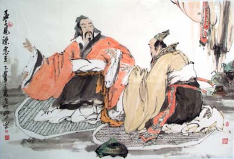

# ＜天玑＞托物言志（一）——驳孟子：民权之本在于民主

**“民众性善，君主性善，人人都性善，世人相亲相爱，推己及人，皆是兄弟姐妹，自然要靠热辣辣的道德来解决问题，不能动辄就冷漠漠地讲权利，讲法律。而此等幼稚的理论如何实行千年不倒？”**

### 

### 

** **

### 

# 驳孟子：民权之本在于民主

### 

## 文/明夷（中国人民大学）

### 

### 

自江南游学以来，遂于世事愈加绝望，本想于民主自由之义绝口不谈，只于风月诗词之中寻一安生地，然种种事情缘由，令我夜夜辗转，压抑郁闷，乃至不吐不快。窃以为凡抽象之理念，必托物而言之，乃可清晰明白，否则终陷于玄冥，只成为哲学家们的专有品，于开启民智之一端用处甚微。又以为，平等自由民主者，普世价值也，绝对真理也，放之四海而皆准，所托之物，莫不可至于此，犹殊途而后必同归。研读历史者，终可知民主自由，真理也；研读哲学者，终可知民主自由，真理也；研读物理学者，终可知民主自由，真理也。故我读《孟子》，亦归于民主自由之途。

我人多以为孟子于诸子百家中，最重民权，盖以其“民贵君轻”之说定论矣。此一谬也，孟子眼中，民何尝贵？君何尝轻？所谓政治，称为“人牧”，该政府养民，如同养殖牛马，牛马者，牧人衣食之本，故而贵之。所谓民本思想，归根到底，君主以民为本也，而非民可自立自本也。君要为民做主，而民绝无为自己做主之理。我人千百年以来，每逢不平，则希望“青天大老爷”者为民做主，不到万不得已，何尝敢于为自己做主？至今屡有不平之民，高举条幅，要求政府为民伸冤之行为；而亦偶有怀有为民做主之古老理想之幼稚官员，民权法制之观念始终无法深入我中华民心之中。此大抵亦孟子民本学说之流毒也。

近日偶然闻某些学者，说法怪异，说什么孟子学说与封建专制主义相违背。还为此展开讨论，有的说孟子的学说是制约皇权；也有的说既然皇帝都尊崇孟子，说明孟子支持专制主义。窃以为前一种说法，实在没有把握住重点，制约皇权本身也是专制主义的一部分，专制主义，若无制约，如何长治久安？安能说有制约，就不是专制主义？而孟子将这种制约完全诉诸道德理念，此乃儒家政治上之幼稚也。而后一种说法，乃是从事实出发，却缺乏哲学上的论证。

中国之古人，大抵相信道德能治国，然而近代世界之潮流却证明只有制度方能保障民权，进而治国图强，此环球之公义也，若非要说道德能救国救民，我无话可说，只可谓此乃中国之真理，而非人类之真理。然我古圣先贤，又为何不知此义？盖有性善论之影响。性恶则重制度保障，性善则重道德教化。民众性善，君主性善，人人都性善，世人相亲相爱，推己及人，皆是兄弟姐妹，自然要靠热辣辣的道德来解决问题，不能动辄就冷漠漠地讲权利，讲法律。而此等幼稚的理论如何实行千年不倒？盖古代乃是一乡土社会，故而以道德为运转社会之机制成为可能。而如今之社会早已非乡土社会，由此而以道德为机杼之社会模式早该抛弃，而其性善之人性依据也早该抛弃。乡土社会一节，详见费孝通先生之书，此处不赘述。

记得许久之前，那是某个年代的尾音，一群青年要求和某组织进行对话，某组织说，我们本来就是一体的，自己和自己怎么对话？某组织一贯说，我们不像别的主义那样，需要外部制衡，需要三权分立，因为我们心里装着你，我们代表你们的利益，我们是一体的。此之谓民本也。民本的效果如何，不必赘言，而其后性善的理论基础如何，也不必赘言。盖民权之本，在于民主，而不在于民本。此是世界数百千年便已争论清楚之公理，亦恐怕只有一些中国人尚不清楚，还在说什么民本也是普世价值，可以和西方的民主争衡。林语堂先生说：“中国就有这么一群奇怪的东西，自己明明是被统治被压迫的阶级，却要说着统治阶级的话，在动物世界里是没有这么奇怪的东西的。”大道之行，天下为公，我虽愚笨，人微言轻，尚有爱国之心，窃附斯义。

我向来推崇李宗吾先生的《厚黑学》，只可惜今人玷污了厚黑二字。窃以为李宗吾先生，中国之穆勒也；《厚黑学》，中国之《功利主义》也。其论孟子之精辟独到，令人叹服。虽然看似荒诞不堪，却一针见血。好谈性善，不过是民众的一种虚伪与怯懦之心罢了。说人人皆性善，无非是想说我也性善，夸自己性善，当然是好事。谁愿意说自己是坏人呢？所谓自利利人，何乐不为？西方精神之根本，在于契约精神。此乃中国农业社会所无，也是今天大多数中国人无法理解的精神。由契约而法治、而平等、而自由、而民主。而我国国民，在若干年前，莫说社会政治之抽象契约，便是签合同，也要先说一句：“先小人后君子。”盖签合同者，小人也。既然大家都是性善的，那么还讲什么契约，人人自觉一点就好了。做生意要自觉，治国也要靠自觉，事事靠自觉，上有圣王，中有君子，下有良民，修身乃至治国，最终天下大同。呜呼哀哉，这只是一个梦。性善，误国误民之垃圾。

盖人性善或恶，不重要，重要的是以此为基础展开的理论构架，乃至实践的影响。“夫子之言性与天道，不可得而闻。”我以为孔子的态度最为审慎，不似孟子这般草率，对人性轻下断言，当然孟子生时也未必预料到其后来之地位影响。故而可怪者亦非孟子。哲学家自然有言论自由。而对与错的判断决不能依靠另一套评判标准，只要孟子由起点到终点的论证是严密的，那么他就是对的。而批判孟子亦不过是托物言志，如此而已。民主自由之精神，宽容异己也，我自然尊重别人的各种讲法，亦不认为只有我才是对的。

有这样一种讲法：“孟子讲人性是善的，并不是否认好色、贪吃之类的是性，因为那些都不是人性，只有善才是人性。所以人性是善的。你敢说你人性不善？那你不是人。”说实话，我被雷到了。因为我想起了一些类似的逻辑推论。

“中国人得不了诺贝尔奖。什么？你说你得了？那你现在不是中国人了。”

注：题目为编者所拟，原题目为“我为什么这样评价孟子”。

(责编：黄理罡）
