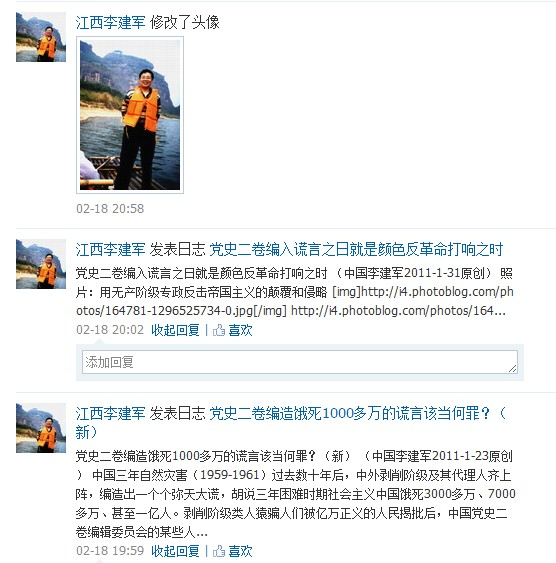
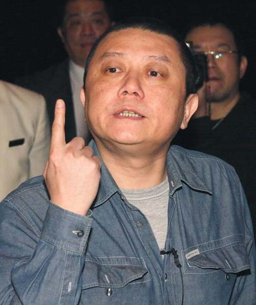

# ＜天玑＞托物言志（二）——走下道德的神坛

**我们看到了中国历史上的一幕幕悲剧，权力永远是正义和善的化身，反对者永远是十恶不赦的卑鄙小人。政治派别永远要以道德来划分，权力与道德狼狈为奸。可悲的是，权力的反对者仍旧跳不出这个圈子。自古每支起义的队伍，无一例外，都要宣称前朝无德，自己有德，永远在改朝换代的圈子中出不来。**

### 

### 

# 走下道德的神坛

### 

## 文 / 明夷（中国人民大学）

### 

### 

想来有件事情，诚可怪也。中国人最不懂科学二字的含义，却整天把科学当做宗教偶像一样膜拜；中国人最不懂得怀疑精神，却整天怀疑世界人民都不怀疑的真理。于是有些人，也诚可怪，且不在少数。从一些莫名其妙的地方得来那么一套莫名其妙的理论，却要冠以科学的标签，还妄想和西方、和真理分庭抗礼。 近来总是听到一些奇怪的理论，但是其实也不奇怪，因为这些道理也是经常听到的。我没有心思去记得那许多杂七杂八的东西，虽然演说者自以为是独创的高级理论，还高声强调，实际上这种论调实在老掉牙，老掉牙也没什么，民主自由的话题也是老掉牙的。关键是这些论调实在很荒唐，在世界潮流面前显得很可笑。 

### 

 如果周公制礼作乐这件事是真的，那么我认为这是把中国领向死亡之路的开端；而后来孟子的出现，以及孟子学说的地位被抬高，则是把中国彻底推下了万劫不复深渊。如果说周公给暴力夺权安了一个道德的遮羞布，那么孟子则给每一个恶棍和伪君子涂了一层道德的脂粉。从此，这个国家的政府和人民表面上走向道德的神坛，越走越高；而实际上，却堕落进专制、自大、无知的地狱。 “夫子之道，忠恕而已”，我从来对孔子的宽容精神怀有敬意，但是却不知道为什么儒家会出了孟子这样的异端，又不知道为什么孟子这种异端会被请上神坛。窃以为孟子是有心理疾病的，不然也不能把异己全部斥为“禽兽”。由此看来，古往今来，恐怕最不能容忍异己学说的便是孟子。孟子有病没什么，但是却令千百年来服膺儒家学说的人大抵也染上了这种病：极端的狭隘和固执，视异己如仇雠，必生啖之而后快。并且把“不与世俗同”看做一种极高的美德，孤傲和无礼的性格尤其为中国的知识分子所赞美。中国知识分子之傲慢与自大，这一小传统的形成，与孟子的学说脱不了干系。那些口口声声自称儒家的学者，把孔子的忠恕精神忘得一干二净，却把孟子这种疾病思维拿来抚慰自己落寞的内心。在他们眼中，自己是最正确的，他们不能接受有人不同意他们的观点。中国人，几乎无不抱有如此之想法。 儒家的排斥异己不同于法家，不仅仅是从治乱的角度进行利益的考量，而是真的认为自己掌握了真理，站在道德的至高点上，这是其最可怕的地方。这种心理机制是儒家的偏狭世界观传播开来的动力，孟子为我们塑造了一个人人自大、人人无知、人人狭隘的国度。如果看到孟子认为人人皆可为尧舜，就说孟子有平等的思想；如果看到孟子说民为贵，就说孟子有民主的思想——只能说这是幼稚和学究式的看法。在孟子那里，人人皆可以为尧舜，但是并非每个人都能成为“人”，因为只有同意了他孟子观点的人才是“人”，墨子、杨朱之流都是禽兽。而民为贵，我不止一次说过，只是君以民为本，民众，都是贵族的劳力工具罢了，无需赘言。 谁可以是人，谁不可以是人，让谁来决定？孟子说是性善。谁善，谁不善，又让谁来决定？孟子说你自己心里明白。这样一来，在历史上出现了两个后果。其一，凡人都认为自己是人，自己有道德。遇到异己，觉得不爽，就说你没道德，进而到你不是人的境界。大概由意见分歧而到人身攻击在中国最为流行，因为孟子给了一个理论支持，这让每个中国人在骂别人不是人的时候理直气壮。其二，在实践中，政治权力成了最终裁判善恶的标准，道德也成了权力的合法性基础。于是我们看到了中国历史上的一幕幕悲剧，权力永远是正义和善的化身，反对者永远是十恶不赦的卑鄙小人。政治派别永远要以道德来划分，权力与道德狼狈为奸。可悲的是，权力的反对者仍旧跳不出这个圈子。自古每支起义的队伍，无一例外，都要宣称前朝无德，自己有德，永远在改朝换代的圈子中出不来。 此种思想演化到近代，和人权观念格格不入。说人民有各种各种权利，等你需要行使权利反对权力的时候，权力说你已经不是人民了。中国之犯法者从来无人权可言，此之为国际社会所不解。其实也没有什么，因为从孟子的眼光来看，他们已经不是人了。所以无视人权和虐待犯人，实在是国粹。试看今日之中国，实在实在已经有了很大的进步。 此外，在长期的历史演变中，道德不仅和权力结合到一起，也和知识结合到一起。说儒家学说是关于道德学说毫不为过，儒家之为学，终究以学道德为目的。这成为道德和知识相结合的根源。司马光的道德才学之论，至今觉得中国味十足。“德才兼备者谓圣人，德胜于才者谓君子，有才无德者谓小人，无才无德者谓愚人。愚人可用而小人切不可用也。”知识分子一定要德才兼备，起码是要有德。为什么是这样，怎么做到德才兼备，已经不重要了。重要的是这种观念的影响，那就是知识分子的心底总是有点德才兼备的自诩倾向，起码认为自己是有德的。大言不惭说自己才高八斗的不多，但是大言不惭的说自己讲道德的人不少。道德高于知识，这成为我们近代一些人将西方科技斥为奇技淫巧的根本原因，成为学术被权力领导的理论支持。如果不把道德和知识剥离开来，“尊师重教”的恶劣传统永远也无法在教育领域消失；如果不把道德和知识剥离开来，中国人永远都不可能认识真理。 

### 

 站在道德的神坛上，我们无不妄自尊大，自以为尧舜。 站在道德的神坛上，专制主义的幽灵在深入骨髓。 站在道德的神坛上，我们不满的永远不是体制，而是自己在体制中的位置。 站在道德的神坛上，中国的历史在进行着可悲的循环。 中国人需要解放，不是一朝一夕的事情，不是实行了三权分立和直接选举就能立刻完成的。我们需要一点一点梳理传统精神，然后把它彻底打碎。 走下神坛，正视人性。重整国故，全盘西化。 

### 

### 

（采编：黄理罡 责编：黄理罡）

### 

### 
