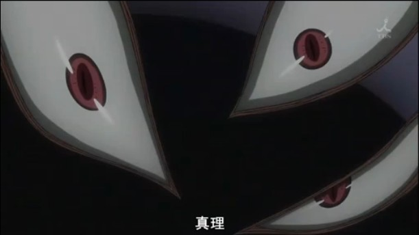
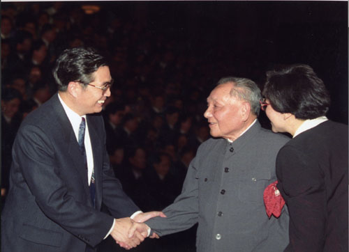

# ＜天玑＞托物言志（四）谁动了我们的真理

**那些教材反复地隐性地强调着真理的相对存在。从此，我们丧失了判断力和对真理的信仰。我们仿佛不愿意分清真理和荒谬，一切关于真理的争论都被“聪明人”看做可笑的。我们早已不知道真理是否存在，更遑论信仰。然而我们又比任何人都显得有信仰。**

** **

** **

# 谁动了我们的真理

## 文/明夷（中国人民大学）

就在不久前，听说有个国家闹将起来了。随即，听说有对夫妻也闹将起来了。然后，就听那些喊了很久娜姐加油的，开始说输了也是好样的云云。又随即，就开始互相批判起来。

这一切，再次让我质疑我们的判断力。 我们中国人看到几种不同事物或意见的时候，有赞同这个的，有赞同那个的，并且总会有一个最终声音出来，告诉所有人各种意见只是不同而已，没有对错之分。并且经常是引出庄子的齐物论来，或直接说辩证法，或者一分为二、和而不同什么的。总之，是自以为很高明的。 从高中的哲学课本开始，此种理解问题的方式就被系统地灌输给我们。那些教材反复地隐性地强调着真理的相对存在。从此，我们丧失了判断力和对真理的信仰。我们仿佛不愿意分清真理和荒谬，一切关于真理的争论都被“聪明人”看做可笑的。我们早已不知道真理是否存在，更遑论信仰。然而我们又比任何人都显得有信仰。在这个七嘴八舌的网络世界里，地不分南北，人不分老幼，异见之间互相仇雠，只是因为各种“我觉得”不一样而已。没有人检索过自己的逻辑，我们都在凭着莫名其妙的信从来发表意见，并且坚信不移。中国人就是这样一种奇怪的组合体。 

 就一个民族集体而言，没有宽容精神作为文化背景或宗教背景，是根本不能有真正的辩证思维存在的，才有“一分为三”这样的学术笑话。儒家自孟荀以来的偏狭气质，以及大众对老庄的流俗理解，使我们在思考问题时往往既执拗偏狭又立场虚无，最后流向极端唯我。 我们从未如今天这样：除了自己，不知道还有什么是对的。无论逻辑和实践哪个是检验真理的标准，我们今天已没有真理可检验。抛开哲学形上的讨论，我不想证明真理的存在，只想说我们的价值虚无已经走到一种危险的境地，不仅其程度之深和范围之广令人惊讶，更令人奇怪的是，我们竟然不知道检索这种劣根性。相对于西方思想家对于价值虚无的警惕和反思，我们的学者竟然还在为相对主义作辩护，甚至想从这里面导出什么民主自由来。每念及此，酣睡都足以惊醒。 相对主义的唯一后果便是价值的虚无，进而导致群体价值混乱，丧失判断力，最终形成某一种价值观独霸天下。由于此种传统，百家争鸣总是昙花一现，独尊某术则千秋万代；我们总是坚信在真理之外另有中国的真理，在世界潮流面前另有一种中国特色。 价值虚无和信仰自由必须分开，自由不是没有真理。 

 不迷信，不等于都不信，不盲从，不等于都不从。去除糟粕，汲取精华，不是把自己觉得不对的去掉，和自己结论一样的拿来。一个人口十几亿的大国，一个还徘徊在现代文明门口的大国，必须学会用理性来检索自己的信仰，用理性来做出判断，用理性去寻找真理。 思想自由总是不该被干涉的，但是价值判断并不能因此而虚无。哪种思想好，哪种思想不好，总是可以在具有一定的前提下给出评价的。比如关注离婚的和关注政局的，就今天大学生的思想状况而言，关注政局的比关注离婚的好些，批判的总比中立的好些，因为思想的大脑总比不思想的头好，起码，想要有思想也是一件不坏的事情。 

### 

### 

(采编:黄理罡 责编:黄理罡)
