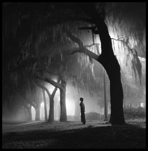

# ＜天玑＞散宜诗话（一）：大学生是天然的理想主义者

**一个合格的大学生注定应该是一位真正的理想主义者：他祛除了理科生脸上那凝重的严霜，也没有文科生弱柳扶风般的敏感与矫情；他不屑于小右们声嘶力竭的空洞口号与稚嫩表情，也从来与毛左们充溢着的理想主义和领袖崇拜相绝缘。** 

# 大学生是天然的理想主义者

## 文/袁依（山东师大）

中国的大学生，是全世界最为纯粹的、彻头彻尾的无产阶级，他们天然应当成为理想主义者，可实际上却总会出现事与愿违的结果，这不仅是大环境“不反对，也不支持”的潜在诱使，还有着深层的来源于自身的内在缘由。 

 大学里出不了敢思想的特立之士，其责任在于高中；高中里出不了敢思想的特立之士，其责任在于初中和小学。现在有人经常告诫我们，不要被外来思想洗脑了。我质疑的是，难道只有外来思想才能对我们进行洗脑？我们从开始接收“义务”教育的那一刻起，在长达十几年的应试教育的高压之下，不也是每时每刻都在被无情地洗着脑吗？那再接收些不同性质的洗脑材料又何妨呢？只有接收再一次的洗脑，才能真正实现对洗脑的否定。另外，中小学施行的“洗脑教育”之所以畅通无阻，与家人们在其间发挥的推波助澜作用也有着密切关联。笔者打小就记得，大人们之间的争强好胜，也体现在爱拿孩子们的考试成绩开刀。倘若孩子的成绩不错，自然也耐不住自己一人独享，于是大街小巷里都回响着这些半老徐娘们的欢呼，闪烁着她们雀跃的身影。有人奉承她孩子天资聪颖，她却要说孩子的情商比智商还要高；有人说她孩子刻苦，她偏要反驳一句那是出自天生的遗传。这样习惯于自作聪明的家长们，自然会培育出无数习惯于自作聪明的接班人来。 及至我们迈入大学的门槛，占绝大多数的贫家子弟却因为自身的“不争气”使得“思想”变得奢侈起来，好像“思想”只能是贵族少爷们能够玩得起的“鬼把戏”。笔者一向以为，大学里的贫困生是大量存在着的。若是在贫困的现实面前仍能抬起你高昂的头颅，并且无视于别人那发自肺腑的鄙视与轻蔑，那便是对贫困的挑战与征服；若是将贫困当做自己消极和颓废的挡箭牌，抑或当做一种“资本优势”，那便是无可挽救的永远的奴隶了。贫家子弟中，除去自甘消极颓废的那一派外，还有着这样两派：一派是一天到晚“义正言辞”地痛斥富二代、官二代者，他们宛如受了公婆长年压抑的小媳妇，我猜想一旦当了家后恐怕会更可恶——何况公婆目前仍然健在；另一派是受不得穷的现实野心家，人穷志短，马瘦毛长，受不得穷的他们于是拼了命地想去闯入体制内，借体制之力分一杯冷炙残羹。他们大多数都不能真正觉悟，也不想真正觉悟，即便是有些觉悟了却还想装装糊涂，他们尚且没有坐上奴隶的席位，可心思里却全装着做奴隶的打算，各大高校的学生会和班委里这样的人不在少数。 而那些贵族少爷们玩的所谓“思想”，绝大部分也不过只是蒙人的把戏而已。鲁迅先生讲过： “中国人向来因为不敢正视人生，只好瞒和骗。”（《论睁了眼看》）中国百姓果真没有觉醒吗？我看未必，他们从来都是觉醒在心中，而不觉醒在行动上的。在笔者看来，一个人有自己的思想并不难，难的是敢于坚守自己的思想并甘心为之付出流血的代价。倘若思想只是拿来说说而已，抑或当作辩论的工具，那简直是对思想的侮辱，这样的思想，还不如没有的好。但有人也许会不服气，他们鼓吹政治是四十岁人的事业，青年人激情有余而理性不足，如果“起而行动”会给国家造成极大的负面影响。笔者以为，青年人固然有过剩的激情，但也从来不缺乏应有的理性。至于造成的负面影响，绝对不该将责任推到青年的头上，因为操控国家强权的毋庸置疑是那些自诩为“成熟”的中年人，以及那些“老而不死”的乡愿们。 然而，我们却也不能由一个极端走向另一极端，提倡“思想”并不等于“为思想而思想”。经常有些同学会把翻墙弄来的一些“禁书”奉若神明，以之为历史的真相、绝对的真理。实事求是地讲，如果按照他们那种骛新的眼光来评判，大陆似乎还真没有很多能够“出思想”的书籍；但这不意味着大陆出版的书籍里没有深层的思考，只是很多书并不以“有思想”而闻名。很多书籍看似只是不时鲜的大路货，看似只是材料的堆砌，其实客观上是踏实学风的一种无形引导。先用客观的材料开出踏实的积累路径，然后头脑中才能有真思想的生发。经得住时间考验的“真思想”，首先需要有厚积薄发的扎实积淀，而不是一味的口号标语式“叫嚣”抑或人云亦云式地“以讹传讹”。在这里举个反例来说明，记得前几日校内网上有人撰长文批判毛泽东诗词，一说是胡乔木原创，非领袖的真实水平；又说格律不通，具体内容脱离实际。笔者以为，秀才们的文章即便作得再好，也造作不出毛诗中那冲天的“虎气”，“脱离实际”反倒从侧面证实了毛泽东作为诗人的浪漫气质。我们要批毛可以，但完全没必要把毛扭曲成一个弱智。 

归根结底，一个合格的大学生注定应该是一位真正的理想主义者：他祛除了理科生脸上那凝重的严霜，也没有文科生弱柳扶风般的敏感与矫情；他不屑于小右们声嘶力竭的空洞口号与稚嫩表情，也从来与毛左们充溢着的理想主义和领袖崇拜相绝缘。真正的理想主义者所向往之人生境界，当是誉满天下，谤亦满天下：誉满天下，故能“自信人生二百年”；谤满天下，故能“虽千万人吾亦往”。他永远不惮于闯入孤独之境，永远不惮于回归孤寂之乡，也正因为有了这个“孤”，所以无有世俗人情的羁绊，方能毅然决然地下得去手；也正因为有了这个“孤”，才可无惧于朋党的“清议”，永葆心中的那股浩然之气。他全神贯注地着力于当下，却永远不会让现实将一个生机盎然的自己压垮。 “大学生成为真正的理想主义者的时代，迟早要来。这是国际的大气候和中国自己的小气候所决定了的，是一定要来的，是不以人们的意志为转移的，只不过是迟早的问题，大小的问题。而现在来，对我们比较有利。最有利的是，我们有一大批善于思考的年轻人在，他们经历的风波多，懂得事情的利害关系……总之，要总结现在，看到未来。” 是的，我们一定要看到那个崭新时代的到来！我们一定能够看到那个崭新时代的到来！   

（采编：安镜轩 责编：黄理罡）

 
