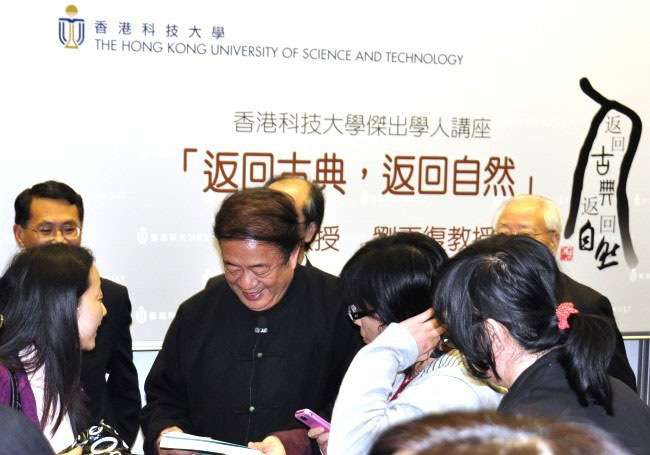

# ＜天玑＞散宜诗话（二）：那虚晃着的“启蒙”光环——刘再复先生之我见

**生于上世纪四十年代的刘再复先生在这里玩了一个文字解读上的游戏和思想导向上的花招，他“不知不觉”地悬空了特定环境之下的历史背景，以期达到一个竖立箭垛的隐性目的，如此他便可以抓住转瞬即逝的大好时机，顺势亮相于那众人觊觎良久、早已蠢蠢欲动的“八十年代”。**  ** ** 

# 那虚晃着的“启蒙”光环——刘再复先生之我见

## 文/袁依（山东师大）

 刘再复又一次在大陆焕发了青春的荣光，作证的便是他那接连不断出版的旧作和新说。他既从无厘头的时代中领略过惨痛的教训，又在其间收获了不菲的怨的资本。他生来就是一颗靓丽的学术之星，八十年代如此，现在也是如此。他的表演舞台从不局限于枯燥而寂寥的学院，他喜欢越界去向着广大的群众振臂挥手，理想主义的泡沫仍然从他的头顶不断华丽丽地冒出，可惜的是，众声喧哗的八十年代已经死去，已经无可阻挡地默默死去。 无可否认的是，他的文艺眼光还代表着一定的高度，除了八十年代那些曾经轰动一时的理论著作（这本身就是件不大正常的事情）外（如《性格组合论》、《文学的反思》、《论中国文学》），单看去国之后的他选准了搞美学和思想史的李泽厚，并费尽心力将自己与李泽厚勉强地捆绑在一起，就足以证实他理论探究层面上水准。也许是出自自家的性情，他在审美趣味上与“很喜欢古典悲剧，不喜欢那种游戏人生的作品。对人生采取一种嘲弄、纯粹玩笑、撕毁一切价值观念的态度，始终不能接受”的李泽厚截然相反，去国怀乡的他“现在很喜欢喜剧，特别是带有一点历史内涵的喜剧”，理由是“人生在经受大痛苦之后，往往会超越痛苦，然后对痛苦进行一种调侃和智慧的对话，这里也含有深刻的东西，与着意玩世不恭的东西不同”（《告别革命》）。虽然他强调与“玩世不恭的东西”划清界限，可“对痛苦进行一种调侃和智慧的对话”却还是有些“玩世不恭”的嫌疑：用一种不触及敏感话题和深层结构的诗化语言去解读现当代和古代的经典（如《高行健论》、《红楼梦悟》、《双典批判》），无疑是有意为之的“避重就轻”，虽然不讨好知情的学界内行，却足够转移大众的注意力——这是变换了策略的“玩世不恭”。 在谈及当代文学及作家的有关问题时，他将新时期的转轨现象归结为“从英雄王国走进侏儒王国，是一个巨大的变化，这是从武松王国变成武大郎王国的变化”，他批判“痞子文学是对过去畸形的崇高文学的反抗”，可实质上他批判的中心和结点还是放在“强制文学塑造高大的英雄，以致最后达到高大全”的“红色革命文学”上，不过是新时期的文学变革未达到他假想的理想预期。“《太阳照在桑乾河上》只是毛泽东土改政策的文学转述。但毛泽东本人偏偏从不读这类作品，看不起它们，这真是政治式写作的悲剧”，这样的说法实在有失偏颇，众所周知，对一部文学作品的解读一定要植根于它的具体历史背景，如果以刘再复先生的审美眼光为审美眼光，那难道不是另一种意义上的“文化专制”？任何一部作品都不能不从文学本位上去考量（当然也不应该仅从文学本位上去考量）。对于接受过“高等教育”的有着浪漫情结的再复先生，这样一部太过“现实主义”也太过“革命主义”的《太阳照在桑乾河上》，难以入其法眼自然是“人之常情”；而对于理应享有“最广大民主”的普通读者而言，这样一部既贴近生活又昂扬向上的红色作品，思想内容和艺术表达上也至少是“差强人意”的。就连讲授古典诗词长达六十余年的叶嘉莹女士，翻看“十七年”及“文革”时期的文学作品时，也经常是“兴致盎然、孜孜不倦”，由衷地感到“别有一番滋味在心头”。 而刘再复先生对这一“政治式写作悲剧”的解释却更为离谱，甚至违背了最为基本的事实。“很奇怪，政权坚固得像铁桶一样，还是心惊胆战，老觉得敌人很强大。意识形态非常脆弱，老是神经兮兮的，以为江山立即要变色，结果人为地制造那么多阶级斗争，对那么多不该实行专政的人实行专政。而作家也神经兮兮的，人为地膨胀阶级斗争，把文学作为阶级斗争教科书和土改册子。”从新中国成立至七十年代，联系到当时复杂而险恶的国际环境和国内环境，“政权坚固得像铁桶一样”无疑是一句连自己也骗不了的谎言；至于“那么多阶级斗争”是否是“人为制造”，也大有可待商榷的地方。在一个百废待兴并且被迫“闭关锁国”的战争遗留下的残墟之上，号召把文学当作酒足饭饱之后“风花雪月”、“草木虫鱼”的谈资，抑或当作积极宣传“文化精英“们“民主、人权、自由”主张——那种塞给乞丐选票但就是不给饭吃的主张——的工具，不仅完全不必要，而且完全不现实。生于上世纪四十年代的刘再复先生在这里玩了一个文字解读上的游戏和思想导向上的花招，他“不知不觉”地悬空了特定环境之下的历史背景，以期达到一个竖立箭垛的隐性目的，如此他便可以抓住转瞬即逝的大好时机，顺势亮相于那众人觊觎良久、早已蠢蠢欲动的“八十年代”。 那虚晃着的“启蒙”光环，尚需时日褪色；“启蒙大师”们心间的鬼火，依然顽固不散。 

（采编：安镜轩 责编：黄理罡）
