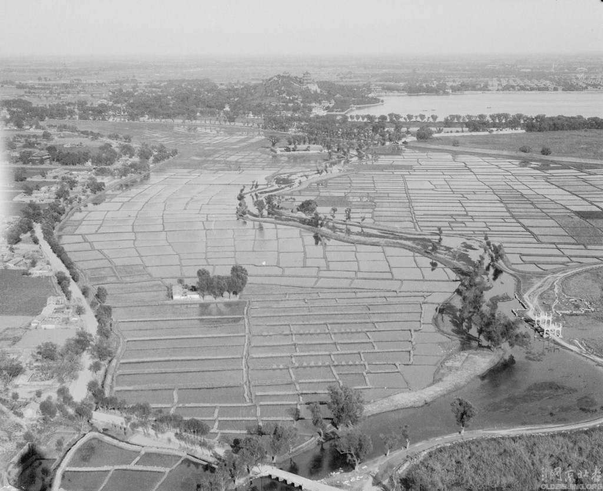
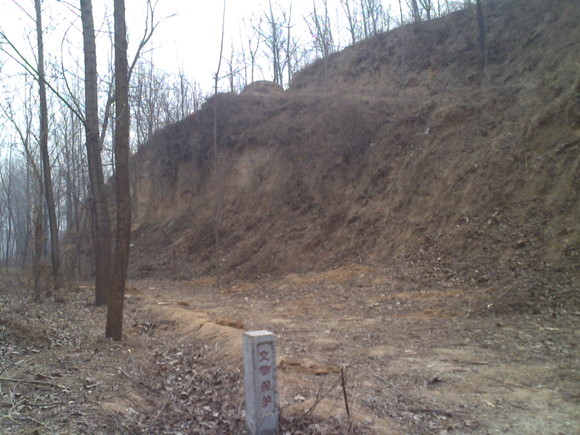

# ＜天玑＞无根之水（上）——北方本是水乡

**说了这么多，无非都是要向大家证明原来我们华北平原也是河道纵横，水塘遍布的，如今的我们已经很难想象这种景象了。就像我们难以想象如今火车川流不息的北京站曾经是流水潺潺的高粱河，难以想象八十年代从北航去地质大学可以踩着稻田的田埂走……**

### 

### 

# 北方本是水乡

### 

## 文/alexmaoist (北京航空航天大学)

### 

题记：昨晚给家里打电话，父母还在浇地，家乡除了一场二指深的小雪之外，再无降水，父母都已年逾六十，仍要下地劳作，晚上父亲还要抱着被子去看电线。作为不孝子，父母养育二十多年，却不能在身旁替父母分担辛劳，心中甚是愧疚，哀痛…… 中国的北方如今频遭干旱袭击，但从历史上看，直到近二三十年前，中国北方一直是丰水地带。 河南简称“豫”，其意即为一个人牵着一头大象，而在我的家乡，一个舅舅挖沙子的时候就曾挖出一副大象化石。在商代，河南地区还是暖湿的亚热带气候。或许你会说这个历史太久远。但直到几十年以来，整个北方地区都是湿润多水的，缺水的北京曾经河网环绕，湖泊遍地，水甘土厚，林木郁郁葱葱……地理学上，这里曾被称为“北京湾”，其湖光山色，远胜千年后今天的水城威尼斯。只不过现在北京严重缺水，众多带水的地名如今只能成为历史遗迹了，连“海淀”都被孔庆东讽刺为“每定”了。 

### 

图一：曾经的颐和园西面（感谢王訸的照片）

### 

关于整个北方原有的水状况，苏拉密的《万流归海见桑田——从华夏5000年农耕文明的大视野仰望毛泽东》一文有比较详细的描述，高粱在我国粮食种植史上历史悠久，从西周早期一直延续到20世纪70年代。曾经我以为“青纱帐”指的是玉米地，一直疑惑玉米虽然可以藏人，但毕竟还不够高，后来才知道“青纱帐”是华北平原曾经广泛种植的高粱，我的家乡地处平原，但在解放前土匪也经常出没，原来不知其何处藏身，现在想来，遍布的高粱地不仅能成为打鬼子的游击队的藏身处，在原来当然也是土匪们横行的重要屏障，不然土匪为什么被称为“杆子”呢？ 但是，今天的华北平原高粱却极为少见，种植了几千年的高粱为何退出历史舞台？苏拉密一文认为：由于华北平原大量的地表水的存在，导致华北平原长期存在严重的水涝与盐碱，导致其他的粮食作为难以大面积种植，高粱虽然难吃，但是具有耐干旱，耐水涝，耐盐碱的特性，大面积种植高粱正是针对这种生态的必然选择。而正是因为毛泽东时代的中国进行了大规模的水利建设，大片大片洼地得到改造，盐碱得到治理，使大片的土地能够种植更好吃的水稻和小麦，所以今天高粱在华北平原鲜难一见。 好了，今天我们不讨论毛时代水利建设的问题，在苏拉密一文中，从农村聚落的变迁，“村”和“庄”来历的不同，“走过一洼又一洼，洼洼地里好庄稼”，洼的广泛存在，证明了华北平原直到二十世纪六七十年代还存在大量的洼地和水泊。 而就我的家乡而言，一直到九十年代初期，小村子都是河流环绕，堪称鱼米之乡的。村子四面皆水，用的也都是压水井。小时候，东边的大沟里长满芦苇，西边的大沟里泉水潺潺，南面的大沟里还有渔船和鸬鹚。村子的北面曾经有一条高架水渠，用于灌溉村子最好的土地，我原来奇怪从何引水，后来问过长辈才知道，当时村北的沟里水还很大，水渠是为了引那里的水的，不过后来大沟干涸，水渠也就废弃了。 

### 

图二：家乡附近的金钟寨，这里原来是护寨河

### 

再看看我们那里的村名，司洼，河里王，河范，蛤蟆洼，龙占洼等等，莫不与水相关，在蛤蟆洼，河范附近，听叔叔说原来地下水位非常高，在地里挖一个大坑就能集上水。 上边说了这么多，无非都是要向大家证明原来我们华北平原也是河道纵横，水塘遍布的，如今的我们已经很难想象这种景象了。就像我们难以想象如今火车川流不息的北京站曾经是流水潺潺的高粱河，难以想象八十年代从北航去地质大学可以踩着稻田的田埂走…… 今天的华北平原却是一片河流断流、池塘干涸的景象，“红旗渠”因河南河北争水问题曾经被河北一方炸开，曾经洪水泛滥的“无定河”如今变成了“永定沟”，曾经碧波荡漾的“华北之肾”白洋淀也干涸了，连母亲河黄河如今也仅仅是保持着象征意义的不断流。地表水消失了，地下水也严重超采，中国又创造了一项世界第一：华北平原由于地下水超采出现了横跨京、津、冀、鲁、豫的世界级超级大漏斗，“超级漏斗、地沉降、地裂缝、海水入侵、咸水下移、海水倒灌”等令人惊悚的词语频频出现在华北水危机的文章中，华北多个城市都在使用千年才能循环一次的深层地下水。 

### 

### 

我曾经骑车从北京到郑州，一路经过永定河、唐河、大沙河、磁河、滹沱河、渚河、滏河、漳河、要么没水，要么是污水，没有一条健康的河流。 我的家乡也是一样，井越打越深，原来是用手压就能压上来的压水井，后来几乎各家各户都自己打了数十米深的机井。原来灌溉是从河里抽水，现在都是用机井抽水。家乡附近的河沟大多都有十几米深，看到干涸的河沟和沟沿上一层一层的水退的痕迹，我真是很难想象这里的河流竟然会有这么深，水会有这么大。 好，说了这么多，下面我们来切入正题，水上哪去了？ 欢迎收看下期文章：无根之水（中）——毛时代兴修水利是北方大旱罪魁祸首？ 

### 

### 【作者注】

本文有相当部分内容来自苏拉密文章及相关网上资料，不一一列举，原创内容有限，一家之言，水平有限，各位见谅。） 

### 

### 

(采编：项栋梁 责编：黄理罡)

### 

### 
