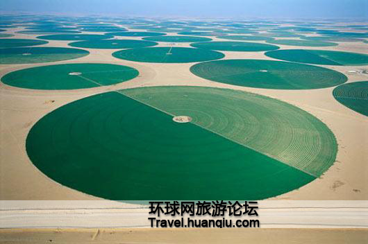
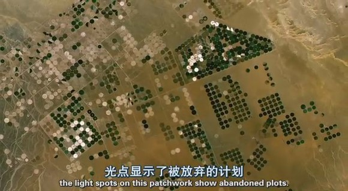
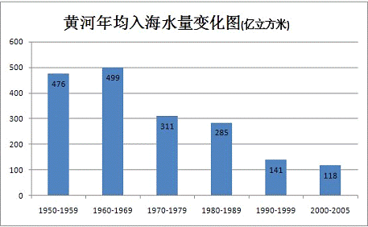

# ＜天玑＞无根之水（中）：毛时代兴修水利是北方大旱的罪魁祸首？

 **物质不灭，地球上的水的总量应该是不变的啊，我这里灌溉了，但水毕竟蒸发了，将来不是还要变 成雨下来吗？水能跑哪去？但现在看来，水总量还是一定的，但每一个地方的水循环应该是天然形成一种均衡态，一旦这种平衡被打破，可能就进入一种正反馈状 态，急剧恶化，直至崩溃，人类历史上类似的例子并不鲜见。** ** **

# 毛时代兴修水利是北方大旱的罪魁祸首？

## 文/alexmaoist (北京航空航天大学)

**题记：北京下雪了，连忙给家里打电话问问家里下雪没？妈妈说下了一点，但根本不够，下着雪还有人在地里浇地呢，我们家的地已经浇完了。**

** **

（[接上文](/?p=7787)）好，说了这么多，下面我们来切入正题，水上哪去了？ 本人并不是水问题专家，以下观点仅仅是参考网络上的文章和本人的见闻做出的一点思考。 对于北方为什么干旱，主流观点无非以下三种： 1、大的周期性气候变化，降水减少，气温增高； 2、工业与城市用水增多； 3、森林植被减少。 以上三种原因必然会造成水源减少这是毋庸置疑的，但以上三点不足以解释北方在短短一二十年中急剧干旱的原因，苏拉密先生的文章对以上三种原因都做了深入的分析，他认为以上这些因素不仅不是导致“水荒”的主要原因和次要原因，甚至根本就是反面原因。比如，农业一直以来是用水大户，城市与工业的扩张增加了用水，如果排除水污染的因素，除开人口因素，同样面积的城市恐怕比同样面积的农田要节水。结合苏拉密的研究，本人认为造成北方近些年急剧干旱的主要原因是大面积的灌溉农业，尤其是改革开放以来不合理的灌溉农业。 灌溉是根据作物的需水要求，人为地向农田补充水分的水利措施。我国广大的北方农业区降水时空不均衡，且降水量小于蒸发量，均属于灌溉农业地带。人类农耕史将近1万年，灌溉农业的出现是农业发展的一个重要里程碑。人类文明大多起源与大河沿岸，现在世界40%的粮食产自于灌溉农田。几个主要的灌溉大国——美国、中国、印度和巴基斯坦的灌溉农田面积占到世界灌溉农田面积的一半以上。在中国，灌溉农业也有近5000多年的历史。纵观中国历史，强盛的王朝大多重视发展水利工程，完善的水利工程才能保证农业收获，进而保证国家的稳定。 据邓拓《中国救荒史》的统计结果，自公元前1766年至公元1937年，旱灾共1074次，平均约每3年4个月便有1次；水灾共1058次，平均3年5个月1次(《邓拓文集》第二卷第41页，北京出版社1986年版)。就灾害的后果而言，“旱灾一大片，水灾一条线”，因此旱灾引发重大饥荒的频次以及由此导致的人口死亡规模，非其他灾害所可比拟。自汉代以来，因各类自然灾害导致的求生性食人事件经常周期性发生，而其中至少有百分之五十以上是由干旱引起的。1942 年夏到1943年春，河南大旱，夏秋两季大部绝收，死亡300万以上，灾民1500万，“寥廓中原，赤地千里，饿莩遍野”、“人相食”，冯小刚今年准备新拍的一部电影《温故1942》即改编自河南作家刘震云描述1942年河南大旱的作品，那次大旱留下的伤痛至今可见，当年姥姥和乡亲们到山西逃荒，在施粥的粥棚里差点被踩死，村里的几个老人前几年才从山西回家…… 毛时代的伟大之处之一就在于通过国家动员、组织广大人民群众对大江大河进行彻底治理，大力兴建农业蓄、排、灌水利工程，一举改变了险恶的农业生态。不仅解决了先民们多年几千年未解决的“排涝”这个核心问题，完成了对大面积低洼、盐碱地的开发，并且通过大规模的水利建设，将大片的耕地改造成旱涝保收的丰产田，完成了中国人几千年的梦想，其意义不逊于大禹治水，同时堪称世界农业发展史上的典范。 但灌溉农业本身并不是可持续的，灌溉的本质是支取环境水源补充农田。环境水源取决于大气降水等气候、地理因素。也就是说，在特定区域内，环境水源的储量和盈余能力都是一定的。在一个生态系统中，水的总量是有限的，过度的灌溉用水占用其他子系统的用水，结果可能是其他生态子系统的受损，甚至引发整个生态系统的破坏。 一个区域（一般按大流域计）的环境水源盈余量有多少？——在水源储量不透支、水位不下降的情况下，通常就是除去维持河道生态所必需水量以外的入海水量。假如灌溉耗水超出了环境盈余量，靠透支地下水、土壤水等水源储量或克扣生态需水来维持，其灌溉就是不可持续的；终有一天会因储备耗尽、生态恶化，导致灌溉体系崩溃。 

【图一】

【图二】

（位于沙特阿拉伯的沙漠农田，这些直径达800米的巨大的圆形农田，利用从圆圈中心的深井来抽取原生地层水来灌溉，这是中东石油出口富裕国的现代农业生产技术。但遗憾的是地层中的原生地层水并不丰裕，它是完全的不可再生资源，因此，很多建成的农田，在耕作几年之后，便只能废弃。） 这个问题曾将让我很费解，物质不灭，地球上的水的总量应该是不变的啊，我这里灌溉了，但水毕竟蒸发了，将来不是还要变成雨下来吗？水能跑哪去？但现 在看来，水总量还是一定的，但每一个地方的水循环应该是天然形成一种均衡态，一旦这种平衡被打破，可能就进入一种正反馈状态，急剧恶化，直至崩溃，人类历 史上类似的例子并不鲜见。 乍得湖位于乍得、喀麦隆、尼日尔和尼日利亚4国交界处，曾经是非洲第四大湖，甚至一度被认为是尼罗河的源头之一，但自1960年以来，面积从上世纪60年代的2.5万平方公里，锐减到现在的2500平方公里，湖体已经缩小90%以上，主要原因就是灌溉。80年代，该地区进入持续干旱时期，该湖的主要水源夏里河和朗格纳河由于被大规模的用于灌溉，现在几乎没有多少水了。 最为极端的例子莫过于咸海。它为阿富汗、伊朗以及前苏联的5个加盟共和国所共享。咸海是世界第四大湖，主要由阿姆河和锡尔河两条河流补给。前苏联曾利用两条河流的水灌溉中亚细亚平原和乌兹别克斯坦与哈萨克斯坦的沙漠，种植棉花。依靠机械化、深度灌溉和大量使用农药化肥，现代化的大农业在这一地区很快地被建立起来。从1940年到1980年，前苏联成为世界第二大产棉国。然而生态环境灾难接踵而至。现在咸海的体积减少了80%，剩下的水的含盐量与以前相比增加了9倍。咸海周围的湿地减少了85%，几乎所有鱼类和水禽的数量都大幅减少。大风每年从干枯 的湖床卷起4000万到1.5亿吨的毒性化合物，抛向周围的农田。几百万“生态难民”不得不离乡背井。1987年前苏联水资源工作者痛心地宣布咸海“毫无用处”，希望它以“一种美丽的方式死去”。 问题出现了，有同学会问：那现在的干旱是不是与毛时代排干了洼地，兴修了水利有关呢？我认为，当然不能排除这种嫌疑，因为确实在不少地方出现过一些 如今看来不甚科学的做法，比如盲目的围湖造田，排干沼泽。但我认为即使有这种情况出现，我们也不能过分求全责备，应该理解当时人民为了解决吃饭问题做出的 努力，汪晖叫毛时代为“反现代性的现代化”，但毕竟是现代化，同环境污染一样，这都是现代化过程中必然出现的问题。 更重要的是，根据本人的了解及相关资料，在北方的广大地区，直到二十世纪九十年代初期，在毛时代水利工程完成十年之后，仍然有丰富的水资源存在，家乡的压水井是在1997左右被废弃，而河流彻底干涸是在1998年左右。而从黄河年均入海水量变化图我们也可以看出，黄河水量急剧锐减也是发生在八十年代末以后。 

【图三】

根据苏拉密的研究，在毛泽东时代，中国北方尽管拥有了大规模、高密集的灌溉农业，但并没有发生透支水源储量和生态需水的问题！截止70年代，黄河流域平原的浅层地下水平均埋深为3—5 米，这是个最适合农业耕作、而且还持有合理“土壤库容”（以备洪涝）的优选水位；黄河年入海水量依然保持300多亿立方米，扣除河道生态需水200 亿立方米，还有100多亿立方米的盈余可供以后扩大灌溉面积。 那为什么毛时代灌溉好好的，到了伟大光荣正确的改革开放年代，河流一个个断流，水塘一个个干涸，水就没了呢？ 作者注：本文有相当部分内容来自苏拉密文章及相关网上资料，不一一列举，原创内容有限，一家之言，水平有限，各位见谅。  

（采编：项栋梁 责编：黄理罡）

