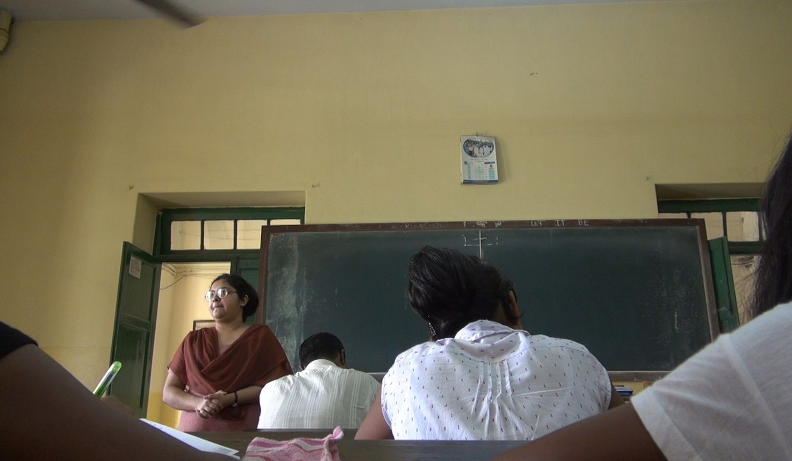
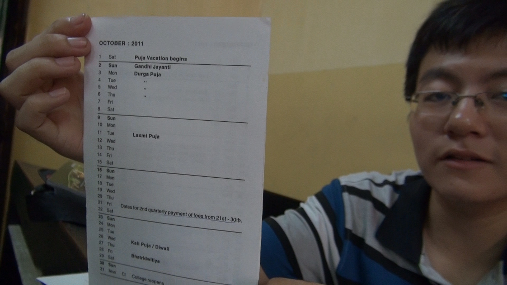
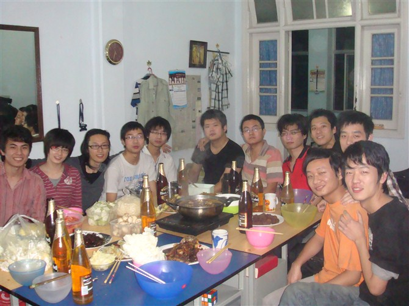
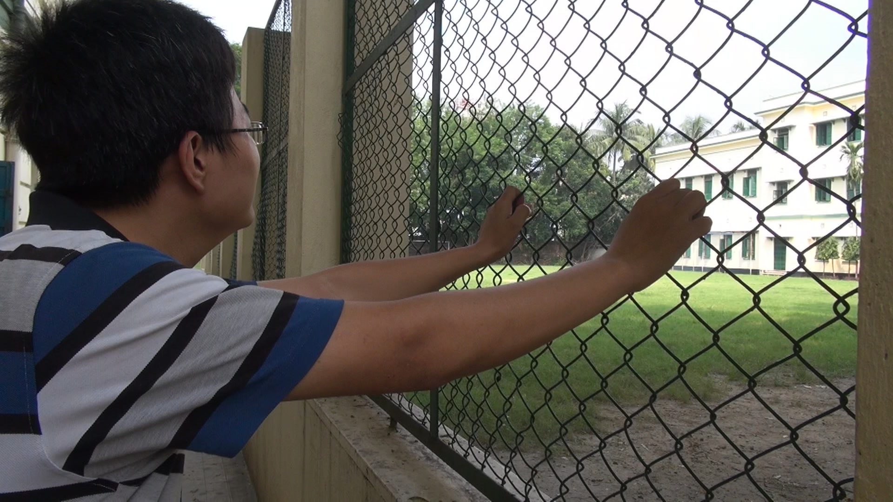
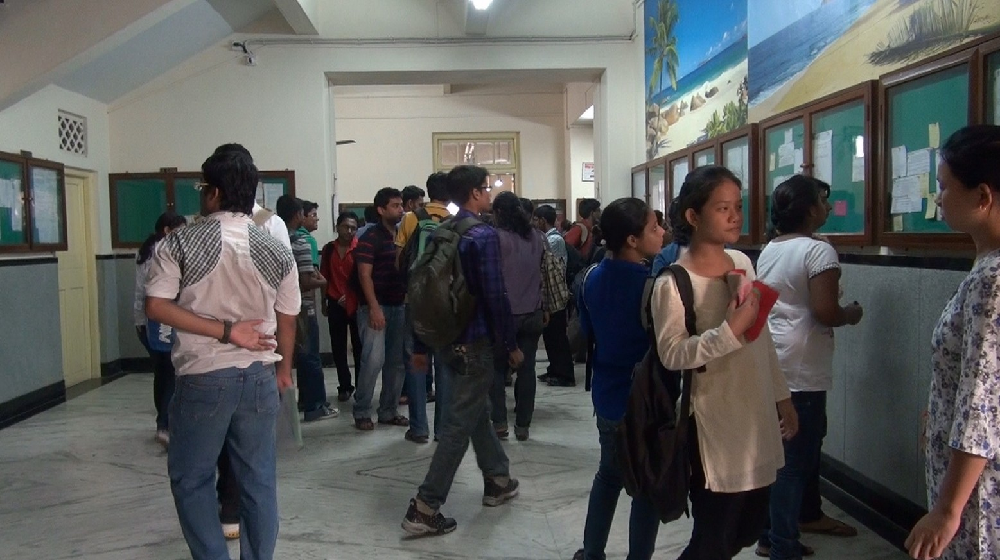
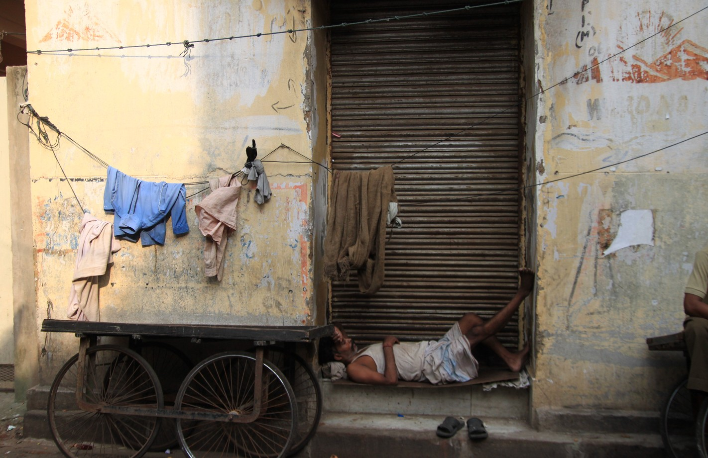

# ＜天玑＞毕业就思奔，安芯的间隔年（一）：中国90后留学在印度

**编者按：** ******安芯，间隔年套餐推广者，北斗七星人物曾有其[访谈](/?p=12708)，足迹涉于美国，墨西哥，四川，马来西亚，西藏，尼泊尔，印度，泰国，柬埔寨，老挝，越南等，她的间隔年鼓舞了很多人，“我还年轻，我正在路上”，本连载为她间隔年路上的一些记录，以飨同好。** 

 **我说等我把记录他们生活的片子做好了，就给他们寄一份过去。等他们老了，还可以给自己的孙子辈说，你看，这就是爷爷当年在印度留学时候的青春。** **其实，无论是在哪个国家，美国，英国，加拿大，法国，荷兰等等，对于大部分留学生来说，无外乎就是四个字：冷暖自知。** **但这些关于青春的印记，需要人去记录。** **至少我们在异国他乡都来过，狂热过，存在过。**  

# 中国90后留学在印度

## 文/安芯(暨南大学)

 

在大多数人眼里，90后不都是娇生惯养的么？

在大多数人心里，印度，这个脏乱差的地方，怎么可能会有孩子去留学，去居住，去生活？

印度中国留学生目前有2000左右，大部分是学计算机类专业，其余的就是商科，金融，管理，语言类。而加尔各答的中国留学生有16个，圈子并不大，但几乎都是90后：90年的温章，89年最后一天的何斌，91年的韩晨，92年的李万祥，90年的高凡，还有90年的马群。

**1.**

89年最后一天出生的何斌来印度加尔各答留学，已经三年了。

“Just because，仅仅是因为喜欢。”问到他为什么来印度留学，眼前这个清瘦的男孩放下手里的报纸，淡淡地回答。

他当年高考填志愿，第一志愿是古巴，第二志愿是新疆的某211大学，但毕业后需要留在那里援新10年，索性就放弃新疆来了印度。

“从小打到做决定都是自己，去哪个学校做什么事情，父母都会问我为什么，我再把原因细细地告诉他们。”

“我的感觉就是在路上，on the road，我们都在不停地寻找着什么，也许在寻找这个的时候不经意间就发现了其他。”

“那你在寻找什么？”

“这个问题我得在三十岁的时候才能回答你，那时候有了一定的阅历和经验，关于人生的一些观念已经相对比较成熟了。”

喜欢也好，寻找也罢，其实说到底都是个感性的东西，在它们的背后总会有理性的支撑吧？

“调查，各种调查，顺便借用别人的眼光去看待世界，因为不同的人都有他自己的观察思维模式和方法，最后你才将不同的眼光综合起来，有时候也会形成你自己所特有的。”

“我也会根据市场走势，从网上获取各种信息，比如大的方面就是中印两国的贸易政策趋势，小的方面如中资公司业务方向，零售市场的开放程度，市场潜力值，劳资关系如何，很多东西值得深入探讨。”

“那你调查市场会有偏向性么？”

“印度的话，这边的电子市场非常大。我在出来的这两年一直在探索这到底是什么样的市场。但是我现在学的这个专业，也许以后未必会从事这个行业。其实用不着想太多，因为一个人在四五十岁之前需要的是睿智和磨练，而最好的途径就是和不同的人打交道。”

何斌学的是商务管理，很明显从大部分话里都能够感觉到他的专业敏感。

韩晨，91年出生的小伙子，河南沈阳人。他说，他来印度的那一天是2010年9月26日，他会一辈子都记住的。

为什么来印度留学？我抛出了同样的问题，因为这是这群人的起始点。

“高考没考上理想学校，考虑过欧美国家，但费用偏高。再考虑新加坡，又觉得文化底蕴不够深厚，但又想通过留学锻炼下自己。索性就选择了印度。”他回答得很坦诚。

**2.**

“2009年来的时候，刚下海德拉巴的机场，哇，印度这么现代化啊。”

那晚，我和这群90后中国留学生，坐在加尔各答广场的草坪上，听他们讲故事。

“等我坐上机场大巴到市中心时，就看到贫民窟了，心立即从天上掉了下来，哇凉哇凉的。”何斌坐在草地上，抿了口印度姜茶（Masala Tea），开始回忆当初的模样。

恩，甚至包括我自己，下飞机后，尽管坐在加尔各答特有的黄色出租车里，也是闷出了一身臭汗。再看窗外，公车爆棚得像人肉炸弹，地上横七竖八地散落着垃圾纸屑，光屁股的小孩满大街地跑，旅馆的房间里裹着一缕咖喱味。

那时我同自己说，以后再也别来印度了。

“后来连续三天，我也没吃饭。不知道吃什么啊，就吃面包，但面包也太难吃了，好不容易找到炒饭可以凑合着吃。这才没把自己饿死。”

“那跟家人抱怨过吗？”

“有啊，接着我就给爸爸打电话，说想回来了，他让我再坚持一个星期，实在不行就回去吧。”

“那怎么忽然想通留下来到现在的呢？”

“不经意和一位学长聊天，他说，既然来了，换一种心情看待环境。这个环境差，到底差在哪里，多了解一下，一旦了解，就带入感情了，自然而然也就适应了。”

“坚持一件事情肯定会有困难，有些事情是心里想做，有些事情是应该做的。去印度留学坚持几年，是应该做的，想通这一点，生活条件这些也就没那么在意了。”91年的韩晨抚了抚金丝边眼镜框，在旁边补充着。

印度是穷，但当我们没有来到这里的时候不会去想这个问题，印度是山，是海，到底是什么样子。中国穷至少还是家徒四壁，但是这里睡觉，今天晚上睡了这块地，明天就不是你的了。

“你在街边看到的那些小摊小贩，每天赚的钱可能只有20卢比，但是要知道，若是他们不做，可能一分钱都没有。这边扫垃圾的人，下水道啊，赤身裸体地就跳下去了，用最简单最原始的方法去处理。但是他们认为他们很幸福，因为比起非洲人，他们还是有得吃，非洲人他们是连吃的都没有啊。”

何斌是个细心观察生活的人，言谈举止就能略知一二。

“那你觉得这三年学到最多的是什么？”

“换一种眼光去看待世界。当你看到一个扫大街的人很脏不愿意靠近的时候，也许这份工作对于他而言，就是满足的，也许对他而言，这就是美啊。当你觉得瞧不起他的时候，也许你毕业出来的工作还不如他，毕竟这个市场是瞬息万变的。最好的办法就是了解交流沟通。”

恩，交流和沟通，才能慢慢地将那些因为信息不对称所带来的误解消除。

“三年，现在的你和当初没来印度时的你差别大吗？”

“以前高中所在的地方很小，当时就觉得以后毕业了找份工作，拿两三千的工资，可以有自己的房子，讨个漂亮的媳妇，就满足了。”

“在哪里发生了转变呢？”

“西安，我后来去西安呆了段时间。发现自己眼光很短小，看做自己身边的人一个个都有自己的目标，也许他们的目标很小甚至和我的相似，但是他们的眼光并不是和我一样局限于小范围。因为他们追求的是物质与精神的质量，而我还只是停留在短短的基本要求之中，并没去设想其中的质量到底怎样。”

“有的时候世界很小，近在咫尺，但是视野可以很大，自有自己的生活态度，只有思想观念的转变，才会慢慢学会怎么去生活，怎样去珍惜生活，怎样去拥有与享受，在印度苦中作乐亦是如此。”

思想观念的转变？恩，我想是这样的，经历，感悟，最后是思想观念的转变，少了最开始的经历，哪会那么轻易就质变的。

“所以我现在特别珍惜周围的朋友，你看在国内咱两相隔那么近都没有机会相遇聊天，而几年后在国外，我们能够坐在灯光下畅谈，这就是幸福。”

“你有宗教信仰吗？”

“我想我已经超越宗教信仰了吧。信仰没有高低贵贱之分。”

反倒是我自己，在听完他们对印度看法的转变后，扭头再去看这片土地时，先前的厌嫌也荡然无存了。

**3.**

次日清晨，90年的温章和高凡带我去他们的学校旁听，加尔各答大学圣泽维尔学院，泰戈尔的母校。

在印度留学，听他们说，不同专业不同学校的收费都是不同的，但一般生活费加上学费一年3-5万就足够了。贵一点的如南部的韦津格尔理工大学一年是8万。

转悠了一圈学校，我转身问高凡，“在这里念书最大的困难是什么？”

“考试，我们专业的考试，一场考试，大都是宽泛的开放式问题，写不到二十页纸是拿不到高分的。比如解释“管理”的意思，你必须得把不同学者对管理的定义写出来，最好还要分别对它们评论，说说你自己的看法。”商务管理专业的他回答。

“考试很难，过不了就留级，听说这里的计算机专业没有一个外国人过，好多人上了一年就转专业了。”温章补充着，同样也是考试。

不仅是国际学生，这里印度人的学习压力更大。“以前在海德拉巴学语言的那个学校，我呆了六个月，就听说了三四次跳楼自杀的，都是印度人”

印度理工和印度商学院是整个印度最好的两所大学，简称IIT 和IIM。IIT在印度有7所分校，其中以孟买理工为最好，IIM则以加尔各答最强（IIMCA）。光是东，北部这边来说至少每年有40万以上的人报考印度理工大学，而每年录取率只有千分之一。印度商学院只招收研究生，每年的学费是4万美金。

印度人多，贫富差距大。于是，小学开始上补习班，中学条件好一点的请家教，再是补习班，最后就是参加邦（即国内的省份）一级的统一考试，再去考想报考大学的自主招生考试。

至于印度的教育和国内教育的差异。何斌说这边更注重思维方式的培养，所以平时作业不多，但考试就显得灵活多样了，以论述题为主，都是考当前的一些实际问题。怎么去解决处理。

其次就是教育体制上的，印度大学主要以公立和私立为主，公立的比如加尔各答大学沿用的英国教育模式，私立的主要财团投资或者是和欧美大学合作创办的。

“那其他方面呢？”

“学校的限制太多了，吃饭不方便，上网不方便，每天还要求五点钟必须回到宿舍。校规规定不准谈恋爱，不准带手机。校长每天会站在校门口查勤，若是被查到缺勤，今天会查明天的，也会查前天的，若是被发现了就会被罚钱，10卢比。”

“我都被罚过的呢。”温章腼腆地笑了笑。

“还有就是气候太差了。这里不像国内有些地方，四季分明。这里只分旱季和雨季，而实际上从三月份开始就达到38度了，四月到七八月份是最热的时候，气温差不多四十多度。”

坐在教室里，印度老师在讲台上课，我偷偷地打开了机子。

“这里的大学老师经常缺课，大多是我们来了才知道今天没课。”温章在旁边悄声对我说着。

“这是为什么啊？”

“那主要是一般的公立大学，由于是政府出资，老师工资低，所以大部分大学老师就到外边开补习班之类的。”

“这里的假期也挺多的。”说到这里，温章乐乎了起来，从包里翻出一张学校的日程安排表，摊在我面前。

“你看，10月放一个月，因为是印度的新年，11月也是各种假，夹杂着些考试，一个星期考一科。12月放一个月，寒假，5,6月份放暑假，再加上每个月的大小节日和星期天，总共算起来放假的时间就有半年。”

每天都期待着放假，这是从小到大我们共同的心声。

**4.**

稍有空闲，何斌高凡他们就带我去他们这些留学生最喜欢的餐馆吃饭聊天。

16个中国留学生在加尔各答，远远比不上美国英国加拿大的留学圈子热闹。何斌和高凡干脆搬到了便宜的旅馆住，至少那里来加尔各答旅游和做义工的中国人还是有的。

何斌干脆在旅馆门口贴了张“中国之家欢迎你”的告示，留下了自己的联系方式，但凡需要提供资讯的中国人，他都会热心去帮助。

人终究是社会动物，离不开朋友的。

一次在中餐馆吃饭，“在这里有印度学生的好朋友吗？”我问他们。

“印度人不守时，经常让人等半个多小时，交不了知心朋友，又抠门，在一起时常常不会主动掏腰包付钱。”温章略微有些愠色。

“也不完全啦，印度办事效率是很低，因为在他们的宗教信仰里，等人是一种幸福，只有高等级的人才会很悠闲地等人，所以在一些印度人眼里等人是一种很自豪的事情。”何斌手舞足蹈地解释着。

但是在我们中国人眼里等人是浪费时间的，这就是文化差异。

轮到韩晨开口了，“我挺喜欢印度人的，对人热情，很豪放随意地和你打招呼。不信，你去商店买东西，他们从进门到出门热情地介绍。即便你试完这个又试那个的，最后不买，他们也不会骂你。”

这一点我倒是深有体会，印度小商贩的脾气的确出奇的好。

“那平时你们自己有没有什么娱乐活动啊。”我想到美国的留学生们会有party会有BBQ会有shopping会有camping。

“我们都是印度宅男啊，你也看到了，这里好玩的不多，四十多度，天太热了也不想出去，偶尔会有party，但也就三四个人。”何斌打趣地说着。

“也就是和室友之间开开玩笑，打闹打闹，酒吧喝酒聊聊天。”韩晨和另外四个中国留学生住在一块，合租了一套房子。

后来混熟了，我经常开玩笑问他们感情问题。

90年的马群有一个漂亮的印度女朋友，平日里两人总是形影不离。偶尔傍晚去广场的草坪里浪漫，还被印度警察用枪顶过脑袋，吓得马群再也不敢夜里拖着女朋友公然浪漫。

90年的高凡一有空就揣着一张地图到处走，他说他的梦想是环游世界，那么现在就从加尔各答做起，别的留学生或多或少都笑话他这个看似有点异想天开的想法。高凡告诉我，他在国内喜欢的姑娘已是别人的女朋友了。

何斌则总是将学业事业挂在嘴边，他说感情的事情在自己寻找的路上说不定就会遇上的。

92年的李万祥则总是缩在屋子里，从移动硬盘里翻出一部部他喜欢的动画片，津津有味地看着，偶尔遇到不错的，主动说拷给我看。

我离开加尔各答的那天，高凡依旧是摊开报纸坐在屋门口，何斌抱着一大堆资料说马上要考试，再不复习就要挂科了，马群和印度女朋友又不知所踪浪漫去了，韩晨和李万祥忙忙碌碌地在厨房里做饭烧水，偶尔做做小火锅几个留学生们凑在一起热闹热闹。

当我平静地用文字娓娓道完这段故事后，我给何斌发了条信息。

我说等我把记录他们生活的片子做好了，就给他们寄一份过去。等他们老了，还可以给自己的孙子辈说，你看，这就是爷爷当年在印度留学时候的青春。

其实，无论是在哪个国家，美国，英国，加拿大，法国，荷兰等等，对于大部分留学生来说，无外乎就是四个字：冷暖自知。

但这些关于青春的印记，需要人去记录。

至少我们在异国他乡都来过，狂热过，存在过。

附：

安芯的微博：[http://weibo.com/anita0429](http://weibo.com/anita0429)

安芯的博客：[http://blog.sina.com.cn/jing0429anita](http://blog.sina.com.cn/jing0429anita)

 

（采编：应鹏华；责编：应鹏华）

 
