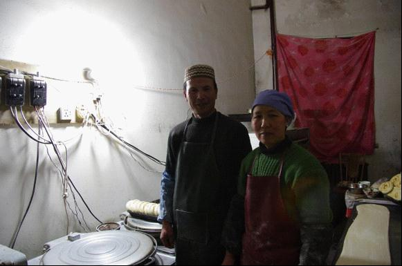
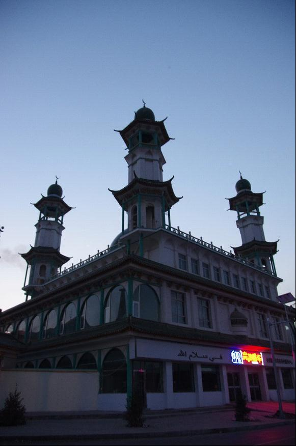
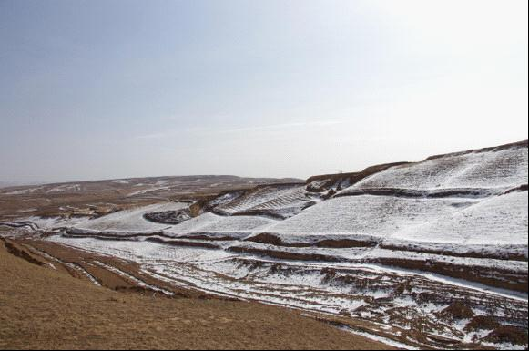
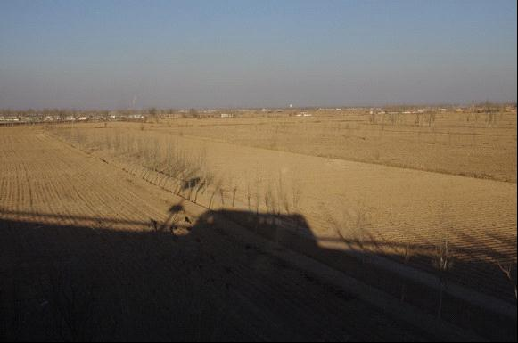

# ＜天玑＞甘宁游记（一）：畅游宁夏

**黑暗中，跪倒一片的穆斯林们都在轻声得念着些什么，语调相近，但各说各话，整个大厅的祷告声和在一起，于我来说就像有千条虫子在心头蠕动，莫名的一阵鸡皮疙瘩就起来了。但稍作适应，便能慢慢地感觉到虫子都停下来了，心里也慢慢平静下来了。在光明短暂地出现之后，我再度陷入了绝对的黑暗。屋子里只能借助月光看到幢幢人影，偶尔的光亮，还是汽车驶过的灯光穿过窗户，在屋内嚣张地划过。很快，又重新陷入了黑暗。当我慢慢地体会这种平静、以为早上第一次的礼拜就是如此度过的时候，突然亮了起来。**  

# 畅游宁夏

## 文/李东哲（吉林大学）

 

忘了从哪里看来的了，说，在清晨进入一个城市，看着这个城市慢慢苏醒，看着这个城市的人最不假掩饰的一面，是一个了解城市最好的机会。看的时候，头如捣蒜，浑身兴奋得冒鸡皮疙瘩，觉得这句话说得不仅对，而且带感，并在很长的一段时间内奉为圭臬。但是当我今天凌晨五点多下了火车，黑灯瞎火地来到宁夏一个叫做同心的偏僻小县城时，嘴唇边打哆嗦边颤抖地骂道，放他妈的狗屁。

我对黑灯瞎火这词，只会嫌其程度不够。满城都浸没在黑暗中，我需要借助出租车驶过的大灯才能看清前面是小路直行还是分叉十字路口。好在黑暗之中，还能隐约传来一阵阵颂唱的声音，忽高忽低，听不清也听不懂。不用多想，必然是来自于回族伊教。或许是这宗教的力量，让我在阴黑的寒风中拒绝了一辆又一辆对我按喇叭的出租车，一个人边用已经僵硬的大拇指滑动着手机地图，边跟随着屏幕上小小的箭头，闭着眼睛走。

拐过一个路口，看到一个亮着灯的房间，扫到貌似是经营什么吃的之类的，没多想就钻了进去。在夫妇俩的惊异中，我淡定地从兜里拿出纸巾，擦干净眼镜的哈气，才交待了我的窘境。夫妇俩也很大方，搬了个板凳，倒了杯水，就继续忙自己的去了。这是一家烤馍店，男人做馍，女人做花卷，皆由此，我才感受到了这两种食物之间细微的不同。买了4个馍，边啃边满屋子转悠，看看这问问那。沟通其实颇有障碍，我祭出了高考英语联系上下文的功力，也能沟通个八九成。征得同意后，开始一顿乱拍，用快门声掩饰自己的无聊和尴尬。后来实在觉得过意不去，或者说能聊的都聊了，剩下的实在聊不来了，气氛太尴尬，我就想帮着干点啥。但还是被化骨绵掌般嘿嘿一笑拒绝掉了。我想我是在无以报答这一张椅一杯水一间屋，于是就想给他俩拍个合影，日后给他俩寄过来。对于照相和镜头，能看出女人很惶恐，就想刚进屋子坐定的我，不知道该干什么，不知道眼睛该往哪看。咔嚓一声后，女人长出了一口气，好像庆幸自己终于又可以回到自己熟悉的事情、回到花卷当中一样。男人则很高兴，半天合都不拢嘴，笑呵呵地一字一解释地告诉我邮寄地址是哪里。

在旅途的开始，用此来为自己开一个好头。

旁边的清真寺突然用大喇叭念起了乌里哇啦的声音，男人告诉我这是要礼拜了，让我快去看看。我跟着一群边穿衣边打哈欠的人流走到了大殿门口，左顾右盼地用眼巴巴的眼神望着别人，希望能得到一个明确的能否进入的指示。原来看了一篇关于无良摄影爱好者在藏区为了拍到一张心满意足的照片而不断秀下限的文章之后，就一直提戒着自己。所以对于宗教，我还是谨慎一些为妙。我本着“宁可错过一张绝佳的作品，也不要当摄影界的人渣”的心态，进入大殿，坐在最后的一个角落里，尽量不让人注意到我。

黑暗中，跪倒一片的穆斯林们都在轻声得念着些什么，语调相近，但各说各话，整个大厅的祷告声和在一起，于我来说就像有千条虫子在心头蠕动，莫名的一阵鸡皮疙瘩就起来了。但稍作适应，便能慢慢地感觉到虫子都停下来了，心里也慢慢平静下来了。在光明短暂地出现之后，我再度陷入了绝对的黑暗。屋子里只能借助月光看到幢幢人影，偶尔的光亮，还是汽车驶过的灯光穿过窗户，在屋内嚣张地划过。很快，又重新陷入了黑暗。当我慢慢地体会这种平静、以为早上第一次的礼拜就是如此度过的时候，突然亮了起来。先是两块大屏幕，上面显示着圣城麦加那个著名的四方形，接着，是侧灯、顶灯。刚刚适应黑暗的眼睛下意识地眯了起来，让我怀疑他是不是用这种方式来体现真主的神迹以及光芒万丈。

询问过后，我也大胆了起来，在最后一排不断地寻找着拍摄的角度，再借诵经声的掩护，按下快门。拍了几张之后，便见好就收，有猫在角落里静静呆着。反而是几个穆斯林好奇，围坐了过来，刚开始客套地问问家乡问问来因，熟络之后，便开始给我出谋划策，你去那边，你来这边，你上二楼，你等结束人纷纷起来往外走时拍，你周五中午那时再来拍因为人会更多等等，弄得我受宠若惊，现出一副谨小慎微怯怯懦懦的怂样。

礼拜结束，钻入冰凉的鞋洞里，随着人流出来。天已经微亮，但月亮还没退去。我走着走着，突然间抬头，看着清真寺的穹庐上顶着一轮真正的新月，心中恍惚，觉得眼前的一切不太真实。

宁夏本不是旅游热门，再加上现在正是淡季中的淡季，我走在天亮的大街上，就算收起单反试图佯装本地人，还是会常常引人侧目。在他们的帽檐和口罩之间的缝隙，射出两束或是好奇或是警惕的眼神，弄得我蛮不自在的。目光是有重量和热量的。

同心去处不多，有一个名气颇大的同心清真大寺，位于城南。一路走过去，接受了一路目光的洗礼。步行、抵达、拍照、围转一圈之后，也就大功告成可以返回了。对于这些做功课时便了解了详情、看过了图片的景点，我总是抱着一种完成任务的心理，继想象之游后，肉体再走一遍。以目前我的文化底蕴和素养，还不足以让我在肉体走的这一遭时，获得一些额外的收获，例如站在古遗物旁感慨历史兴衰，指点人物臧否。虽然惊喜也偶有发生，比如看到周遭的环境心生感慨，或是偶遇高人闲聊片刻，但这种东西都是可遇而不可求的。

我把这样死气呆板的固定节目视为引子，嚼之无味弃之不可的引子。有了这些引子，我才会去某一地方的冲动，其实我心里也明白，这种冲动其实冲的是其过程中可能发生的预料之外的惊险、惊艳和惊喜，但这样的想法被牢牢压在潜意识之中，老老实实地做着去之前的功课，天真的以为那些书上白纸黑字、彩色图片的景点就是这次出行的全部意义。直到真正踏上旅途，它才显露真身。但为时已晚，人已在路上。

比如，我从同心坐大巴去下马关的路上，拐过一个90°的弯之后，一个小村庄突然闯入眼前，被四周还带着白雪的土堆沙丘包围着，困顿的我立马不打瞌睡了，改打鸡血了。看表，觉得时间差不多，应该离下马关不远了，于是就扯着标准的普通话喊着要下车。不知道是我的普通话暴露了我游客的身份，还是因为要在这里下车的原因，我再次遭到了众人的侧目回头。后来知道了，是后者。

刚下车，还抑制不住的兴奋，但随口问了句还有多远到下马关之后就乐不出来了，还有15公里。忍着沮丧和无助，转身往回走，想要去找那给我惊艳的Frist Sight的地方和角度。搭了个男人的摩托顺风车，在他的指点下，我弃国道，该走土路，穿越土堆沙丘，抄捷径去到那公路的制高点。

这片大地应该还属于西海固地区，那个世界上最不适合人类居住的地区之一，风大沙多，接天连片的土山被风一刀一刀割成千奇百怪的样子，但大多都棱角分明，高低错落。就是这个高低错落，有时眼前高出的两米的台阶，就需要绕一大圈子才能上去，边饶边想着小学课文中得詹天佑之字型铁路。但这样的之字没绕多久，我就丧失方向感了，眼见原来的小路越来越模糊，眼前的路况越来越不像该有的情况，我觉得自己可能是迷路了。虽然我知道公路国道就在身边不远处，但我被起伏不定的山石沙土挡住了视线，不知道该往哪里走。迷路了需上高处，我调整指针，向着一个目测觉得还能得上的小山头前进。爬得这一路甭提多漫长了，以至于我想到了爬雪山的王石，想到了骑行要翻越好几座山的川藏线，想到了两次的马拉松。我借用种种痛苦的体验和想象，来缓解麻木当前的酸乏、疲劳。到顶之后，确定了公路所在，下山，搭车，这才到达了本该两个小时前就到达的小镇。在车上，我看着相机里平淡无奇的照片和满身的灰土，除了苦笑，还能如何呢？

说到搭车，就说说自驾游。自驾游原来在我心里的印象是无比美好的，自由自在无拘无束，想去哪就去哪，不受太多客观条件的限制，想拍照就停下来，休息够了就继续走。但这次出来也不知道为什么，突然觉得自驾游也并不是那么完美。不完美是当然，原来刚接触这个概念的时候是被蒙蔽了眼睛，看不到罢了。自驾游在我看来的缺陷，除了油费、体力、安全等乱七八糟有的没的之外，旅行的体验方面会打些折扣。自驾出去相比于通过公共交通出游，多了方便快捷，但是少了和人交流的机会，封闭性骤增，好像一路都被卷在了那个钢铁盒子里面，和外界断去了交流，偶尔的问路，也是人不下车，摇下单面透光的车窗，冷漠且高傲。而采用公共交通乃至于双腿的旅行，则平易近人得多，显得更加开放。你可以打量作为旁边的人，也可以攀谈聊天，你可以在街头逮着一个人就上去问路，过足听陌生方言的瘾。就好比原来我对比过的，飞机和火车两种方式抵达一个城市的区别一样，一个冰冷客套，高高在上，一个热气腾腾，更接地气。

之后的过程就显得稀松平常了。第一天从早上5点多抵达同心，白天走过了下马关和韦州，看了眼两地的古城古墙，说白了就是一些黄土堆。之后以吴忠为中转，马不停蹄地赶往银川。值得一说的是韦州到吴忠一路，沿途到处都是巨型的风力发电机，一个个白色的大风车密密麻麻地出现在国道两旁，让我感觉自己像是塔防游戏里面忍受挨打的怪物。

原本计划两天的路程，一天就走下来了。当我走进银川市唯一一家青旅时，已经晚上八点多了。第二天，上午进行西夏王陵，是银川的惯例；下午去找书店逛书店，是我的惯例。一路暴晒暴走，一路胡吃海塞，晚上回到旅馆，享受大西北彻骨的寒冷，在只有我一个人的青旅之中，抱着电脑敲着键盘，入睡。

明天一大早的火车，从银川到嘉峪关，宁夏部分也就到此为止了。原来计划中的一百零八寺和中卫的沙坡头，在我看到后面的敦煌和甘南之后，也就不想在此过多地停留留恋了。初期对于旅行的规划，就像人的动脉血管，只规划出大概要去的几个城市和方向顺序，也只能规划到此。但随着旅程的深入，我们开始能够慢慢地画出周身的更细的支血管了。但需要注意的是，着眼于局部的毛细血管时，也要通盘考虑，切忌因为眼前小景，而侵占了后面重头戏的时间。

#### 花絮：

途中还发生了一件有意思的事情，就是撒了一泡一块钱的尿。作为附加产品，还顺道参观了一下令人发指的厕所，堪比那个日本人书中所说“最危险的厕所”。这样说这样想并不是刻薄，也不是阿Q，我确实是这么认为的。就好比有一次和朋友座出租，事后我被朋友告知，司机绕远路了，我问何以得知，答曰他看到司机从镜子里面瞟我们了。我在脑海中试着重现了一下当时的情景，不禁笑了起来，觉得这几块钱花得值，让我得知了这么有趣儿的一个动作表情，就好像我通过这一小细节就窥探到了的哥的内心世界一般，津津有味，回味无穷。

#### 尾记：

这次来甘宁，功课全靠一本Lonely Planet的甘肃宁夏本。书的专业自然不用说，让我颇为欣赏的一点在于，书中不会给你大量的目的地的图片，而是通篇通篇小如蝼蚁的文字，用一字一句去描述他向你推荐的那个地方，让目的地的形象只能存在于你的想象中，而不是直接让你看到景点的图片。做功课的时候可能会稍显枯燥，我就经常看见那一大段一大段的描写就头疼，心想着你放个图片不就完事了嘛。但只有当我到了目的地看到了他描述的景色的时候，才知道LP这一点是多么得用心良苦。它避免了目的地对你冲击力的分散，看图时觉得美，真到现场时美的感受就不那么强烈了；而是用文字在你脑海中建立起一个因人而异的图景，带到你亲身走近亲眼看到之时，冲击力夹杂着和想象中图景的对比，倾斜而至，给你极好的享受和体验。你会感觉到你参与到了自己的旅行当中，而不仅仅是按照指南上的安排有一看一，单纯地重复别人的经历。

把事物的客观情况摆在眼前，让你根据其描述可以判断自己是否感兴趣，从而作出决定，而不会过多地影响使用者的主观意识，这就是好的指南。

 

（采编：何凌昊；责编：尹桑）

 
