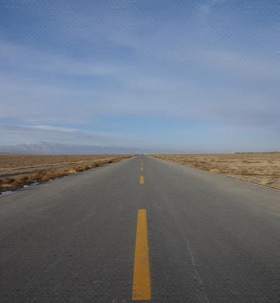
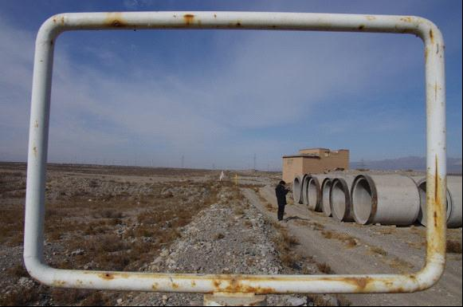
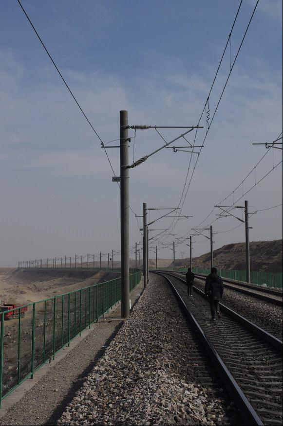

# ＜天玑＞甘宁游记（三）：三人游暴走嘉峪关

**有时旅途无论再苦再累，但只要心里面明白，有那么一两张得意的照片在自己的相机里，有那么一两篇满意的文章在电脑里在小本子上在自己脑海里，就会有莫大的幸福感出现。照片静静躺在相机里，文字瞧瞧躲在电脑中，而幸福感则在不知不觉中降临，以至于在临睡前或在旅途结束之后，这种浓而不腻的感觉才愈发地酝酿、弥漫。这种心里上的满足感，和饿极之后吃上一顿哪怕不是当地小吃的饭，以及累极之后坐上一刻钟的休憩，并成为旅行中的三大幸福感。出门在外，对周遭条件的要求降低，幸福感的门槛也随之放低。**  

# 甘宁游记（三）：三人游暴走嘉峪关

## 文/李东哲（吉林大学）

 

越长越大，就有机会去一些小时候只能在文字中打照面的地方。没到之前，会竭尽所能地在脑海中搜刮儿时仅存的印象。酒泉、嘉峪关、敦煌皆在此列。还有些地方，哪怕是现在依然没什么看头了，仅存下黄土堆一片，也值得站在旁边静静体会一番，比如郁闷比如阳关。去看他的衰败，去找自己的感慨。其实在大西北，景色大多那样，黄黄的一片石头土堆一般的东西，放在银川那叫西夏王陵，放在嘉峪关那天下第一敦，放在敦煌那叫雅丹地貌，放到阳光玉门关，那就是名气响当当的城楼城墙长城。呼呼的狂风当中你明白，无论你历史上多重要多牛逼，时光和岁月总会把你碾成一个德性，不由分说。

在去嘉峪关的火车上碰到认识了两个人，一个上海人，一个四川人，在银川做完项目之后，一路溜出来玩。三人合伙，变身疯子三人团，一起游走嘉峪关和敦煌。

一大清早，疯子三人组就打车来到了离市区十余公里的“天下第一敦”。离景点还有很远就惹得三人连爆粗口，来表达自己的感受，虽然眼前只有一条笔直的国道和道路尽头那黄黄的土堆。上海男人和他一样，喜欢摄影，二人话题较多，而四川男人则插不上话，一个人走在前面开路，也顺带着不断提醒另外两人，让他们随时知道自己因为不断的快门而落下的路程。他还是蛮喜欢这个四川男人的，性格爽，说话直，什么路都敢走，托他的福，嘉峪关的徒步暴走才能这么有意思。一路上，也主动或被动地当着他和上海男人镜头中的模特。有时四川男人走的太快了，会被另外两个从取景框中探出脑袋的人吼住，让他走慢一点，或者直接粗暴地让他走远点走出镜头；有时则会被告知不要乱动，保持神态深邃地向前看之类之类的动作。从始至终四川男人都没有怨言，他觉得他愈发得可爱，也就爱屋及乌地跟着他手机喇叭里的音乐，边走边大声唱跑马的汉子，或是爱情买卖，在萧条的古长城旁边，冲着还覆盖着冰雪的祁连山脉。

只有摄影人的旅途是不好玩的。大家都冲着大致一样的景色和方向，举起各式各样的黑洞洞的枪口，拍出无甚差别或是天壤之别的作品。就好像眼前的风景是一个衣着华丽且暴露且浓妆艳抹且在搔首弄姿的女人一样，脸上带着面无表情的笑容，面对眼前一群长枪短炮，并接受恍如白昼的闪光灯群的接连轰炸一般。这样的美给他一种很俗的感觉，哪怕那景是真的美，也会被水泄不通的围堵闷得枯萎。有一个对摄影毫无感觉的人的存在，好像才能显示出自己审美的独特一样。他自认为站在了另一个层次上去进行对自己的更高级的欺骗。

并且，照片当中有人才会鲜活。虽然摄影人之间也有偶尔有那种螳螂捕蝉黄雀在后的偷拍，但这种拍摄，在拍照人的心里，拍得其实不是别人，而是自己。没有把对方当成拍摄的对象，而变成了一种意识当中的自拍。摄影的人呢，长期藏在镜头后面观察世界，大多会变得越来越羞于出现在镜头前，但其内心当中却极其想拥有一张拍自己的好照片。这样的复杂矛盾的心里贯穿整个旅途，有时知道自己在被偷拍，不躲不闪，强装镇定，控制神情，努力向深邃深沉方向发展，装作一副浑然不知的样子。然后再在无意当中翻看发现旁人相机中的自己，隐藏住惊喜或是失落，淡淡地说等下给我拷一下这张照片。

三人游，没了自己出行时的自在随性，本不是他所喜爱的方式，但和不同的人组合在一起会对阶段的旅途起到什么样的作用，这也是我很好奇的。同时，也给了他观察别人旅游方式的绝好机会，他跟在两人身后不远的地方，心想。有时他会琢磨，在结束每天的奔波和疲惫之后，为什么还要面对那块小小的屏幕，勉力去记下一些东西。顺着这个思路，他琢磨起自己为什么喜欢写为什么喜欢读别人的游记，希望从中获得些什么。他在微博上扔出了这个问题，和往常一样，应着寥寥，很快就被信息的洪流淹没。他只能自己去回答这个问题，利用睡前那段宝贵的黄金思考时间。睡前这段，适合来琢磨一些困扰自己良久的问题，身体放松，精神轻松，前方等着自己的是最能给人以安全感的睡眠，没有任何的后顾之忧，有时甚至连梦都会帮你。但是，好不容易想清楚之后，容易被第二天接踵而至的零七碎八给冲淡忘掉，偶尔想起，感觉像是个久远的梦一样，模糊且揪心，直到想破头皮终于找到那一刹那，都有便秘许久突然通畅之愉悦感，虽然没经历过，但我猜测不过如此吧。

他自己的答案，在于旅行的方式。我们通过文字影响或者直接接触，希望的就是看到别人的旅行方式。和人各有不同一样，每个人的旅行方式都有所不同，哪怕是跟团旅行做同一趟大巴并排座位的两个人，对景色旅游的所想也会不同。方式是广义的方式。通过这个小小的窗口，我们仿佛能够窥探到对方整个人的些许特质。并不是企图通过旅行来更加全面地了解对方，而更像是一个有个古怪旅行癖好的人在如痴如醉地搜集收集跟他类似的病例，好用来消除这世界给人无法磨灭的孤独感。

嘉峪关的第一敦不过是一个黄土堆，长城尽头的噱头大于观赏价值；而嘉峪关关城也不过如此，去过山海关的人大多会嫌其人工痕迹过于重。而这两个常规景点之间的徒步暴走七公里则成了现在存放于他脑海记忆中最鲜活的一段。7公里按说不长，以至于他们都对Lonely Planet上预计的徒步时间为两个小时保持怀疑。但当他们在戈壁上走起来之后就全明白了，由满腹狐疑改为看着表告诉自己还有多长时间要走聊表安慰。徒步的主题是沿着长城，他们自然舍不得离开那一人半高的黄土堆，而走和长城保持着冷静距离的公路，这也是一路多舛的原因。如果能鸟瞰嘉峪关古城长沿线，就会发现人类的动作和痕迹在这条古代防御工事之上，穿过来插过去，公路、火车道、建筑地等人类的成果，耀武扬威地横断那原本就脆弱的长城，好像在嘲笑古人的羸弱一般。于是，严格顺着长城的三人游，也就要悉数穿越那些地方。冲上七八十度的土坡，翻过密集的铁丝网，踏过两尺后黄土灰的工地，越护栏上铁轨，火车呼啸而过，背身蜷缩，紧紧按住帽子捂住耳朵，身子瑟瑟发抖，不知是冷还是怕的缘故。走在长城上面仅几十公分宽的土堆头儿上，眼神不得旁骛飘散，心若稍有对景色的贪念，走时抬眼望了两眼，脚下必然会出现惩罚性的踉跄，古长城似乎在用试图把我们摔下去的方式来警告这三个冒失的游客，要专心地行走于其上。虽然只有不到两米的高度让这样的严肃有些可笑，但出于对古物的敬意，专心行走，站定看景，长城头上，此刻的他也显得老态龙钟。

长城两侧都是戈壁类型的沙土地貌，其上零零散散地长着一些彪悍的低矮植物，土黄色，浑身带刺，一年只需一两场雨便可存活，充满了混不吝的味道。疏疏密密地散布于沙土地上，恍然远观，觉得置身于美国西部的沙漠中与仙人掌为伴一般，但眼前小小的关楼则把他生硬地拽回来。望山跑死马，望楼走死人，快到了快到了这句安慰他们自己对自己说了足足有一个小时之久。三人出来徒步，居然都没有带吃的喝的，随风吹来的一个方便面的广告海报，便已足够让他垂涎三尺。不料到达景区得知，商店只剩下一包泡面，于是三人合分。这一顿泡面是他近些年来吃得最美味的一包泡面，大汗淋漓地咕咚咕咚抱着碗喝汤，周身充盈着无与伦比的幸福感。老坛酸菜味的。

旅行在外的人，幸福感来的更为容易些。

有时旅途无论再苦再累，但只要心里面明白，有那么一两张得意的照片在自己的相机里，有那么一两篇满意的文章在电脑里在小本子上在自己脑海里，就会有莫大的幸福感出现。照片静静躺在相机里，文字瞧瞧躲在电脑中，而幸福感则在不知不觉中降临，以至于在临睡前或在旅途结束之后，这种浓而不腻的感觉才愈发地酝酿、弥漫。这种心里上的满足感，和饿极之后吃上一顿哪怕不是当地小吃的饭，以及累极之后坐上一刻钟的休憩，并成为旅行中的三大幸福感。出门在外，对周遭条件的要求降低，幸福感的门槛也随之放低。

如果这样说，那出门旅行是不是一种对原先生活的逃避、不想法提高供给而去降低需求以求达到供需平衡的懦弱行径呢？

对了，这部分的游记，是他为了体验生活，在二十块钱一晚的破旧招待所里面，一间泛着说不清什么的酸腐气息的房间里，在隔壁打电话和电视的声音中写下的。他对着静音的电视发呆，突然想到什么，就低头匆匆记下两句，在色彩斑斓的氛围中。

 

（采编：何凌昊；责编：尹桑）

 
