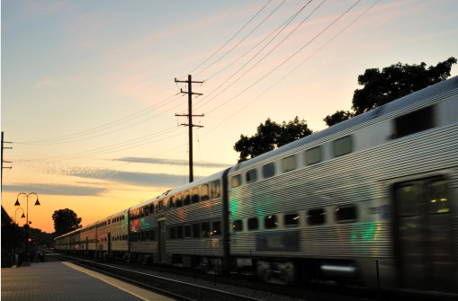
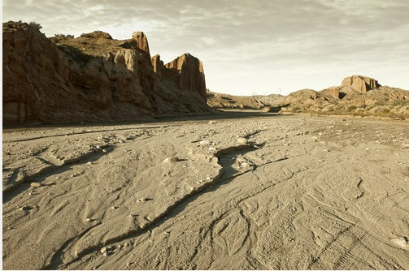

# ＜天玑＞甘宁游记（二）：火车遐想

**窗外的荒凉如寒气一般，透过车窗传递了进来，让我心中的悲怆之感愈发强烈。在这样的季节，一个人，跑到这种主打荒凉牌的地区，与我性格当中的悲剧元素相呼应。悲剧于我，就好像是天生，很多想象，都愿意把自己往悲剧的方向推搡，愿意想象自己成为悲剧中得主角，哪怕现实生活中并不想成真，也要在脑海中过足了瘾。悲剧性在我看来，有种无以言说的绝美。**  

# 火车遐想

## 文/李东哲（吉林大学）

 

“跑马滴汉子你威武雄壮，我愿融化在你宽阔的胸膛...”

这首歌最近常常冲击着我的耳膜和音乐审美，火车上、长途汽车上、私家车上、街头路人的铃声，到处都是这首歌，以至于我在甘宁的很多时候，脑海中都经常出现这个旋律，一个人走着走着走嗨了，竟然也会不由自主地哼起来。刚开始的时候，一意识到自己在哼这首歌，就立马停止，并做贼似的左顾右盼，希望不要有人发现这一幕。但到了后来，也就无所谓了，哼了便哼个痛快，权当是一种融入当地的旅游方式吧。

从银川到嘉峪关，买的卧铺，花的钱着实让我心疼了好久，连日来零敲碎打的省吃俭用仅此一下就化为了乌有，只能安慰自己会休息的人才能玩得更好。在路上的人，没有阿Q的自我安慰精神还真是不行。为了充分利用一白天卧铺的奢侈，昨天在银川市里搜寻书店时顺带给自己挑了两本书，一本穆斯林作家张承志的《北方的河》，一本贾樟柯的工人采访记。前者耐读，用来填充安静的时光；后者易读，可以打发吵杂的环境。但我过长地估计了12个小时的长度，也过高估计了自己的能力，车上一大半的时候都是在昏睡中度过的，戴着耳塞，一睡就是三四个小时，而剩下的时间，除开吃饭聊天，《北方的河》才看了一小半。快到站时我就感慨着，这两本书的重量，就当是自己又犯贪婪症的惩罚吧。

一直都很喜欢坐火车，无论是硬座还是卧铺。上次坐通宵硬座写了那篇还算受欢迎的文章，而这次则住进了那篇文章所说的“冷冰冰的太平间”。每次火车，窗外的风景都不同，车内的人也不同，就连每次都会有的让你烦让你厌的人都是千奇百怪换着花样在你面前出现的，而自己的心情当然也是都有所不同，所以每一次火车的旅行，都是新奇且独特的。

清晨上车，待太阳升起来，车也正好驶出城区，荒原戈壁的图景就开始不断地冲击着我的视野。黄土枯草飞沙走石，称不上美，但不可谓不震撼。盯着窗外，一看就是半天，不住地深吸气。旁人问我为何叹气，我笑了笑没有回答。震撼时的深吸气和叹气之间的差别，旁人时体会不出的。心里暗想，如果我小的时候就能接触到这般壮阔的景色，那个我与现在的我又会有什么不同呢？自己未完成的东西，大多都会寄托在后代身上。我心里也这么想：以后有了孩子，在小的时候就带Ta去看那些波澜壮阔的景色，什么大山大海大江大湖沙漠荒原高山险峰统统都要，先要有个开阔的胸襟再说，也就是传说中的见过世面，这样的孩子长大之后一般的事情还真烦恼不到Ta；等到他长到足够的年龄，有兴趣有意愿也有能力去了解人文历史的时候，再带Ta去那些人文景观看看，什么庙啦塔啦寺啦阁啦，什么美术馆啦艺术馆啦博物馆啦世博会啦之类之类的，人文素养的培养和艺术素养的熏陶，就在实地实景当中完成。虽然这样做有吧自己孩子当作品当试验品的嫌疑，但其中的道理我还是坚信不疑的。对于小孩子的教育的话题，我还是很感兴趣并持续关注的，以至于每次看到我很讨厌且一点都不可爱的小孩子，我都会忍不住打量观察他的父母。虽有不敬，但权当是自己娱乐，罪过罪过。

青春就是昏睡，我在车上也坚定不移地实践着这个说法。但我睡得不踏实，并不因为手里没翻两页的书，而是怕错过了外面的风景。虽说外面的景色变化不大，但是细微的差别还是足够让我欣喜若狂的。以至于每一次睡醒起来，都会有惊喜出现在窗外。一边找地方赶紧坐下，一边心里暗暗祈祷，不要被我睡过去太多。

这也就是为什么我无比向往着坐上北京开往莫斯科的那趟K19的原因。五天六夜的火车，单调乏味是绝对不会在我这里出现的。窗外的景一天一个样，有白桦林有贝加尔湖还有绝大部分的荒原，就是这一趟漫长之旅最值回票价的地方。也正好给自己几天的时间好好和自己相处，看看书，学学俄语，和周围的外国人交流交流，应该是蛮有意思的一段旅程。希望毕业前能有机会走一遭。

窗外的荒凉如寒气一般，透过车窗传递了进来，让我心中的悲怆之感愈发强烈。在这样的季节，一个人，跑到这种主打荒凉牌的地区，与我性格当中的悲剧元素相呼应。悲剧于我，就好像是天生，很多想象，都愿意把自己往悲剧的方向推搡，愿意想象自己成为悲剧中得主角，哪怕现实生活中并不想成真，也要在脑海中过足了瘾。悲剧性在我看来，有种无以言说的绝美。

所以这样的荒凉，正好满足了我在这方面对自己的臆想。火车过了酒泉，缓缓向嘉峪关滑去，广播里放起了王力宏的《盖世英雄》，鲜明的节奏声中，我却以为这是专门为我放的一首歌，哪怕所有人都听得见，也只有我听得出其中的意味。种种的意淫和假想，伴着夕阳下烧红的荒原，我瞬间真的以为自己如仗剑天涯的末路英雄一般，头也不回绝决地走进了这片不毛之地。

正当我目光放远，正待从胸中憋出什么旷世名言之际，甜美的播音员打断了音乐也打断了思绪，“前方到站，嘉峪关站”。

 

（采编：何凌昊；责编：尹桑）

 
