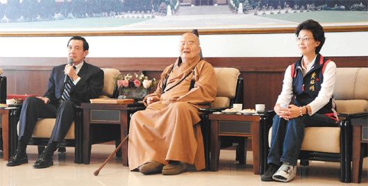

# ＜天玑＞神马姜主意（一）：今天，你快乐吗？

**一秒钟，一分钟，一个小时，还是一天呢？还是，你自己仔细想想，自己长这么大，原来真的没有快乐过。对于快乐的感觉，用渡边淳一的话来说，就是“钝感力”。与“爱无力”一样，周围的人慢慢地，慢慢地，步入了一种“乐无力”的状态。什么事情都不能让自己快乐起来，忙乱与焦躁的情绪渐渐地代替了快乐。或者说，已经把快乐边缘化了。**  

# 今天，你快乐吗？

## 文/姜骏怡（同济大学）

 

有好朋友问我，为什么本周二的神马姜主意不见了？这可不是我的风格。听到好友善意的诘问，我只能笑笑。而且真的是只能笑笑。

本周二的时候，看了一个视频。在2007年的时候，当时还没有成为马总统的马英九和当时还没有参加周立波婚礼的星云法师进行了一次对谈。对谈的主题是“入世与出世”。不得不说，这个问题困扰了中国人好久。从故圣和先贤到贩夫走卒，都不得不经历这样的一个选择。庙堂之高与江湖之远，两者之间，一定要留下点什么。行走世间的，不全是妖怪，更多的是妖精。

星云法师与马英九的对谈中，充满了禅宗佛教的智慧，也充满了政治人物的狡黠。很多话都很有力量。但正如星云法师所说：道德也是一种力量。他认为，他自己不是一个政治和尚，而是一个道德的和尚。以星云法师在宝岛61年的人生经历，我相信，他早已参透了“菩提本无树，明镜亦非台，本来无一物，何处染尘埃”的终极奥义了吧。慧能禅师凭借这20个字，披上了袈裟，成为了一代宗师。想来普通人要是多读几遍的话，不说能够大彻大悟，醍醐灌顶，起码可以求得个“心自在”。

今天，不谈道德的力量，也不论慧能禅师，我只想说说两个字“快乐”。

你已经有多久没有感受到快乐了？

一秒钟，一分钟，一个小时，还是一天呢？还是，你自己仔细想想，自己长这么大，原来真的没有快乐过。对于快乐的感觉，用渡边淳一的话来说，就是“钝感力”。与“爱无力”一样，周围的人慢慢地，慢慢地，步入了一种“乐无力”的状态。什么事情都不能让自己快乐起来，忙乱与焦躁的情绪渐渐地代替了快乐。或者说，已经把快乐边缘化了。

记得小时候，手里拿着幼儿园门口的棉花糖，能让我开心一个星期。再后来，卖棉花糖的阿姨不见了，我的快乐也没有随之消失。因为，每次回到家里，搬个小板凳，打开电视机，传来熟悉的动画片音乐的时候，那棉花糖的甜味早就已经抛到九霄云外去了。再后来，幼儿园不要我了，小学收留了我，快乐的日子也就越来越少了，直到今天，无限趋近于零了。

人为什么会不快乐？有没有人想过？

是因为无限制的竞争吗？从小学开始，每一次考试的成绩，每一次考试的排名，都让几家欢喜几家愁。中国人喜欢用硬性的数字来说话，数据与排名就说明了一切。于是乎，为了高个几分，为了领先几个名次，各种手段无所不用其极。一方面催生了大量的第四产业，让这些产业得以繁荣与延续。另一方面，就在这种紧张的环境中，自己把自己的快乐给弄丢了。甚至有人把自己的自我意识给弄丢了。除了分数，你问问自己，还有什么？

有人认为这个问题的高峰是高考。考试的东西一辈子都用不上，但是却可能决定了你的一生。但是，我的很多朋友却无限感怀自己的高中岁月。我记得，当时的自己，拿过盒饭公司的鸡腿吃，补习班的时候，偷偷地溜出过校门，总是最晚一个到学校，眼保健操之类的东西，总是睁一只眼闭一只眼的在做。还有很多很多好玩的事情。不用想着自己今天说错话，明天做错事。因为朋友之间很大度，原谅与被原谅是一件很容易的事情，宽容与被宽容，一切都显得那么的自然。虽然，有高考这条红线，但是，红线之下，还有着突然的自我。虽然不能看通透，但是，心却自在。

有些人高考分数高，去了名牌大学；有些人，分数不尽如人意，去了二本的院校。我不认为，人生从此就盖上了橡皮图章。人又不是猪，在身上盖上“优质”二字，将来被屠宰之后，价钱能够卖的高一些。人是人啊，有自我意识。有自己的判断，有自己的选择，有自己的打算。虽然人生有那么多的不确定，但是，这些不确定恰恰应该是我们所有人爱上人生的理由。

为什么不快乐？自己没有考虑过，自己没有思考过。

大学里，为了一场风花雪月的恋爱，可以让人高兴，也可以在分手后，让人学会了吞云吐雾。恋爱中，有人求不得，这自然是不高兴的。但是，如果这些求不得人，看着别人每天甜言蜜语也不高兴的话，那就是心态失衡了。失恋可以，甚至可以偶尔失态，但是，心态失衡的话，没有人可以帮你。正如所罗门王的箴言一样：能救自己的，永远是自己。

奖学金给别人了，不高兴；老师上课点名了，不高兴；老师作业多，不高兴；老师没作业，自己空虚，依然不高兴；天气热，不高兴；下雨，不高兴；看着别人男友的车停在了寝室楼下，那就不是不高兴了，而是彻底的会发疯。男友桑塔纳，不高兴；男友日本车，不高兴；男友没有准时到，不高兴。谁能告诉我，什么才能让自己高兴？这种无限制地向上看，无限制地要求，渐渐地，成了一个死循环，自己终有一天，也解不开了。如果心态失衡，不多少的日子，工作了，拿工资了，看着别人的工资单，今天自己又吃不下饭了。人啊，可以无聊到这种境界，小数点后面的不一样，都会影响自己的心情。为了几张毛主席，茶饭不思，至于吗？

写到这，有人会说我，你理想主义了。如果，不热爱竞争，没有竞争，人就没有了上进心，也就不会上位了。但是，我想告诉你。竞争的环境如果是公平的，那还有希望。如果，竞争的环境是不公平的，需要功夫在诗外，你还会保持坦然和淡定吗？你的兢兢业业，你的辛辛苦苦，不如人家在老总耳旁的软语，换做任何人，都不会高兴起来了吧？但是，人命如此，自己何必与自己过意不去呢？

压力大，竞争激烈，小时候的梦想，没有一个是实现的。那些小时候要当科学家，要当企业家的人，永远实现不了自己的梦想。反而那些小时候相当司机，想当普通人的孩子，实现了自己的梦想。社会上，最多的群体，原本就是普通人嘛。

很多踏上了职场的人告诉我说，每天从事简单，单一的工作，很多时候自己都想放弃了。工作一定能够完成，但是，前面看不到的路，却是真正让自己没有了勇气的。每个人都知道要慢慢熬，慢慢熬的道理，但是，很多人熬了一辈子，也没有参透。甚至于很多人每天上下班回家的路线都没有改变。如果，再绅士一点的话，左右脚的步数都是一样的。不怕工作累，不怕工作苦，不怕两头见不到太阳，怕的是什么？怕的是没有希望，怕的是由此而来的不快乐。慢慢熬，慢慢熬，所有人都告诉你慢慢熬，等你开始熬的时候，也就是一个消磨心志的开始。梦想没有了，快乐没有了，什么都没有了。领了一个号开始排队，可是排了好久好久，依然见不到售票处在哪里，甚至前面的队伍都没有动一下。领导都是终生制的，不到退休年龄根本下不来，哪有那么多的出缺，让你去大展身手呢？踏着时间的步点上班，每天就在看着时钟的变化的过程中，偷走了岁月，偷走了时光。

所以，人活的快乐一些。命不可改，运也不可改。

今天，你快乐吗？

 

（采编：麦静；责编：麦静）

 
