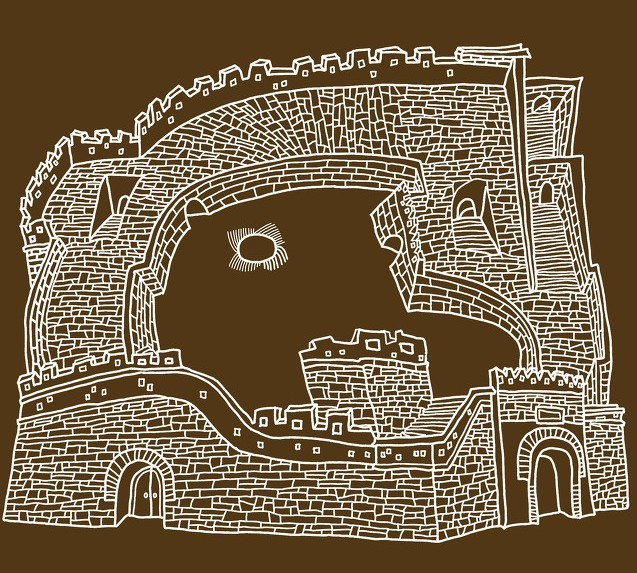
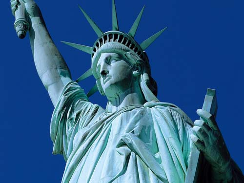

# ＜天玑＞神马姜主意（二）潜伏还是潜逃？

**有没有人想过，一张美利坚民族的身份证，对于这些人来说，真的只是一张垃圾。他们需要的不是身份，而是一种新的生活方式，一种自由的生活方式，一种崭新的活法。骨子里的因素，是对于中国的不信任，对于中国政权的不信任。**  

# 潜伏还是潜逃？

## 文/姜骏怡（同济大学）

 

几年前，有一部电视剧挺火，相信不少人都看过，名字叫做《潜伏》。依稀记得，电视剧的最后，由孙红雷扮演的余则成，最终还是没有能够潜伏下来，他和站长一起，登上了开往别处的飞机。《潜伏》中的一句台词，给我留下了深刻的印象，语出站长之口：“凡事都得讲个证据。”正是因为站长秉持着这样一个信念，所以余则成屡屡能够化险为夷，转危为安。

余则成是一心想留下，可惜造化弄人。可是，有的人，却一心想出去。中国于是成了半个围城，外面的人不想进来，里面的人却想出去。

中国正在经历一个新的移民潮。

这个移民潮的主体是“达官显贵”。因为一般的平头老百姓，没有这个财力，也没有这个能力。根据中国有关部门的数据调查显示，中国千万级别的富豪中，有47%的人，已经移民了，或正在考虑移民。按照以往的惯例，中国的官方数据在发布之前，都是要经过一些技术处理的。或放大，或缩小。依照笔者之见，47%，怕是没有统计拥有绿卡的中国人吧。而西方各国对于移民的条件也在不断地放低，吸引外资，吸引优秀的人才，是这些国家的首要目的。以加拿大为例，据说，只要有能力拿出70万的动产证明，移民的算盘就可以打起来了。

如果以财富的多少来衡量一个人成功与否，那么这些富豪们是担当得起中国精英这个称号的。现如今中国的富豪大致上可以分为四类。一，以荣智健家族为代表的红色资本家。这类家族大多在民国时期就已经发迹，二三十年代的时候，达到鼎盛。新中国成立之后，这些家族成为了“三大改造”的目标对象。文革之后，又走上了复兴之路。电视剧《大宅门》中的白家就是那个时代的缩影。二，改革开放之后，中国下海潮中拔得头筹的弄潮儿。这类富豪所从事的领域大多集中在制造业，手工业等传统行业。通过中国制造的影响力，完成了资本的原始积累。浙江义乌，苍南，江苏等地囤积着大量这种类型的富豪。三，借助于上世纪90年代中后期，世界互联网产业的蓬勃发展，而诞生了数量巨大的“数字英雄”。这些富豪往往有着非常出色的教育背景，大多数人还喝过洋墨水。搜狐的张朝阳，腾讯的马化腾，百度的李彦宏等，皆属于此类。四，房地产巨贾。在全世界的范围之内，很难找到比中国的房地产市场更畸形，更暴力的行业。借着民间资本的借贷，国家银行政策的漏洞，再加上中南海政令的影响。房地产行业培养了中国为数最多的富豪。万达的王健林，万科的王石，soho的潘石屹，当为个中的顶尖翘楚。很难想象，如果这些人都移民了，偌大的一个中国，还会剩下什么？以前是“国破山河在”，名亡实存。那么，如今，就是“国在山河破”，名存实亡。

中国刚刚经历了一个知识精英移民的大潮，一大批北大，清华培养的，这个国家最优秀的人才们，纷纷登上了飞往大洋彼岸的飞机。他们小时候在教科书上读到的愿望终于实现了，那就是把红旗插遍全球。不过，正如一些网友所言，不知道，他们是打入敌人内部，还是她们被敌人打入内部？

钱学森曾经质问过温家宝总理：“中国为什么培养不出民国时代的大师？”这个问题日后也被称之为“钱学森之问”。其实，中国在坐拥着世界人口第一大国的同时，有天赋成为大师，有志向成为大师的人肯定不会比世界上任何一个国家的人少。但是，中国即使培养出了大师，也留不住人才。在解决培养大师的问题之前，当权者为何不想想先解决如何留住大师的问题？留住大师，也就是留住了人才。留住了人才，也就是保住了这个国家。中国的前总理朱镕基不止一次的在公开场合大声疾呼：“人才啊，归来吧。”可惜，响应朱总理者寥寥。

想起了一个李政道的故事。李政道在20世纪70年代初的时候，回国访问过。期间还得到了毛主席和周总理的接见。在接见周总理的时候，周总理问他：“李博士，你能不能介绍一些物理学方面顶尖的人才归国，中国急需这方面的人才。”李博士答道：“中国有最一流的物理学人才啊，我的老师束星北啊。”后来一查，才知道，束星北早在几十年前，就已经誉满江湖。文革中被打倒，后来在浙江大学清洗厕所和实验室的仪器。你能想象的到，一双曾经设计过那么多精巧实验的手，如今在握的，是刷子，是拖把。和他命运相同，甚至更惨的人，还有叶企孙，还有一大批的医务工作者，拿手术刀的，怎么可能不如拿剃头刀的呢？可是，精巧的手指不再，人才也就不见了。文革中的荼毒，直到今天，依然存在。一切以行政级别划分，以职称划分。不学无术者可以在学者头上拉屎撒尿。没有一个自由，公开，透明的环境，要是我，我也不愿意留在国内。科学家如此，更何况那些财富精英们呢？

全世界在对待人才方面做的比较好的国家，无疑例外的就是当今世界最发达的那几个国家。美国，欧洲，我们不说。亚洲范围之内，新加坡是可以作为楷模的。这个20世纪60年代，从马来西亚独立出去的国家，如今成为了亚洲高科技的集散地。从劳动密集型到技术密集型，再从技术密集型到科技密集型，这两步大跳跃式的发展，新加坡都做得足够出色。只要你是被新加坡看重的人才，政府会想尽一切办法把你招至他的麾下，解除你的后顾之忧。你可以像普林斯顿大学的约翰纳什一样，十几年只发一篇论文。也可以像中国的高校一样，一年发十几年的论文。只要你高兴，只要你能对新加坡这个国家，这个社会做出贡献。没有人治，也没有人斗。更没有对于科学家的不尊重。“科学技术是第一生产力”这个口号已经喊了十几年了，江主席也说过“创新是一个民族进步的灵魂。”可惜，中国至今依然停留在加工业，模仿，山寨是他的标签。GDP虚报，房地产是支柱。这是一个什么样的感觉呢？一条京巴狗做了警犬，不是不可以，但角色始终是错位了。

人类历史上大规模的外逃。诸如，北逃（从北朝鲜逃到南朝鲜），东逃（从东德逃到西德），还有中国改革开放的历程中发生过的大逃港事件。都呈现出这样一个规律，是饥饿，贫穷，让这些逃亡者冒着被射杀的风险，穿过层层的隔离，逃到一个自由，富庶的新大陆。在《大逃港》这本书中，记录下了这些血淋淋的事实。因为中国当时的积贫积弱，在70年代和80年代，大约有100多万人，来到广东省，来到深圳市，希望通过罗湖口岸等与香港连接的地方，逃到海的另一边。其中有人被射杀，有人遇难，有人成功来到了香港，但是却与自己的亲人，从此一水隔天涯。是生存的希望让这些人鼓起了勇气，与命运做斗争，等着是死，逃了，或许还有机会。《大逃港》把一个个普通人的故事，娓娓道来，悲悲切切。这一波大规模的逃亡潮，最后传到了当时中国的第一号人物邓小平的耳朵中。邓小平未置可否。事后有历史学家分析，邓小平改革开放政策的出逃，对于经济政策的宽松，意识形态领域的开放，与这一次的大逃港事件有着必然的联系。这又是一个很好的佐证，历史是由人民书写的。

怎么看，这一次中国富豪的移民潮与二战时期的犹太人的大逃亡有着许多相像的地方。因为纳粹德国对于犹太人的种族灭绝政策，一大批犹太人逃亡到了世界各地。爱因斯坦乘着轮船，来到了亚美利坚。从此世界物理中心的坐标也转移了。但是，最大的，最根本的问题在于，当时犹太人的逃亡，牵涉到生命，种族的生存与繁衍。中国的那些富豪们，根本不存在这些问题。凭借着他们的财富，社会地位，在中国过的是人上人的日子，何必去大洋彼岸，喝可乐，吃汉堡包呢？有没有人想过，一张美利坚民族的身份证，对于这些人来说，真的只是一张垃圾。他们需要的不是身份，而是一种新的生活方式，一种自由的生活方式，一种崭新的活法。骨子里的因素，是对于中国的不信任，对于中国政权的不信任。在中国，有钱，没法活，要赚钱，得赔上尊严和笑脸。哪一步走错了，万一碰上什么中央严打了，被揪住做典型，那就惨了。赖昌星和黄光裕，哪一个不是道上风光过的人物，如今却通通成了阶下之囚。没钱，那就更没法活了。因为中国独特的政治环境和社会因素，使得每个人都活的非常的累。上到玉皇大帝，下到贩夫走卒。过的都不滋润。独特的人情社会，缺乏法治，使得富豪们也人心惶惶啊！

有了外部的因素：欧美国家宽松的社会环境，高福利，教育程度高，人民素质高，压力小。也有了内部的催化：说不定那一天，就成了活的枪靶。正因为如此，移民潮滚滚而来。随之而来的，可能是剧烈的社会动荡。这个国家的精英们都选择了离开这个国家，余下的人，不可能不反思自己的选择。中国的社会和历史已经不是“历史三峡论”了，而是三峡的大坝。而且是开闸放洪的大坝。巨浪已经滔天了。如果再加上那些政治官员们的移民热潮，留下来的都是矮穷挫，那么，希望在哪里？不会告诉我，让我仰望星空吧。

其实，何止是财富精英们的移民。从中国大学一张张学生的脸上，都可以看到一些什么。托福，GRE,GMAT等等的东西构成了他们大学生涯的另一张，一个戏份绝对不少的男二号。你似乎都可以从他们紧锁的眉头之间，读到这四个字：“我要出国。”出国成了他们好好学习，好好背单词的动力，甚至是唯一动力。诱惑真的有那么大吗？国外的月亮一定比中国的圆吗？当清华北大各高校成为了“留美讲习所”的时候，那一块块的金字招牌，是否依然敲的响呢？

孰能无过，孰能免祸？

潜伏与潜逃，告诉我你选择什么？

 

（采编：麦静：责编：麦静）

 
