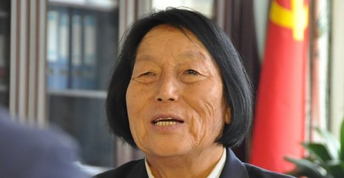

# ＜天玑＞神马姜主意（四）：人妖之间

**雷锋式的狂欢，申纪兰式的调侃，无一不是彰显着当今国人的无奈。在中国，有着太多的不能说，于是他们两个人成为了箭靶，成为了体制行为的替罪羊。既然不能攻击体制，那就攻击体制的代言人吧。虽然泄愤，但是无用。转嫁的矛盾没有消除，移植的仇恨继续再生。**  

# 人妖之间

## 文/姜骏怡（同济大学）

 

不知道从什么时候开始，每年的3月5日，大街上会显得特别的凄清，斑马线上没有老头老太，而一到3月6日，一切就都又恢复正常。老头老太即使年事已高，也不能总“宅”在家里，出来走动走动，感受一下和谐的社会氛围，还是很有必要的嘛。 

也许这仅仅是一个巧合，今年的全国人民代表大会与学雷锋日“撞车”到了一起。或许是中央的刻意安排，又或者是其他的种种理由。 

人大，雷锋，两者有着太多的故事。 

在3月5日到来之前，网上就已经开始了种种的争论，各色的段子。雷锋作为一个自然人是真的，但是雷锋作为一个道德楷模却又是假的。真真假假之间，早已经模糊了不少人的双眼。一开始，网友戏谑的段子，尚且在道德水准之上，越到后来，段子就在道德水准之下了。换句话说，雷锋在各种段子中的形象，从人，变成了混混，再从混混变成了禽兽，最后，从禽兽进化到了恶魔。本来端庄英气的军人形象，现在浮现在眼前的是青年猥琐男。本来青春勃发，现在下面勃起。想来，实在是好笑。 

一个已经去陪了马克思几十年的人物，从前被统治者请上了神坛，现在，却被庶民请下了圣坛，请下之后，还不忘被恶狠狠地踹上几脚，雷锋，你究竟得罪谁了？ 

其实，雷锋谁也没有得罪，只是那个时代的他们，得罪了这个时代的我们。以前的官宦得罪了现在的老百姓而已，作为一个普通人，雷锋绝对是无辜的。 

自1949年中共建政以来，伴随着这个政权不断增长的就是层出不穷的英雄团体，每个时代都有楷模，每个时代都有雷锋式的人物存在。稍微远点的有焦裕禄，孔繁森，稍微近点的有任长霞，牛玉儒。再近一点的，有随着汶川地震，而爆发式涌现的各路英雄，小的有林浩，大的有谭千秋，假的有他们两个。至于真的有谁，我还真不知道。与前苏联的“风镐英雄”如出一辙。对了，还有铁人王进喜，还有每年一度的感动中国。 

记得上小学的时候，教室的门廊之外，挂着少年英雄赖宁的头像，后来，头像被撤换了下去，再后来，我们被告知，不要向赖宁学习，再后来，知道了赖宁是被英雄的。死人就是有一点好，不会说话。所以毛岸英是英雄，毛新宇是狗熊。所以，共和国喜欢把死人树为英雄，于是乎，出现了一个朝着墓碑跪拜的民族。墓碑上只有生辰年月是真的，其他的，都是假的。 

1966年，穆青与几位同仁合作撰写了长篇通讯《县委书记的榜样—焦裕禄》。一夜之间，这个来自河南兰考的县委书记火遍了大江南北。其中对于焦裕禄有许多揣测性质的描写，这是犯了新闻写作的大忌的。若干年后，穆青亲口承认，这篇通讯是政治任务，里面许多的内容是他和同仁故意放大的，旨在宣传焦书记一心为民，不食人间烟火的清廉形象。因为国家需要英雄，高层需要愚民的对象，下层需要道德的楷模，于是，焦裕禄走上了共和国的前台。在当时，一个崭新的英雄就这样又诞生了。第一次觉得，当英雄是如此的简单，但是简单背后，需要付出生命的代价。看看共和国的英雄们，有几个是活着的？大口喘气的都屈指可数。 

关于雷锋的真假，关于雷锋的照片，还有那动辄以百斤为单位的大粪，相信每一个有民事行为能力的人，都会心里明白。只不过，每一个人虽然怀揣着“心里明白”，却“装着糊涂”。这就是这个国家对于雷锋们的态度。 

可以说，从英雄到反英雄，代表着民智的进步。赖宁的头像已经被撤了下来，雷锋日的取消还会远吗？如果，雷锋日都取消了，那么天安门城楼上，应该悬挂谁的照片呢？ 

每年三月，两会如期而至。女人有月经，国家有年经。至于每五年召开一次的党代会，则是这个国家的“血崩”。 

一位绝经期的妇女意外地成为了两会的主角。其人气之高，直逼今天登场的影帝同志。第一届人大开幕的时候，她投的是赞成票，第十一届的时候，她按的还是那个代表赞成的按钮。近60年的历史走来，她从来没有摇摆过，信仰也从来没有动摇过。论个人，她始终如一；论精神意识，她恐怕早就分裂了吧。 

岂止一个申纪兰！ 

人大的近3000个代表，个个都是申纪兰，个个都投赞成票。人大的代表换了一茬又一茬，换了一代又一代，只有赞成票不变，举手通过不变。真可谓是流水的决议，铁打的赞成。很多时候，我怀疑那些代表们是不是精神分裂了，否则为什么那么多南辕北辙的决议都可以得到通过。 

当代表的，唯一要学会的就是揣测上意。 

不知道大多数人怎么想，反正我是把两会当成电影节来看的。而且是黑色幽默无厘头搞笑喜剧。演员阵容强大，有连庄的影帝，有饰演精神病患者的演员，还有本色出演的少将，台词雷人，布局宏大。剧本也具有非常的可塑性。 

每年都有许多的雷人提案，这些提案的宗旨无不是维护统治阶级的利益，无不是把老百姓当猴耍。甚至有些提案的内容公然与《宪法》相违背。广电总局，这下，你可以粉墨登场了。这个尺度有点大哟，还不快快审查审查。当审查的机构也成为了审查的对象的时候，很容易从一个极端走向另一个极端。 

申纪兰今年也八十多岁了，人是不能违背自然规律的，但是我相信，一个申纪兰倒下了，千千个申纪兰们还高举着手，虽然，他们的背后被枪和金钱顶着。 

如同雷锋一样，申纪兰也成为了老百姓们泄愤的对象。对于他们个人来说，是不公平的，一个已经去世，一个是行将就木的老奶奶。中国人历来喜欢说“盖棺定论”这四个字，那么对于雷锋，请给予他正常人的权力。他去世的时候，是20岁出头的小伙子，他还没有结婚，他还没有子嗣，他还没有经历过太多就已经去了，他不是英雄，他也不是楷模，但是，作为一个正常人，他本该享受死后的清静的。但是我们却用言语对他进行着鞭尸。是不是太残忍了呢？申纪兰也是如此，纵然有以她名字命名的贸易公司，但是这又能说明什么呢？人到了这个位置，就不是自己能说了算的。 

雷锋式的狂欢，申纪兰式的调侃，无一不是彰显着当今国人的无奈。在中国，有着太多的不能说，于是他们两个人成为了箭靶，成为了体制行为的替罪羊。既然不能攻击体制，那就攻击体制的代言人吧。虽然泄愤，但是无用。转嫁的矛盾没有消除，移植的仇恨继续再生。 

当一个国家的年经变得不调的时候，这个国家就进步了。 

英雄无用，楷模无能。因为没有分清谁是真正的英雄。 

雷锋，申纪兰们，永远的人妖之间。 

今天这个特殊的日子向遇罗克致敬！ 

同时本文标题向刘宾雁致敬！ 

 

（采编：麦静；责编：麦静）

 
