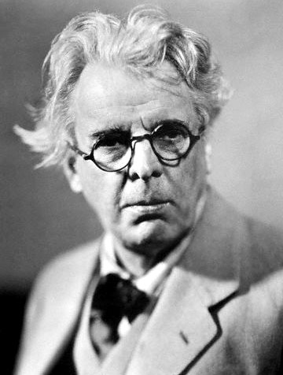
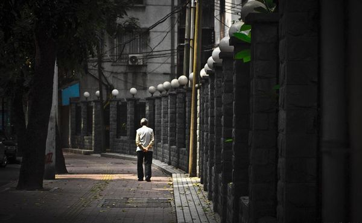

# ＜天玑＞萧萧落木（一）：老浑沌

**人老了，有一种控制的欲望，一旦控制不住就会用权势压抑他们控制不住的人。老年人往往有权有势，他们活到一辈子终于成为有权有势的人。权势的根本就是控制。一旦他们觉得无法控制，他们就会以疯狂的努力捣毁他们不能控制的人。**  

# 老浑沌

## 文/沈睿老师（美国海军学院教授）

 

以前我曾经翻译过爱尔兰诗人叶芝的一首诗，《人随岁月长进》。我译的这首诗在网上有很多转载，很容易查到。叶芝问到：“人随着岁月长进；但是，但是，这是我的梦境，还是真实？”

如今我回答叶芝，这只是你的梦境。与我以前相信人随岁月长进，人会变得越老越有智慧相反，在现实中我看到更多的是人越老越浑沌。近来我非常仔细地想这个问题，我也努力地睁大眼睛看历史和现实，让我大吃一惊的是，大多数人随着岁月的增长，都是越老越浑沌，越老越固步自封，越老越觉得自己年轻，比年轻人还自信，还对未来有把握。

今天跟一个朋友通电话。在电话里她讲到一个著名的漫画家对要编辑出版自己书的年轻编辑说：“我这样的天才五百年才出一个，我最看不上你们这些小编辑了。”我听了后几乎有一种压抑不住的愤怒。我给她讲了一个有名的中国女作家在写自己书的介绍时公开写某某西方作家说她是中国唯一该得诺贝尔文学奖的作家等等。这样的作家和漫画家，用朋友的话来说，“是什么样的名声让他们对自己的成就如此自信？”

不知道。

中国古人说：宁欺老，不欺小。中国古人是有智慧的。如我的老伴所说，你们中国人总是有各种成语说非常智慧的话。我认真地点头，真的，我们中国古人真有智慧，就是现实中的很多人没有智慧。很多人，特别是老年人，只有自私和愚蠢。

我的一个朋友在某大学做东亚系主任，前不久我们聊天谈到人的老年与智慧的问题。我谈到中国的尊老传统，孝道为基本文化核心的问题。他说，人老了，有一种控制的欲望，一旦控制不住就会用权势压抑他们控制不住的人。老年人往往有权有势，他们活到一辈子终于成为有权有势的人。权势的根本就是控制。一旦他们觉得无法控制，他们就会以疯狂的努力捣毁他们不能控制的人。

我的朋友有体验。他的导师曾经是美国汉学界的大学者，居然在我的朋友评终身职的时候，给他的大学写信，认为自己的学生不该有终身职。根本的，是因为我的朋友不完全同意他的导师的政治立场。他的导师忍不住要控制，控制未来。我的朋友因为这样恶劣的信，没有评上终身职，离开了那个大学。几年之后，另一个大学邀请他直接做正教授，并让他担任东亚系主任。人，是珍珠不怕水混吧。可是搅混水的老年人总是存在，老浑沌们是变本加厉的。把老本拼上，再更加厉害，谁能是他们的对手？

人是不是都是这样呢？我会不会也变成这样呢？我很担心。我对五月花说，朋友，如果我老了，如果有一天我狂妄地说些无知的话，你可要告诉我。我虽然没见过你，可是知道你是坦诚的人，请你对我说实话。五月花在电话里大笑，大声地要求着：你对我也要这样做！我妹妹是很有智慧的人，她也说，我们得彼此互相提醒。

可是我们真能做到吗？也许只有孩子能矫正我们。我的孩子跟我有时争论，这些争论成为我的镜子。我的孩子使我成一个更好的老师，更好的妈妈，更好的人。没有他，我的生活会多么自我中心啊。他跟我论争，他甚至有时不想跟我说话，就把电话一挂。我气得目瞪口呆，内心里却感谢他：儿子，你是一个不把我当成外人要时刻尊敬，不把我当成客人要时刻礼貌的人，为此，妈妈感谢你。妈妈需要的，就是敢站出来指出妈妈有错的人，虽然当时我气得只想骂你一句小兔崽子。

别的人呢？我的学生，就是我大放厥词，他们也觉得我是中国问题专家而不会挑战我。我的朋友都是因为彼此倾慕才成朋友的。就是我说了狂妄的话，他们也容忍，更愿意想我的优点而忽略我的缺点。爱我的人们呢？我的姐姐妹妹都认为我可爱得不得了，不然她们也不会这么爱我。所以我指望我的孩子以及年轻的一代站出来挑出我的糊涂，说出我的愚蠢。

前几天我的一篇博文，我也觉得写得不清楚，还是贴上来了，结果好几个不客气的，说不知道我到底要说什么。我看他们的评语，不舒服，可是想了想，他们说得对，就把文字撤下来了。是的，说不清楚的话，就别说了。我本来也觉得自己说得吞吞吐吐的，因为担心豆瓣的审查，把很激烈的话说得跟聊家常似的，不清楚。我承认自己写的不好。虽然心里有一个小声音很想对批评我的人说，你没看出我的激烈论点必须用这种方式写？试图再次证明自己的聪明。人是有这个几乎控制不住的欲望要证明自己伟大光荣正确的。我也有。

老年人因为获得更多的尊敬可能就更容易相信自己的伟大正确与光荣。每个老年人大概都有伟大光荣正确的历史，从他们自己的角度看，所以他们就容易变得浑沌。一次一个旅行团里有一个七十岁的老年人。这个老年人每到一个地方就大谈过去他是怎样在这里有怎样的光荣的历史。历史对他来说如数家珍。我听着听着，累了，只希望他不说而让我睡一会。可是他不停，我无奈地，站起来走到大汽车的最后一排，躺下来，想睡。隐隐地，我仍然听那个老人在谈过去。过去就如同他的声音，时隐时现。我突然想，无论他怎样努力，我们都无法跟着他回到他过去的荣光和激情里。这也许是可悲的。如同我的书，我写的童年与少年，未来的年轻人会喜欢吗？我希望自己写出了一个时代，成为一个时代的见证，但是，我的童年的时代真的那么重要吗？我慢慢地睡着了，醒来的时候，我们在一个新的海边，而那个老年人还在谈论着。

怎样警惕自己变成老浑沌？变成一个只想听好话不想听异见、时刻想控制的人？我不知道。我不是一个控制欲非常强的人，希望十年后自己进入老年的时候，自己的控制欲也不要增长。老年人性欲减退，控制欲增长，这是很可悲的。所以我很喜欢看美国的一个电视广告，买Cialis，专门为中老年人提高性欲的药，似乎特别是专对中老年女性的性欲，跟伟哥差不多。我看这个广告，看得微笑，好像有了治疗我要是变成老浑沌的秘方。先告诉年轻的朋友，特别是关心我的年轻的朋友，要是有一天我变成了老浑沌，就请买这个药给我做礼物。我一定收下，先谢谢你们。

 原址链接：http://www.douban.com/note/194690999/  

（采编：宋晓慧；责编：黄理罡）

 
