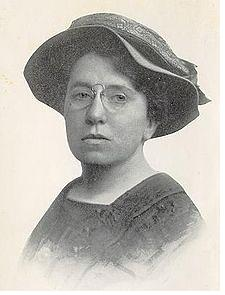

# ＜天玑＞萧萧落木（三）：美国女性晚婚或不婚潮

**美国《纽约时报》曾经报道过很多中年女性对自己单身的想法。一个名叫伊莱莎·特里斯的在结束了三十四年的婚姻后说，“一个很好的男人向我求婚。我对他说：‘我正要起飞，正要做自己，可别把我这样的感觉夺走。’”另一个五十七岁的女性，卡罗·葛瑞肖说：“我现在生活得很舒服，我想做什么做什么，我想跟谁在一起就跟谁在一起，我曾经是母亲和妻子，我不想再做一遍了。”她们说出了很多中年之后单身女性的心里话。**  

# 美国女性晚婚或不婚潮：婚姻不是人生归宿

## 文/沈睿（美国海军学院教授）

一百年前，1911年，俄国出生的美国社会活动家和思想家艾玛·古尔德曼(Emma Goldman) 在她的著名的文章《婚姻与爱情》中宣告：“婚姻与爱情没有任何共同之处。” 在分析了结婚的实质以及结婚与女性关系之后，她激情地说：“有一天，也许有一天，男人和女人都会站起来，他们将达到山顶，他们将自由地接受与给予，沉浸在爱情的金光里。不是婚姻，而是爱情，将诞生真正的伴侣和合一的感觉。”

一百年后，艾玛的话似乎正在逐渐变成现实。据2011年12月14日美国民情调查机构皮尤（Pew）调查中心发布的调查报告说，美国十八岁以上的成人，目前只有一半多一点点（51%）的人已婚。这个数字在十年前是57%。十年之内，进入婚姻的人继续减少，越来越多的人不再认为婚姻是必要的。三十岁以下的年轻人有四成认为婚姻已经过时。结了婚 人中，有三分之一的人认为结婚不是人生的必须。

这个最新的社会调查还统计了美国2010年登记结婚的人数，并把这个数字与2009年的数字比较，发现结婚的人数居然下降了5%。这种巨幅下降，到底是因为美国经济衰退还是因为社会变化，专家们一时议论纷纷，似乎没有共识。不仅如此，这个报告还说美国人现在结婚的年龄越来越推迟。一半以上第一次结婚的男性年龄是29岁或以上，女性27岁以上。

我看这条新闻时并没感到任何惊讶，因为这就是生活的现实本身。不结婚或晚结婚的人比比皆是，并不奇怪。统计数字无非是把现实变成了新闻而已。婚姻这种制度，正在逐渐演变，逐渐分解之中。我认为美国可能很快有一天会像欧洲一样，不结婚的人成为主流。从某种意义上看，不结婚或晚婚是社会从传统男女婚姻社会向更多元的家庭结构的进步和发展的标志。

我在美国这里的女朋友们，大多都没有结婚。我问我的好朋友们为什么她们都不结婚。每个人不结婚的理由各有所异，但是有一点却是共识：婚姻与家庭并不是女人的归宿。也就是说，她们对自己的想象或定义并不是以婚姻为标志。没有结婚，她们并不觉得是一个精神负担；当然也没有很多人，特别是他们的家人对他们进行“好心”的规劝，劝她们结婚。她们没有必须结婚的个人内在的和社会压力。

从我的左右看，我的女朋友们大都是受过教育的女性，因为工作和事业，她们并不把婚姻当成自己生活的主要目标，虽然在美国结婚仍然是值得大家庆贺的好事，但是如果一个人没有遇到自己想结婚的人，没有结婚，或只是跟伴侣同居，大家也不觉得有什么稀奇。如果一个人选择单身一个人，没有伴侣，大家也不会觉得这个人心理不正常。在美国十八岁以上的成人女性，没有结婚的人数超过结了婚的女性的人数。也就是说，大多数美国成人女性是单身。

虽然婚姻型的家庭财富一般来说比单身要增长的快，但是快乐地做单身在美国也极为正常。年轻的女性单身是因为现在的女性不依赖男性而能经济独立，生活自给自足，生活方式多彩多样。年纪大的女性单身的人，很多都是离了婚，不想再进入婚姻的。很多五十岁以上的单身女性都似乎在庆祝自己的单身。美国《纽约时报》曾经报道过很多中年女性对自己单身的想法。一个名叫伊莱莎·特里斯的在结束了三十四年的婚姻后说，“一个很好的男人向我求婚。我对他说：‘我正要起飞，正要做自己，可别把我这样的感觉夺走。’”另一个五十七岁的女性，卡罗·葛瑞肖说：“我现在生活得很舒服，我想做什么做什么，我想跟谁在一起就跟谁在一起，我曾经是母亲和妻子，我不想再做一遍了。”她们说出了很多中年之后单身女性的心里话。

在美国做单身并不意味着没有性生活或生活孤单无侣。我的女朋友们几乎都有伴侣，同性的或异性的。同时因为美国单亲家庭相当普遍，单身女性自己生孩子、自己养孩子也一点儿也不奇怪。我的同事爱丽丝在跟男朋友分手后，自己到我们附近的约翰·霍普金斯大学做了精子移植，怀孕生了女儿。她的女儿现在已经五岁，非常可爱，母女两人生活得很快乐。我常感叹在美国做单身女性没有什么社会压力，也没有那么多的自我的否定或怀疑。相反，在医疗保险等等具体问题上，单身母亲和孩子也不用担心没有福利。

在我接触的环境里，人们所工作的单位提供的医疗保险帮助单身女性付精子移植等费用，减轻单身女性怀孕和生孩子的经济负担。由此我想到中国的单身女性愿意做母亲，国家和所工作的地方也应该提供各种帮助。中国的所谓的大龄女性找伴侣难的问题，是中国社会和文化上二十年的巨大变化所带来的后果。女性迅速进步，造成女性教育程度越高，越难以找到一个教育和文化水平相当的异性伴侣。对这个问题，国家应该从女性的立场出发，帮助和协助单身女性创造幸福快乐的生活。

美国女性晚婚或不婚的潮流反映了美国女性社会地位的变化，也反映了美国女性的自我角色设定的变化，标志着美国社会家庭结构进一步向多元的转化。在越来越多的州批准同性婚姻的同时，美国结婚的人其实在减少。今天在世界上几乎没有一个社会不是在转折之中。美国女性的变化，或许对也在社会转型中的中国女性有所启示。

 原文链接：[http://www.douban.com/note/199271248/](http://www.douban.com/note/199271248/) 本文发表于《中国妇女报：新女学报》2012年2月7日沈睿专栏  

（采编：宋晓慧；责编：麦静）

 
