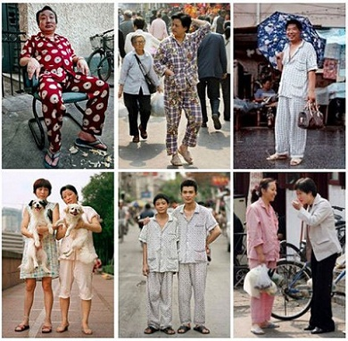
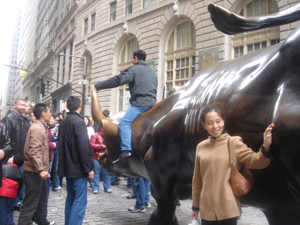

# ＜天玑＞萧萧落木（二）：中国人的素质

**民主，就是希望公平，民主就是希望自己也能做主，因此，民主是一件人人都能做到的事情。但是保证民主成为一种体制的机构却不容易建立，但这与老百姓的素质没关系，与机构的设定有关系。要知道美国制定民主制度的时候，老百姓百分之九十都不识字，大多都是农民，觉悟更低了。美国现在虽然是民主制，但是机构的设定也有很多弊病，与什么素质有关？**  

# 中国人的素质

## 文/沈睿老师（美国海军学院教授）

 

今年夏天在北京呆了两三个星期，我居然听了四次人们谈起或大声说中国人的素质。第一次是在一个卖包的商店里，刘家窑地铁站旁边卖包的店里。刘家窑以及南三环的那个地区，虽然高楼万丈，但是街道上垃圾遍地，破瓶子烂纸片野火烧不尽的毒草，哪里都是。

我从地铁上来，就听见卖包的吆喝：大减价！大减价！拆迁甩卖，拆迁甩卖！声音之高，让我不得不被吸引。奇怪，我想，我每年回中国一次，都听到这个店拆迁甩卖，怎么四五年过去了，还不拆迁呢？与那些反对和抗拒拆迁的人不一样，我对拆迁，特别是拆迁这个大声叫卖的店，十分赞成。我一直赞成拆迁，旧的不去，新的不来。我没有怀旧，旧的真的那么好？

我于是登上了尘土飞扬的台阶，进去问问他们到底什么时候拆迁。再说，假包也实在好看，我正想买一个假包呢。卖包的是一个二十三、四岁的南方姑娘。她看到我进来，热情地站起来，给我看各种包。我一边看包，一边问：“你们到底什么时候拆迁？”她愣了：“不知道。”我说：“你不是说要拆迁甩卖吗？”她笑，“老师，这是商业宣传。”我假装恍然大悟地说：“我每年都在你这里买一个假包，年年都听你们的大喇叭说要拆迁，我听着你们的喇叭，有种紧迫感，马上来这里买包了。”她更高兴了：“看来我们的宣传很有用啊。”我点头：“真有用。”

正说着，几个人进来了，她丢掉我，立刻迎那几个人去了。那几个人走了，她又回来。我拣中了一个小包，粉色的，二十五块钱。我一边付钱，一边继续说：“你这里看来生意不错，人进进出出的，挺多的。”她答：“您可不能看人进人出，很多人进来拿起包就走，我看都看不住。最怕一进来三四个的，准是偷包的。中国人的素质，低极了，尽是想偷包的。”我大笑起来：“偷包的跟中国人的素质有什么关系？”她不屑地摇头：“中国人，素质低！”我抬头看看她，是的，她看起来文文静静的，是一个普通的年轻的南方女性，当她说中国人素质低的时候，我猜她没有把自己看成是一个中国人。

从包店里走出来，我在大街上走，想这个年轻女性的话。从什么时候起，老百姓都说中国人的素质低了呢？什么是素质呢？我想想我自己，五十多岁的人了，我的素质是什么呢？这个卖包的姑娘看到我的一刹那，先把我设定是偷包的也说不定。我在她的眼里素质高还是低呢？

北京南城沿着三环路，有各种小店。在大街上走，我总感到街道上有一种过节般的狂喜，总有一种比学赶帮的热情洋溢。走了几步之后，我就忘掉了自己的素质，享受在北京大街感受到的生活的红火狂乱。我喜欢这种狂乱，在美国我的日子实在太安静了。回到中国，我为这种热气腾腾而高兴。仿佛想到张爱玲的诗歌：大片的叶子飘了下来，飘得实实在在。

过了没几天，我又听到人们在说中国人的素质。这次我是在餐馆跟人吃饭。我忘了有几个人，无论怎样，大家说起中国民主的未来。席间我听有人说，中国不可能实现民主，因为中国人的素质太低了。听到“素质”这个词，我忍不住问，“什么是素质？”“素质就是中国老百姓做不到民主。他们没有觉悟。”听了这样的回答，我觉得这简直是逻辑不通。中国老百姓，跟美国老百姓觉悟差不多，我说：“民主，就是希望公平，民主就是希望自己也能做主，因此，民主是一件人人都能做到的事情。但是保证民主成为一种体制的机构却不容易建立，但这与老百姓的素质没关系，与机构的设定有关系。要知道美国制定民主制度的时候，老百姓百分之九十都不识字，大多都是农民，觉悟更低了。美国现在虽然是民主制，但是机构的设定也有很多弊病，与什么素质有关？”

认为中国人素质低的人觉得我说得不对，说我不了解中国人。我还是忍不住：怎么会不了解中国人？我就是中国人啊！我突然想，那些认为中国人素质低的人，也不认为自己是中国人吧？我不说话了。

回到家跟我母亲聊天。我因为对楼道里的脏乱差感到愤怒，我说：“怎么人就会把自己的大脏脚往刚刚粉刷的墙上踩？弄得楼道里就是新刷的墙也脏兮兮的。”我母亲回答：“这些人就是素质差！”母亲的回答让我一愣，接着大笑：“妈，什么是素质啊？”我母亲说：“咱们这个楼，住着一大堆外地人，外地打工的，根本没有素质。”我继续问：“北京人就有素质了吗？”我的七十五岁的老母亲说：“北京人的素质比外地人强。”我笑着跟母亲争辩：“妈您这是地域歧视。”我妈瞪了我一眼：“什么地狱歧视？我还天堂歧视呢！”我一听，大笑出声，差点把茶全喷了。

我站在阳台上看从我母亲家看到的北京：高楼林立，灰蒙蒙的天空，楼下活跃的小商店，小市场，汽车在三环路上一路连过去。我好像听得见楼下热闹的声音和大街上的嘈杂。这就是我热爱的脏乱差的中国。我想，连我都不怎么关心时事的母亲都在用“素质”这个词表明自己的素质比别人，特别是比外地打工的人高一等，可见素质这个词深入人心了。素质到底是什么呢？教育程度？自觉的程度？关心他人的程度？

第二天上午去看一个住在郊外的朋友。我搭地铁在五号线的最后一站上来，从电梯上往外走，就听见为出租车招徕生意的女人大声地叫：出租车！出租车！要不要出租车？我从铁栏杆围成的出口往外走，看看朋友是不是来接我，从眼睛的余光中看到招徕顾客的两个女人，我看到是两个乡下的女人，当然，她们的穿着打扮也并不是乡村的，但是红扑扑的脸，晒黑的皮肤，衣服的搭配给我的感觉是乡村的，但我并没注意她们。我东张西望地找来接我的朋友。

就在我走出车站口这个过程中，我听见那个女人继续在大声地叫喊：要不要出租车？！要不要出租车？！我身后的一个男声，显然是不耐烦，这个男人对这个女人说：“嚷什么嚷？要是要出租车，还用得着你喊？真该回家呆着去！”听到这么不耐烦的声音，我回身看看，这个男人的声音还没有落，那个女人已经骂起来了：“你他妈的不坐车还说闲话，你吃饱了撑的？”我看见这个女的，个子不高，声音很高，显然是要吵架了。

那个男人一边走，一边还在说：“大老娘们，在这现眼。不如回家呆着去！”我心里立刻反应：这个男人性别歧视。可是这个女的也不示弱：“我现眼？我没偷人没卖B，我现什么眼了？”这个男人说着已经走出去了，听见没听见我不知道。这个女人还站在那里，骂个不停。我站在那里，目睹这生活的喜剧，听着这个女的继续骂下去：“穿得人模狗样的，这种中国人的素质！”“素质！”这个词如此让我震惊，我愣在那里，看这个骂骂咧咧的女人，她在骂那个男人的素质。我忍不住简直要去小声地问问她：素质，什么是素质？我看到她的朋友过来了，问怎么了，她还在那里续骂：“这个人一点素质都没有。”

我恍然大悟：素质是一个很神秘的几乎看不见摸不着的没有具体形状的什么。在中国，人人都可以用素质来定义或批评或指责别人。通过说别人没有素质，人就获得了素质。素质可以有高有低，有强有弱，或者一点也没有！

正在那里想着，我的朋友来了。我对素质的探究，也就蜻蜓点水地结束了。前天看韩寒的《谈革命》和今天的《说民主》，韩寒也谈到了国民的素质，他说：“国民素质低并不妨碍民主的到来，但决定了它到来以后的质量。”我是喜欢韩寒的，可是他凭什么说中国国民素质低呢？他是跟哪个国家的国民做比较？我不明白。

  原文链接：[http://www.douban.com/note/191820279/](http://www.douban.com/note/191820279/)  

（采编：宋晓慧 责编：黄理罡）

 
