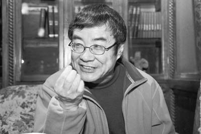
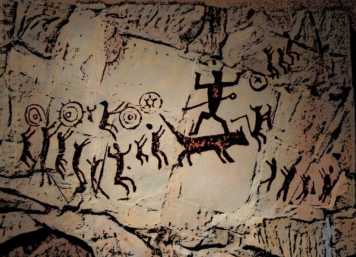

# ＜天玑＞诗的诞生（上）

**“诗乐舞同源”这在人类学上只是一个事实，但在诗学研究上却有非常大的意义，因为这意味着诗具有音乐性，而音乐性，则是诗最为本质的特征。尼采说，音乐是最为纯粹的酒神艺术，是一切艺术的核心，因为音乐不涉及任何的形象，只是纯粹的节奏和律动，又最能唤起人得情绪。诗则是有严格的形式和复杂的意象的，所以表面上看起来是日神的艺术，但本质上却是酒神的，因为诗的核心是其音乐性。**  

# 诗的诞生（上）

## 文/范云飞（武汉大学）

 

**一**

“诗的诞生”这个题目是模仿尼采的《悲剧的诞生》而来，但不同的是，尼采是从哲学的角度来论述古希腊悲剧的诞生，不同于以往的古典学家（比如尼采著名的反对者维拉莫维兹）。本文则是从历史学、人类学和哲学这三个方面来讨论“诗”起源，当然还是以哲学的考量为主。

在《悲剧的诞生》中，尼采讲述了一个古希腊的传说：

弥达斯国王在树林里久久地寻猎酒神的伴护，聪明的西勒诺斯却没有寻到。当他终于落到国王手中时，国王问道：对人来说，什么是最美好的东西？这精灵木然呆立，一声不吭。直到最后，在国王强逼下，他突然发出刺耳的笑声，说到：“可怜的浮生呵，无常与苦难之子，你为什么要逼我说出你最好不要听到的话呢？那最好的东西是你根本得不到的，这就是不要降生，不要存在，成为虚无。不过对于你还有次好的东西——立刻就死。”

像许多古希腊的神话一样，故事中往往包含着哲学中最重要的命题。像潘多拉的魔盒、斯芬克斯的谜语，西勒诺斯的这番话像梦魇一样一直盘桓在人的头脑中，一直到二十世纪，哲学家们还在为之苦苦思索。的确，人注定要死，每个人都不能例外。生命的辉煌并不能掩盖其短暂的事实，人生中一点可怜的快乐也不能敷衍其本质上的荒诞和死后的空虚。我们不能奥林匹斯山上的诸神一样能得永生，所以死亡也就成了我们所必须要思考的问题。从这种意义上来讲，人生的本质即是“必死”，也只有每个人的死亡才是真正属于自己的东西。所以二十世纪的生命哲学家们会说“人向死而生”。

死亡是人生所要面对的最为重要的问题，也是一切的哲学和宗教所要解决的终极问题。有通过强调生来淡化死，比如儒家；有通过否定生来否定死，比如佛教；有通过美化、升华死来接受死，比如基督教；或者混淆生死以看淡死，比如道家；在哲学方面，怀特海说过，后世的一切哲学家的著作都是柏拉图所说过的话的注脚。而柏拉图最终要论证的问题则是人死后其灵魂将继续存在，这就是他的最为核心的“理念”学说。这也是对死亡问题的一个回答。

但是在我们的印象里，古希腊人似乎是光明而理性的，他们通过辩论、思考以取得思想上的愉悦；通过饮酒、运动以取得肉体上的愉悦；通过庄严肃穆的悲剧、高大雄伟的神庙以及或阳刚或柔媚的雕塑来取得审美上的享受；他们积极参与政治，治理城邦，以实现自己存在的价值。古希腊人似乎理性而中庸地活着，奥林匹斯山上的诸神也是按照希腊人生活的原型来塑造，他们的生活放荡而快乐，完全没有东方神祇的道德楷模作用和苦大仇深的悲悯情怀。

以前的学者论及古希腊的艺术，都以为他们的艺术来自他们内心的和谐，所以他们的雕塑充分地展现了人的肉体之美和健硕，他们的建筑比例完美又高大庄严，处处体现着理性的精神。但尼采确认为，古希腊人的艺术恰恰来自于他们内心的矛盾和挣扎，来自于对死亡的恐惧和对生命的深刻思考。他进而把古希腊的艺术精神分为两种：日神精神和酒神精神。

日神阿波罗代表着光明，他的光辉照耀着一切，并给所有事物披上一层美的外衣。在艺术上，日神精神体现为视觉艺术、造型艺术，比如绘画、建筑、雕塑，这些艺术的特点是外表光辉而且亮丽，注重形式，给人直观的、审美的享受。但日神精神的光明并不代表着理性，因为创造美、欣赏美本来就是和理性绝缘的，是直观的、感性的活动。和日神精神最为接近的人的生命状态是梦。因为在梦中人的自主的灵魂和理性处于麻木的状态，梦中所呈现的也是光辉而美丽的景象。人沉溺于梦中的光明而暂时忘记了现实生命中的黑暗和痛苦。

酒神是狄奥尼索斯。在古希腊有一个重要的节日叫做酒神祭，在这一天的晚上人们在野外山林里痛饮美酒，酩酊大醉，一起载歌载舞。最后在极度的癫狂状态下人们会恣意地放纵自己，仿佛人类又回到了原始的与自然合而为一、每个人都合而为一的状态，人的体内最古老的欲望也在此时得到完全的释放。酒神的精神即是放纵。这既是极度的狂喜，又是最为深刻的悲剧。与酒神精神最为相近的生命状态是醉。酒神的精神是沉醉，是迷狂，其表现为艺术，则是音乐，是舞蹈。因为真正地把生命投放进酒神的艺术中时，只有纯粹的生命的律动和节奏，好像自己的灵魂要超脱沉重的肉身的束缚而投向无底的深渊。

艺术的本质，是人类情感的宣泄、是迂回的表演、是生命的外溢、是灵魂的呼喊、是对人生最本质问题的追问、是在上帝创造的生命之外给自己的自我创造另一个生命！而日神艺术和酒神艺术这两种，则是对生命基本问题的两种回答。日神艺术借助其光辉的形象而使我们沉迷于梦境，不去追究世界和生命的本质。这其实是借艺术来逃避真理，用艺术的价值来否定真理的价值；酒神则借助其迷狂与沉醉而使我们摆脱肉体、摆脱幻觉，直接与生命的本体、世界的本体会合。

周国平说：“通过个体的毁灭，我们反而感觉到世界生命意志的丰盈和不可毁灭，于是生出快感。从‘听天由命’说到‘形而上的慰藉’说，作为本体的生命意志的性质变了，由盲目挣扎的消极力量变成了生生不息的创造力量。“

（关于古希腊的酒神祭，弗洛姆在其《爱的艺术》中从孤独与返回母体的角度来讨论。认为自从人类走出原始，逐渐地发现自我之后，就不可避免地产生了一种孤独感。因为人本质上是一种群居动物。但每个人又都有着自己的不可替代的独立精神和人格。独立的个人和群居之间就产生了矛盾，使人类有了无法消弭的孤独感。而为了消除这种孤独感，古代人采取类似于酒神祭的方式，放纵自己，忘记自我，在精神上和群体融为一体，和人类的自然母亲融为一体。现代人则是通过醉酒、吸毒等方式来达到这一目的。但最为常见、最为正常的方式则是恋爱。通过恋爱，使两个人的精神融合，使一个人的孤独变为两个人的孤独。）

至于悲剧，表面上看起来似乎是日神的艺术——因为其有光辉的外表和严谨的形式——但本质上却是酒神的，因为悲剧的形式是诗，而诗在本质上具有音乐性。尼采认为音乐是最为纯粹的酒神艺术。

周国平说：“音乐整个就是情绪，丝毫不沾染形象。但是，音乐有唤起形象的能力。悲剧是音乐情绪的形象显现。民歌和抒情诗是语言对于音乐的模仿。即是日神艺术，包括希腊雕塑和荷马史诗，在某种意义上也是对由音乐情绪唤起的形象的描绘。所以，音乐是本原性的艺术，在一切艺术类别中处于中心地位。”

以上是对尼采所论“悲剧的诞生”的复述。与我们所要讨论的“诗的诞生”问题也有很大的关联，下面言归正传。

**二**

“诗的诞生”看似是一个历史学问题，即诗起源于何时，因什么而诞生。但实际上，历史学的方法对这个问题所能做的回答非常有限，更确切地说，用历史的方法并不能真正地解决诗的起源问题。

比如《诗经》是我国最早的一部诗歌总集，其中收录的大约是从西周初年到春秋中期的诗歌。但现在见于古籍的一些诗歌在《诗经》中找不到，称为“逸诗”。这些诗在形式上和《诗经》里的诗歌很接近，年代应该也相似。但是在《诗经》所收录诗歌的年代上限之前，从现存的古籍中仍可以找到很多诗，这些在沈德潜所编的《古诗源》中称为“古逸”类。比如其中有《击壤歌》：

日出而作，日入而息。凿井而饮，耕田而食。帝力于我何有哉？

这首诗出自《帝王世纪》，传说是尧帝时一个田间老农所唱的歌。但观其语言，不如《尚书》中的那么佶屈聱牙，更接近春秋之后的语言风格。

又有《卿云歌》：

卿云烂兮，纠缦缦兮。日月光华，旦复旦兮。这首出自《尚书大传》，传说是舜帝时之诗。

但语言最为古奥简练、最有可能是上古之时的诗歌的，当推《吴越春秋》中所记载的《弹歌》：断竹，续竹。飞土，逐肉。

这首诗语言凝练，元气淋漓，很有上古质朴之风，有可能真的是远古时期流传下来的人们在打猎时所唱的诗歌。

除此之外，在《左传》、《大戴礼记》以及各种类书中还能找到不少的古逸诗和各种古器铭、题物诗等。但用历史语言学的方法考察，这些诗歌有的很古雅，似乎是上古时遗留下来的，有的则明显系晚出。而且这些诗所来源的古籍的年代和真伪本身也很成问题。

其次，古籍中关于诗歌的记载，比较靠谱的最早的当推《尚书·虞书·尧典》中的：诗言志，歌咏言。声依永，律和声。八音克谐，无相夺伦，神人以和。

但《尧典》的著作年代很成问题，并非真的尧帝时的典籍。一般学者以为是战国时的作品。这句话亦被郑玄的《诗谱序》所引用：“《虞书》曰：‘诗言志，歌咏言。声依永，律和声。’然则诗之道放于此乎！”

郑玄为东汉晚期人，其所引用的《虞书》最早出自西汉初年伏生所传的二十八篇今文《尚书》，则这段文字至少不晚于秦汉之间，很有可能是战国时产生的。当然，成文的文字的出现的年代并不代表其内容出现的年代。所以，这句话的来源可能还要更早。

除此之外，古书中还有很多用韵的语句、散文，虽然不能说是诗，但和诗也有很大的关系。比如《周易》、《老子》、《庄子》中的很多文字也都是用韵的。《周易》中的一些挂爻辞甚至可以说是早期的诗歌。之所以要押韵，可能是为了便于记忆。古书为成文字之时，口耳相传，内容不固定，往往随着师徒传授而发生很大的变化。古人为了方便记忆，也是为了是书的内容固定，于是尽量用韵语，结果形成了现在我们所看到的古书的面貌。像《老子》、《庄子》中的韵文，则有可能是为了音韵的和谐，使读起来朗朗上口。

至于先秦两汉的古籍中记载的三皇五帝之乐，更荒诞不稽。比如黄帝曾张乐于洞庭之野，有《咸池》之乐，舜有《韶》乐等，都不可信。特别是二十世纪初，古史辨派兴起，考索古籍，认为周以前的历史，都无明徵。这样到底最早的诗歌起源于何时，已无法考证。更进一步，历史学的方法所能凭借的其实是古籍和考古实物。但早期的诗歌形于歌咏，未必有文字记载，更难反应在考古实物上。所以，历史的考据并不能回答“诗的诞生”的问题。

现在看来，最可靠的古诗还是《诗经》，《诗经》是中国诗歌的源头，对《诗经》的研究也是中国诗学的源头。比如古希腊的《荷马史诗》，被认为是西方最早的诗歌，但《荷马史诗》这样的皇皇巨著不可能是凭空出现的，在它之前在游吟诗人之间也流传着很多的歌谣和英雄史诗，这些比《荷马史诗》更早，也是构成《荷马史诗》的原材料。但这些诗歌大多也不可考，所以《荷马史诗》是西方诗歌、乃至西方文学的源头。

**三**

用历史的方法虽然不能解决诗的诞生的问题，但也是必不可少的。通过对古籍中散见的古诗的搜集、整理，我们可以大致了解诗在早期的形态及其特点，这对诗学研究至关重要。下面我们尝试从人类学的角度来讨论诗的起源。简而言之，即诗乐舞同源。这一部分主要参考朱光潜先生的《诗论》。

人类在原始部落时期，或打猎有获，或农业丰收，或祭祀先祖，以及其他的各种节日、仪式上，往往会聚众跳舞。跳舞之时一般会击鼓、抚髀为节，或者嘴里发出声音以协和节奏。最初的声音可能只是一些毫无意义的音节，或者吼叫。后来可能会出现一些有意义的词语、句子，但这些词语、句子是凌乱的，放在一起并不能构成整体的意义。这即是最早的诗歌。朱光潜先生说：

“诗歌、音乐、舞蹈原来是混合的。它们的共同命脉是节奏。在原始时代，诗歌可以没有意义，音乐可以没有“和谐”（harmony）,舞蹈可以不问姿态，但是都必有节奏。后来三种艺术分化，每种均仍保存节奏，但于节奏之外，音乐尽量向“和谐”方面发展，舞蹈尽量向姿态方面发展，诗歌尽量向文字意义方面发展，于是彼此的距离日渐其远了。“

这段文字不仅指明了诗歌的起源：诗乐舞同源，也指出了诗歌的命脉：节奏。

其他的关于诗乐舞同源的证据，比如古希腊的悲剧，即是起源于酒神节的祭礼。在最初的祭典中，人们载歌载舞，用舞蹈姿势来象征各种意义。其中所唱的歌应该就是早期的抒情诗。后来这些诗歌的内容被扩充，更加情节化，渐渐地演变成了悲剧和喜剧。直到埃斯库罗斯，古希腊的悲剧才真正成形。

至于中国的《诗经》，早期更是离不开音乐和舞蹈。更确切地说，《诗经》中的诗篇，是周朝用于各种宗庙祭祀和燕飨礼仪的。在举行礼仪时有的要奏乐，奏乐的时候要有舞蹈，要有歌词，歌唱的节奏和舞蹈的节奏要和音乐相协和。古书上说“礼以节文，乐以发和。“古时礼乐部分，乐中诗乐舞亦不分。《诗经》中的“风”、“雅”、“颂”三部分，所谓“颂”，据清朝阮元考证，“颂”即“容”。比如“商颂”就是“商容”，即商朝的样子，指的是商朝的礼仪中所跳的舞蹈的舞容。其实不止商、鲁、周三颂，上古各代皆有舞容。《周礼·春官·大司乐》中说：

“以乐舞教国子舞云门大卷、大咸、大韾、大夏、大沪、大武。郑玄注：“此周所存六代之乐。黄帝曰云门大卷。……大咸，咸池，尧乐也。……大韾，舜乐也。……大夏，禹乐也。……大沪，汤乐也。……大武，武王乐也。”

其中每一种舞蹈都有相应的诗篇与之配合，《墨子·公孟》篇中说“歌诗三百，乐诗三百，舞诗三百”。其中“舞诗”即是在礼仪中舞蹈时所要用的诗歌。比如“大武”之乐分为六章，每一章都有专门的诗篇与之相配。据王国维先生考证，大武之舞的一成所用之诗为《武宿夜》，二成为《武》，三成为《酌》，四成为《桓》，五成为《贲》，六成为《般》。

“诗乐舞同源”这在人类学上只是一个事实，但在诗学研究上却有非常大的意义，因为这意味着诗具有音乐性，而音乐性，则是诗最为本质的特征。尼采说，音乐是最为纯粹的酒神艺术，是一切艺术的核心，因为音乐不涉及任何的形象，只是纯粹的节奏和律动，又最能唤起人得情绪。诗则是有严格的形式和复杂的意象的，所以表面上看起来是日神的艺术，但本质上却是酒神的，因为诗的核心是其音乐性。

关于诗的音乐性，古人以有过很多论述。《诗大序》中说：

“诗者，志之所之也。在心为志，发言为诗。情动于中而形于言，言之不足，故嗟叹之。嗟叹之不足，故咏歌之。咏歌之不足，不知手之舞之、足之蹈之也。情发于声，声成文谓之音。治世之音安以乐，其政和。乱世之音怨以怒，其政乖。亡国之音哀以思，其民困。故正得失、动天地、感鬼神，莫近于诗。”

这段文字虽然简单，却内涵丰富，其中包含了中国古代文艺理论中的几个“公理”，比如“诗者，志之所之也”，即“诗言志”；“情发于声，声成文谓之音”即是说明诗的音乐性；诗歌反映了治道兴衰；温柔敦厚的诗教等。这些观点都为后世的文艺理论家所继承，并发扬光大，内涵也逐渐丰富。虽然关于诗的问题，言人人殊，聚讼纷纭，但这些“公理”，却是中国古代各种文艺理论的共同基石。

通过这段文字，我们得知，诗的产生是由于“言志”的需要，其形式则是歌咏、舞蹈，表现为成文之“音”。声音反映了所言之志。人的怀抱有喜怒哀乐，声音有轻重缓急、音韵格调。正是声音的音乐性表现了人的各种情绪。后代文艺理论家对这段文字进行申说的，有明朝徐祯卿的《谈艺录》：

“情者，心之精也。情无定位，触感而兴，既动于中，必形于声。故喜则为笑哑，忧则为吁唏，怒则为叱咤。然引而成音，气实为佐；引音成词，文实为功。盖因情以发气，因气以成声，因声而绘词，因词而定韵，此诗之源也。“

这是对《诗大序》中的观点的引申和发挥，并说明了情、气、声、词、韵的关系。另外，明朝初年李东阳的《麓堂诗话》对诗的音乐性论述的比较深刻，摘录其中的一段：

“陈公父论诗专取声，最得要领。潘祯应昌尝谓予：‘诗，宫声也。’予讶而问之，潘言其父受于乡先辈曰：“诗有五声，全备者少，惟得宫声者为最优，盖可以兼众声也。李太白、杜子美之诗为宫，韩退之之诗为角，以此例之，虽百家可知也。”予初欲求声于诗，不过心口相语，然不敢以示人。问潘言，始自信以为昔人先得我心。天下之理，出于自然者，固不约而同也。……门人辈有闻予言，必让予曰：‘莫太泄露天机’否也！“

这段讨论诗的音乐性，比较深奥，不好理解。其中说“诗，宫声也”，宫商角徵羽代表不同的音高，大致相当于西方音乐中不同的调，而不同的调则适合表现不同的情绪。比如《史记·刺客列传》中记载荆轲刺秦王之前践行时，“为变徵之声”、“复为慷慨羽声”，则大概变徵之声悲怆，羽声慷慨。但宫声何如，又为何可以兼众声，不得详知。清朝叶燮的《原诗》中说：

“诗家之规则不一端，而曰体格、曰声调，恒为先务，论诗者所谓总持门也。诗家之能事不一端，而曰苍老、曰波澜，目为到家，评诗者所谓造诣境也。“

苍老、波澜在诗歌审美上为正宗，是否和宫声有关，也不得详知。朱光潜《诗论》中说：

“古希腊人就注意到这个事实，他们分析当时所流行的七种音乐，以为E调安定，D调热烈，C调和蔼，B调哀怨，A调发扬，G调浮躁，F调淫荡。亚里斯多德最推重C调，以为它最宜于陶冶青年。近代英国乐理学家鲍威尔（E.Power）研究所得的结论亦颇相似。”

声音的高低可能确实和人的情绪有关联，但不同调值的乐曲是否更适合表现不同的情感不详知。亚里斯多德推重C调，李东阳青眼宫声，不知是否有什么联系。

 

（采编：孙梦予；责编：徐海星）

 
