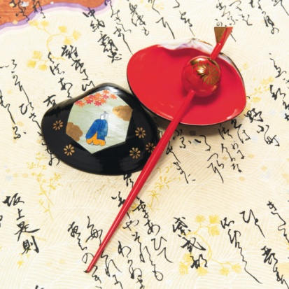
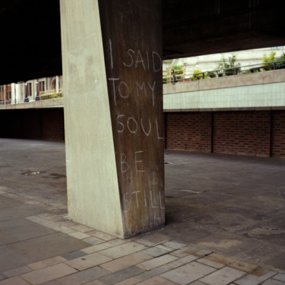

# ＜天玑＞诗的诞生（下）

**艺术虽然是情感的，但又不是完全溺于情感。虽然和理性绝缘，但也不是完全地亲近情感。艺术须得和情感保持一定的距离，需要沉淀和回味。须得以情感为基础，又以“象”为媒介，通过建构“境”来抒发情感。通过这一个迂回的过程，情感也得到了沉淀和升华，把苦闷升华为对人生宇宙的思索，把愤怒升华为对天下苍生的悲悯，把孤独升华为对自我本体的探求，把惆怅升华为对人世无常的感慨，把喜悦升华为与人乐的情怀。这也就是所谓的“沉静中回味”。** 

#  诗的诞生（下）

## 文/范云飞（武汉大学）

 

#### （四）

诗之音乐性的灵魂则是节奏。前面引用朱光潜先生的观点时就已经说过，诗、乐、舞虽然后来分离，并向不同的方向发展，但都保留了节奏这一核心。其实任何艺术都或多或少地和音乐相通，也都有各自的节奏。绘画以浓淡、疏密和色彩为节奏，雕塑以张弛、大小、比例为节奏，至于建筑，则更是被称为“凝固的音乐”。诗是最为接近音乐的一种艺术，所以其节奏也更为明显、更为重要。 

若论节奏的来源，则大矣深矣。星河流转、日月双悬是节奏，寒来暑往、春秋代序是节奏，阴阳消长、朝朝暮暮也是节奏。以上是自然界的节奏。至于人本身，呼吸、心跳是节奏，日出而作、日入而息也是节奏。因为大自然本来就有一定的节奏，我们本身也是自然的产物，也有自己的节奏，并且和自然和谐共振。那么我们在进行艺术欣赏时，对审美对象也会有音乐性的期待，如果艺术品的节奏和我们的心理期待合拍，我们就更容易发现作品的美丽和神韵。 

诗的节奏可以分为语言的节奏和音乐的节奏。诗是语言的艺术，语言本身是有节奏的。一般的，语言由语音、文字和语义这三个部分组成，当然，早期的语言只有语音和语义，没有文字。语音有高低升降、轻重缓急，而且随着内容、情感的变化，语音的这些方面也不断变化。但语言的节奏本身是自然的、不固定的。音乐则是由一个个的音符构成，每个音符都有不同的音高和时间，音符的音阶高低和时间长短也是固定的，乐曲有固定的曲式和旋律。所以音乐的节奏是机械的、固定的。 

在早期诗乐舞不分的时候，诗歌的节奏主要体现为音乐的节奏，其意义则主要由语言来表现。不同的诗歌会配有不同的乐曲，乐曲本身的节奏就是诗歌的节奏。其时，语言本身的节奏还未被充分挖掘。但当诗乐分离之后，诗失去了外在的音乐节奏，就转而向内、向语言本身寻找节奏。中国诗歌的这一过程从汉朝开始，终止于唐初诗的律化。 

汉朝时有乐府诗歌，从当时的民间采集而来，朝廷中也有专门的音乐机构负责采诗、配乐、演奏。当时就有司马相如作词、李延年谱曲的盛况。在各种郊祀、朝觐典礼中，都会用到乐歌。但从汉朝开始，诗与乐也渐渐分离。西汉时就出现了文人创作的诗歌，是没有配乐的。而五言诗的出现，比较早的当推东汉初年班固所作的《咏史诗》，其后的《古诗十九首》和苏李赠答诗等，则是五言诗的上乘之作。苏李赠答诗被疑为伪作，但推其年代也当不晚于魏晋，有可能是东汉时的作品。《古诗十九首》一般认为创作于东汉末年。这些都是文人诗，不同于民间民歌和礼仪用的乐歌，都没有配乐，但因为语言本身的节奏，诗歌的音乐性本质并没有改变。李东阳《麓堂诗话》中说： 

“古律诗各有音节，然皆限于字数，求之不难。惟乐府长短句，初无定数，最难调叠。然亦有自然之声，古所谓‘声依永’者。谓有长短之节，非徒永也，故随其长短，皆可以播之律吕，而其太长太短之无节者，则不足以为乐。今泥古之成声，平侧长短，句句字字，模仿而不敢失，非惟格调有限，亦无以发人之情性。若往复讽咏，久而自有所得，得于心而发之乎声，则虽千变万化，如珠之走盘，自不越乎法度之外。” 

语言除了有节奏外，还有意义，而语言的意义又反过来影响诗的节奏。比如同是律诗，有的则苍凉悲怆，有的则轻缓曼妙，这就是因为语言意义的不同、内容的不同导致情绪的不同，不同的情绪又影响着我们吟诵的节奏。即使抛开语音本身的高低升降、轻重缓急，不同意义导致的不同情绪也还是会影响诗歌的节奏。比如有全是平声的诗句，有全是仄声的诗句。但平仄并没有影响诗句本身的和谐。李东阳说： 

“诗有纯用平侧字而自相谐协者。 

纯用平声字的，有：轻裾随风还，桃花梨花参差开。 

纯用仄声字的，有：月出断岸口/有客有客字子美/中夜起坐万感集/壁色立积铁/业白出石壁。“ 

朱光潜先生举的一个纯用平声字的诗句的例子是汉武帝的诗：“是邪？非邪？立而望之，翩何姗姗其来迟？” 

其中“翩何姗姗其来迟”一句，全用平声字。但和上面李东阳所举的例子一样，并没有拗口不畅的感觉，亦都有其各自的和谐与节奏。这是因为语言的意义使人的情绪有了起伏，读诗时声调也就有了缓急高低，诗的节奏和音乐性也就出来了。 

除了意义对节奏的影响，语言本身所固有的、脱离其意义而存在的节奏，亦即声音的高低起伏轻重缓急，也会对诗的意义和情绪产生反作用。 

比如杜甫的《白帝城最高楼》：城尖径仄旌斾愁，独立飘渺之飞楼/峡坼云霾龙虎卧，江清日抱鼋鼍流/扶桑西枝对断石，弱水东影随长流/杖藜叹世者谁子？泣血迸空回白头。 

这首诗多用拗句，意思也多晦涩，读起来就感觉中气郁积、悲怆难言，这也正是作者所要达到的艺术效果。用语言上的声韵曲折断裂来表现其所要表达的抑郁苦闷的情怀。白居易《琵琶行》里的一句“呕哑嘲哳难为听”，也是借用声调也表达感情。 

从汉朝到唐初，中国的诗歌走在一条脱离了外在的音乐性转而寻找内在的音乐性的路上，其最终结果则是格律化。不仅是近体诗，词和曲也是格律化的产物，都有各自的词律、曲律。可以说，格律化是继汉朝时起诗歌脱离外在音乐性之后又一个重大的变革。格律本身及其历史、产生原因比较复杂，其优劣影响在此也不评价，但格律化的本质则是从语言内部找出音乐性的节奏。 

前面已经说过，语言的节奏是自然的，不固定的；音乐的节奏是整齐的，固定的。但汉语的语音有平仄，平声清扬，可以无限发声。仄声短促，不能无限发声。平仄相间，语音就有了起伏。而律诗有固定的平平仄仄的格式，这就是向音乐的固定式、整齐式的节奏靠近。律诗的这几种平仄模式，也是经过从南朝到唐初很多位诗人不断地探索而发现的最为和谐、最为完整的。 

因为有了格律，而且我们习惯了这种格律，所以出现拗救之句时，就会觉得不顺畅。前面所举的杜甫的诗，就是利用这种郁积的感觉来表现情感。但千载以来，杜甫一人而已。如果不是为了达到这种特殊的艺术效果，最好不要用拗救，否则读来气沉韵滞，就坏了味道。 

#### （五）

前面是从人类学的角度论证诗乐舞同源，讨论诗的音乐性，以及诗歌的节奏的问题。下面则拟从哲学的角度讨论诗到底如何诞生，以及诗歌诞生的条件。“吟诗好似仙人骨，骨里无诗莫浪吟”。诗人是不是天生的？还是每个人都有写诗的潜能？诗人在何种精神状态下才能写出诗来？又凭借着什么样的才华和力量才能写出好诗？ 

首先，诗是情感的产物。美的创造和欣赏都是远离理性的，当我们用理性来分析美时，审美所带来的直观的愉悦和美感也就消失了。这和哲学不同，诗歌和哲学同是对人生的思考和探索，但却是两种不同的进路。哲学是理性的，迂回的，其对人生、对世界采取冷眼旁观的态度，通过层层冷静的思考而逐渐地接近宇宙人生之本体，但对于这本体却只有理性上的把握，而无真切的体会。诗则是情感的、直观的。其对世界、人生是热切的体会和感受。虽然不能从理论上把握宇宙的本质，却能直观地体会它。 

但哲学和诗歌也有很多共同点。哲学的思考和诗歌的创作都根基于独立的人格和高度自由的精神，都是旺盛的生命力的体现，都是为了探索生命本体之秘密。其最终归宿也都是宗教，也就是说，来源于“自我”，又终结于超越“自我”。 

从《尚书》里的“诗言志”开始，研究诗歌理论的人就意识到诗歌是情感的产物。《诗大序》中说“在心为志，发言为诗”。陆机的《文赋》中说“诗缘情而绮靡”。后代的文艺理论家更是把“吟咏性情”作为诗歌的重要作用和产生原因。但是否诗歌就完全属于情感而和理性绝缘呢？否。一切艺术都是为了表现人的精神世界、抒发人的情感。但表达情感的方式有无数种，进行艺术创作则是其中最为麻烦的一种，那么艺术创作和其他的表达情感的方式有什么区别呢？ 

一个完整的艺术品，包含有意象，或者称之为“象”，即采择自现实或者想象的各种形象，比如诗歌中的意象，绘画中的各种形象。也包含有作者所要表达的情绪、意思，称之为“意”。这个“意”是作者在进行创作时所寄予艺术品的，也是我们进行欣赏时所神会而得的。但一般人的脑子里也有无数的“象”，每个人的心理活动都纷繁万端、瞬息万变，头脑里也充满了现实世界所投射到我们意识里各种形象。每个人也都有许多的“意”，人生中充满了悲欢离合、高低沉浮，生活中的很多事情也会影响到我们的内心，使我们产生喜怒哀乐的情绪。既然艺术家和普通人都有“象”和“意”，那么艺术家又何以区别于普通人呢？ 

原因就在于，一般人头脑里的“象”和“意”是分开的，头脑里的各种形象并没有特殊的意义，虽然千变万化，却又旋生旋灭，有如浮沤；旋灭旋生，有如落叶。而头脑里的“意”，即各种情绪、感怀，也是和“象”孤立起来的，这些情怀的抒发方式，不是通过“象”，而是以直接的嬉笑怒骂等方式来抒发内心的喜怒哀乐。不仅是哭之笑之，佯狂奔走、酗酒斗殴、撒泼骂街都是抒发情绪的方式，但这些方式都是非艺术的，因为它们直接受情绪的控制，从情感到表现之间并没有缓冲间隔，艺术的方式则非如此。 

艺术家通过创作来抒发情绪，创作所用的材料是各种各样的“象”，但这些“象”不是杂乱无章地堆放在一起，而是有组织、有层次的融合为一个整体，这个整体形成一个完整的艺术境界，称之为“境”。艺术家所要做的，也就是创作艺术之“境”。简而言之，艺术创作就是用各种各样的“象”组合成一个完整的“境”，这“境”中又包含着艺术家所要抒发的“意”。头脑中的各种形象经过艺术家的加工之后而用于作品中，就不同于普通的形象，而是有着特定含义的艺术形象。当然普通人头脑中的形象也可能有艺术的意义，比如我们看到落叶就想到了秋天，进而生发悲秋之怀，甚至联想到人生世运，产生悲怆萧索的情绪，此时落叶作为一个“象”就有了艺术形象的意义。但这还不能算是艺术创作，因为我们并没有因落叶而建构一个完整的境界，进而抒发一个完整的情绪。 

从上面所说的来看，艺术虽然是情感的，但又不是完全溺于情感。虽然和理性绝缘，但也不是完全地亲近情感。艺术须得和情感保持一定的距离，需要沉淀和回味。须得以情感为基础，又以“象”为媒介，通过建构“境”来抒发情感。通过这一个迂回的过程，情感也得到了沉淀和升华，把苦闷升华为对人生宇宙的思索，把愤怒升华为对天下苍生的悲悯，把孤独升华为对自我本体的探求，把惆怅升华为对人世无常的感慨，把喜悦升华为与人乐的情怀。这也就是所谓的“沉静中回味”。 

诗作为艺术的一种，自然也符合上述原理。所以，诗歌也是诞生于理性与情感之间。诗歌是根基于情感的，但产生于从理性的角度来反观情感、升华情感。 

#### （六）

《诗人玉屑》上说，作诗有两忌，一忌俗，一忌空。所谓俗，就是太过市井气，文俗意俗，则格调不高，不是真正的诗。所谓“空”，指的是流于禅家，太过“无我”。受佛教文化的侵染，写诗四大皆空，诸行无常，诸法无我，也不是真正的诗。 

关于俗，历来诗歌理论家的讨论很多了，比如严羽《沧浪诗话》中说： 

学诗先除五俗：一曰俗体，二曰俗意，三曰俗句，四曰俗字，五曰俗韵。 

其中最紧要的是要除俗意。诗歌虽然都是来源于生活、来源于活生生的情感，但又须得和尘世保持一定的距离，须得有一分出世的情怀。如果斤斤于利益得失、柴米油盐，则决不能写出诗来。顺口溜不是诗，标语口号不是诗。一副市井嘴脸、吆五喝六、斤斤计较的引称卖浆者也绝不是诗人。因为这些都是“俗”的，太过于贴近生活，没有一点的山林情怀、出世念想，是不会写出诗来的。但究其根源，之所以会“俗”，就是因为真正的“自我”未被发现，自己的“人格”未独立。一个人沉迷于世俗、纠结于各种琐事，是因为没有意识到自己独立的“自我”，对“我”、对人生宇宙、对生命本质没有热切的或理性或直观的探索和把握。 

至于“空”，则是对自我的消弭和否定。按照佛教的教义，人有眼、耳、鼻、舌、身、意这六识，还有第七识，称为“末那识”，也就是意根。意根即相当于哲学里的“自我”，即一个人之所以会成为自己而不是其他的任何一个人的东西，也可以称之为自己“独立的人格”。但大乘佛教和小乘佛教都否定这个“末那识”，小乘佛教讲“三法印”，即“诸行无常，无法无我，涅槃寂静”，最后达到无法无我的境界。大乘更是提出一个第八识“阿赖耶识”来否定自我。阿赖耶识即是佛家所讲的“真心”，但这个真心是无法感知、无法把握、也无法进行反思的，是超越自我的存在。这在哲学上是非常高超的境界，是对自我最为透彻的反思，但这种境界却是没有“诗”的，因为诗的产生正需要一个“我”在。 

《诗人玉屑》中说诗要忌“空”，也就是这个意思。诗是一种文化现象，需要一定的文化土壤，比如中国诗歌的文化土壤就是儒家思想和道家思想，而佛教这种文化，却是产生不了诗的。其实中国也有不少的禅诗，朱光潜先生对此做过说明： 

我们首先应注意到的一点就是：受佛教影响的中国诗大半只有“禅趣”而无“佛理”。“佛理”是真正的佛家哲学，“禅趣”是和尚们静坐山寺参悟佛理的趣味。佛教只扩大了中国诗的情趣的根底，并没有扩大它的哲理的根底。中国诗的哲理的根底始终不外儒道两家。佛学为外来哲学，所以能合中国诗人口味者正因为其与道家言在表面上有若干类似。 

上面所说的，之所以“空”和“俗”的状态不会产生诗，就是因为自我精神的缺席。真正的诗歌，诞生于高昂的自我，诞生于独立的人格，诞生于自由的精神。每个人都有自己独立的自我，这也是每个人都独一无二的原因。而且这个自我，是非理性的。按照康德的说法，所有的智慧生物，其思考模式，或者说理性的构造模式，都是一样的。每个人的理性都是相同的，但却各有各的情感、各有各的人格。或者这样说，人之所以成为“人”，是因为我们有理性；但我之所以成为“我”，却是因为我的非理性。而这非理性的、情感的，是诗诞生的土壤，也是诗诞生的条件。 

诗的诞生，是由于“自我”，那么在诗中，也就处处体现着“自我”。读其诗，知其为人，想见其音容笑貌。好的诗歌，体现着作者的人格和性情，体现着一个人最真、最美的部分。最终达到人与诗的合一，诗的优劣也就成了人品的高下。 

真正的诗歌诞生于自我人格的出现，所以只有文人独立创作的、有作者的诗歌，才算是诗，集体创作的、众口相传的民歌民谣以及上古时之诗歌，属于另一类。但这类也是诗，而且是上乘的好诗，因为这些诗歌反映的不是某一个人的人格、某一个人的性情，而是一个民族的集体的人格、集体的喜怒哀乐。也是反映了人类所普遍具有的感情。这一种文化、这一个民族所孕育的后世的诗人，都从其最原始的歌谣中汲取营养，并受其影响，养成自己的人格、自己的性情，他们所写出来的诗，也深受那些原始歌谣的影响。 

比如中国的《诗经》，即是我们这个民族集体人格的反映。“饥者歌其食，劳者歌其事”，青年人要谈恋爱，互相思念，这些都是人类普遍具有的感情。尊亲敬长、重视人伦、忠君爱国，这些又是我们民族所具有的感情。这些都在《诗经》里得到体现，虽然在《诗经》里找不到一个“个人”，但每个人都会在里面发现自己。 

古希腊的《荷马史诗》也是如此。《伊利亚特》表现了希腊人的勇敢，《奥德赛》表现了希腊人的智慧。其中有很多经典的形象和情节，比如阿基琉斯因为战利品分配不公而在盛怒之下退出战场，又因为自己的好友帕特洛格罗斯的死亡而复出，杀死赫克托耳为之报酬。又比如阿开亚人因为海伦而向特洛伊开战，这是多么浪漫而又具有英雄主义的事情。《奥德赛》中奥德修斯历尽艰难险阻回到家乡，又同自己的儿子欧内马科斯杀死裴奈洛佩的求婚者，最终获得圆满的结局。这些诗歌经众口相传，并不是某个人所独创，并没有反应某一位诗人的精神和人格，但却是整个希腊精神的反映。其中所塑造的各种形象，也成为后世西方文学中的经典。 

总结来说，从哲学的角度分析，诗歌诞生于独立的人格，是情感的产物，却又介于情感与理性之间而产生。  

（采编：孙梦予；责编：徐海星）

 
