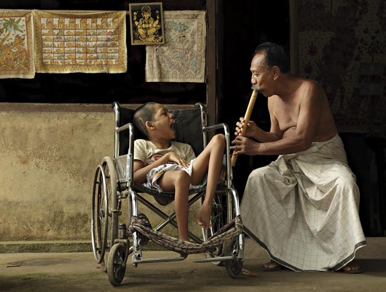
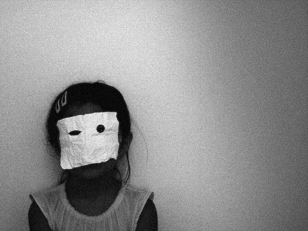
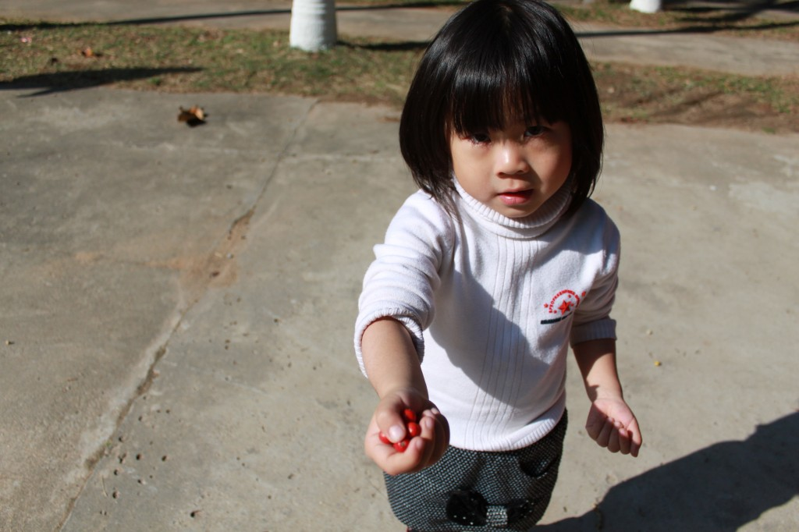
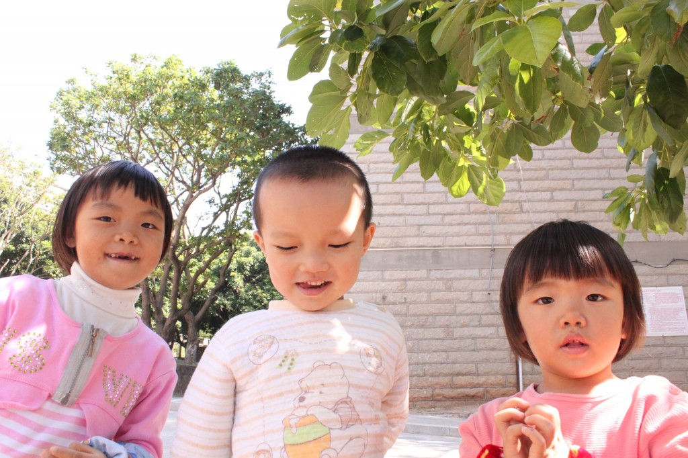
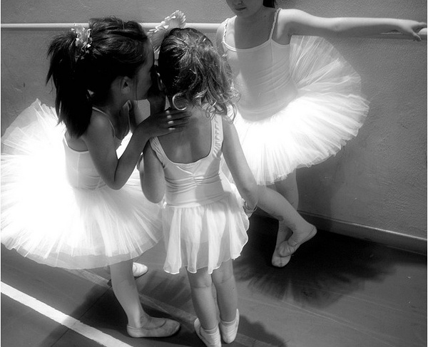

# ＜天玑＞走哪算哪（一）船上的孩子

**易北河的水湛蓝，天气少有的晴朗。在一个以举止得体行为严谨而著称的国度，船上一群失态的孩子和一群淡然的成年人，让我再次红了眼圈。**

### 

### 

# 船上的孩子

### 

## 文/树（中国政法大学）

### 

#### 一

上小学的时候，低我几级的孩子里，有个女孩是智障。 我找不到更温和的说法来代替这个残忍的词，只能这么直耿耿地把它从键盘上戳了出来。 她总是斜着眼睛，斜着嘴，斜着脚，斜着腿。所有的倾斜让她脸上永远挂着一幅悲喜莫名的表情，像是在为什么笑到情难自已，又像是在为什么就要落泪。那种不和谐是那么明显，即使是在一大群叽叽喳喳的小孩子里，也没办法隐藏那张小小的悲喜莫名的脸。 

### 

### 

小学放学的路要经过一个长长的窄巷子，一帮小屁孩儿被几个美其名曰路队长的小屁孩儿趾高气扬地吆喝着，极其艰难地保持一条龙式的小队伍。作为当年胳膊上偶尔会带两道杠的中队长，视鸡毛为令箭那是必须的，于是我总是在繁忙徒劳地窜前窜后检查路队时，路过那个小小的身影。她有一张白净的脸，有乌黑的亮亮的头发，整齐地扎成一束马尾。但是她的五官无力地倾斜着，包括她的身影和脚步，总是走着走着就走出了自己该顺从的那条小龙，于是小龙尾巴上那个尽职尽责的路队长就地会不耐烦，凶狠狠地把她推回到队伍里去，嘴里嘟嘟囔囔。我那时经常直勾勾的看着她，像许多的其他小孩子一样，用尽了我们不自知的好奇和刻薄，来观察一个异类的存在。她带着那副似笑非笑的表情，对孩子们诡异的打量，毫无察觉。 在小巷子的尽头，是一大堆横七竖八拥挤在那里的自行车，每个自行车前都有个被有限的几种蔬菜塞满的筐，每个筐的旁边，都站立着高矮胖瘦各不同，但眼神一样焦灼期待的大人。小龙一样的队伍散开，立马变成一群叽喳的小麻雀，准确无误地飞向那辆专属自己的凤凰或永久，以及专属自己的那个焦灼眼神。他们熟练地跨上自行车的前梁或后座，于是叮铃叮铃，各种响声里，巷子口瞬间空寂。 我在奔向戴着检察院大檐帽的爸爸的时候，总是忍不住还要回头看她，和她的父亲。她有个非常英俊的父亲，清瘦的脸庞和清瘦的身材，像80年代那个家喻户晓电视剧《渴望》里的王沪生。他的脸从来没有夸张的表情。带着一个知识分子安静的甚至有点悲伤的气质。他总是穿着藏蓝色的一身工装站在巷子口，扶着自行车的把手。和其他父母不一样的是，当孩子们的身影开始出现在巷子口的时候，他不能只是在原地等待，他必须艰难的保持着自行车和菜筐的平衡，然后使劲分开人群寻找他的女儿。 因为他有个不一样的女儿。他的女儿是折翅的小鸟，如果他不飞向她，她无法飞向他。 当他找到她的时候，他总是抱她坐到自行车的后座，然后掰开她僵硬的手指，让她紧紧环绕自己的腰，然后默默的骑着车离开。她坐在自行车后座的表情，我想应该可以确定，那是在笑的。 很多年过去了。明知道那是不可能的，但是每次回头想起那个巷子时，我总是固执地觉得，当初那个巷子的尽头，每一天，都只站着那一个父亲，扶着菜筐，扶着自行车，拨开人群，寻找他的女儿。 很多年过去了。去年，我回家，小城多了好多车，小城盖了好多楼。有一天，在车水马龙的路边，我看到那个穿着藏蓝色工装的男人，推着那辆带菜筐的自行车，吃力地把那个已经是成年人的她抱上车后座。他掰开她僵硬的手指，让她紧紧环绕自己的腰，然后默默的骑着车离开。 什么都没有改变，除了他两鬓斑白，除了他身形迟缓。 毫无缘由的我的眼泪就扑簇簇的掉了下来。 

#### 

#### 二

上中学的时候，同年级有个女孩，是个智障。 我仍旧无法逃脱从键盘上打出这两个字的负罪感，然而现实总是比任何的文字都残忍吧。 这一回，她离我很近。她跟我同班，她曾坐在我左边的左边。 她的病状没有小学那个孩子那样严重。她胖嘟嘟的脸，永远都是温顺的表情，如果与人说话，顶多只是淹没在人群里一个不起眼的文静女孩。但是当她不得不与人交流，或者回答老师的问题时，她的语无伦次和迟钝，会无可奈何地暴露出来。她无法协调自己的身体，她的所有动作，都要很慢很慢地做。时间久了，大家都很清楚她的智力状况，于是年少的刻薄变得更加肆无忌惮，拿她的名字作为白痴和傻子的代名词，已经算是伤害最轻微的游戏。在全校集合升旗的时候，我们集体围观她慢慢地走进男厕所，又慌张地退出来，脸涨得通红地走回队伍，我们所有人都大笑。所有人。 那时每个下午有一小时的课外活动。每个星期四，有全校的大扫除检查。小学的两道杠到了中学几乎变成一道杠，但拿鸡毛当令箭的作风一样坚持一百年不变，于是，每个周四我就是一上蹿下跳的疯狂生活委员。 我忘记了，那是秋天？还是春天？只记得三楼的教室窗外，高高瘦瘦的白杨树，枝桠都似乎要长进窗户里来。还是个热火朝天装模作样的周四，我在教室外的走廊拖地拖得不亦乐乎，听到教室里一阵骚动，有人在喝彩什么，有人在呵斥什么。我愠怒地跑进教室，觉得肯定又是那几位难指挥的刺头拿扫帚当宝剑。但是一进门，就看到一群人围着靠白杨树的窗户，围着一个站在窗户外手足无措的她。 

### 

### 

### 

窗户由上下两个格子组成，下面的格子是死的，上面的格子是可以打开的，所以每次大扫除的时候，擦玻璃的同学只要打开上面的格子，身体还站在教室内的一侧就可以擦窗。对于一个正常孩子来说，根本也不是什么难理解的事。她本来都不是周四值日。但是不知是谁怂恿了她，让她相信今天该由她擦窗。她站在窗户外，两只脚挤在一本书那么宽的窗台，手松松的扶着窗棂，随便哪个脚向后挪动一步，或者哪个手松开一秒，她就会从三楼的窗户坠下。教室里的人们乱作一团，有人大叫你别动别动，有人骂怂恿她的人禽兽不如，有人笑嘻嘻地看着她说你不是真想跳楼吧，有人安静地埋头看书做题，像是什么都没有发生。我的心提到嗓子眼上，六神无主，既怕吓到她，又怕让她进来的时候发生更可怕的意外。两眼一抹黑只能让同学先稳住她，我去找老师。 那场闹剧是怎么结束的，我竟然没有印象了。只知道后来她总算是安全的脱了困境。 但是不久，她就退学了。我再也没有见过她。 她站在窗台边手足无措的表情，像只被捕捉的小麻雀一样惊慌的眼神，刻在了我脑子里。 

#### 

#### 三

在汉堡，我住在一个岛上。要去大学，就得坐船。 坐船经过的那条路线，是汉堡有名的风景线。那艘船，其实也是游船。二十多分钟的路途中，有世界各地来的游客，也有如我一样拿它当了交通工具看书看报的摆渡族。 几天前我在船上遇到一群孩子。 一群智障的孩子。 他们每个人有各自的病状表现，有的孩子甚至无法行走，有的孩子无法言语，有些孩子肢体有着这样那样的萎缩和畸形。几个成年的辅导员带着他们，用特殊的方式和语调，提醒他们观看沿途的如画风景。船偶尔会有颠簸和摇晃，在船的晃荡里经常有孩子激动地怪叫起来——那是他们表达悲欢喜怒的唯一语言。满船的人，无论是在看书读报的老者，或者卿卿我我的情侣，或者穿着另类的小青年，他们偶尔抬起头来，看看那群激动到无法抑制声音动作的孩子，默默的笑笑。大多数时候，他们只是淡淡的忙着自己的事。 

### 

### 

那是一种非常经意的不经意。 易北河的水湛蓝，天气少有的晴朗。在一个以举止得体行为严谨而著称的国度，船上一群失态的孩子和一群淡然的成年人，让我再次红了眼圈。 

#### 

#### 四

我不知道我想总结什么。 天真不意味着善良，青春不全都是美好。 

### 

### 

对生命苦难的同情与悲悯，有时并未天生带来。那是一种需要被教育的品质，也是一种需要被培养的技巧。过分的忽略与过分的关注，对于那些在命运的苦难中被压弯了脊梁的人，都是重负。 所幸，反思与忏悔也是一种教育。 

### 

### 

(采编：黄理罡 责编:黄理罡)

### 

### 
