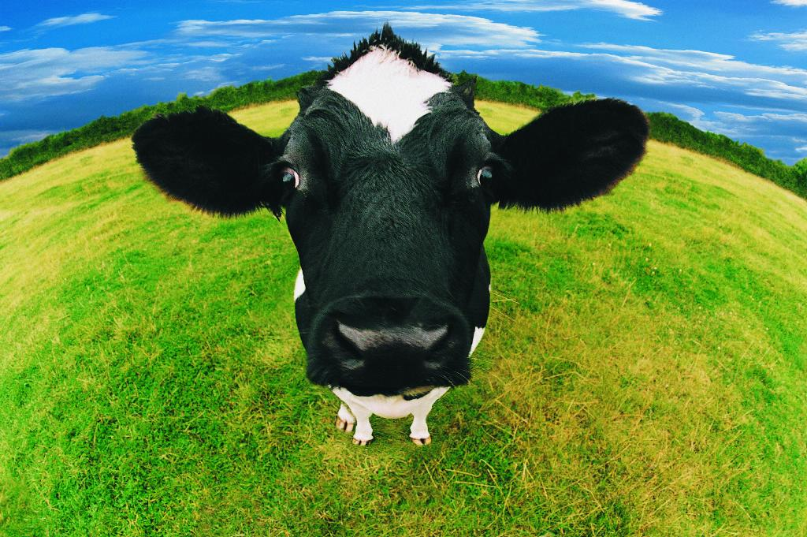
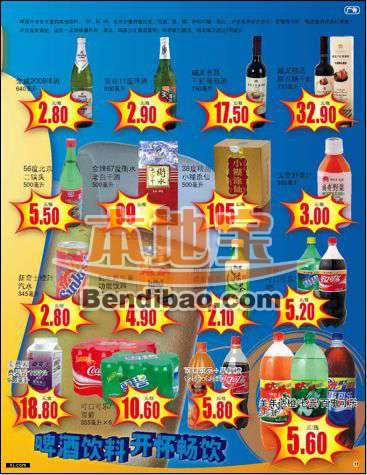

# ＜天玑＞走哪算哪（三）：1欧的牛奶

**穷人用点廉价货，富人用点高价货，这是很好理解的事。但是，若同样两件产品，质量不相上下，一个产品因背后对工人的克扣而廉价，一个产品因对工人的公平待遇而价高，到底为不为他人的公平买单，有时不只是个负担能力的问题，还是责任意识的问题。**  

# 1欧的牛奶

## 文 / 树（中国政法大学）

  刚到德国的时候着实被超市里各种奶制品的廉价程度惊艳了一下。 比较常见的1L装的大罐牛奶，在几大超市里卖价为38到45分不等。简单地算就是3.8到4.5人民币的价格，这还是欧元没贬值之前的换算，如今怕是更便宜些。放在人均月收入两千多欧的德国，花个40分左右去买这么一瓶不加三聚氰胺的牛奶，委实是廉价得很可观。 作为没几个小钱又来自实惠之邦的中国穷学生，我很快成为这价廉物美的牛奶的fans。偶尔也会想，在一个劳动力成本如此之高的国度这个廉价是怎么出来的，不是克扣了奶农就是克扣了奶牛。但也就是脑子里念头那么一闪又那么一灭，不甚了了。 

 之后去德国人家里作客，打开冰箱惊奇地发现一个牛奶罐子上还贴着未撕掉的价签，赫然写着1欧！想说真是够胆啊，那得是什么牛挤出来的奶，才能斗着胆子比其他牛奶卖得贵出一倍来呢？于是很是小心地品尝了一番，结论是：似乎强点，但也不过尔尔。百思不得其解，于是向朋友问个究竟，为何放着物美价廉的牛奶不买，花高一倍的价钱买贵的呢？ 朋友答的倒是很爽快：这个公司对奶农公道。 是个很简单的答案，但又是个不简单的答案。 朋友自己不是奶农，他们的家人也不是奶农。即使他们花多一倍的价钱长期购买这个公司的奶制品，也不见得就会有哪个奶农会为此而感恩戴德送锦旗。简单地说，这真就是个良心账。这么做，没人知。不这么做，也没人知。 但是如果许多的人这么做，如果足够多的人这么做，那么一个有着健康理念和良好道德的公司就得以生存，他们于是有能力付得起奶农合理的要价，而奶农由此可以担负起给予奶牛合理的饲养条件，而奶牛也由此可以过上较为人道化的日子。这些看上去不错的结果，取决于多少人愿意付出多一倍的价钱，为他人买个公平——尤其是当这个公平是以自己的小小牺牲为代价且并不能直接作用在自己的生活的时候，更尤甚的是当这个善举可能没人知没人晓上不了TV也得不了小锦旗的时候。 一开始我试图用贫富差别来为自己开脱，想说毕竟若我一个月也拿两千欧的话，花40分还是花1欧买牛奶，其实也不是那么有所谓。但是我的朋友也是穷学生一个，每月打工养活自己，暂时还没过上2000欧的生活。随后不久，读到国内的新闻，无论是月收入多少的雇主，都咬牙切齿的抱怨保姆涨价太无耻。 忽然觉得这或许不单单是个贫富差别的问题。穷人用点廉价货，富人用点高价货，这是很好理解的事。但是，若同样两件产品，质量不相上下，一个产品因背后对工人的克扣而廉价，一个产品因对工人的公平待遇而价高，到底为不为他人的公平买单，有时不只是个负担能力的问题，还是责任意识的问题。 

 去年在写反倾销的论文时阅读了一些资料。中国因为出口商品的廉价引起进口国市场被侵占而招致不满，已经不是一次两次了。而之所以如此廉价的理由地球人都知道：不是克扣奶农——劳动力，就是克扣奶牛——生产设备。看到许多论文，包括我自己的初稿中都不假思索地写着：“中国最大的优势在于廉价劳动力”，但是看着看着，写着写着，就慢慢不是那么个滋味了。对，我们中国人就是便宜，所以在将中国的产品价格与其他国家的产品价格做对比的过程中，你们就是要看到我们的劳动力贱卖，我们的生产条件恶劣，我们加班不要钱，我们12个人睡一间屋还要给公司交“适当的”住宿费，所以我们成本低，所以我们的产品生产的又快又多又好又便宜。所以你们竞争不过我们，所以你们的生产者别唧唧歪歪，消费者别横眉竖眼，得了便宜还卖乖。 是这么回事儿不？ 中国的劳动力，就活该当那40分又廉价又优质又不公平的大罐奶么？ 而所谓的廉价劳动力，之于一个公司，一个产业，一个国家，或许在眼下是个所谓的优势，但是之于一个工人，一个家庭，一个活生生的人，究竟又有什么可骄傲呢？ 我一度很怀疑我的论文方向究竟是护中国还是害中国。一面为保持劳动力廉价摇旗呐喊一面又听着富士康惊心动魄的十连跳，我说不上究竟是该骄傲还是该悲哀。德国有不少这组织那组织，对made in china，made in india等工人待遇太差的进口产品提出抗议和抵制，他们想以此方式来提醒或逼迫人们为工人们该得的另外60分买单。然而他们带着这样美好的天真，有可能导致的却是中国出口工厂倒闭，工人失业，连手中的40分都丢个干净，而德国进口商不过是将厂房移动到印度，土耳其，非洲，anyway，全世界还有那么多的奶农，不得不把自己的牛奶以30分、20分、10分卖出。 于是权衡再三，论文最后还是不情不愿地先护着我们的廉价劳动力市场。 然而世界在变，中国尤其在变。我们不可能总是跟人比贱，也不可能总是等着美国英国德国的人来为中国工人的60分钱买单。被全世界评估为最有潜力的消费市场的中国，拥有以亿来计数的消费者，不只是欧美在消费着中国，中国人自己也在消费着自己。或许在不太久远的未来，中国人也会如今天的欧美人一样，消费非洲，消费拉美，消费印度。国人的消费意识，决定着一个国家的走向，国人的责任意识，决定着整个社会的健康。 那么从现在起，你是否会关心40分的牛奶背后，他人的所得是否公平？你是否愿意放弃一些便宜，为他人的公平多承担60分的付出？你是否愿意默默无闻地奉献小小的一点，不为作秀不问回报的净化这个社会？ 

 你不需要告诉我答案，你告诉你自己。 毕竟，我觉得，在一个弱者活得像狗的社会，所谓的强者，也不太可能活得像人。  

（采编：黄理罡 责编：黄理罡）

 
