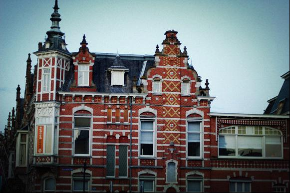
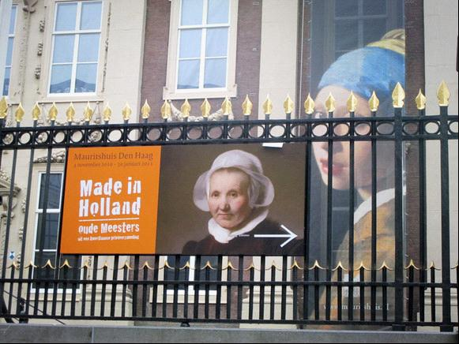
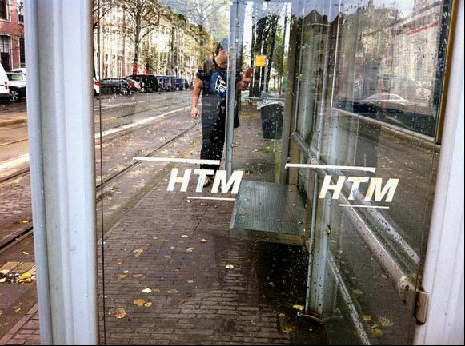

# ＜天玑＞走，闯一个明天去 (二)： 刚来到欧洲最低谷的前半年

**只能安慰自己道，哭诉与抱怨，真的无法对客观的事情产生任何的改变，往往结果夸大了它的痛苦性，浪费了本应用在解决困难的时间。反而，一声不吭，只是去解决。回过头，一切却有了一股苦涩的甜蜜。或许，就是无人能够了解你的苦，但是你自己知道，他们看见那些成绩，或许还觉得无所谓每个人都可以得到。但是，谁知道你曾经那痛不欲生放声大哭的苦呢？又想回来，每个人都何尝不是那么孤独呢？成年人，就是有秘密的吧，有多少伤痕，无从与他人说起自己一个人默默抗下来的呢？**  

# 走，闯一个明天去 (二)： 刚来到欧洲最低谷的前半年

## 文/陈嘉倩（荷兰海牙大学）

 

#### 1.抵达

人总是对于未知事物保持了一股热情与恐惧掺杂的复杂情绪，而对于我的父母，他们的恐惧情绪远大于我那股傻傻向前冲的热情，因为家里没有认识的人在欧洲生活过，不知道在那边能买到什么，东西贵不贵，去买一次东西会不会很不方便，父亲特地为我买了一张可以托运40公斤行李的机票，起先对于这个40公斤的数目我丝毫没有概念，直到看着父亲把东西一样样塞满箱子的边边角角密不透风，坐上箱子勉强拉上箱子所有拉链的时候，看了一圈周围，发现家里被我搬空了，才对40公斤有了些意识。

打包完毕，父亲突然想起了什么，走到小储藏间，出来后手上拿着几年前我还在读中学时候戴的红领巾。他把这根梅菜干一样的红领巾绑在了在巨大的箱子上面，说，“这样的话到时候取行李就方便了，一眼就能够看见”。我只是看着这根红领巾，有些讽刺地挂在黑色的大箱上面，虽然很土，可还是接受了。想着，都要离开了就不要那么任性。又况且，已经看起来够狼狈了，因为除了两只箱子，随身的大包，还要手上拎一只电饭锅，锅子里面还被母亲塞了点针线包之类的小东西。少女叛逆期的时候，我连冬天穿毛衣这件事情都会和母亲纠结一番，只认为那是很没有腔调的事情，裹得像一只粽子一样，还要披一件像是肌肉般凹凹凸凸的羽绒服。

而此刻，我只是在一边静静看着为我忙碌着，认真盘算着“还有什么可以让女儿带上”的父母。

出发的那天是中午，父亲一路开着车，放着他一直在听的CD，是英文翻唱的中文歌，以前听从来都觉得很嘲讽很滑稽，而那一刻，却无比煽情。在高架上看着高高低低错落的楼群，看着车一路驶过南浦大桥，离浦东机场越来越近。我只希望这条路没有终点，可以和他们多呆一会儿，喉咙像是被什么东西卡住，不敢多说话，怕一开口就情绪失控。

托运了扎着红领巾的行李箱，和父母在机场四周走了一圈，就不知不觉到了海关处。因为知道这一别可能很久才能再见到，现在不舍得以后日子也许会更难过，但毕竟是要走的是要去一个人过的，于是就没心没肺地在离境口提着行李拿着机票，笑嘻嘻地手一挥就走了，死活头也不回。

那是人生的第一次坐了那么久的飞机。本应兴奋，但却坐到麻木，因为十多个小时的飞行真的不是那么好过。从一开始上飞机的激动到了后来卷缩在座位上，裹着飞机上的毯子以很不舒服的姿势醒着。

【荷兰】 红色的典型建筑，也总是阴雨的典型天气。

抵达后的第一个夜晚，八月的欧洲天黑得晚，于是想家也更深刻。临走前父亲为我很细心地兑换好了钱，还都是零碎的欧元，因为害怕包被抢，于是小心地把钱又惯例放在了一个信封里面，打开箱子，拉开箱底的拉链就藏在最里面的夹缝。一个人在空荡荡陌生气味的房间里面，打开了箱子拉开拉链，看见了那个熟悉的信封，想着在上海的时候那个画面，里面还有一股家乡空气的味道。

握着那笔钱，我又望了一眼箱子上系得牢牢的红领巾，接下去会有什么在等着我呢？

####  2.第一件小事：不去争取，没有人会帮助你。

还没有开始适应在这里的生活，没多久就去学校报道了。

带着出生证明，毕业证书，录取通知书到学校的国际生办公室门口排队，提交完了材料，眼前的这位染了红头发的荷兰人对我说，“好，现在开始你就是国际商业管理专业的学生了，明天是开学第一天。”

一听到“商科”，以为自己听错了，说，“什么？商科？”

红发的荷兰女人说，“国际商业管理，你的专业。”

我急了起来，“这个是四年的专业，我当初报名的是国际交流与管理啊！”

对面的女人看着我，耸了耸肩膀说，“抱歉，我这里的系统显示的就是商科。”

我张了张口，却不知道要怎么表达此时的惊讶，也无法解释这一切，拿着自己的材料，手抖着塞进书包就奔到了自己专业的办公室。坐在里面的一个行政处老师听了以后，说，“没关系不急，可以先帮你把名字放在新生表当中，但是需要你自己去政府那里申请改专业”。

听到“政府”“自己改专业”，我顿时傻眼了，才刚刚来到这里，连读书都有困难。老天怎么开了一个这么恶劣的玩笑。我问这个老师该怎么申请，得到的答案是“不是很清楚，你需要去问国际生办公室”。

又回到了底楼的国际生办公室，还是那个红发女人，我解释了一遍专业的行政老师说过的话，红发荷兰人给了我一张纸，说着要交什么材料，要去什么网站，要怎么怎么办接下来的事情。真的是一个非常繁琐的过程，听着那堆解释，而我的脑袋只是一片空白。

红发女人看到我一脸的恐惧，好心说，“没关系的，那就读着国际商业管理吧。”

我拿着这一张纸，嘀咕着说了一声“谢谢”走了出去。那天，刚踏出学校，阳光照射到眼角，我的心一片凌乱。

回到家，冷静下来，想到那个红发荷兰人说的，“那就读着国际商业管理吧”。可是我不想读这个专业，不想多浪费一年。如果不去争取的话，在这里没有人知道我是要学习交流的，在这里没有人会帮我争取，在这里我还能依靠谁继续草率人生随波逐流吗。

第二天，在不是正式学生的情况下，我还是参加了自己专业的动员大会。行政老师把我分到了A班。年级主任讲述着我们的专业，台下坐着各个国籍的人，也有三三两两中国人摸样的学生，但没有商科来得多，一共才十个左右，所有学生加起来一共一百不到，分了三个班级。这是一个新开的三年制专业，因此门槛很高，对于英语要求很高也要求有过大学一年的学习经历。

这是我真正想学习的专业，而不是商科啊！我的心在那里呐喊着。越是想着，越是急了起来。

又跑去了国际生办公室，还是那个红发的女人坐在那里。我问道，“昨天晚上材料都交了，要等多久才能正式确定？”

她看着这个眉头紧锁的中国女孩，分辨了很久终于认了出来，说“可能一个月可能三个月。因为你的专业入门很高，所以政府不一定批准。”

“啊？即使我的专业同意了也不行？”

“要正式注册的。”这个红发女人事不关己地说。

我想着，怎么那么冷漠，这是关系到一个人未来的事情啊！于是想着想着，想到最快未来一个月才能开始读书，想到还可能被拒绝然后就莫名其妙读一个不喜欢的专业四年，我的眼泪忍不住流下来了。想和这个荷兰人说这些，可是不知道怎么表达。眼前的这个荷兰女人，从一开始的惊讶到了慌张，于是把我请进了里面的办公室，给我倒了一杯水，又递来一张纸巾。

“我该怎么办？”我哽咽着说。

“我们帮你打电话去政府那里催一催吧，但是你现在因为正式录取的是商科，所以在录取之前你只能在那里读书。对不起了，我们也不想这样的。”

在不情不愿和对未来心灰意冷的情况下，我滑稽地坐在了商科的教室里面，学习着数学和会记。而与此同时，我应该读的专业也开学了，学习着英文，学习着演讲技巧，学习着媒体，学习着一切我充满热情的课程。

那一阵子我三不五时跑去国际生办公室问情况。一个月后，国际生办公室终于通知我说收到了政府确认，可以正式念当初我报名的专业了。

那天，那一股喜悦无从说起，我为这一点点自己所取得的小胜利而万分庆幸。如果不去争取，不怕麻烦，不耐心等待，或许，就这样稀里糊涂念一个不喜欢的专业浪费四年了。有时候，对自己人生，就要这样认认真真锱铢计较，并不是什么丢脸的事情，而是应尽的义务。这件事情对我将来处理事务产生了一个非常大的影响，过去的我一直被动地接受安排，但是这一刻开始，我学会了要站起来为自己想要的去争取去发出内心的声音。

与此同时，心里隐隐约约感受到了压力，一个月的课，能够赶得上吗？

【海牙】

####  3.第二件小事：把自己放得很低

当满怀激动地出现在自己专业的A班教室，老师却冷酷地说，因为之前一直没有出现，所以被安排去了C班。眼前的这个荷兰老师，后来才知道原来和她说话根本没有商量余地，除了换回原来A班这件事情讲不通之外，对于上课时间这个老师也非常严格，开课十分钟就锁了教室门迟到的学生不能进去。有次因为半路有轨电车出问题而迟到，差点被她关门外。

开始上课了，专业一年四个季度（term），每个季度都有不同的学习主题和相关的大型小组项目。因为这是三年制的专业，所有一切课程都是高压高强度的。当我出现在班级里面的时候，第一个季度已经差不多接近尾声了。

坐在教室里面，什么都听不懂。一来是因为还没有习惯，二来是因为专业术语我基本上全都不懂得。下课后紧张地和老师解释自己的情况，却没有一个老师给予优待，只是让我自己多看看上课的讲义（PPT），多读读他们给的书单。换言之，一切都我自己加倍努力学习才能追赶上去。

最糟糕的是荷兰语，我已经错过了基础的课程，大家已经开始对话了。去和老师讲了情况，老师只是说“这是你自己的事情”，因此更没有补课之类的帮助。为了追赶上课程，我只能自己听CD自学。于是每天起床就和小时候学习英文一样，反反复复听着CD里某一个章节，去听懂每一个字的意思，连吃饭做饭洗碗都在这样练习。

上课经常是一个人坐在角落，因为之前专业已经开展过许多的活动，他们都参加过派对去过鹿特丹和郊外游玩，全班已经彼此认识，况且女生很容易组成一个个小圈子，再加上在中国人眼里，我是有些莫名其妙多出来的异类。

于是，我就像高中读到的王安忆<流水十三章>里面的女主角，因为迟到错过了认识的机会，所以融不进集体而异常孤单。但，早已习惯的我倒也已经无所谓，那需要凑在人群里面才得到安全感的幼稚想法，当我读高中的时候，早已经脱离了。再加上，我真的很忙，除了打工之外，还要再加努力自学拖拉的课程。

即便我也很想多和班级里面的外国人交流练口语，但是不知道怎么开口。回到家，一整天没有人和我说话，眼泪也只好自己咽下去了。和爸妈报告情况只是说着这里的环境这里的天气这里的吃穿住行，却不会讲到这些读书的烦心事情。因为隔着千山万水，隔着七个小时，他们结束了一天工作也很累，况且每次打电话给他们，我刚下课四点，他们那里已经快要半夜十一点了。

人总是不经历很多不会觉得其实自己的环境不算什么的。回到冷清的小屋，有天，拿出了以前的日记。读着：“2007年8月23日，晴天转阴，澳门。对我来说今天是一个很特别的日子，这一周完全一切都是自己完成，独立解决的。同时，眼前的天空真的变大了。尽管我一直知道天空那么大的。虽然心里仍然很害怕着，但我相信没有关系的，我会很好的”。

刚离开上海去澳门读书的时候，那些小挫折小苦难真的不算什么。现在没人帮助，离家千千万万英里遥远，才真的是真正的挑战。以前觉得高中的环境如何残酷如何恶劣，其实是多幸福，一切有父母在照顾着。高考以前，总觉得再也没有比这个更苦难的了，要背负那么多压力，生活不能自己安排，只要高考结束就再也没有什么挫折了。现在想来，是多么的幼稚。人生所要经历的，就如同宇宙一样庞大，以前十多岁喊着的痛苦，不过是为赋新词强说愁罢了。

这个安全地带，我出走的很彻底。每天除了上课之外，回家后，需要更努力地读书。不知不觉就到了第一个季度的尾声。这时候，有一个全年级的小组演讲，每组要讲自己国家的媒体。轮到我的小组的时候，我上台紧张到没有意识一般不知所云了一番。一结束，一个老师很不留情面地说：“我完全听不懂你在讲什么”。

那一刻，在全年级面前，听到这句话的我，完完全全被打击到了。

这一切只是一个开始，唯一可以庆幸的是，我却没有伤得很重。可能，在我知道世界很大天空很广的时候，已经把自己看得很卑微很卑微。有时候，以一个卑微的角度来看待事情，一切就没想象中那么糟糕了，当一个人一无所知一切都做错的时候，就只有上升的空间了。不一定每件事情都要得心应手，一开始能够错误连连甚至不被看好，然后一点点往上爬的过程，却是令人愉悦甜蜜的。失败没有什么大不了的了，年轻时候自尊心更不值钱了。反倒庆幸有人能够这样直白提醒，庆幸有这样一个残酷的环境，催自己上进。

如果说在澳门又成绩优秀又加入当地学生会又拥有许多朋友的我，是万事顺利的话，那在这里，所有的一切都背道而驰。尤其上课回答问题，同学都争相举手回答，而在澳门总是积极的我，在这里却完全变了一个人一样，有的时候，好不容易挣扎了很久举手了，说话都是颤抖的。大家回过头看着这个表情略略挣扎的中国女孩，听着她有些奇怪的英文，会不会有些鄙夷？想着这些，更害怕和不安了。

而曾在澳门下课后经常去找老师谈话的我，在这里也想要这样做，但是那些金发碧眼的老师们一旦下课了就离开学校，同学也都很忙，课一结束，好似每个人都有别的事情要去做，以很快的速度各奔东西。

在这里，深刻感受到自己性格的改变。

####  4.争取了，可是没有成功

做不了优秀的学生，那就中规中矩的。当我辛辛苦苦把之前拖拉的功课都追赶上了，新的一个季度的课程也逐渐听懂，习惯了上课节奏。可是，怎么都没有没想到，一直小心翼翼的我，居然就会在考试之前把学生证弄丢了。

第一场考试的那天，我还是去了。按照学校惯例，每次考试之前，总有监考老师会把每个人的脸和学生证比对，而到了我这个桌子，因为没有证件，所以就被无情地请了出去。到了年级办公室，和年级主任说了这件事情后，他就拿到了一张纸，写了一段话加上他的签名用来证明我是这个专业的学生。

拿着这张纸，交到了学校的考试办公室。走出来了一个白发苍苍的中年荷兰男人，他说，“这张纸学校不承认的，必须是学生证”。

这时候我旁边还有一个没有带学生证的另外一个中国女生，也一样拿了一张年级主任的证明单。这个女生一听，就开始语气很生硬地和老师争论起来，说，“这个只是一个证而已，没什么大不了的”。

结果老师一下子愤怒了，甩门就走，丢下一句话，“我不承认”。

在一边的我，眼泪在眼眶里面立刻打转起来，而那个女生，只是潇洒地背起她那只名贵的包哼着歌走了。

因为经历了专业录取的事情，我深深知道，一切都需要自己去争取，无论结果如何，需要什么想要什么一定要表现出来，不然是没有人为你站出来说话的。于是，我鼓足了勇气，伸出手颤抖地敲了敲办公室的门。

考试主任开了门，一见是我，不耐烦地问“什么？”

我的心跳骤然加速，颤抖的声音说，“我一定要来考试的，因为我的父母会难过，如果这个季度的考试都变成了下学期的补考，万一一次没有全部通过我的大一就过不了，会被退回中国的……”

我讲着一大堆话求着情，心快要跳出来，眼眶模糊起来看不见周围，只有考试主任那张仍然无表情的脸。

这个白头发的荷兰人做了一个停止的手势，然后长大了嘴，圆弧状，吐出一个单词，“No”。

我突然忍不住眼泪大哭了起来，含糊的说，“只是这一次，因为这个考试我参加不了接下去这个季度这个星期的考试都没有办法参加，因为补办学生证要一个月。我以后一定不会再忘记了”。

他还是冷冷地看着我，说，“这是你的问题”。他转过身进了办公室，门砰地一声，关上了。

一个人走出了学校，我的泪水还没有干，阳光再一次从屋顶洒下来，心里，只感到了寂寞和无助。几近一百人的整个年级，只有我一个人晚了一个多月才开始跟上课程，只有我才第二个季度一门考试都没有参加，这种感觉真的很孤单，有时候，即便是知道有其他那么一个人也有类似遭遇心情会好些。可是，当我的情况最差，这股无奈感伴随着寂寞孤独还有不安混合在一起，对于未来，觉得很迷茫，很怀疑自己是否能够按时毕业，甚至是否能够熬过第一年。

大家都在考场里面，而只有我，不合时宜地走在市中心的商业街，这个国家，在曾经看起来是那么繁华浪漫充满了梦想，于是对着照片和画册看了一遍又一遍，而今行走其中，却又那么陌生。那些最美丽的日落，最古老的风车，最美味的牛奶和芝士，和我又有什么关联呢？

回到所居住的屋子里，因为我一个人住也没有朋友。一关门，那些无助和压力压过来，更无从说起与得到安慰。这一整个星期，除了夜晚会去无人的图书馆闷头看书之外，整个白天她都把自己困在房间里面，窗帘紧闭。

在家里，想到这个季度所有考试都很难，只有两次考试机会，而这第一次机会我就错过了，补考如果哪门没有过的话就拿不到学分了，拿不到足够的学分，就要被退回去了。而且接下去一个季度更多的科目会更难，加上补考的科目总共十多门，复习不过来怎么办？下一个学期的每一天，一想到季末的考试一定都会有许多的压力，还怎么去学新的科目呢？

想着想着，我就放声大哭起来。只能用看书和讲义来充实自己，如果某一刻突然停了下来，只有莫名的难过。那段时间，一个人饭也不吃，想着就眼泪就掉下来。然后看看周围没有人，只有冰冷墙壁，只有自己了啊！去厕所洗一把脸拿起书本镇定下来。

只有我一个人要面对这些，每每想到那张荷兰人无表情的脸和他白色的头发，演化成了不断说NO的残酷噩梦，压力和委屈压得我好累。

只是真的想不通为什么我要那么特殊，才刚来这个人生地不熟的地方，应该得到一些照顾才对，没做错什么只是认真读书也会出差错。好不容易注册成功了，拖拉的课程赶上了，现在又发生这样的事情。真的很难过啊！回国就没有这一切了吧！回到澳门也没事，因为当初办的只是休学，只要回去，一切还是照常的。可是，哪有说走就走说回去就回去的？回不去了，就算回去了，也会看不起自己。

突然很想，在这个世界里面，有一个谁，即便是陌生人也好。来告诉我，这经历的一切是有价值的。希望有个谁，告诉我说，一切会过去的，看好我，相信我会战胜这些不期而遇的困难。

可是，我只有自己。即便是父母，和他们说了，只是徒增烦恼。挂断电话后还是要自己面对，索性不说，宁愿一个人扛下来。在将来某一天，希望一切解决的时候，风轻云淡地和他们说，成绩都过了，我按时毕业了。

只能安慰自己道，哭诉与抱怨，真的无法对客观的事情产生任何的改变，往往结果夸大了它的痛苦性，浪费了本应用在解决困难的时间。反而，一声不吭，只是去解决。回过头，一切却有了一股苦涩的甜蜜。或许，就是无人能够了解你的苦，但是你自己知道，他们看见那些成绩，或许还觉得无所谓每个人都可以得到。但是，谁知道你曾经那痛不欲生放声大哭的苦呢？又想回来，每个人都何尝不是那么孤独呢？成年人，就是有秘密的吧，有多少伤痕，无从与他人说起自己一个人默默抗下来的呢？

再怎么样日子还是要熬下去的吧，或许老生常谈的“上帝会关上了一扇门，却会打开一扇窗”真的还有他的道理。即便不成立，至少我相信自己内心的力量，坚持着与众不同，一路跌跌撞撞地走过了孤单的青少年时期，我那深深爱护着的梦想还有内心的抗争到底的一股坚强。

至少不管怎么说，努力读书没错的。“按时毕业才能快点解脱，快点离开这个冷酷无情而寂寥的鬼地方”。我抹着泪对自己恶狠狠地说。

#### 

#### 5.过不去的，都过去了。

事到如今，所有当时的心情早已成为一句风轻云淡的“啊！三年前的事情了”。

刚抵达欧洲开始学习的那前半年，其实还发生了很多其他的挫折：关于小组功课突然所有人都退出了只能一个人扛下，但是四个人的大项目一个人怎么可能有精力去完成，和老师去寻求公道却也一点帮助都没有得到，同时我还要在两个星期内把12门考试一次性通过，没有一天好好睡过觉。那些看似，快要“死掉”的日子，也就一点点一点点被我脚踏实地耐心地走过了，尽管走得姿态并不优雅，可是却成为了一生的收获。

尤其现在看来，那些曾经觉得过不去的，也都过去了，成为了真正的过去。

纵使为了跟上课程、把全部功课的补考和新一轮考试完成、在演讲和语言交流上下更多功夫，比起周围的同学花了很长一段时间，才真正步上正轨。但，一点点从零开始，甚至从困难开始，逐渐地将一个个难题解决，再慌乱再绝望，也一样样从眼前的事情着手沉下心去做。

我们总是宣扬着“不能输在起跑线上”，所以自小就被父母安排要去学这个学那个，叛逆心强的，学什么就讨厌什么，结果找不到自己的爱好，更对于会做的事情恨之入骨。面对父母指定的人生，走起来的确是轻松的，可是人生唯独自己在走的时候，才会真正去领悟去思索。

走了弯路，花了些时间，似乎就被认定是失败者。殊不知，正是这些看似“无用功”的经历，为我们真正的成功排练了一次又一次。

如果没有开学注册的风波，我想，我永远都不会意识到想要的事情是需要自己争取的；

如果不是晚出现在班级，我想，我永远都不会有勇气做那个“多出来的异类”；

如果荷兰监考老师没有惩罚我，我想，我永远都不会对于“规矩”这两个有那么深的领悟。

成长就像是第一次学完车后上路，教练讲得再细致，自己真正上路才会遇见各种突发情况。父母只能在出发前替我打包行李，注定无法为我遇见的这“三件小事”做准备。

箱子上梅干菜一样的红领巾陪伴我走了很多路，飞去了很多国家。它自己也没预料到从工厂被成批制造出以后，跟着这个主人会有如此命运。反正啊！这就是人生有趣的地方，曾经以为自己过不去的，最后都过去了；曾经以为抵达不了的，然后一不小心真的到了。

如有想法，可与作者交流。

微博： http://weibo.com/mejiaqian

博客：http://blog.sina.com.cn/mejiaqian

 

（采编：何凌昊；责编：尹桑）

 
