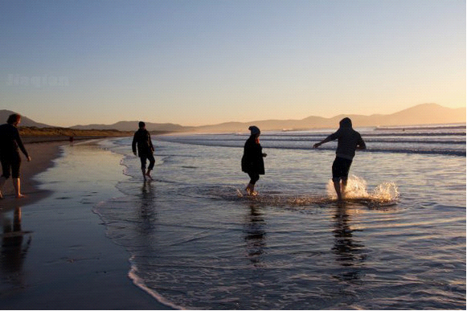
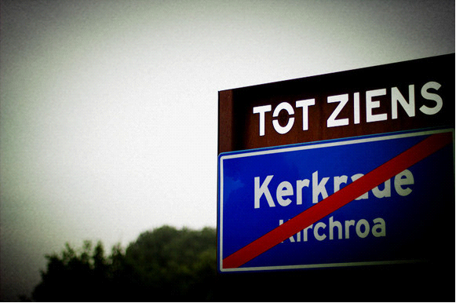

# ＜天玑＞走，闯一个明天去（一）：一个留学生的爱情故事

**最近他更加倍工作。回家累到话都说不出来，我心疼说，那么辛苦干什么。他说，要攒钱带你去旅行。去你想去的冰岛，去你想去的南美洲。可是，我却想着，的确我想环游世界，但没有那么渴望。四年前，我离开了家乡来到了地球的另一边，一个人闯荡了那么久。认识了你以后，其实再也不想去远方了。说说话，散散步，熟悉的风景都那么好看，即便只是周末夜晚两个人在家里躺在沙发上看电视。**  

# 一个留学生的爱情故事

## 文/陈嘉倩（荷兰海牙大学）

 

**1.去经历, 去爱, 去感动, 去被伤害, 去拥有一个平凡却精彩的青春**

荷西是三毛的致命伤, 但他不会是. 在爱尔兰初见面, 他说着在撒哈拉生活过的经历, 我被许多的巧合震住了. 有一天,他神秘地把戒指给我的时候, 这个满是胡子一米八五高大的西班牙男生,突然脸红地说, 这只是一个礼物没什么意义的. 当初荷西与三毛分别, 现在我们面临多少相似的境地.分开时,他不断亲吻着我的手指.看我哭了,为逗我做起了怪脸. 看我还是在难过,他抬起我的脸,说:Barcelona, tu casa.

那部短片《evolution》 他是导演. 他很努力,为了自己的梦想. 已经导演了几部短片,在我们好友圈里大家都很爱那些作品. 他只是一个穿汗衫加牛仔裤的平凡人, 对生活没有什么大要求, 冬天的唯一的一件外套拉链坏了两年都没有去修.

我的西语太差，和他的母亲玛利亚说话总是闹起笑话,全家都能在那里笑好久. 但他们丝毫不介意这个外来如外星人一般空降的中国女孩. 去年夏天只是皮肤过敏,半夜他父亲安德里克开车送我去医院打针. 圣诞节, 他的整个家族还有所有好友,讲着浓浓西班牙口音的英文和我问候拥抱.

有时候. 我以为他是我的致命伤. 于是害怕失去. 在乎他人对自己的看法. 可是他说, 只要在乎自己在乎的人就好了. 他人的生活,我们无权评论与干涉,也无力更改.

我爱说故事. 但害怕说自己的. 不是因为别的, 只是不想走三毛的路. 平凡就是一种快乐. 想当一个有勇气的人, 过平凡而精彩的生活. 有个刚失恋的女孩读了一篇我的文章, 写站内信来问我, 为什么会那么坚定有力量. 其实,能够牵手一个正确的人是一种幸福. 异地加异国, 文化差异那么大也不经常见面. 如果再三考虑, 眼前困难重重,我们岂不是已经分开了许多次? 但惟独坚持下来, 就是觉得那个人是正确的. 彼此真实坦诚. 虽也知道未来无法预计, 随遇而安送上祝福就好. 记住感动和快乐, 去经历, 去爱. 不要委屈了青春.

“我要当导演. 大家来看我的电影.” “好的，我陪你一起实现这个梦想.” “我的梦想不是这个. 是娶你. 那天会是我人生最快乐的一天.”

**2.我差一点错过你，你差一点错过我。就是那差一点，让整个生命不一样了**

这一切，在没有认识之前就默默开始了。一月初 (2010年) 还在荷兰的时候，梅丽莎和迪莎为我办了一次欢送会，临走前，她们都来拥抱亲吻我。迪莎突然笑着说，去了爱尔兰，到时候遇到真爱要和我们好好汇报哦！

我只是笑了笑，心里想着，这个几率实在太低了，在荷兰的这一年半都没有遇见，怎么可能会半年在另一个时区遇到呢。但当我真的遇到树的时候，开始相信一切其实不用刻意安排与拼命期待，自然会有上天额外的馈赠。

有天，我奇思异想地问树，如果当初我真的被安排去了香港大学交换, 没有来爱尔兰，或者去了都伯林的学校；又或者，因为他当初就只在爱尔兰交换前半年的，后半年没有决定继续留在这里，会不会我们的一辈子就不一样了。

或许曾经走过再多的路，即便是弯路，一路扭扭曲曲，居然能遇到，再纵然给我一个时光机，我都不想要了。因为，回到了从前，我害怕就这样走下去就错过了他；去到了未来，我害怕现在一切的温柔和快乐，就只是笔下的小说。我想就这样走下去，不缓不急。遇到了，一切都好不容易。就在千里外的相遇，更是要努力珍惜的。如果当初我没有离开上海，没有离开澳门，没有暂离荷兰，我就不会遇见他。他只是地球某一个角落的存在。永远，永远就不知道彼此的存在。一点交集都无，也许我就在其他地方发生着其他故事，但如果那个时空的我知道了错过了那么美妙的相遇，会非常惋惜吧。两条平行线，即便曾经我就行走在他的城市巴塞罗那，仍然不会遇见。可是我们千里迢迢，就在爱尔兰这个欧洲的角落遇见了。

遇见你，正正好。我不走少一步，你不走多一步，于是就遇到了。

还记得第一次学校电影社活动，我他还有和住我隔壁的德国男生J一起去。那天看的电影却是一部类似科普的片子，J还有很多人早早回去了，就我和他两个热爱电影的狂热分子坚持看到了最后。

夜晚的爱尔兰很冷，下坡的路，他和我说，上车吧我骑车送你回家，于是我坐在他的自行车后座，静静靠在他的后背。他回头看了看我，让我环抱住他的腰。然后他看我很冷，把他那副巨大的黑色耳机罩在我的耳朵上。听着一首清脆而略略悲伤的男声，他一路把我送到了我住的屋子前面。那天星光很美，天色已经晚了，街灯洒下，暖黄色的。我小心地下了车，就准备走了。

眼前这个高大的男孩，一米八五, 比我高出一个头，总是爱穿黑色皮夹克，汗衫加牛仔裤，棕色略卷的头发，胡渣，比我大五岁，说话声音很男人，特别讲加泰罗尼亚语的时候让我常脸红，爱电影，眼睛很亮。突然他拉住我，亲了我左右两下，是在脸颊上的。我躲了一下后愣住了。他笑了，说，这个是礼貌，是西班牙人一定要做的。我怀疑着，怎么亲在脸上呢，看着他骑车回交换生大本营的背影，我的脸很烫。

回家后在被窝里，回想到了我们的第一次见面的情节 ...

【爱尔兰，2010年3月】我们两个还有一群好友在爱尔兰的海边嬉戏

以前发出过感慨 “如果三毛当初和那位德国教授结婚了，就不会有这段浪漫惊险的撒哈拉故事。又或者，如果当初三毛去西班牙前，那个学长答应结婚了，就更不会有我们的三毛了。我们嘴里说着”但愿人长久“，但总是在事与愿违地错过那些美好”。我真的很谢谢那些错误的或是伤害过我的人，让我一路来到了这里遇见了树。我差一点错过你，你差一点错过我。就是那差一点，让整个生命不一样了。

那天学校的化妆派对，主题是“Pimps and prostitute”，所有人都打扮得很夸张，大多数调皮的男生都借来了女生的裙子，画上了耀眼的浓妆，而女孩们，有的穿上了水手服，有的穿着西装花了两撇胡子。我只是化了一点淡妆，穿了一条黑色的抹胸裙，一双黑色的高跟鞋。

“嘿，你在这里！” 他过来很惊讶很开心地和我打招呼，再礼貌性亲吻。

我抬起头，看见了树，“是啊！”

“看我今天的打扮怎么样？”他穿着一件简单的汗衫，外面一件灰色马甲，陪着一条黑色的紧身裤，戴着一顶绅士帽和太阳眼镜，手里拿着一根拐杖，脖子上围了一条橘黄色的大围巾。

“果真是个电影奇才。”我笑着看他。

音乐开始后，大家陆续进场，人太多，我们两个被散开来。当我找到了树高大的身影，拍拍他的肩膀，说“你在这里啊！”我给他看了先前和其他几个交换生跳舞聊天时候拿到的假纸钱，今晚那些男生为了让派对更好玩，特地自己做了一大刀的假钱。我拿着那些纸，摇了摇，说，“今晚我这个交际花赚了那么多钱！”

他笑着低头看着眼前这个傻笑的女孩，从口袋里拿出了厚厚一刀订好的假纸钱，全部都给了我。

“那么多钱？”

“哈哈，是啊，全给你，你值这个钱。”他温柔地笑着。

我愣着傻傻看着他，周围喧闹的音乐突然好似停止了，我什么都听不见，于是垫起脚尖，本来想礼貌的亲他脸颊，结果却得到了一个吻。他拥抱起我，这样的身高，刚刚好。

**3.在一起**

“你为什么会喜欢我这样戴牙套中国女生？”

“因为你戴牙套很性感，因为你长得很漂亮。”

“只是漂亮和你怪异理解的性感？”

“随便说的，因为喜欢的原因太多了，多说你要骄傲的。”

“不说就不说，那从什么时候开始你喜欢我的？”

“第一次见面。”

“那次爱乐迪的生日派对？”

“不是。”

“我们不是那次才认识的吗？”

“其实那前一天，我就看见你了。你们一群中国人去派对，有个穿红裙子的中国女孩和我擦身而过，她冒冒失失地从我眼前跑过去。那一刻起，我就记住了。”

“对，那天我穿了红裙。你怎么记得我的，而且，我没有见过你。”

“哈哈，就因为记住你，所以才打听到原来你会去爱乐迪的派对。”树得意地看着我。

我生病了，他就哪里都不去留下来陪着我，做饭洗碗买菜扔垃圾，样样都做。但大男孩仍然是大男孩，其实喜欢偷懒，总会有选择性地做那些重要的劳动。或许，就在他身上，我看见和我的一些相似性，傻傻生活，但是要按照自己的方式去活，于是就这样深深了解。两个人，都喜欢简单，生活愉快容易知足。

我们一起在爱尔兰的日子，生活很简单。每天都会一起在房间里看电影，那时候，用了整整一个学期把Lost所有季度差不多都看完了。有时候做他喜欢的饭菜；有时候他做意大利面；有时候一起用超市里买来墨西哥卷的材料，两个人在客厅包巨大的卷吃得很撑；有时候叫速食店的外卖。无论外面爱尔兰的天气是刮风下雨还是阴冷悲伤，我们在屋子里，永远都是温暖而安全的。

每个星期三，他和我一起去上艺术课，他总是带上他拿西班牙人的特产：迟到。上课的时候，我们就像高中生秘密谈恋爱一样，悄悄地写纸条聊天，我问他，“你名字为什么有三个，一个是姓，一个是名，第三个呢？”

他说，“西班牙人的父母的姓都放在上面的，我中间的名字是树的意思。”

我很喜欢树这个词语，于是在纸条上画了一棵树，和一个笑脸。

当我们一起出现在交换生的派对里，和我一起来的第二学期这群交换生都很惊喜地看着我们手牵着手。

“大家怎么都那么惊喜？”我问树。

“你不知道吗？在欧洲，交换项目时候认识的男女朋友，一般都在交换结束时候就分手了。伊拉斯姆斯的爱情，都是没有未来的。”

“我们呢？”

“别去想这个了。”

“所有人都在交换项目结束时候分手了，所有人？”

“对，交换结束之后，我们会分开，你在荷兰我回去巴塞罗那。我不知道接下去会怎么样。”

“为什么不给我一些承诺的话？”

“到时候才会说啊，我们过好现在的每一天就是了。”

有天，一个法国女生拉我进去她房间，问“你们两个夏天分开后怎么办？”

“我们都不知道啊。”

“我喜欢了一个男孩，可是我不想开始，到时候他回他的国家，我会法国，然后就结束了。我想要的，是长长久久的恋爱。”那个女孩有些失落地说。

我拍了拍女孩的肩膀，说，“你怎么知道未来会怎么样？想在一起，就在一起，接下去还想在一起，就努力在一起。”这句话，也是对自己说的。

其实我们在一起的点点滴滴，我都看得到未来。当我因为护照问题，在都伯林不能乘飞机，他陪着我一起乘了几乎半天漫长昂贵而没有效率的爱尔兰火车；同样因为签证问题，我们在伦敦的机场，我被拦住，冒着可能错过航班的风险他继续在一边牵着我的手。

交换结束的时候，他把我送去了前往机场的大巴。我们很难过，可是已经说好，要在下个月见面。我，去巴塞罗那。当我再次踏上去巴塞罗那飞机的一刻，心里不禁感慨，去年前一个人去巴塞罗那旅行，离别的时候，只是淡淡地告诉自己，“像是所有去过旅行的地方一样，这里来过了，见过了，就不再相关，更不会再来。”

生命就是那么有趣，或许，那些冥冥之中的安排，从来都不得深究。对于西班牙，一开始唯一的接触还只是瑞典男孩安迪从西班牙旅行回来时送的一瓶酒。他说，“你喜欢红酒，又喜欢红色。我看到了这小瓶子的酒就知道你会喜欢。”那个瓶子很漂亮，让我爱不释手，有西班牙女郎跳弗朗明哥的身影，也有斗牛士手里飘扬的布头。一个地方对于一个人的深刻意义，不仅仅是歇脚。家乡可能慢慢看着你长大，而有些地方，是注定要看你的跳跃性改变的。此刻的巴塞罗那，仅仅在一年时间，就看见了两个活在同一个躯体内的女孩。

半夜的飞机抵达，当我走出抵达大厅，在人群里又一眼认出他的时候，心里像是开了花一般激动。他开车接我，巴塞罗那的夏夜晚风轻抚着脸，已是零点，大街却仍然热闹，我却本激动的心更紧张了起来。

“你父母一定睡了吧。”

他看了看我，笑着说，“没有阿，等着你呢。”

“啊！”我叫了起来 “怎么办怎么办”。

“他们很喜欢你的，别多担心啦。”

当他打开门，客厅里灯亮着。果不其然，树的父母都在等着我们。一看见我这个害羞的中国姑娘，就热情地拥抱和亲吻我，虽然不会说英文还是努力手舞足蹈地表示欢迎我的到来。树的母亲玛利亚很温柔美丽，父亲安德里克高大而有趣，是一家平凡但却温馨的人家。第二天，一家人庆祝了树的生日，树只有一个亲生姐姐，嫁给了一个巴西人，他们夫妇那天也来了，带上了一岁的混血儿。当他们一起唱生日歌拍合照喝着香槟畅快聊天时，那一刻我突然在欧洲有了家的温馨感。

随后，树又骄傲地带着我去见所有的朋友们。我才知道，原来树一直都会和家人朋友们聊起我，树的朋友们开玩笑给我取了一个“春丽”的绰号，即便他们并不讲英文但是很快就和我玩在了一起。世界杯夺冠的那个夜晚，在一个露天广场，我们和朋友们一起喝着啤酒看那场决赛。当最后西班牙被宣布成为冠军时刻，红色的礼花四处绽放，大家互相拥抱亲吻，我们回家的时候也在马路上狂按喇叭。

在这个暑假，我们一同经历了树祖母的死亡。当我再回去荷兰继续读书，我们就又分隔两地。

**4.第一次过的圣诞节。**

几乎所有的留学生，都不会去过圣诞节，放圣诞假期时候，选择旅行或者在家里继续过生活。我过往的两年，都是在旅途中度过圣诞和新年倒计时的。甚至，倒计时，都只是在宾馆里平平淡淡中度过。其他欧洲的留学生们，大多都会回家过圣诞，比如在荷兰的德国人，回家一次非常方便。即使有好友邀请去参加圣诞，总会推辞，并不是因为不感激他人好意，只是因为怕触景生情，别人一家子欢聚，自己却一个不相干的外人。大抵就好似在国内过春节一大家族团聚的，突然冒出个表叔的朋友，愣是直直插在那里听你们家族聊家常。还是宁可一个人去过。

这一年，却是格外不同。树说，“你一定要来，因为我的爸妈也很想你。”于是，那个圣诞节和元旦，是我第一次度过真正意义上的欧洲节日。又见到了树的整个家族，这次，却不似如同第一回在树祖母告别式上那么悲伤与尴尬了。

圣诞节夜晚，吃着一大桌子的西班牙饭菜，大多以橄榄，西班牙Tapas和火腿肉为主，树的母亲和我两个人准备了用鹅肝制作的一个个小tapa。在晚餐一开始，还有许多西班牙特色过年的点心，这一切，就像是国内过春节一样。看着跨越千山万水之外国家的人们，那么热闹地过着与自己祖国相似的节日，心里非常的温暖。吃完晚餐，大家喝着香槟，小孩吃着水果切成块配汽水的小点心，就是礼物环节。每个人都买了礼物，不需要知道是送给谁的，所有的礼物刚抵达就被放在一个房间里，被一个个编号，那天，一共有三四十件。

“好，我们邀请第一位！”每个人都会前去，从小盒子里面随意抽出一张纸，纸上有一个号码，那就是礼物。

那天，树运气超级的好，抽到了全家最贵重的那样烤具。我心里只是想着，自己是一个异乡人，也在外面习惯了以一个似乎隐形人的存在。可是，随后大家都鼓掌，喊着我的名字，树抱着他的礼物回到座位，推了推我，“快去抽奖！”

我在树一家人的眼下，从纸盒里抽出了一张。

当我抱着礼物回座位的一刻，心里暖洋洋的。那是我收到的第二次圣诞礼物了。在家乡，我从未收到过，唯独第一次，还是父亲在我很小时候，留在床边的小文具，还说，“那是圣诞老爷爷给你的。”当时，我信以为真了很久。

在座位上，继续看着这一家人和乐融融地抽纸片，拆礼物，小孩们在客厅里玩着自己的游戏尖叫着奔跑着，不再当隐形人的感觉真好，我感到自己的存在，感到心里很热闹，有了家有了归属感。即便树的家人们，都不会说英语，还总是要和我比划着热情地聊些什么。

有了归属感，在这个曾经想过一毕业就要回家乡的地方，我从来没有料想过这一切。从来都觉得自己只是一个过客而已，可有可无，一个异乡的客人。

圣诞后一个夜晚，是在树父亲那一边的家度过的。同样的，我又遇见了一大家的人，吃了一大桌的西洋饭菜。当老祖母拿出礼物的时候，她只给了在座的女孩们，树的母亲，姐姐，还有树的阿姨，是老祖母亲手编织的围巾。我看着，很是温馨，想到了自己的童年。

“这一份，给你！”当回忆着过往，老祖母居然出现在她眼前，把一条围巾递给我。“知道你不喜欢紫色，所以这条粉红色的给你。”我突然彻底被感动了，不在于颜色的细节，而是，被认可是一家人。即使第二天受了风寒得了重感冒，脸上都欢乐地笑着

过新年的时候，简直像极了中国。一家人围坐在一起看电视，当女主角说道，“现在开始倒计时最后一分钟”。

“我和你说过的我们习惯，还记得吗？”树看着我，一脸坏笑着。

“吃葡萄那个？”想起树曾告诉自己，在过新年的时候，他们都有一个习惯，最后十二秒倒计时，每一秒就要吃一个葡萄，然后就可以许十二个愿望。他们家每年都这样一家人“疯狂”地坚持这个习俗。

“是啊，我妈已经洗好葡萄了。不过，没有买到无核的了。哈哈！这次一定很好笑！”树越是说越是坏笑着。

“准备好了吗？”玛利亚捧着一盘葡萄走来。

于是，在倒计时十二秒的一声声钟声下，大家都一颗颗葡萄往嘴里塞着。我看着每个人满嘴鼓鼓的，心里很想笑，树立刻一个眼神催我去跟上大家。有籽的葡萄，又不好咽下去，结果一秒塞一个，之前的还在嘴里，直到最后一秒，快塞不下去。树看见我一大口鼓鼓的，在钟声全部敲过，电视里传来万人狂欢的声音时，他笑得前俯后仰。

至于那十二个愿望，我没有很贪心。夏天尾声前，和树还有他的家人一起去了野营，第一次，住在帐篷里面，全是外国人但是作为中国人也很开心。那次，也看见了流星，流星划破了天空。默默心里许了愿望，关于树的。看见流星了，一辈子的第一次，它就在我毫无准备的情况下一闪而过。我的愿望很简单，因为知道，只要脚踏实地，一定会实现。当树开着车，他们经过在深夜里仍然恢宏的圣家堂，奇怪的是，第一次我来此的时候那股异乡人还有对于美景的崇拜，没有了，只有一股平常的快乐感。看着树沉默开车的侧脸，听着广播里喜庆的音乐和主持人的欢声笑语，我的心里，只是淡淡的快乐。

后来，因为在南非旅行社的实习有了问题，于是顺理成章我去了巴塞罗那实习。我们从异地跨国恋，终于变成了正常生活在一起的一对，尽管中间发生了很多事，却只让彼此更坚定了。

“蛮好蛮好。” 每次我和家里挂完电话，树常常会在一边用他浓厚的西班牙口音讲着这句话。在上海话里，“蛮好”和西班牙语一个单词很像，所以树立刻就学会了。我常常会看着眼前这个可爱的大男孩，笑得前俯后仰。

“如果我们争吵了，你要去理解我的文化我的国籍”。我说道。

“很简单啊，我们对彼此坦白，把事情说清楚。”

“我从来不觉得自己受到中国文化影响那么深，但有时候和你说话，一起生活，一些微小的事情都会让我感受到差异。”和树，我认真说道。

“我不懂，只是说清楚就好啦，很简单。”

“中国人很多时候话中带话，一个字一句话可能很多含义的。”

“好，对了，还有英语，我们两个都不是地道英语国家的人，有时候表达不一样。可是，我不喜欢和你争吵。”树补充。

“有矛盾的时候，谁还会细声细气的呀？”

“正因为争吵时候，大家想要说的话被彼此听见，所以才要好好地说。用嚷的，根本听不清楚，还会让彼此更不好受。”

我看着他，点了点头。在我眼里，这个比我大五岁的男孩，像是无话不说的好朋友，遇到任何尴尬困境都要去倾谈的导师，依赖着的另一半。有时候，他是我最好的好朋友，无话不说；有时候，是我的老师，再狼狈都一定要和你诉说；有时候，是我依赖的另一半，充满了安全感；有时候，是我平等的玩伴，度过荒芜的时间；有时候，我们成为了彼此。

**5.关于三毛**

有天，我给树看三毛与荷西的照片。树立刻认出来说，三毛，你很喜欢她。

我说，你知道吗？三毛随荷西去了撒哈拉，她是中国人，荷西是西班牙人。三毛青少年时候也很倔强，让父母很操心吃尽苦头。她也爱写东西，写的东西很温暖很给人力量。她的文章，让匮乏的沙漠都充满了浪漫的气息。她整个人，让我看见很熟悉的自己。就是从认识你以后，才开始读她的。因为你，因为我，所有一切都那么相似。

他看着我，笑了。指着荷西的大胡子说，我一定比他帅很多。又从背后抱住我说，你写书但我不会潜水，我老了还是和你一起在沙发上看电视。

也有一天，他问我为什么要在文章里称他为树。我说，因为我们在爱尔兰刚认识的时候，你介绍你自己，中间的名字是树的意思。我喜欢大树的感觉，高高大大，很有依靠。然后，吐了吐舌头，继续说，虽然我的好朋友称你为马可波罗，其实我也很喜欢这个名字。

“三毛和大胡子去了撒哈拉” “我在撒哈拉的那段日子，没有水，没有床，睡地板，也都没有厕所的” “快告诉我上厕所的细节” “恩，有点不浪漫啊，那我说啦” 在安达卢西亚一家阿拉伯人开的茶店，树开始讲起了在那里上厕所的故事，我看着他手舞足蹈的样子，心里想着，哪里都不去，这样就够了。

前段时间，在巴塞罗那旁边一个小镇旅行，单反被抢走了。回巴塞罗那后难过了很久。树悄悄地用所有打工攒下的钱在网上订了一部新的相机。他每天早上五点天没亮就去乘火车赶去打工，回来天都黑了我做什么饭菜他都闷头吃掉。上次他查银行账户我还不知情笑说怎么又只有一欧了，真是赤贫啊。

最近他更加倍工作。回家累到话都说不出来，我心疼说，那么辛苦干什么。他说，要攒钱带你去旅行。去你想去的冰岛，去你想去的南美洲。可是，我却想着，的确我想环游世界，但没有那么渴望。四年前，我离开了家乡来到了地球的另一边，一个人闯荡了那么久。认识了你以后，其实再也不想去远方了。说说话，散散步，熟悉的风景都那么好看，即便只是周末夜晚两个人在家里躺在沙发上看电视。

他让我，成为一个有力量的人; 他让我，真实地看清自己。他让我， 从22岁什么都不是什么都做不好的自卑年纪里看见了未来。我终于在患得患失后，有了你的勇气。三毛，谢谢你。

从小，我就有一个写作的梦想。经过了四年一个人在外漂泊，积攒了很多故事。这段日子，一直都是他在陪伴着我，安慰着我写完了那人生第一次的25万字。如今，我要回我的家乡上海一段日子，去把这个梦想脚踏实地地实现。

他告诉我： “傻瓜，这本书是你梦想的第一步。你离开这里我会难受，可是我也不想留你。我很想但却不能带你去旅行， 也不在乎别人有钱有权有人脉，可以轻松去做想做的事情， 我要留在这里每天继续凌晨打工晚上读书。 我有梦想,但是不想用父母的钱去实现。况且， 比起看世界， 我更想有个和你一起简单的小房子， 每天吃你做的饭菜。 记住，我爱你， 我父母也爱你，这里永远有人会等你。”

听完后，还有什么理由，不去更坚定梦想呢？我把爱情，作为开篇。

因为，所谓梦想，不过就是把喜欢做的事情，用心做好；对于爱的人，努力去爱。

（未完待续）

如有想法，可与作者交流。

微博：[http://weibo.com/mejiaqian](http://weibo.com/mejiaqian)

博客：[http://blog.sina.com.cn/mejiaqian](http://blog.sina.com.cn/mejiaqian)

 

（采编：何凌昊；责编：尹桑）

 
