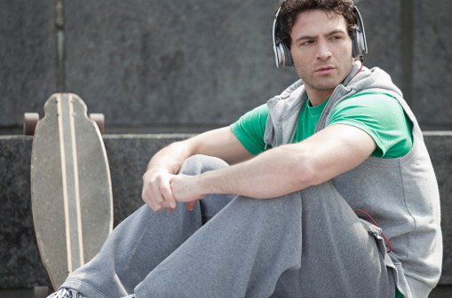
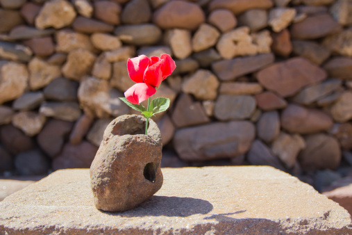

# ＜天玑＞走，闯一个明天去（三）：青春是一盘孤独的番茄炒蛋

**一刻不停地行走，有一天累了，才发现灵魂很远，很久没有静下来和自己谈谈心。自我意识缺少的时候，最容易迷失，也最得不到机会成长。一个人的时候，是成长的好机会，就不会迷失在人群里面。一个人坐在房间里面，大概是在这里的常态。安静的，不想看电影不想出门，什么都不想做，只剩下自己还有那颗清醒的脑袋，常常就会突然想清楚很多事情。人，毕竟要坐下来，给自己每天几个小时的独处时间。总是在热闹人群里面，是注定不能独立思考，而无法得到成长的。** 

# 青春是一盘孤独的番茄炒蛋

## 文/陈嘉倩（北斗撰稿人）

 

1.

四年前，在欧洲的第一年，第一次一个人生活。

住在学校配备有基本家具的单人房里，一关门，厨房厕所卧室一应俱全。不需要与外界有任何关联，也没有邻居之间的往来，更没有任何的嘈杂，这就是有些凄凉的学生公寓。

就在这里，二楼中间的一间房，红色窗帘内，我度过了大一的一整年。

马桶堵住了，从来没有遇到过这样的情况下，只有自己去研究解决；灯泡不再亮了，不懂瓦数也要带着旧灯泡去超市里询问，回家叠着椅子颤颤巍巍地换；洗碗的水槽堵住了，尝试拧开下水道，把堵在中间的垃圾一一亲手取出。一个人生活的起步，总是在不断研究，尝试不同的方法，一但成功，即使只是马桶终于抽水，也会兴高采烈到几乎要在房里跳舞，之后就根据成功的方法如法炮制。

再多的困难，再多的喜悦，反正，也只有和自己分享，冷静和淡然就是这样渐渐养成的，浮躁和娇气也褪去了一大半。

一个人买日用品一个人扛大米回家一个人去上课一个人回家温习功课一个人读书看电影一个人去图书馆一个人打工一个人扛下所有功课一个人哭着寻找坚强的理由。

一个人久了，对于一个友好的微笑，就会放大到从心底里炙热的温暖；对于那些能够触及灵魂的旋律和歌词，听着会心潮澎湃；对于电话对于网络，不再有任何的依赖，洒脱地生活着；对于爱情，没有期待也更小心翼翼了；对于节日，不痛不痒，就算外面烟火漫天自己的日子还是柴米油盐地过着。

这是第一次一个人生活，与自己独处，也是最大的考验。当读书压力骤然而至，竟然发现洗碗这件无趣的事情都可以变成生活的调剂，堆了洗，洗了用，用了再堆。越洗越利索，也留给生活一些喘息时间。一边做家务一边听音乐，倒也从内心深处悠然发出一股清闲的享受。

没有人作伴，那阵子脆弱到还会为自己的孤独而自卑。

夜深了，一个人在超市快要关门的时候才去买东西，牛奶，油，蔬菜水果，扛着重重的购物袋上有轨电车，往往接下去一个星期肩膀仍然很酸痛；没有人作伴，生病了就吸着鼻子头痛欲坠的情况下给自己煮粥，多喝水吃些清淡的东西；没有人作伴，才知道马桶是要经常清洗的，不止抽水那么简单，一个人得把生活给撑起来有棱有角有模有样，小情调的话还喷一点芳香剂；没有人作伴，一个人的时候才知道杀虫子没有那么吓人，不需要尖叫着喊老爸，自己迅速脱下拖鞋就冲过去了；没有人作伴，一个人时候听见半夜门铃响了，不去胡思乱想也不理睬只是继续看书或者窝在被子里面；没有人作伴，当遇到人生最低潮的时候，就大方地允许自己放声大哭，然后给自己抹眼泪，哭累了饿了去做饭。

一个人，就是在这里生活的常态。很安静，有时候一件事情没有想清楚就什么都不想做，早早睡觉。

每天听着耳机上学，然后一个人回家。日子不紧不慢，下雪的日子，就窝在暖气房里，穿着短袖看外面白花花的雪。有时候，会想一些人一些事，想到失眠。看着窗外的天空越来越亮，鸟开始在树枝唱歌，不断暗示自己其实一切都还好。因为一个人的时候，容易胡思乱想，没来由地难过或者失落或者对未来失望，却认真回想一下走过的路现在正在努力地自己，觉得一切没有那么的糟糕。一直在按照想要走的路在走，一直在努力着，没有一丝一毫的畏惧或者逃离。

有时想不通，闷坏了，就一个人乘火车去鹿特丹。走在街上，突然有了家乡上海的感觉，看着一辆辆车呼啸而过，霓红灯闪烁，想着家，走着走着，又把自己给弄哭了。

在最寂寞的时候头发也长得飞快，国内带了一把理发刀和打薄剪刀，因此甚至连理发这件事情都是属于一个人的。从一开始的一刀平，渐渐学会了修剪层次，有时候剪烂了，也知道没有人会去看去在意，索性越大胆技艺越渐入佳境。

2.

记得在澳门读书的时候，学校食堂很受欢迎，不但因为菜色好，更是因为对于澳门同学来说，他们的打工收入相对这一顿二十葡币的午餐是不算贵的，但对我而言，这笔饭钱在生活费里占据了太多比重完全可以省下来，况且只是回家自己做个饭的问题罢了。于是乎，我总是有计划地每天中午一下课就奔回家，踩着学校的高跟皮鞋下山，一到家换上拖鞋就开始热饭菜，因为不会做菜所以吃的都是超市里面那些速冻食品。有的时候吃水饺，热一热水，下锅直接捞上来就完成了。

在欧洲不再像是澳门，外面吃饭更加贵了，超市里冷冻食物成为了奢侈品。无法吃生菜，不能接受味道，也不喜欢沙拉，三明治更像是小点心容易肚子饿，中国菜令人怀念，方便面里面放一些鸡蛋和蔬菜，有时候甚至会觉得很丰盛，却也有时候会有瓶颈期，做饭翻花头令人苦恼。于是，开始不得不去学会做饭，从最简单的番茄炒饭做起一点点增加难度。后来厨艺增长，发现做菜不难，什么都可以炒一炒，自己创造都可以。

嗯，偶尔会为自己的到哪里都饿不死而骄傲万分。

经常买很多的菜，为了一个星期不用去超市。面对一冰箱的食材，就开始学着搭配学着做饭。但有时候边做饭还边看书或者写报告，忙得太投入，常常一不小心就烧坏锅子。

反正一个人吃，无论什么菜都会让自己很温馨。但一个人，怎么会好好地照顾自己；一个人，做饭有时会很无聊；一个人，买多了菜做多了也吃不掉，最后坏掉是浪费；一个人，难得有心情做一桌子菜，结果还要用保鲜膜装下剩余的，放进冰箱，一整周的菜基本上不用做了，暗地里感慨自己真是好养。

渐渐的，居然发现自己不挑食了，有的时候，连意大利面伴着榨菜都会觉得很好吃。还是和澳门读书一样，午间有休息就匆忙回家将冷饭冷菜热一热，省下一笔生活费。番茄炒蛋，是我桌上最常见的一道菜。因为做起来很快，伴着白饭吃也很美味。

每次把热好的饭倒进炒锅里，就着锅子一起吃，会无限地感慨。也因为往往在最饿的时候才想到要吃饭，无人问津饿了没有，更没有人烧了了一桌子的菜等待我回家。肚子咕噜咕噜叫的时候，我才会去温一温昨天的冷饭，拿出鸡蛋和番茄，十分钟完成，然后狼吞虎咽。

最饥饿时候的饱足，就是幸福。

能够为了自己那些卑微的小成就喝彩，即便在旁人看来多么不起眼，我对番茄炒蛋产生了强烈的依赖和满足感。

青春，或许就只是一道简单的家常小菜，在大酒店里面吃着山珍海味的人永远不会点番茄炒蛋，但在最一无所有最饥饿落魄的时候，却最想它。

大半人的青春都很平凡，甚至一无所有，可能一些骄傲也经常被打败得遍体鳞伤。一个人在外面，留学，工作，一碗白饭，配着番茄炒蛋，再撒上切好的葱，看着黄色与红色的交织，心情愉悦，有时候却竟然能够得到奢侈般的满足。黄色是生命，红色是热情。

番茄炒蛋道尽了现在我们的青春岁月，虽然极为平凡，但是生命与热情彻底渗透。鸡蛋与番茄，炒一炒，也是最单纯。每个人都拥有它，本以为是那么不值一钱，可是每看见老人的无力，才醒悟其实青春易逝，现在最好的年纪一无所有的同时也拥有了整个世界。

青春是一头困兽，充满矛盾，还好，我们仍然有一颗纯粹到不和这个世界妥协的心。

3.

易普生说，“世界上最有力量的人是最孤独的人。”

经过第一年一个人的生活，我才明白，其实成长，就是在一个人的时候爆发出来的力量。永远在小圈子里面，被一群人包围，是不可能有突破的；也总是在热闹人群里面，是无法独立思考的。一个人想多了，就找到了对待世界的方式；一群人，却往往受到太多别人的感染而缺少自己真正的想法。

在这里没有支点，这样的一间房，承载了这一年所有的成长与泪水。

无论外面是白天或是黑色，永远窗帘紧闭。下课，我从来不说“回家”，因为那里不过是暂时居住的地方，只是一间屋子，并不是家。无助过，想过退缩，但后来和自己相处习惯了，就找了安静的好处。世界那么多人，能够有幸在生命某段时间一个人过一会儿，是上帝的礼物，让你和自己好好交朋友，好好相处，好好了解。即便对生命灰心的时候，看着周围的那些人事物，却反而感激地看着这一切，因为正是它们让造就了现在的自己。一个人的时候，反而更细腻地去体味这一切，有的时候，面对深深的绝望，只有和自己谈判，才能从深渊中挣脱。

出国之前从未离开过父母，甚至没有离开过家乡；当家的温暖被陌生的语言和文化所替代，当生活还有读书压力无情袭来，被新环境包围，加上出国后每个人都有些自私，大家也都很忙，很多时候别人只看到照片里的我们在异国风情的美景中笑得灿烂，却看不见无论多快乐聊完电话，当挂断电话，看着冷清的房子一个人的房间，心里要不断给自己打气，好好一个人活着，好好生活在这个无依无靠的国度。

有时候看着那些整天一起吃饭一起玩的留学生，整天在中国人当中，嚷着这里地方多荒凉多无聊，说着另外一个圈子的是是非非，在一边冷眼旁观的我只是觉得他们实在是太过寂寞了。

至于面对父母，不是为了虚荣心才展示最光鲜的一面，经常“报喜不报忧”只是知道无论再苦，说出来也无济于事，最终要去面对的，还是只有自己。就好像是小时候打针吃药，再痛再苦，和父母再是争吵，生病的还是自己还是要自己去承担这份苦痛，落下的眼泪不能减缓什么，只是加重了他们的难过而已。长大了越是要忍得下来，也越是学会了如何与孤独相处。

人真是奇怪，过后几年，有时候我甚至会很感激这一年的冷清和孤单。

其实，孤独并不可怕，如果把它看做是上帝的礼物，让人有机会沉淀自己，或许心态就会完全不同了。反正，我也从来不是在人群中成长的，一直在自己反思的世界里。

我常常会觉得那些有思想的人会很孤独。孤独不是代表没有朋友，不代表不会在派对里面于人亲吻热情打招呼侃侃而谈，不代表不被人喜欢也不代表不受欢迎，也还是会有满满的行程表，一大群的朋友。

但间歇性地，会想一个人呆着。

一刻不停地行走，有一天累了，才发现灵魂很远，很久没有静下来和自己谈谈心。自我意识缺少的时候，最容易迷失，也最得不到机会成长。一个人的时候，是成长的好机会，就不会迷失在人群里面。一个人坐在房间里面，大概是在这里的常态。安静的，不想看电影不想出门，什么都不想做，只剩下自己还有那颗清醒的脑袋，常常就会突然想清楚很多事情。人，毕竟要坐下来，给自己每天几个小时的独处时间。总是在热闹人群里面，是注定不能独立思考，而无法得到成长的。

我的青春，就是这样一盘孤独的番茄炒蛋，平凡却也很灿烂。

 

（采编：何凌昊；责编：黄理罡）

 
