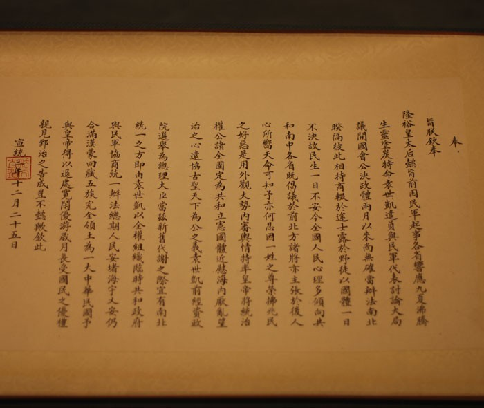
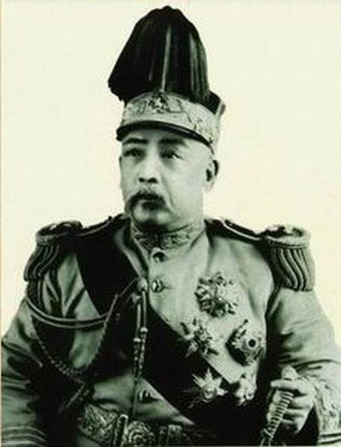
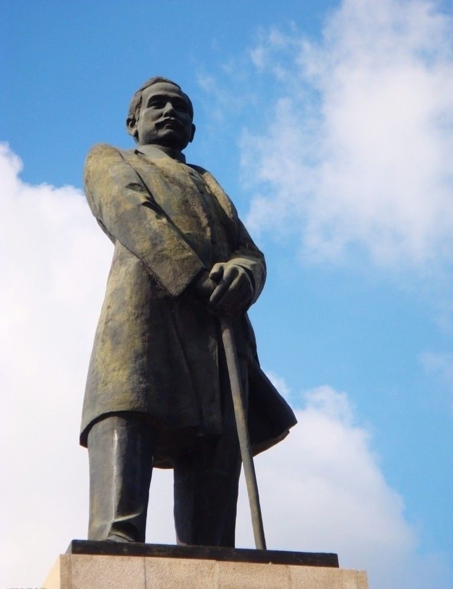

# ＜天玑＞辛亥革命反思专集（四）：满清的灭亡跟孙中山关系不大（下）

**孙文的国父形象是在1920年后随激进主义和党国体制伪造出来的，是党国体制不断洗脑灌输的产物，而不是人民自动选择的结果，就如同当年的毛太阳一样，孙文神象由于两党需要，从没倒塌过，在毛形象倒塌后，愚民需要另外一个神象来捍卫，于是就造就了孙文。**  

# 满清的灭亡跟孙中山关系不大

## 文 / 荣欢（安庆师范）

  （[承接前文](/?p=12141)） 

#### 孙中山三个月临时大总统不代表清朝是他推翻的

西汉末年农民起义者在推举首领时摆不平，突然有人提出有个刘盆子是汉室后裔，于是大家赶快到处找，找到了正在放羊的刘盆子，天上掉个馅饼正好砸着了这个放羊娃，就成了天下共主了。而孙中山就是这样的一个放羊娃。孙中山反清于政无能，于军无功，于财无制，于民无知。各省代表投票给孙中山不是因为孙中山讲“民主”而是因为孙中山没有本钱和他们玩真！这和1970年代台湾严家淦“当选总统”做蒋经国的“跳加官”是一个道理。没利用价值的时候就成了“地球弃民”癞皮狗！这还跟不久前武昌起义临时选个黎元洪当都督一个道理。正式总统还没选，各地就选个没军队没实权的孙当个临时的以便玩弄。还有当时各派系在等待袁世凯反正，袁世凯在各派系中有着什么样的地位，当时通行祖国南北最流行的四个字足以说明：“虚位待袁”。黄兴：“实为今日第一人物”。湖南巡抚吴大澄：“公向谓张幼樵为天下奇才，我见天下才非幼樵，乃袁某也。1912年2月12日袁世凯北洋军逼清帝退位，清朝被彻底推翻，2月15日南京参议院正式选举袁世凯为临时大总统。这样孙的使命也完成了，各派系就要求孙下台了。但反观这一年的孙中山，孙中山对日本人说：“当此次举事之初，余等即拟将满洲委之于日本，以此希求日本援助中国革命。”（孙中山：《与森恪的谈话》1912年2月3日，《孙中山集外集》167页，上海人民出版社1990年）。于是乎孙当了三个月的临时总统也就此结束，以后孙再想当全国总统，不停地造反但历史再也不给他机会了。

另外孙中山三个月的临时政府也是非法的。他听到武昌爆发共进会领导的革命以后，急冲冲回国抢官当，他的总统一没有选举法，二没经过全国普选，然后就给追随自己的老部下们加官进爵，而同盟会以外的蔡元培、章太炎等人组织的革命团体则被排除在权利中枢以外。这是什么？是法制么？这是人制！当时的代表都是各地都督指派的，都没有经过哪怕是当地议会的推举。他们的目的主要是协调统一行动，但没有选举临时大总统这样的权力和合法性。另一方面，很多地方都督林立，也都分别派出了代表。南京政府利用这个有利条件，选择性地接受代表。其实当时已经有一个协调机构，就是大元帅和副元帅。大家达成的一致是，黎元洪为元帅，主持武昌前线的战事，而黄兴为副，负责南京的工作。结果，黄兴利用主持南京工作的时机，和陈其美一道，党内决定选举孙文为总统。当时的被选举人只有三位，孙中山黎元洪黄兴。很奇怪的是当时参加的直隶、奉天、山东、山西是哪位都督指派的，要知道山东军政府11月12日宣布独立，11月24日就宣布取消独立，11月27日四川军政府宣布独立。当年直隶、奉天、山东、山西，河南这些地方并没有督军，而且当地政府还忠于满清，所以很是搞笑。此外，就是临时大总统的确立，同盟会内部也有分歧。当时有两种模式，法国式的内阁制（中央集权，但设立内阁来分权）、美国式总统制（不设内阁，但地方分权）。宋教仁主张内阁制，但孙文选择了没有地方分权的总统制，成为了一个专制总统。后被迫下台，又临时改为内阁制，出演了一出随意国体的闹剧。当黄兴和陈其美利用控制南京临时政府的时机，突然选出临时大总统。选了以后，孙文还向各地解释是为了和北军谈判方便。各地才得以勉强承认。最愤愤不平的就是武昌了。辛亥革命最主要的发起人孙武兴冲冲地跑到南京，结果重要职务都给了孙党成员。孙武不平，反而被说成争权夺利。至此，武昌派大多加入民社，反对孙党的专权了。

其实孙能临时脱颖而出与当时中国的现实有关。帝制刚退，中国不可能建立所谓的共和。然而，由于清廷退的不清不楚，一下子谁继位都缺乏合法的依据。就好像以前的拳王都是谁打赢算谁，无论你用什么招。但现在，前拳王说我不干了，金腰带也丢了，你们谁爱当谁当。这样，虽然每个人都有了当新拳王的机会，但却都失去了当新拳王的合法程序，总不至于把已经不干的拳手打出来再痛打一顿吧？而论实力，自然袁世凯最强，但自己直接登位大宝，似与袁的传统观念不合，也难以服众。更糟的是没有对手，没人愿意出来对打一下。如果有人出来打，那打的越多，某种程序上，胜者继位的合法性越强。就好像旧拳王退了，唯一的实力派空拎着两个大拳头，有劲无处使。明亡于南方的东林党，清亡于南方的洋务派，这不是什么革命性，而是利益之争。

#### 孙中山是个伪民族主义者

评价一个政府或政党是否进步，是否属于华夏正统的唯一标准，是看该政党对道教儒教的态度。孙中山拒绝穿汉服，他去祭拜朱元璋竟然穿的是军便服。自始至终鄙视道教，大部分时间信仰基督教，晚年虽然基督教信仰减弱，但敌视道教态度未变。可以断言孙中山和洪秀全一样都是伪汉民族主义者。他们是意图利用汉民族主义来达到用基督教代替道教的大阴谋家。宗教是火车头，既然信了外国教，大方向都错了。孙中山自称洪秀全第二。其实他和洪秀全一样，从西方拿了点自己也不明白的东西，改改细节然后就跟人吹牛：耶稣不是耶和华的儿子嘛，洪秀全是2儿子；美国不3权分立嘛，我们5权。在信徒里把自己立成偶像。造反可以，自己建个国家的本事就没有。为什么说是洪秀全第二呢，除了时间靠后之外，能力上，气度上也比洪秀全差，洪秀全怎么说也打到了长江边，还发动了一次北伐，孙中山死的时候势力还没越过两广；洪秀全在用人上，杀杨秀清他们至少也是用完以后，从黄兴开始，孙中山和其它领导人根本就相处不了，只有手下没有同伴，一有人看起来可以和他相提并论了，马上和人翻脸。

#### 莫被孙中山的嘴炮所欺骗

孙中山只会一些说词，因为除了卖弄些概念，孙其实一无所有。当有人问他某次到国外筹款回国带了多少钱，孙说只带了精神。说到底就是忽悠民众。然而一旦他觉得自己有点影响了，什么民主共和也就成了狗屎。居然让黄兴等一众大佬也要宣誓对他孙某效忠。一旦自己做不成总统，就到处忽悠反袁，搞什么二次革命，甚至不惜卖国。孙逸仙一生，军事上，未领导过哪怕一场战争的胜利。政治上，未领导过哪怕一场革命的成功，因能力不济只得以贱妾身份献身于军阀轮流玩。论坚持华夏主义，他是彻头彻尾的洋奴，三民主义中民权主义抄自美利坚白蛮，民族主义抄自日本列岛（日本抄自德意志白蛮），一个毫无理论建树的白蛮奶水充塞的华夏皮囊而已。论个人人品，背叛真心帮助他的朋友无数，糟蹋女人就更不在话下。后来的体制就是孙文作乱之后的历史继承和发展。先亲美，后媚日，再联苏，二次革命，护法战争，广东割据，出卖满蒙，挑起内战。一生奔波反复无常为那般。留下徒孙三支，皆以国家为一党之私产，对内残暴对外卖国，亲日的去南京曲线救国与日本共荣，亲美的去台湾三民主义反攻大陆，宁为美国玉碎不为中国瓦全。另一派也曾高喊过武装保卫苏联。不过建国后被人翻盘，对外称苏联为修正主义，对内以各种名义清洗亲苏派。对于孙中山，中国人要避讳，而外国人则会秉笔直书。美国的史扶邻先生在《孙中山：勉为其难的革命家》一书的正文之外，以括号的形式审慎地指出：“孙中山和黄兴赞同三井总经理的建议：以二千万日元和两师军队的装备，作为割让满洲的交换条件。据说，此建议遭到东京政府的否决。”鄙人认为，国家领土丝毫不得与外敌用作交易！反之，不管他出于什么理论，就是民族败类。

法国史学家百合吉尔也认为孙中山是“头脑不清的政客”，主意多但思路混乱的机会主义者，醉心权力游戏等。错就错在我们的历史包括“学者”们重来都是“造神不造人”，君王、领袖包括西方的各式各样的人物，一吹就把他们吹成神仙了，这样很容易造成别人的反感，并抓准漏洞批判。孙、蒋、毛这些人物都是这样的。更重要的是，辛亥革命所创造的中华民国，是一个有“宪法、议会，国旗是五色共和旗、多党制”的国家，这些都被孙中山领导的军政党政力量消灭了。民国军阀混战，我等国民陷入内忧外患，民不聊生的境地，确是由孙中山1913年二次革命开了先例，孙中山是个天生的革命家，民国建立后自己想修20万里铁路一寸修不成，还得继续革命至死，最后却美其名曰“欲求文明之幸福，必经文明之痛苦”。说得真好，反正他自己是不痛苦的。孙中山那点理论，在他之前就已经有了，而后来的传播，基本都是学生和知识分子。这主要得益于新文化运动中涌现的一大批思想家、教育家，而这批人，以北大为首，还真不关你孙文的事，基本上都出现在北洋军阀时期。而孙中山1914年创立中华革命党时叫党员按指模子对孙文本人效忠而不是基于整个民众的意志，强调妥协共和本来就与强权政治是同套的做法。孙文的军阀行为不仅在宋教仁死后严重地破坏了民国的基础，使得力量均衡受到了破坏，还接受苏联的援助创造黄埔军校北伐。从此国内无宁日。孙文晚年代表的是国民党左派，思想源泉是列宁，国民党提出的节制资本是什么东西？列宁所谓的国家资本主义而已，中国资本在近代都没有壮大和发展，他却提出要学习苏联，搞所谓的节制资本，打击和摧毁资本发展，变成国家和官僚控制的极权党国主义，把中国刚露头的工业文明摧毁于萌芽之中，这就是孙文的真面目。在其后其统治的几十年里，中国没有宪法、没有议会，面对这样的成绩。这种伟大国父，世人真不能欣赏。孙文的国父形象是在1920年后随激进主义和党国体制伪造出来的，是党国体制不断洗脑灌输的产物，而不是人民自动选择的结果，就如同当年的毛太阳一样，孙文神象由于两党需要，从没倒塌过，在毛形象倒塌后，愚民需要另外一个神象来捍卫，于是就造就了孙文。各种各样的政治需要把他打造成所谓民主的化身，正义爱国的化身，如此而已，为政治强暴人民思想而已。而现在的某些孙粉一方面高歌“浩浩荡荡不可阻挡之历史潮流”，一方面又夸大个人在历史中的作用，荒谬至极。由于不能树立自身内心的独立信仰，无法构建强大的内在精神世界，一些国人是当奴才的最佳材料，这也是很多人现在盲目崇拜孙的原因。关于孙在民国以后的所作所为及其具体分析这篇文章就不过多阐述，我以后再单独写一篇文章以享读者。

 

### 【有关书籍史料】

1，曹亚伯，《武昌革命真史》 2，陈锡祺，《孙中山年谱长编》 3，茅家琦等，《孙中山评传》 4，杨天石，《寻求历史的谜底》 5，郑曦原，《帝国的回忆：美国人眼中的晚清社会》 6，杨兴安，《杨衢云家传》 7, 谢一彪，《光复会史稿》 8，沈渭滨，《孙中山与辛亥革命》 9，石彦陶，《黄兴传》 10, 黃宇和，《孙逸仙伦敦蒙难真相》  原文地址：http://blog.renren.com/blog/225318469/722285890  

（采编：黄理罡；责编：黄理罡）

 
