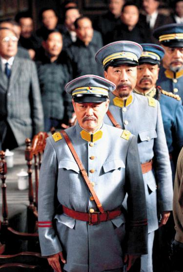
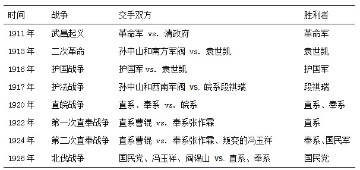
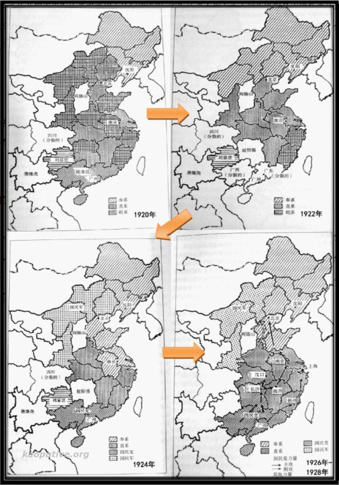

# ＜天玑＞靠点儿谱（七）：军阀割据的中国

**“陈并没有完全说错。回过头看来，共产党比国民党多做了一件事，就是试图彻底改变传统中国的社会结构。其时大小武夫横征暴敛，乡绅阶层瓦解，小农经济破产，人民苦不堪言。中共显然看到并抓住了机会。国民党有没有能力做到这一点呢？在1928-1937年的“黄金十年”里，国民党并没能挽救它自己。1949年后它在台湾它做到了，只是国军入台时，台湾毕竟没有强悍到足以和蒋介石抗衡的既得利益。** **这也是为什么历史学家徐中约和黄仁宇不约而同地指出，国民党对中国革命的贡献，在于它完成了上层组织的重建，而中国共产党则完成了下层组织的改造和统一。也许这才是“建党伟业”的主旨所在。”** 

# 军阀割据的中国

## 文/徐阿懒（麻省理工）

 （一） 《建党伟业》是部挺好的片子，以陶成章被刺起始，大体上尊重了史实，而上半部又比下半部精彩。但这部片子最大的问题，是上半部铺叙的近代史与下半部的“建党”似乎没有清晰的逻辑关联。为数不多的线索是刘烨嘴里吐出的一句“今天的中国，绝不是换一个皇帝、换一个总统就能改变的”以及冯远征、张嘉译饰演的陈、李二人颇具喜感的组党动议。可是，建党为什么能够拯救中国，电影并没有提供有力的逻辑。 要理解中共的“建党伟业”，恐怕要对1860年洋务运动以来的中国历史有一个整体的把握。其中特别困难的部分，可能是1912年清帝逊位到1928年国民党北伐成功之间的这段军阀割据时期。大陆历史教科书没给军阀说过几句好话。物极必反，近来坊间似乎又要给军阀翻案。陈志让和齐锡生在1970年代的两本专著对于理解这段历史很有帮助。 陈志让（Jerome Chen）先生是加拿大著名华裔历史学家，《剑桥中华民国史》的作者之一，长期执教于英国利兹大学教授。他的《军绅政权》成书于1979年。1980年，三联书店在第一时间就将这本书引进中国。齐锡生（His-Sheng Ch`I）先生毕业于芝加哥大学政治系，师从邹谠和卡普兰（Morton A. Kaplan），后来在北卡任教，并帮助筹建了香港科大。他的《中国的军阀政治》1976年由斯坦福大学出版社出版。 两位作者很有点别苗头的意思，陈志让更是批评齐将是分裂的中国看成一个国际体系“极不适当”，以及齐将视野锁定在1916-1928年（袁世凯死至蒋介石统一中国）缺乏历史感。陈的批评之后再说，在我看来，两位作者立论的共通之处远大于他们的分歧，其中最重要的是指出了军阀割据造成的社会经济后果。这恰恰是中共日后兴起乃至走向成功的社会基础。 

陈志让指出，1895年以后，尤其是1912年清帝退位后，国家走向分裂，地方变成独立王国。在地方上说了算的不再是读过书考过科举的士绅，而是掌握枪杆子的军人——即所谓“军-绅政权”。军阀自利，不听（名义上的）中央的调配，最重视维护自身的权力和地位。在当时农业社会的情形下，扩大地盘是争夺经济和人力资源最有效的手段，因而派系之间的混战不可避免。又因为他们受到技术条件的限制，又没有哪一派有足够的力量统一全国。 齐锡生进一步深化和细化了陈的分析。打仗靠人，人要吃饭。军队要增强实力，就不得不扩大财源。军阀们将负担转嫁到农民身上，农民的贫困程度相应增加，破坏了传统农业社会的社会组织和经济平衡。农民生存境况的绝对恶化使当兵成为一个重要的谋生手段。事实上，贫家子弟构成了军阀组织的主要成分。译者萧延中总结得不错： “从生产力水平低下，经扩大地盘、招兵买马、军费增大、盘剥农民、形成兵源，到更加严重地破坏社会生产力，这就完整地构成了一幅军阀主义发展的恶性循环图。” 不了解这个背景，我们就很难理解为何国民党能够统一中国以及为何共产党能最终成功取得政权。按照我的理解，齐锡生的潜台词是，无论是国民党还是共产党，都通过组织创新改变了攫取战争资源的“技术条件”，从而超越了北洋军阀和其他地方军阀。 值得注意的是，在军人的构成、招兵、训练、武器、财政各方面，国民党在中国政治派系中都是作为优势力量而出现的。相反，陈志让则认为，蒋介石也是军阀，国民党本质上是军绅政权。不过有一点是肯定的，国共两党在军队的阶级成份和意识形态上的差异，要比他们和其他军阀之间的差异小得多。 陈并没有完全说错。回过头看来，共产党比国民党多做了一件事，就是试图彻底改变传统中国的社会结构。其时大小武夫横征暴敛，乡绅阶层瓦解，小农经济破产，人民苦不堪言。中共显然看到并抓住了机会。国民党有没有能力做到这一点呢？在1928-1937年的“黄金十年”里，国民党并没能挽救它自己。1949年后它在台湾它做到了，只是国军入台时，台湾毕竟没有强悍到足以和蒋介石抗衡的既得利益。 这也是为什么历史学家徐中约和黄仁宇不约而同地指出，国民党对中国革命的贡献，在于它完成了上层组织的重建，而中国共产党则完成了下层组织的改造和统一。也许这才是“建党伟业”的主旨所在。  （二） 陈志让对军阀时期中国历史的分析，展现了比齐锡生更宽广的视野。他是把军阀的兴起和衰落放在中国社会转型的大背景下来讨论的。 陈志让将晚近中国的历程分成两个时期。第一个时期从1860年到1895年，涵盖了整个洋务运动。这一时期，曾国藩、李鸿章以湘军、淮军为依托，进入了中国政治舞台的中心。此时，军队在传统知识分子的管理之下，仍听于中央。陈称这个时期的政权是“绅-军政权”。 1895年以后，清室为维持国内政权的稳定，着手训练新军，而新军恰恰成了日后革命的主要力量。1912年清帝逊位后，地方变成独立王国，中国进入了军阀割据时期。陈将这种地方行政机构听命于军人的政权称为“军-绅政权”。 “绅-军政权”和“军-绅政权”这两个概念都有值得商榷之处。就是前一个词而言，“绅”之所以区别于“军”，是因为士大夫受到皇权的认可。如果皇权对曾、李、张、刘等人仍能施加有效的影响，除非“绅”可以用来指代传统的中央集权体系，否则“绅-军政权”的描述就是不完整的，不然要把西太后往哪里放？ 就第二个词而言，“绅”究竟是指什么人并不明确——有时，它是指传统士绅，因为据说军人需要士绅为其提供合法性；更多时候，它仅仅是指配合军人盘剥农民的地主，这时，“绅”失去了这个字本来蕴含的复杂性。 在我看来，绅-军政权、军-绅政权的差别，不外乎两点：(1)是否有统一的中央政府，以及(2)传统知识阶层的角色。就第一点而言，前面已经讲过，割据的军阀对传统农业社会的催残，可能远甚于统一的专制皇权。一个简单的“产业组织”模型也许就能说明其中的逻辑： 1. 流寇比坐寇更加机会主义，不在乎信誉的积累； 2. 割据的军阀会将较多的剩余用于维持于军力和发动战争，而非为地方提供公共品； 3. 由于战争是劳动密集型产业，军阀有动力通过大肆攫取剩余压低农业均衡工资，甚至不惜降低农民的基本生存水平。 这三个渠道并不需要借住乡绅角色的变化，就可以解释军阀割据时代中国乡村社会的破败和不堪。 同时，分裂的格局本身，也可以解释为什么北洋政府统治时期，思想界、知识界比较自由，因为名义上的中央没法统一国家内部的意识形态，也没有管制其他地区的舆论的能力。并不奇怪，今日我们对北洋政府的称赞，多集中在当时的言论和学术自由。 陈对军阀时期社会经济的分析，使他很自然地得到以下推论：统一（或宪政下的统一）,是中国现代化的前提。这当然没有错。但是，得到这个推论并不需要“绅-军政权”、“军-绅政权”这对概念。陈志让的贡献在于，通过这两个概念，他间接地指出了从晚清到民国，中国政治格局的根本变化——伴随着传统士大夫群体的没落，中国从一个专制帝国艰难转型为一个现代国家。从此，知识阶层不再享有特权。 在一篇刊登在《南方都市报》的[书评](http://epaper.oeeee.com/C/html/2008-11/02/content_615810.htm)中，有读者写道： “原来居于舞台中心的士绅，无论新旧，从张謇、严复到梁启超、汤化龙，再到顾维钧、曹汝霖这样的留学精英，甚至包括跟当家的军人领袖关系极为密切的智囊型人物，如袁世凯的杨度、段祺瑞的徐树铮，吴佩孚的张其锽、白坚武，张作霖的王永江等，都只能退居次要地位。” 这是一个非常重要的变化。陈敏锐地观察到新出现的城市知识分子游离在统治格局之外（第155页）： 有的人从事自由职业（大学教授、报纸编辑、文学家等），他们批评军-绅政权，主张改革，但不参加政府也不参加政治活动，怕的是张謇所谓的从“皭然”到“秽浊”。 有的根本没有什么了不起的自由职业，多半在小县城或乡下教书，渴望改革，参加政治行动，身受武力的摧残。在思想上吸收反帝的民族主义，所以反对军-绅政权与帝国主义；他们也吸收了社会主义，所以反对社会上不公平的现象……他们不再说“万般皆下品，唯有读书高”，而提出“劳工神圣”的口号。 ……中国一部分受过教育的人变成另一部分受过教育的人的死敌。 正如陈所言，知识分子的角色转变，孕育了革命的火种。后来，一些左翼知识分子逃到山区，赋予农民思想和组织。“这两个武器和山地农民的愤怒结合起来，变成了一支毁灭军-绅政权的力量。” 如果说包括国民党在内的各路军阀没能建立一个稳健的、在宪政框架内运行的民主共和国的话，他们至少催毁了那个延续千年的政权机器。知识分子不被人待见，未必全是坏事，因为经官方考核的“知识”不再成为进入权力系统的入场券。现在有些学者拿今天共产党中国的官僚体系比附专制王朝的文官系统（用来说明所谓的中国模式的长期有效性？），逻辑上最大的困难恐怕莫过于此。  （三） 陈志让对齐锡生的批评不无道理。将1916-1928年间的军阀看作一个国际体系，无法增加我们对于中国社会转型的整体认识。但后者从小处着眼的研究进路并非没有价值。实际上，正是看了齐的分析（尤其是第九章《中国的政治系统》），我才对军阀混战的逻辑稍有了解。Donald G. Gillin说这章“冗长、乏味、没有必要”，对于这个评价，我完全不能理解。 自1911年辛亥革命始的大型战争，可以粗略罗列如下： 

齐用卡普兰的“权力均势”（balance of power）理论分析了1920年以后的四场战争。实际上，所谓的“权力均势”并不是什么超越常识的独特见解——弱者会联合起来平衡强者。早在三国时期，孙、刘就知道只有联手抗曹，才略有胜算。这个理论里的前提是各方基本上没有意识形态方面的考虑，大体上只关心生存和拓展势力范围。不过，齐把权力均势理论应用于民国初年的军阀之间的战争，确有令人豁然开朗之感。 下图来自该书的第九章，描述了四次战争前后的实力格局。1920年直皖战争之前，皖系独大，直系和奉系因而联手对抗皖系。随后直系似乎成了新的霸权，直系与奉系失和。1922年，奉系联络国民党进攻直系控制的江西，第一次直奉战争爆发。奉系在失败后被赶出长城外。1924年，当直系进攻败退到浙江的皖系时，奉系再次联络国民党对抗直系。这次，由于直系冯玉祥反叛，战争以直系失败告终。 

1924年以后，形势发生了变化。奉系、直系和冯的国民军好像都没把弱小的国民党放在眼里。当国民党开始北伐的时候，北方正打的不可开交。权力均势理论看起来说不通了，齐的解释是个人情感因素和“不完全信息”： 直系之所以没有和冯玉祥合作，是因为对背叛行为的强烈憎恨。吴佩孚的报复最终使国民军和国民党形成了稳定的联合……国民党过去的软弱使北洋军阀对它产生了很大误解。所以，当北洋军阀最后被迫与国民党较量时，他们没有新的措施对付这个威胁。 齐的分析带有很强的政治学色彩。第三章里他应用西方学者的社会关系理论，对军阀派系构成的分析又是一例。从繁琐的历史细节中抽象出普适的社会科学理论，自然要付出代价。所有有人委婉地批评齐[生搬硬套](http://www.crup.com.cn/Item/92026.aspx)。 这并不是他的错。政治学似乎是介于历史学和经济学之间的一个多少有些不伦不类的学科。它比历史学更讲究一般化的理论，但这些理论往往不是假设太强就是缺少深度，免不了被经济学者讥笑；它似乎比经济学更关心历史和现实的细节，但在第一手资料的搜集和使用上往往又不入史家的法眼。 齐锡生的这本书突破了史学描述的范式，试图对军阀时期的历史进行更加抽象的思考，这在三十年前肯定是极为重要的尝试。我甚至有一个感觉，今日研究中国问题的政治学者，并未在齐努力的方向上推进很多。统计学固然已经被大量使用了，且不说统计分析经常被误用，即使回归能说明一些现象，抽象层面的深入思考仍然少之又少。 其中也许有一个原因，研究中国的学者常常不自觉地相信——中国是极为特殊的。大体上，我不同意这种看法。  **陈志让，《军绅政权：近代中国的军阀时期》 三联书店，1980年；广西师范大学出版社，2008年。 译自Jerome Ch’en, The Military-Gentry coalition: China under Warlords, University of Toronto-York University, Joint Centre on Modern East Asia, 1979.** **齐锡生，《中国的军阀政治：1916-1928》，中国人民大学出版社，2010年。 译自Hsi-Sheng Ch`I,Warlord Politics in China, 1916-1928. Stanford University Press, 1976.**  **作者简介：本期天玑一共有三位作者，但都来自同一个博客 “[靠点儿谱](http://kaoputive.org/?p=12733)”。**  

（采编：刘一舟;责编：刘一舟）

