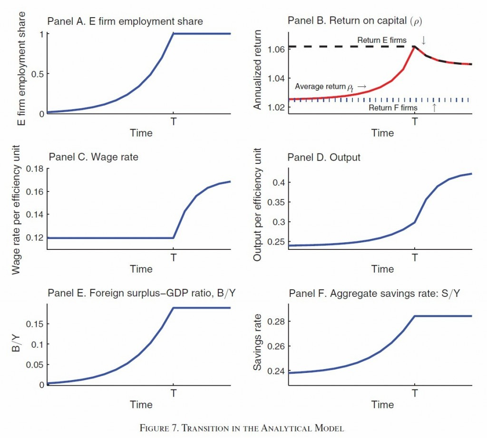

# ＜天玑＞靠点儿谱（二）像中国一样疯长

**“这个故事为什么重要？除了理论上的原因（比如解释中国的资本回报为什么长年不降，比如刻画“转型”的动力学）外，它指出了中国这些年经济疯长的一个重要原因：资源（劳动力、资本）在不断从低效部门向高效部门转移。很神奇不是么？同样的东西，放在这里和放在那里，效果居然不一样。能把这里面逻辑讲得很清楚，就是经济学的神奇！如果品味一番，这个故事显然有刘易斯模型的影子。”**

# 像中国一样疯长

### 

##  文/徐阿懒（Massachusetts Institute of Technology）

 这些年美国人谈到中国，最喜欢引用的数字是中国的外汇储备。接下去一句话就是中国在操纵人民币汇率。说这话的人很多，包括学术文章写得很好的道学家[克鲁格曼先生](http://www.nytimes.com/2010/03/15/opinion/15krugman.html)。但是里面的经济学并不清楚。如果操纵汇率有用的话，就等于承认“价格粘性”是一种长期现象。否则，中国人把价钱定得离谱得低，美国人跟进扫货，中国人来不及生产，中国通胀。所以美国人为什么要担心中国“操纵汇率”呢？因为“操纵汇率”对中国人没好处亚！除非中国工厂的老板们统统都是共产主义者，加班加点都是不带涨价的。 

### 

 数据来源：中华人民共和国统计局、中国人民银行 宏观上讲，外贸出超是本国储蓄大于投资的部分。可是，跟美国、欧洲人比，中国人的头顶上的资本还很少。我在本科时参加一个讨论会，那时候研究宏观的学者都说，中国最近几年的投资率太高了，过热了！那次也在座的黄有光老师却说，“怎么会低，农村、中西部，还有那么多地方要投资，怎么会嫌投资太多！” 为什么像中国这样发展水平不高、资本装备率还很低的大国，会持续不断地把钱投到国外去？这是经济学里的一个puzzle。答案有很多，最简洁的版本是中国的金融体系不发达，不能把钱送到需要钱的人手里。许多经济学家写过这个问题，包括我和西洪柿的老师[姚洋教授](http://www.infzm.com/content/33179)。道理我都同意，但是感觉其中的逻辑没有讲清楚。 [最近一期《美国经济评论》](http://www.aeaweb.org/forthcoming/output/accepted_AER.php)上有一篇文章就是为了解释这个现象的。虽然还没印出来，这篇文章已在坊间广为留传，颇受好评。学术到了这个时代，印不印出来已经无关紧要了。文章的名字叫[《像中国一样增长》](http://emlab.berkeley.edu/~webfac/obstfeld/GlC_berkeley.pdf)。作者之一原来是复旦的老师。（我在那儿的时候，他曾说：“做经济学，每天睡觉不能超过5个小时。”我每天要睡十个小时，于是只能转行了。今天看这个文章，觉得他少睡的5个小时物有所值。） 作者们其实讲了一样一个故事：中国有两种企业，一种叫国企，一种叫民企。原先只有国企，工人们都在里面干活。那时候银行是国家的出纳，老百姓的储蓄就是国企的积累，虽然不多，但都花在给国企买设备上面。国企虽然搞的都是重工业，但是因为人实在多，分到每个人头上的机器设备没有多少，所以每个人的产出不高，工资也不高。国企还有一个问题，就是什么都是按计划办事，厂长经理没什么主观能动性。因为上面的领导也知道，能动性多了，下面的人就伸手，管不住。 后来允许搞私人搞企业了，就是所谓的民企。私人老板很有冲劲，而且嗅觉灵敏，知道哪里有机会。而有他们没有伸手不伸手的问题，挣来的钱不是自己的，就是儿子的。但银行不待见他们。他们叫苦，叫苦也没人理，只能自个儿攒钱。他们把利润存下来买设备、建厂商，真正地“白手起家”。有时候他们也搞一会“台会”，相互一间融通一下。银行不贷给他们还有一个原因，就是吃不准这些民企的底细。民企做的大了，固定资产多了，利润好了，银行也渐渐愿意贷款给他们了。 作者们说，中国最近十几二十年的发展，就是民企慢慢做大，国企相对收缩的过程。因为民营企业家懂市场，会抓机会，生产率比国企高很多（数据拟合的结果显示，民企的效率是国企的4.79倍），它们招的工人越来越多。国企效率低，提前退休了一批、下岗了一批，在劳动力市场里面的份额越来越少。中国的经济，就是干劲十足、一天天长大的民营的部分，拽着晃晃悠悠的国有的部分，往前面跑！ 但是这跟出口有什么关系呢？有关系。那时候国企冗员，算上内退的、下岗，平均一下，国企工人的工资很低。工资低，当然不敢花，存钱。民企效率高，但是知道贷不到款，所以挣了钱不也花，投资一部分，存很大一部分。国企呢，裁人都不来不及，当然没什么心思投资。一时间大家都在存钱，消费的不多，投资建厂房、买设备的更少。民企倒是想买，但是家底薄，没东西抵押，贷不到款。这样只进不出，光有存钱的，没有花钱的，居民和企业的储蓄在国内用不掉，只能流到国外变成绿票子了。 

### 

 原文提供的转型动态（E是民企，F是国企） 什么时候完呢？民企占领整个经济的时候，转型就结束了。这时候银行只能把钱借给民企，民企老板不用存钱了，外贸出超的时代也就告一段落了。这个转型的过程，也贫富差矩拉大的过程。因为国企有那么多下岗职工（现实中，还有每年两千万的农村移民），工资水平上不去，所以民企的资本回报率一直很高，企业家财富累积就比较快。 这个故事为什么重要？除了理论上的原因（比如解释中国的资本回报为什么长年不降，比如刻画“转型”的动力学）外，它指出了中国这些年经济疯长的一个重要原因：资源（劳动力、资本）在不断从低效部门向高效部门转移。很神奇不是么？同样的东西，放在这里和放在那里，效果居然不一样。能把这里面逻辑讲得很清楚，就是经济学的神奇！如果品味一番，这个故事显然有刘易斯模型的影子。 其次，它为两件事提供了一种非政治经济学的视角。第一件是贸易盈余。中国有贸易盈余，是因为工资刚性和企业储蓄，而不是什么“操纵汇率”。如果我们的经济系统中真的有什么价格粘着不动的话，不是产品价格，而是工资！克鲁格曼那样道德高尚的自由派会接受这样的解释吗？我看是个两难。第二件是收入分配。收入分配恶化的原因很多，值得另外再写。这里提供了一个渠道——工人工资涨不上去，老板在“被迫”存钱——但我认为不是主要的渠道。 作为结尾，这篇文章最精彩的地方，恐怕还是讲清了金融市场不发达和企业自储蓄之间的关联。关于这个逻辑，我们的宋老师宋天师[早在2005年就发现了](http://news1.jrj.com.cn/news/2006-11-30/000001817349_001.html)。鼓掌，撒花。不过这又是另一个大题目了。 Song, Zheng; Storesletten, Kjetil and Zilibotti, Fabrizio: “Growing Like China.”**_American Economic Review_**, forthcoming. 作者简介：本期天玑一共有三位作者，但都来自同一个博客 “[靠点儿谱](http://kaoputive.org/?p=12733)”。 

### 

（编辑：刘一舟）

标签：
