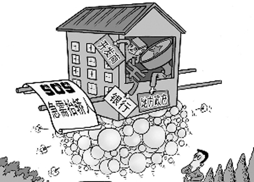
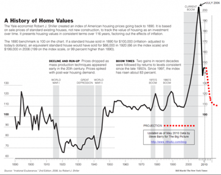
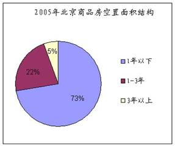

# ＜天玑＞靠点儿谱（四）——糟糕的房地产数据

**“‘泡沫’本身就是个比较虚的概念，每个人离场的触发点不可能一样，历史也不可能完全重复，但明明白白认赌服输和凭着感觉被温水煮青蛙应该还是有区别的。”**

### 

### 

# 糟糕的房地产数据

### 

## 文/ GrapeFoliage

**一、****泡沫指标**

### 

### 

关于中国的房地产市场有没有泡沫、泡沫多大的争论在我们像日本一样歇菜以前（似乎大家都是这样认为的，但大家又似乎都认为这件事在“近几年”不会到来）不会停止，但为更好地讨论这件事所做的那些“笨功夫”这么些年也没见起色，其中就包括数据的工作。通常的几个衡量房地产市场“泡沫”的比率指标：房价收入比、房价租金比、住房空置率都缺乏可供采用的可靠数据。 先说房价收入比，又称为Affordability。有不少讲房地产问题的作者使用过这个指标，网上还搜索得到35个大中城市或者70个大中城市的房价收入比大排序，看上去蔚为壮观。 这些指标中，收入大多采用人均GDP、城市居民家庭人均可支配收入或者企业在岗职工的平均工资。不考虑数据质量，收入只给平均数就有很大的缺陷。收入差距大的时候，平均数往往不是收入水平的好的衡量。比如有四个人，月收入分别是3000、5000、8000和20000，平均收入是9000块，中位收入是6500块。如果这个社会普遍认为月收入能买得起1平米的房子是一种比较“合适”的状态的话，而此时房价是8500一平米，则采取平均收入和中位收入对于决策者和投资者来说得出的结论是完全相反的，而实际情况是四个人中有三个人觉得房价“太高了”，采用中位收入更符合大众的感受。 接着是房价租金比，即使乐观地假定房价和租金的数据全没问题（实际上统计局提供的租金指数有时问题很大，比如北京市2000年租金指数上涨67%，同期房价指数微跌，原因不明），那么就有可靠的房价租金比了吗？答案是不见得。因为这个比例有意义的前提是房价和租金的采集要基本是同一地区的同一类的房子，而许多时候编制房价指数和租金指数时是各管各的，其考察的对象不见得重合，同时使用的话在解释上要谨慎一点。仅就我和王导合住的这所老公房而言，大概60平米，现在其市场价格大概是30000块每平米，租金每平米每月大概是50块，一年租金600块。房价租金比大概是50，也就是说作为资产的这套房子的市盈率是50倍，租金回报率才2%。（目前香港相近平米数的房子租金回报率是3.5%，香港97的时候是3.7%） 住房空置率有按套数计算的，有按面积计算的。对于普通住宅来说，按套数计算更符合我们关心的内容，即现有的存量住房里头，到底有多少套房子是没人住的。可惜现在我们连这个比例的分母都搞不清，中国内地最大的几个城市也没有（或者没有公布过）存量房套数的数据，作为分子的空置套数更不用说了。我手头的一项从年鉴里抄来的资料说，北京市建委2006年的一次入户调查表明，北京市公寓和万元以上高价位住房空置率分别高达14.19%和16.52%，其中70.5%的空置住房为以出售但未入住的房屋。别墅空置率为7.26%，且半数以上为开发商未租或未出售房屋，占63.65%，从这条信息看，那会儿别墅的投资价值不错。 “泡沫”本身就是个比较虚的概念，每个人离场的触发点不可能一样，历史也不可能完全重复，但明明白白认赌服输和凭着感觉被温水煮青蛙应该还是有区别的。 **二、****价格的问题**

### 

### 

我曾经花了好些时间试图整理一些关于中国房地产市场的基本事实，但是最终所获甚少。我不妨列几个数据方面的问题出来，用来求教和给想进这个领域耍耍的朋友们提个醒： 每年统计局都会出一本厚厚的《中国房地产市场统计年鉴》，每个月也有相应的月报，这其中的房地产数据种类比较丰富，包括多种的价、量和金额等，但细看之下不免令人灰心。这些数据大部分是规模以上的房地产企业上报给统计局的，其中存在统计口径模糊、数据不连贯、数据与现实感受差距太大等等问题。最近一两年来，由于民众的呼声，统计局决定加强这方面的工作，比如房价直接采用网签数据代替房地产企业上报的数据，但这又可能会带来统计数字在时序上的断裂，从而纵向无法比较，并且其他一些很重要的变量，比如房屋销售面积、土地购置面积、房地产贷款数量等虽然不如房价那么吸引公众眼球，但对于研究和政策制定也是非常重要的，而它们的质量也亟待提高。 这一篇想先说说价格方面的问题，我们姑且假定房地产企业报给统计局的数基本是真数，或者误差的方向和比例逐年大致相同，那我们是否就能够得到关于房价上涨幅度的一个客观的判断（或者说，一个比较好的房价指数）了呢？答案是还需要一些努力，甚至是还需要一些时间。 首先，房价纵向比较的前提是各期所考察的房子应该是基本同质的。其中，质的含义包括了房子的区位、面积、户型、朝向、是商品房还是经适房等等方面。而统计局长期采用的一个办法是用当期的成交金额除以当期的成交面积得到一个平均的成交房价，再用这个平均的成交房价纵向比较来构造指数。这个办法是存在很大缺陷的。有人举过一个例子说明这种方法的荒唐：去年北京三环边上的房子价格是2万块，今年北京四环边上的房子的价格也到了2万块，如果去年成交的房子大多是三环附近的，今年成交的房子大多是四环附近的，不经过调整而直接使用成交数据的话，得出的结论是房价几乎没有上涨。 学界和业界的人士大都听说过由标准普尔发布的Case-Shiller房价指数，这个房价指数是由标准普尔根据Case和Shiller两位经济学家发展出来的重复交易法（repeat sales method)对36个美国大中城市的房价数据进行收集后构造的，构造过程中很关键的一点是用同一房屋反复交易的信息来规避房屋的不同质，其本质上相当于把每期出现交易的那些房屋的价格的上涨幅度年化，然后取平均：比如去年三环一处房子2万块，四环一处房子1万5，今年三环的房子转手卖了2万5，四环的房子转手卖了2万，那么三环的房子价格上涨了25%，四环的房子价格上涨了33%，平均起来大概是29%。这基本上可以看作是合理的度量之一。 

### 

### 

来源：纽约时报（2006年），Steve Barry于2010年7月更新 我们啥时候能够有自己的Case-Shiller呢？可以说任重而道远，我们的房屋交易还处在以新房为主的阶段，没有交易充分的二手房市场，交易信息的收集还需要一个过程，对于这些信息的处理方法改进也是如此。 在房地产的价的方面，租金和地价的数据也存在同样的问题。我本人看到过一些以统计局数据和其他来源的数据来构造指数，并以其为依据进行统计分析而写作的文章，有不少在学报上甚至很好的学报上（至少在国内）发表了，这些文章中的绝大部分没有解决上述的问题，当他们堂而皇之地宣称Following[ Case and Shiller(1987)](http://dido.wss.yale.edu/P/cd/d08b/d0851.pdf)的时候，我不知道他们在Follow什么。 **一、****土地与面积** 在中国，房地产开发企业上报的关于土地的量的数据有以下以下四项：本年完成土地开发面积；正在开发的土地面积；待开发的土地面积和本年购置的土地面积。我跟这四个指标死磕了很长时间，最终以惨败而告终。 这四个指标中，一般被人注意的是头尾的两个，[有文章](http://www.nsd.edu.cn/cn/article.asp?articleid=8596)用本年购置但未开发的土地面积作为开发商截留的土地面积，通俗点说也就是“囤地”的面积。也[有的报道](http://www.ce.cn/cysc/fdc/fc/200711/05/t20071105_13474446.shtml)用历年的土地开发面积除以历年的土地购置面积来说明“囤地”问题是多么严重。这些都不是很准确，一是本年购置的土地面积是各个企业上报的，可能有些土地今年被这个企业买了，明年又被倒手卖给另一个企业，甚至在同一年内倒手，这样购置面积就存在重复计算的问题。二是本年完成开发的土地面积不见得来自本来的购置，也可能来自正在开发的土地面积和待开发的土地面积。这样算的人可能是看数据的时候没有看到中间那两个指标。 其实，就某一年而言，开发商手里的土地无非就三种状态，已经完成开发的、正在开发的、待开发的，而且这三种状态是相互排斥的，那么，计算“囤地”问题岂不很简单？把正在开发的和待开发的除以三个的总数不就是“囤地”的比例吗？这样考虑是对的，但是杯具在于2001年以后，正在开发的土地面积就很难找到了（反正我没找到，我是去年春天用Wind找的）。 不是不给吗？没关系，咱也上过小学，推吧推吧也能得出如下关系： 本年正在开发面积=上年正在开发面积+上年待开发面积+本年购置面积—（本年待开发面积+本年完成开发面积） 当我正在为修复了丢失的数据沾沾自喜的时候，一时手贱，鼓捣了鼓捣1999-2000年三年有数据的年份，看看我找的这个关系对不对。结果当然是又一次悲剧了，等号左边和右边有时候相差还好，有时相差太大，不能用。这可能是上一年开发完了的地又在第二年被卖掉导致的，或者其它什么原因。总之，那时我就没再追究了，我已经被统计局打败了。 **四、Rawski的失误** Thomas Rawski在2002年写了一篇从宏观和微观两个层面全面否定中国投资体制的文章，其中有一段就讲到了商品房的积压问题。他用的是1998年到2002年6月份的中国商品房施工面积、竣工面积和销售面积的数据。他发现这期间全国累计销售的商品房面积是6.82亿平米，而1998年末正在施工的商品房面积就有4.86亿平米，假设1998年的这些“在建工程”全部顺利竣工并且在2002年6月之前卖出去了，那么考察期间累计销售面积就只剩了6.82-4.86=1.96亿平米，这意味着1999末到2001年末正在施工的房子当中（根据Rawski提供的数据，共约25.6亿平米），只有7.7%的房子在2002年6月之前竣工并且卖出去了，从而形成了严重的“积压”。这篇文章写作到现在将近9年了，后面的历史告诉我们，这些“积压的”房子，起码在大城市的那些，卖得相当好。 这里且不说Rawski戴着有色眼镜专挑周期底部说事儿的问题，单从数据上看，他也高估了问题的严重性。首先，他假定所有的商品房都会在1年内竣工（这个假定如果不太合理的话，历年的施工面积会被重复计算，从而实际比值会大于7.7%）。其次，房地产企业施工完成的房子里，有相当一部分是属于拆迁还建、统建代建和公益性的建筑，这部分竣工面积是不可租售面积。在可租售面积里，当然有一些被用来出租，应此有个指标叫“出租面积”，房地产企业自己可以处置的面积刨去“销售面积”和“出租面积”，剩下的才是对他们而言的“积压面积”，在住建部的统计指标里又叫“空置面积”。 

### 

 拿我手头有数据的2005年来说，当年北京市住宅的“空置面积”大约是800万平米，当年住宅竣工面积大约是2850万平米，“空置面积”占当年新落成的住宅的28%，占比不算小（空置面积中有往年落成的，竣工面积中有不可租售的，这里只是大概描述一下）。下图是这800万平米的“积压货”的大体构成情况，可以看出，大约四分之三的面积可以在1年内出手，3年内95%的面积可以出手，到时就所剩无几了。所以大体上看，也没必要为这些“积压”担心。当然，如果统计部门每年都把这些个房屋面积指标公布完整并解释清楚，Rawski式的失误会少很多。 作者简介：本期天玑一共有三位作者，但都来自同一个博客 “[靠点儿谱](http://kaoputive.org/)”。 

### 

### 

（采编：刘一舟 责编：刘一舟）

### 

### 
