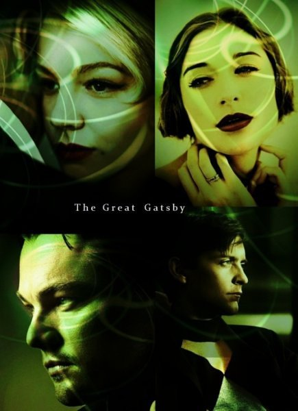
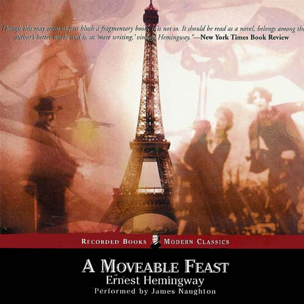
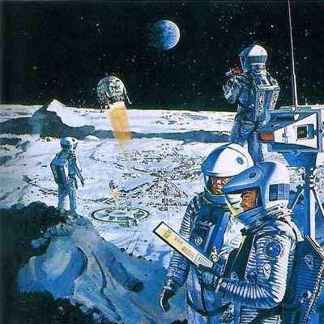
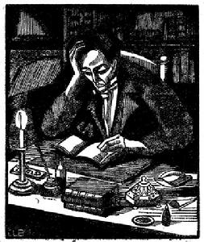
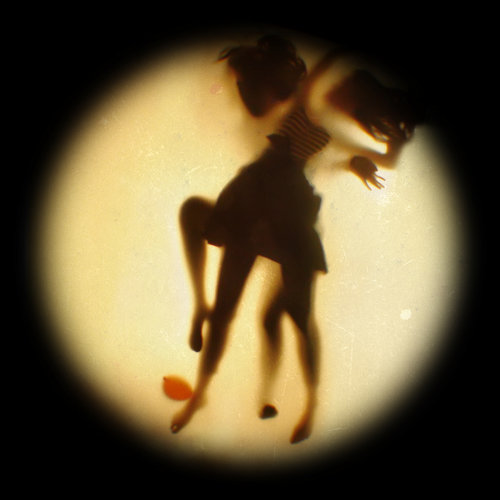

# ＜天玑＞黄昏时偷来你的肋骨酿酒，百年后醉得有血有肉

**每个人都以为自己的生活以妥协结束，而我以妥协开始。**  

# 黄昏时偷来你的肋骨酿酒，

# 百年后醉得有血有肉

## 文/李维恩 （香港浸会大学国际联合学院）

  **1**

当我翻完《了不起的盖茨比》的最后一页，我莫名其妙的回忆起一年前的一个秋夜阅读果戈理《涅瓦大街》的情景。当我在涅瓦大街迷人的街灯和喧闹的人群中目睹一个纯真又孱弱的年轻人的激情被现实的荒谬彻底击碎的时候，我感到一种难以名状的情绪，这令我无处遁形。书中的主人公，庇斯卡辽夫以其全部的生命追求一瞥而来爱情，但是迷人的姑娘却变成了不可理喻的妓女，于是他对美的追求反而嘲讽般的把他推向了生命的尽头。然后，我在那个有点慌张的夜晚里得出了一个结论：不要试图弃拯救任何人。因为这个世界上，不会有太多的人希望在蓝色的天空下不断的延展梦想，包括爱情在内，无奈的具有理想性质的向往与改变他人的试图总会变得苍白和荒谬。然而这种结论在《了不起的盖茨比》面前重新变成了不可名状的乏力与单调。

有人说菲茨杰拉德向我们昭示了美国“爵士时代”充满泡沫般的浮华现实中的幻象，然而我却似乎只看到了盖茨比在他那盛大的派对中，在那绚烂灯火照耀下的觥筹交错中，在那无数富豪和耀眼明星互不相识的假惺惺的畅谈中，紧张的向着大海方向涌动与生命逆流反叛的冲动，一股永远等待的冲动。

每天，盖茨比都会在大海的边缘向着这种等待发抖，不管夜色有多么温柔，不管黛茜的身影离他多么的迫近，他能做的只是伴着他身后那闪耀的城堡式的豪宅，沉重的呼吸以及永恒的孤独。最终，只有盖茨比唯一的朋友尼克理解了他的等待。也许，应该说菲茨杰拉德理解了人群中的等待。虽然菲茨杰拉德随后也把这种等待抛诸脑后，坠入不可遏制的失败中，他终究没有办法化解掉等待那难言的孤苦与焦虑。但当盖茨比荒唐的被手枪打死的一刻，他笔下的尼克伤感坐在了盖茨比无数次去过的海滩上缅怀着那个久远的，未知的世界。在他无限的怅惘中，盖茨比的梦也已经飘散，在依稀的人声鼎沸的幻觉中，只有盖茨比消逝于这个混沌的世界，留下的是逆水行舟后的倒退，还有他镇定而紧张的等待爱情与梦幻的孩子一样的眼神。

尼克还回想起了青年时代那令人激动的返乡的火车。我们有理由怀疑，盖茨比的灵魂并没有在漫长的等待结束之后回家，但那黄昏之后，那些聚集在幽暗车站上纯真的问候与相互依恋，还有寒冬的黑夜里向奔驰的火车两边远方无限伸展的所有归乡人的雪，就在盖茨比死后似乎可以让我们意识是到什么才是灵魂中最重要的部分：那种对未实现梦想的执念。

最后也没能到达的地方，最终也没能牵手的人，永远都会勾起你无穷无尽的思念。即便在后来的人生中你认识到自己已经不再需要曾经梦想的那些，或者自己如今拥有的已经更多，你当年的梦想依旧会在某个深夜不定期的反复将你折磨。

遗憾的是，虽然我们全部都听见了“严寒的黑夜里雪车的铃声”，也都看见过“圣诞冬青花环被窗内的灯火映在雪地上的影子”，但是在经过了许多年后，我们不会把它们与盖茨比生命中最重要的那个码头后令人心醉的绿色联系起来，也不再有勇气重复当年的梦想，甚至不愿提及。正因为如此，我们最终都会站到了现实的一边，我们得到的是相对容易满足的物质生活和看似安稳的人生浮动，而盖茨比，那个了不起的盖茨比，则会永久的站在我们的对岸，忧伤但并不哀怨的注视着等待的哀歌无尽地包围古老的悲剧，那些在无数个世代重复在无数人身上的悲剧。

 **2**

在欧内斯特•海明威（Ernest Hemingway）的巴黎回忆录《流动的盛宴》（A Moveable Feast）中，他花了整本书四分之一左右的篇幅来记叙当时在巴黎已身负盛名的司各特•菲茨杰拉德（Scott Fitzgerald）和自己之间发生的种种有趣的事。当时，风华正茂的菲茨杰拉德已经写出了他了不起的杰作《了不起的盖茨比》，不过与“风华正茂”这个词相照应的是另外一个可怕的词——“英年早逝”。1940年，年仅44岁的这位“迷惘一代”的伟大作家因心脏病突发，于圣诞节前4天猝死在了洛杉矶。海明威曾在读过菲茨杰拉德的最后一部完整的长篇小说《夜色温柔》（Tender Is The Night）之后写信给他说：“你不是一个悲剧性人物，我也不是，我们不过是作家，我们该做的事是写作。”

相对于前辈霍桑或者亨利.詹姆斯，菲茨杰拉德实在是没有任何值得夸耀的资本，在他眼中，或许没有什么比美国本土的学校糟糕了。因此霍桑以其迷人而丰富的笔调写他的故乡英格兰，亨利.詹姆斯在旧世界和新世界交替的时候、像一个欧洲哲学家那样深刻的描写美国人，而海明威这头危险的公牛则把美国的迷惘带到世界公民群体“垮掉的一代”中修炼，然后写成整个人类的迷惘。这其中只有菲茨杰拉德是如此单纯：他面向西部青年和东部青年们的同一个梦想，他看着他们毫无诗意的放纵和狂欢，目睹美国生命的灿烂和黯淡。所以南方人爱墨生热爱这个纯种美国作家，而才华横溢者如福克纳则态度相反。相比菲茨杰拉德，诗人惠特曼比他更好更豪迈的写出了美国，马克.吐温比他更准确的捕捉了美国幽默下的辛酸血泪，欧.亨利则比他遭遇更多，比他更丰富的刻画美国。菲茨杰拉德的平庸由此可见。

然而，这个人，他却整整描写了一个时代。那个时代和我们今天生活的国家如此相像：虚荣、金钱、权力，以及非法的商业操作，欲望在灯火辉煌中毫无保留的释放，人们整日谈论名流和名牌，没有哲学、诗歌和真正意义上的学校。这个时代和那个时代，最赤裸的映照了人性，然而却无人把人性写得更加动人，缺少真正的精神牵引：人人如此，无从对照。

任何作家都无法避免将自己的影子投入到自己的作品中，尤其是悲剧。恰如潜入“鹦鹉螺号”，甘心忍受深海处无限时间的荒谬与煎熬的尼摩船长之于Jules Verne、为了爱情而化为泡沫的小美人鱼之于Heinz Andersen，菲茨杰拉德也不可避免地将自己的人生悲剧融入到自己的名作《了不起的盖茨比》与《夜色温柔》中。借尼克之口叙述的《了不起的盖茨比》可以被认为是一个暗恋者执著追求一个不存在的“梦”的故事。

“世间只有被追求者和追求者，忙碌者和疲惫者。”菲茨杰拉德在书中如是说。在书的结尾，作者更将这种对爱情的执著追求升华到一种对理想的追求——美国梦，全书也因为尼克的这段话而上升到一个新的高度。可是，了不起的盖茨比为什么了不起？其作者书名用意究竟何在？我想，在书的结尾，我们已经找到答案。

“于是，一条条小船逆流而上，我们奋力向前划，却被载着不断地倒退，退回过去。”

我们身处的这个时代，没人能够安稳。人生的悲剧在于，即使你只是以最安全的姿势原地站立，时代的洪流也会将你视为无数的牺牲品之一冲垮。

于是我突然想到王尔德的一句话：无论场面再怎样喧哗，我只是一个头上插满鲜花，将要被送上祭坛的公牛。

 **3**

想起芥川龙之介一则极短小的故事。

有一位年轻人想学习在衣服上绘画的技艺。他的师父最初在教他画衣时，就说，这是一门危险的艺术，你极有可能以生命相赌。这话就像是对自己死期的预言。那位年轻人十分勤奋，技艺举国无双。据说他在衣服上绘画的樱花会在午夜时分纷纷扬扬飘落，他画出的飞鸟会在黄昏的尽头飞出衣裳又在第二个黎明时分归来。四方的大户人家都前来参拜，只求能得到他的一件画衣。某一秋，那位年轻人咳嗽了一整个黄昏后死去，医生解剖，说他的肺已经被颜料的烟云熏得五颜六色，像是被天神收拢在一个袋子里的繁星。

我们所做的任何一个决定背后都有或多或少的权衡或者牺牲，有时候这种牺牲暴烈而决绝，有时又无比的凄美。比如你在一样东西的指引下不断前行，在悲伤、痛苦和恐惧的时分，它带给你安慰、勇气和继续前行的动力。你一边收获着一个个名利上的成功，内心却始终充满着因那样东西的不可得而带来的空虚。然而你可曾知晓，也许你对那样东西的渴望原本就是荒谬的，它只是在你的回忆和幻想中才美丽才具有意义，然后当你真正靠近，才发现它早已变质抑或从不曾存在。

我曾经梦想生活在这样的地方，一个围绕着此起彼伏四季青翠的山峦地方。每天早上睁开眼睛，到处都是绿气袭来。你从来不知道呼吸原来是这么美好的一件事，那些带着生命的气息穿透大地穿透墙壁再穿透过你的身体。苔藓爬上青灰的百年石砖，王宫依然留着当年的容颜，灯笼高高挂起，凄美的故事反复倒转流传。

穿上藤条编织的草鞋，扎染的长衣，批上披肩，穿行过半条街，喝热热的酥油茶，吃新鲜的烤奶酪。从马坊牵出一匹温顺的小马，载着你在日头偏西的时候马铃叮当。进苍山，寂静无人山谷中只有鸟儿的啼鸣，嗒嗒的马蹄响，和你肆无忌惮的笑声。绕过盘山的木板桥，在低头俯身让过千年偎蜿的垂枝老松时，一瞥眼看见山峦间的一线青天。

其实现代人梦想的终点或许不是城市，也不需要没有象征着城市的繁荣和楼群。它没有地界，翻过这座山依然是无尽的青山。山下是一片片整齐的麦田和潺潺的小河，那些青黄交接的梯田，河中清凉的流水，田边的四角凉亭，却比任何图画都要美，它真实的浸透了你的呼吸你的瞳孔。并不宽阔的马路上，朴实的乡人赶着沉甸甸的马车悠闲的经过，偶尔还有一些油亮的水牛，成群的绵羊，活泼的马驹。或许就是这样，在每一个看不见的城市里，留着无数人的梦。有人在梦中骑马穿过车水马龙的人群，走过熙熙攘攘的街口。在梦中每个人都有一个目的地，不知道是什么地方，也不知流向哪里的海。它指引着一个又一个看不见来路的沉甸甸的远航，我于是该走了，拥抱这个城市最后一缕慈悲暖阳。

或许，这眼前的生活并不是你所期望的生活。你诉说梦想的声音像一团被打捞上来的海藻，你的言辞像是从无数的河流、山川中汇聚而来。我们追求的梦想可能不再是我们自己的梦想，而是这个国度强迫我们追求的梦想。而当我再看见你的时候，我也会像库布里克的太空漫游里那样，很快地老去一百年吗？

 **4**

假如让我推荐一位能代表真实内心的诗人，我不会选出博尔赫斯或者维庸。真正触及我心中痛感和存在感的，应该是夏尔·波德莱尔，Charles Baudelaire。

波德莱尔与福楼拜同年出生，生活的时代是浪漫主义最辉煌的时代，与所有在巴黎的名人相映成趣的，是他的独立特行。无论他对李斯特那堪比“生不愿封万户侯”的美誉也罢，还是对乔治桑的种种恶嘲，都令人有些被迫感和尖锐感。

本雅明论及波德莱尔时说，《恶之花》的时代，大众正对抒情诗失去兴趣。拉马丁那样的贵公子日益稀少，诗人很难再如夏多布里昂那样引获举世崇敬。于是，在《巴黎的忧郁》里，波德莱尔说出了他的理想：将他习惯的诗歌去掉脊椎骨，剁成无数小块，没有节奏和韵律而有音乐性，足以适应梦幻的起伏——好了，这就是散文诗。

《巴黎的忧郁》并没有像巴尔扎克或雨果般浩繁广袤的城市或人群描写，甚至也没有像福楼拜（尽管他和波德莱尔同生于1821年，命运把他们指向了文学的两个极点）那样细致科学的氛围描写。这组散文诗的内容，一如波德莱尔对散文诗这种体裁的理想体式一样呈碎片状。人群与城市并没有直接出现，但却无时不刻存在于背景之中。波德莱尔在人群中穿梭，像个隐士一样为每一瞥惊艳。

19世纪的巴黎，拱廊的出现使城市成为花园。《新闻报》的长篇报导、大仲马的连载小说和纸醉金迷的商品与大众美术，使巴黎如梦似幻。可是对波德莱尔来说，这种梦幻像油画颜料般浓郁而不真实。他不像巴尔扎克那样把巴黎尽收眼底，然后吐气开声的宏伟叙述。他在人群中隐居，不断搬迁，每一个他见过的巴黎人都是他心湖中的一点雨，一片涟漪。密集的人群使他的心绪中波澜横生，而又隐藏着阴影。因此，他有源源不断的灵感，但却是破碎的、密集的和阴暗的

工业文明的兴起及大量报纸的淹没，使时代从旷野变成了城市。人群的处境产生了巨大变化。当诗歌和其他文本体裁一样被批量生产、诗人被城市的人群拥挤围绕时，古典文明被湮没了。这算是巴黎的拱廊对时代的反讽：当城市的每个角落都花园化之后，花园本身的诗情画意消失不见。时代与人群使城市变得破碎而不易捕捉，波德莱尔于是出现，用一种既古典又反古典的矛盾体裁来致敬。

波德莱尔的巴黎不像雨果，有无数宏伟思想连缀其戏剧性场面；不像欧仁·苏，有那些精巧的情节牵连。他的巴黎是许多破碎的意象和断想，还夹杂着大麻和鸦片邪恶的氤氲芬芳。如果不是他而是一个庸者来写作，你会觉得那只是疯子的无节律呓语。可是，毕竟他是波德莱尔。《巴黎的忧郁》是他刻意打散的镜子，是他刻意“剁碎、去掉脊椎骨”的蛇。

一位虔诚的诗人，睡眠的仇敌

把这苍白的泪水捧在手掌上

好像乳白石的碎片虹光闪亮

放进他那太阳看不见的心里

---节选自《巴黎的忧郁》 “月之愁”

波德莱尔用他充满黑暗诱惑的美学观点说：爱情是什么？爱情是走出自我的需要。人是一种善于崇拜的动物。崇拜是自我牺牲和自我献身。

所以一切的爱情都是献身。

带着天使星眼燃烧的火焰，我要回到你的房间，穿过夜色昏昏的黑暗，悄悄地溜到你的身边。我将给你，我褐发的情人，像月亮一样的冰冷的吻，就像在墓穴周围爬行的蛇一样与你相依偎。当那天边的黎明降临，你身边便消失我的踪影，直到夜晚的孤寒凄清。别人会对你多意柔情，我却以自以为专断的统治慑服你的青春与生命。

假若哪日我迷踪不明，也请记得我对你有一场动情。

 **5**

在感觉自己身陷平庸的时候，我的脑海里反复出现 Leonard Cohen在晚年不断强调的那个意象：被烈火炙烤的心。身处这样的时代，他有着自己的处世秘诀。他说，当他对一切感到心烦，就想想荷马、但丁、弥尔顿、华兹华斯等。他们也在做着同样的事，他们忍受人生的痛苦，和我们一样，如同草芥飘在尘世，为了挖掘如何令人的灵魂更具尊严的秘诀而工作。在他低沉的声音中我万分迷惘，曾经的故事在不厌其烦的叙述中慢慢远去，而这时你的影像走上前来，稳重的好像群山连绵的根基，地心炙热浓稠的火焰。

油画般的光影色调，童话般的幻想，绝望的孤独，悲伤的命运，所有的一切混合着欲望、罪恶、腐臭当然还有香味的文字，如魔咒般附在你和你命运相连的所有人身上。情节和场景的交织如此离奇浪漫，令人联想到昏暗的青幽小径，斑驳的教堂，孑然孤单的灯影，散发腐败气味的集市……人生就这样一步步将人诱入犹如梦魇、神秘、凄绝的故事中去。

很多时候，总是在某个安静的黄昏，或暮色浓重的时分，周围的世界会悄然地在这样一些场景中展开：一个空荡荡的旅馆房间，一家加油站里暂且驻足的过客，一列行进中的火车车厢，一条不知通往何处的公路。画面中也许空寂杳无人烟，也许会出现个别男女。他们中多数孑然一身，或在街边安然默坐，或在吧台啜饮，或是凝神窗外。他们的姿态极为寻常，却都有那么一丝荒凉和阴郁，强烈地暗示出一片静默中令人不安的因素。一种巨大的孤独和绝望，如同不可抗拒的暮色，向你袭卷过来，似乎要吞噬掉所有的一切。这是当代那些为数不多的写实派作家不厌其烦表现的主题，并且固执的认为，这种庞大的空虚就是我们生活的全部意义。在这样的推论上，我们活着只是在想法设法满足自己的物质欲或者情欲，并没有再进入更高一层空间的可能。

很多时候，我们想忘记所有的代价，只想爱，那么爱的代价反而可能更高。因为爱与仇恨是一体连生儿，你不可能将两者分开来，爱情一旦被剥去温情都是野蛮的，包括仇恨。这不仅意味着看得见的爱是建立在看不见的压抑之上的，而且也意味着爱和仇恨是同一情感的不同方面，同一问题的不同视角。但它们仍然是相反，一方必然导致另一方。

一天中的某些时间，我感觉非常的痛苦。痛苦，因为这是唯一真实的词。这些天夜晚到来时，我因为堵塞的记忆通道惊醒。逼仄的房间倾斜，我双手挥舞着落进布满灰尘的河，河水黑，而且冷，让我忘记来路。仿佛一个人在触摸下体的时候上身突然分崩离析，我的脚下没有坚实的土地。没有母语，没有祖国。

一直怀有死的愿望，却仍然活着，单单这本身就是无穷无尽的爱。

尼采怀着几近癫狂的意识说过，“人最终喜爱的是自己的欲望，而不是自己想要的东西。”我伪装自己的一切狂热，但还是禁不住在梦中梦见无言的高加索山脉，还有卡夫卡、波索亚这些善于沉默的人。高山和你的身形卧在一片我不知名的海岸线上。我强迫你不要告诉我你近来怎样，不要给我电话。写下来，把一切感情都写下来，像被刺穿的肉那样透明和原始。然后我们什么也不要更改。

这样当我在梦里躺下，而你从山脉之上走来的时候，你的身影就会非常清晰而巨大。我希望我们都能在白象一般的群山中出生，而一旦入睡，身下就有异常温暖的土地。 可是再怎样伪装也是无用的，以色列人阿摩司•奥兹早就在《我的米海尔》一开头便喃喃自语道出了我心中的语虚：“我之所以写下这些是因为我爱的人已经死了。我之所以写下这些是因为我在年轻时浑身充满着爱的力量，而今那爱的力量正在死去。可我并不想死。”

 

（采编：安镜轩；责编：安镜轩）

 
