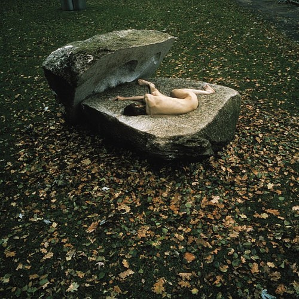
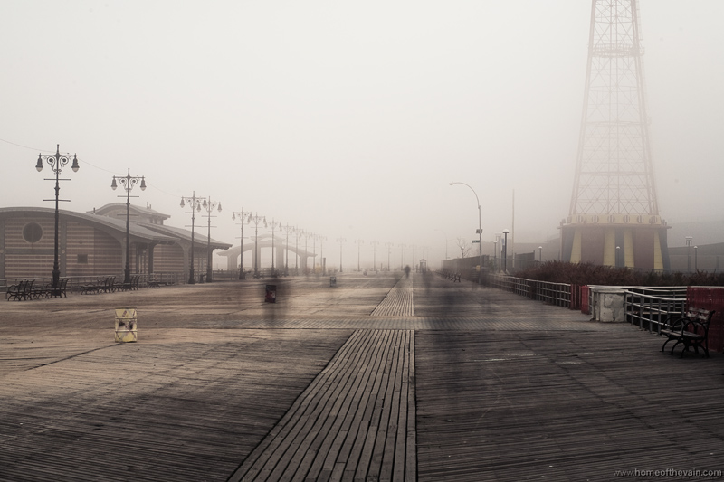
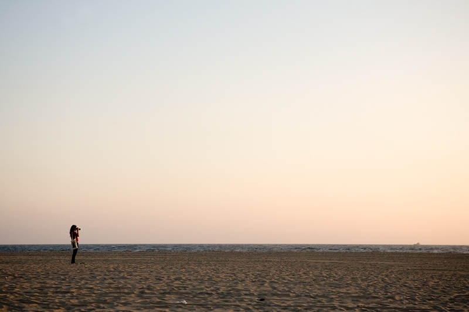

# ＜天璇 ＞为什么迷茫和堕落

**我知道自己为什么迷茫了。我不是在为兴趣做实验，我是在为了一口饭做实验。我在做实验当中缺少热情，是达尔文刁虫子，哥伦布航海，舍勒烧白磷，李比希炸房顶的那种热情。不仅仅是做实验，我学习也只为了那最后的GPA。整个大学是一件为了别人而完成的任务。 **

### 

###  

# 

# 为什么迷茫和堕落

### 

## 文/马开 ( 北京大学)

### 

### 

从今年春季休学至今，在别人的眼中，我一直过着猪一般的生活——不用上课，不用考试，不用操心出国还是保研，不用努力，也不用做出选择。但是我的大脑从来没有停滞。我看了很多书，也尝试了一些其他的生活方式。我一直在思考，为什么在看似优越的环境中，我一直不快乐？我们为什么活着，人生的意义到底是什么？ 一开始我就很痛快的承认了，除了高中化学竞赛的一年，我没有一天是真正快乐的。从我生下来，就是一个很乖的孩子。也许是遗传，软弱的我使得父母没有费丝毫的力气就将他们的价值观复制给了我——要刻苦学习，走在前面，做一个优秀的人。这本没什么错，大多数孩子都是这么被教育的。但是我不喜欢学习，特别是到了初中以后。我不喜欢学习，依然刻苦学习。我重视分数，重视排名，每一次学期的开始都让我陷入一种焦虑，为期中和期末考试做准备，放假后又疯狂的玩，以发泄每学期被压抑的情绪。我喜欢手工制作，喜欢玩转所有的电子产品，现在想想，也许我本来可以成为一个工程师。但是我每天都在为学习烦恼。我不喜欢语文，讨厌写作文，特别是讨厌写出老师希望我们写的作文，然后给我评语；我本来挺喜欢数学，但是它太难了，偏偏又是数学课代表，在初二的时候花了大量时间做BT的平几，却在几何期中考试拿到75分，得到数学老师疑惑的目光；中考本应完全不用担心，正常发挥就能上本校高中，却给自己非常大的压力，一定要考高分，每天的熬夜伤害了身体和情绪。此类事情不胜枚举。 我不喜欢学习，却强迫自己学习。我希望成为优秀的人，但却误以为只有“学习”优秀才能成功。我只能希望获得学习结束后那一点被延迟的快乐和成就感。 

### 

### 

庆幸的是，我拥有一段真正快乐的日子，就是高中的化学竞赛。那段时间，我不确定自己是否喜欢化学，但至少不讨厌，而且比较擅长。我仿佛找到了自己的天命，觉得第一次自己成为了一个有用的人——自己既不讨厌所做的事情，所做的事情又被周围的人所承认。为分数学习、为兴趣学习和为梦想学习感觉是不一样的。当时就想以后我会成为一个优秀的化学工作者。有了这个想法，就什么都不怕。两耳不闻窗外事，只要在做自己喜欢的事情，就很快乐很幸福。幸福不需要大房子，不需要好车，也不需要几十万的年薪，只需要兴趣和梦想。周围一起奋斗的同学也给了我朋友的温暖，直到现在，他们仍旧是我最珍惜的。 上了大学之后，我也不能摆脱迷茫。多年的应试教育磨灭了我们的个性，我们不知道自己想干什么，只是一味地满足家长、学校、社会对我们的要求，并把这种要求想象为自己对自己的要求，然后忠实地实施。面对高考，大家是不是都有一种被强迫感？高考之后，两极分化。一部分自制力差一些的人沉溺于游戏与玩乐，在多年压制自己欲望之后痛快的释放，却在放纵中感到空虚和迷茫；另一部分自制力强的人依旧逼迫自己每天去图书馆学习，去做实验，去背书拿高分，在每天的忙碌中感到疲惫和迷茫。无论生活是积极还是堕落，迷茫是共同的。 我以前觉得我不迷茫。在大环境的感染，在老师和家长的期望中，我希望出国读博士。出国读博士给我的印象是，很优秀，国外的环境很好，科研条件很好。毕业之后可以走学术道路，或者找个好工作，要么定居要么海龟，拿比较丰厚的薪水，买个房子（当然现在就不敢想了），买个车，取个老婆，生个娃，把娃养大。然后呢？让娃去出国读博士，买个房子，取个老婆再生个娃。有人问山里的孩子，你们放羊干什么？放羊，卖钱，取婆姨，生娃，生了娃再放羊…… 有人告诉我这就是生活，生活最终要归于平淡。OK，我觉得挺有道理，于是我开始尝试过这样的生活。我好好学习，考前刷夜，并且找了个课题组，开始研究DNA的转动扩散对FCS有啥影响，虽然我根本不懂把这玩意弄明白了有啥意义。也许我这辈子就会按照自己设想的路走下去了。 可是也许是命运要拯救或者毁灭我，让我对科研的忍耐力还不如对中学语文。在日复一日学习、考试、做实验的重复当中，有一种崩溃的感觉。我问了很多周围的人，很普遍的对话是： 

### 

你喜欢做实验么？ 还行吧。 你真的喜欢做实验么？ 嗯..不太喜欢。 那你为什么要出国？ 因为外国科研环境好，做的研究有水平，blabla…… 别扯淡！ 嗯，因为出国就是好，我也不知道为什么。出国环境好？有钱？能找到好工作？大概这样吧。 你为什么要读博士？ 因为不读博士找不到好工作。现在本科毕业工作多难啊。不读博士也出不了国。 

### 

我知道自己为什么迷茫了。我不是在为兴趣做实验，我是在为了一口饭做实验。我在做实验当中缺少热情，是达尔文刁虫子，哥伦布航海，舍勒烧白磷，李比希炸房顶的那种热情。不仅仅是做实验，我学习也只为了那最后的GPA。整个大学是一件为了别人而完成的任务。 我丢失了自己的梦想，没有自己的价值观，没有特立独行的人生态度。我在为了生存而生活，希望买房子，买好车，找好工作，觉得那样会给自己带来幸福，那样会弥补自己奋斗中所有的痛苦。 很多人就这么妥协了。他们告诉我，这就是成长，这就是成熟。理想是年轻人谈的玩意。踏踏实实干事吧，每天空想着人生的意义，还不如去实验室多过几根柱子来的实在。 我不想妥协，所以我休学了。我需要一段时间纯思考，回忆一下自己的经历，想想自己的兴趣、理想，想想我这辈子到底该做什么，想明白了再奋斗，这一年的时间对于整个人生其实是很微小的。如果钉钉子钉到了砖上，与其加大力度砸，不如换个地方钉。说来也可笑，人们对于人生道路、选择的思考时间还不如在超市里考虑买哪个牌子的方便面的时间多。 我首先想的是，为什么我的路越走越窄？ 

### 

### 

教育。中国教育。中国的应试教育。还有我不假思索的顺从。我们每个人有自己的兴趣和天赋。我喜欢小制作，喜欢机械，从小就拆玩具、看修汽车，做模型。有同学喜欢画画，有同学喜欢打球等等。后来我放弃了制作，因为忙于学习，但是我还能帮忙调试下家电电脑什么的；喜欢画画的人成了板报组的，却只能每周画一次。喜欢打球的成了班里的主力，却只能在不多的课余时间练习。最后大家高考考的都还不错，都进了大学。现在在忙着保研、考研或者实习。 我觉得哪怕我只是中专毕业当个汽车修理工也比现在清醒。至少不用天天花这么多时间在考虑为啥我这么迷茫。我每次看到油腻腻的齿轮和气缸就有一种冲动。我虽然只是个汽车修理工，可是我喜欢，我这辈子要成为全世界最优秀的汽车修理工，我要设计出不增加能耗的自动档车或者按个钮就能换挡的手动档车。我要申请专利，办个厂子赚钱，或者找家公司应聘，平凡终老，总比我天天在实验室研究DNA这虽然重要但我不珍视的东西好。大学不仅是教人怎么考高分，怎么做实验，怎么能够拿到好的offer，怎么出国，怎么多挣钱。更应该教人独立思考，形成属于自己的价值观。如果追求了自己的理想，满意自己的生活，即使成为一个修汽车的，也会和大学教授拥有相同的自信。 我想那位喜欢画画的本来也许能办个画展，那个喜欢打球的说不定能进国家队。可惜他们准备读博士了。 对于一些人，理想不重要，因为根本就没有过理想，不知道有它是啥滋味。另一些人，有过，也知道为理想活着挺好的，可是理想不见了，只好说“年轻时候挺幼稚的”，然后强迫自己向现实妥协，相信生活总是要归于平淡的。最后一些人，觉得活着咋这么没意思呢，混吃等死吧。 教育不好，但我们已经是大学生了啊，不是那些书本能够蛊惑的了。高考完了也一定有人大喊：“老子再不归谁管了！”可是多年的顺从和忍耐已经让我们放弃了反抗，妥协变成了习惯。 

### 

再次用对话做例子： 你喜欢做实验么？ 不喜欢。 那你喜欢啥？ （Blabla，挺好的爱好） 那你为啥不去做呢？ 这不做实验忙么。 那你为啥不能不做实验呢？ 你坑爹呢？不做实验你给我offer，你给我奖学金，你给我文章，你给我PhD，你养我啊！ 

### 

发现了么？让人屈服的最好方法，不是绑个柱子把人烧了，那样在死前反而把反抗精神深深的印入在场的群众中。让人屈服的方法，是用多年的统一化教育，把我们变成价值观一样、思想一样、目的一样的人，干着大学让我们干的事。再用巨大的就业压力，让我们每天为生存担忧，不敢有一丝停顿和懈怠，甚至抽空想想理想都是奢侈的。让我们相信：我必须好好干现在干的事，否则就没有好工作，就不会成功。 想起一个关于买房的笑话，说一个劫匪劫了一堆人，让他们排队交钱，第一个交100，第二个交200，以此类推。于是大家纷纷排队，第一个人得意的说，看，哥比你们交的都少。最后大家争先恐后的交钱，连反抗都忘了。 还有一个故事，一头很大的大象被细绳拴着，很容易就挣脱，可是它不会。因为小时候就被拴着，习惯了，觉得挣脱不了，就不再尝试，虽然一试便知是如此的容易，虽然前面是自由。 我也忘了，我竟然忘了我可以不读博士去做自己喜欢的事并且养活自己。也许不容易，也许会失败，可是有这种可能！而且我会比现在快乐。 我还有多少东西忘了？我们还有多少东西忘了？被潜规则的演员忘了也许她们可以凭实力演出。收红包的医生忘了不收红包也能救人。政府官员忘了不同流合污也可以晋升。我们永远都在以周围的环境要求着自己，逼迫自己去适应周围的环境，从来就没想过自己可以不向环境妥协，甚至改变环境。 至此我变成了一个理想主义者。这段时间我试过不盲目的顺从而去改变，有些失败了，有些却奏效。很多事情比我们想象的容易的多，只是我们从来没想去改变。韩寒说过，在文化界，最强有力的审查不是广电总局，而是每个创作者的自我审查。最大的障碍不是社会，是人的内心。 我想的另外一个问题是，为什么社会这么乱，大家这么疯狂的追求物质，理想哪去了。 从根本上说，我们活着是为了幸福。我们做的一切事情，学习、工作、赚钱，都是为了自己的幸福。我们拼了命读书赚钱，买房买车娶老婆不都是为了幸福么？ 

### 

### 

可是幸福到底是什么？因为统一化的教育，我们的价值观也统一化。以前的人可能觉得入党就很幸福，为共产主义奋斗就很幸福。那个时代的人看上去很可笑。后来人们发现自己可笑，发现信仰、理想什么的都是虚的，不如金钱来的实在，所以现在的人信仰金钱。人们觉得我赚了钱，买了大房子，开了好车，穿了名牌就是幸福。甚至把这些作为理想，作为事业，作为毕生的追求。 在获得这些之后，如果幸福，固然很好。可是如果不幸福呢？良好的物质条件对于一些人足够，对于另一些人却不够。做着自己不喜欢的事，背着沉重的压力，虽然有了丰厚的物质条件，获得的却是空虚。对这些人，金钱不是理想，而是欲望。理想和欲望的区别是：在追求理想的过程中，是快乐、充实、觉得人生有意义的，即使不达到理想，也没关系，因为我没有浪费生命，我为自己的天命奋斗。就像奥斯特洛夫斯基那句著名的话，把“共产主义”替换一下，是对理想最完美的宣言。欲望带来的满足感和幸福感却是短暂的，它在不断的膨胀，让人空虚，然后追求并满足它。再次空虚，又再次膨胀，再次追求，永无止境，如饮鸩止渴。很多贪官拥有的钱是几辈子都花不完的，却不断的贪，不断包二奶，这些在常人看来很奇怪。我就想过，如果我是个贪官，贪上几百万我就不玩了，移民享福去。后来想想太不现实了，欲望是不能满足的，有了一百万就想要一千万。 还是因为我们缺少理想。说的不那么理想化一点，我们缺少多元化的价值观。这么多人，职业有千千万万，我们却没有为兴趣、梦想、天命在奋斗，却只是在为了钱，只是为了成就感，只是为了被夸奖，被尊敬，被膜拜。稍微高尚一点，只是为了不浪费生命，只是为了觉得自己有用，只是为了老了之后不后悔。为什么很多人认为奋斗是痛苦的？是因为奋斗的初衷就错了。奋斗的目标、动力都应该是理想。我们不需要达到目的地，不需要成功，这些只是副产物。真正值得珍惜的，是沿途的风景，是我们为理想奋斗的经历，是我们美好的记忆而不是未来。在追求理想的过程中，成不成功都很快乐。所有人都会说，不要过分关注目的地，要在意沿途的风景。真正做到的人又有多少？有多少人愿意为了没有结果的事业奋斗？具体一点，有多少人愿意为了不能发文章但很有意义的课题奉献自己的5年？很少，是因为这5年的最美好的青春不是人生的组成部分，只是我为了生存、为了金钱、为了获得地位名望成就感等等的牺牲品。人生理想的状态是，做着自己喜欢的事，并设法用它养活自己。但我们却在做着自己不喜欢的事，拼命满足自己不断膨胀的欲望，本末倒置。 我们的生活成本真的那么高吗？我们需要市中心三室两厅的房子，需要一辆好车，需要几十万的年薪么？在现在的我看来，有了理想和兴趣，我只要一个睡觉的地方，一个读书的地方，有吃饭和零花的钱。我不需要买房子，不需要买车，不需要500以上的衣服，不需要出差就住五星级，不抽烟不喝酒，不用送礼。只要我每天都做着自己喜欢的事，我甚至不需要娱乐，不需要休息，不用上天涯看八卦帖子，不用逛bbs，也不用刷校内。海顿说过，当他坐在一架破旧的古钢琴前面，他觉得全世界最富有的国王也没有他幸福。一方面，他的理想让他一辈子快乐和奋斗，另一方面，他的理想也为他带来了安逸的物质生活条件。理想和物质不是对立的。 

### 

 经过这段时间，我已经找到了答案。当然我的理想刚刚形成，还需要一段时间检验和不断调整。我现在相信只要思考，一定有收获。在思考人生意义之类的大问题上，可能永远不会有终极答案，但是每有一点小小的体会，都会给生活带来积极的影响。 就用这些想法对过去的半年做一些总结吧，按照周围人的看法，我变得越来越与众不同，成为了一个异类。但我还是坚持我的想法。 

### 

### 

(采编: 陈轩 责编:陈轩)

### 

### 
