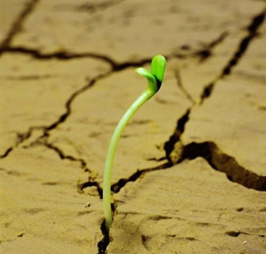
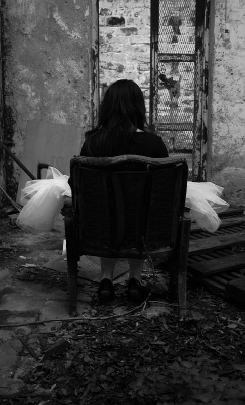
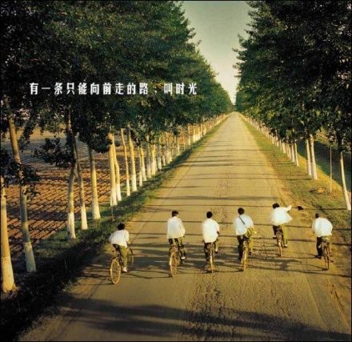

# ＜天璇＞ 没空忧伤的年轻人

**在这个戾气十足的时代，还有什么忧伤可以掩盖你心中的虚弱呢？在微博上的140个字常常还不够写完一首现代诗呢。公共知识分子义正词严地成为了“时代的脊梁”，一些年轻人也脱颖而出成为了“文昆意领”，而“闷声发大财”的一些人则不为所动。看上去一个非常对立的时代，激情却没有地方挥洒，你说你的，我做我的，偶尔有个“反正我是信了”的人，最终被挤到一边去。**

 

# 没空忧伤的年轻人

## 文/王钟的（中国人民大学）

 

京城著名的人文书店，单向街图书馆，老板许知远和南方周末前员工李海鹏对话。李海鹏曾经被称为中国最好的特稿记者，以前实习的时候，在南方周末北京记者站有幸见识风貌，印象最深刻的是那天他穿着印有“精神恍惚”字样的白色T恤衫。大概从那天起，我才分清楚李承鹏、李海鹏和杨海鹏是三个不同的人。

读高中的时候，有位相熟的女孩爱读一本《那些忧伤的年轻人》。有趣的是她读这本书的方法并不是直接购买，而是在电脑上打印了出来，厚厚的一叠A4纸。后来，等她看完了我借来看过，借来了就没有归还，不知道现在有没有被家里当垃圾清除出局。那几年，这本书其实成为了文艺青年的重要谈资，头发始终乱蓬蓬的狮子头许知远也获得了不少“粉丝”。

与此同时，我正在一所不那么出名的县中准备高考，当时似乎觉得读高中的唯一意义就是为了2008年6月的那场考试。那时，我只知道闻一多最后的讲演，却不知道“南都报案”在南方的那个城市发生；我知道翻看地图册上北京规整的布局，却不知道那些皇城天街多少年来的腥风血雨。

大概那个时候正是文学青年最忧伤的几年吧。颓废的北大青年也不怎么写诗了，清华大学中文系的学生以精通计算机语言为骄傲。互联网泡沫虽然破灭了，一个WEB2.0的概念似乎就要拯救人类。那些日子里电视新闻上关于大学生的报道大多都是在校生创业，新兴产业欣欣向荣的样子走入校园。那个时候，Ipod还是非常高贵的电子产品，这给山寨产业送来了第一缕春风。我家的第一台电脑是清华同方出产的，现在仍然躺在卧室里，只不过已经无法开机显示画面。最新的消息则是惠普公司不再制作个人电脑了，读高中那会儿，联想收购IBM的个人计算机部门好像是一件很伟大的事情。

总而言之，尽管文学青年退到一边去了，时代似乎还是向好的方向发展的。北京申奥成功了，高考过后，无与伦比的北京奥运会即将召开。那个时候，地理老师跟我们说高速铁路的建设如何如何前景远大，而且我早已想过，我一定要到北京上学的，高速铁路当然是个不错的体验。几年后我真的到北京上学了，虽然不是我高中时候常常在地图上意淫的博雅塔下。在大学本科的最后一年我也终于坐上了高铁，坐高铁回家没几天，同一趟列车轰地一声宣告了高铁计划的挫折。可是这都是后来，那个时候，如果非要找一个忧伤的理由，能够忧伤的只有文学青年。

那时，文学似乎已经是一个笑话。人们津津乐道的无非是韩寒与郭敬明之间子虚乌有的风流韵事，公共知识分子的说法也没有出现，韩寒还是一个赛车手，郭敬明刚开始做生意，生意不错。认真看待文字的人难免忧伤，嘴巴里还是那几个米兰·昆德拉、玛格丽特·杜拉斯，懂得多一点的，会时不时跳出类似阿伦特、波伏娃等社会学家的名字。

其实能忧伤还是一件好事情，至少忧伤的人懂得为什么忧伤。所以从这个方向看，我还是挺怀念那些忧伤的元素的。现在的年轻人，已经不怎么忧伤的，比如我也找不到许多忧伤的理由来，这些年的关键词是焦虑。大学扩招的后果直接体现在我们这一拨大学生身上，拥挤的寝室和找不到座位的教室，食堂里摩肩接踵的人群。不管如何，四年时光都可以忍受，而且无论大学多么糟糕，毕业以后剩下的只有怀念。更大的焦虑体现在毕业之后如何，这显然不是忧伤能够化解的。

不过年轻人真的没有时间忧伤了。在这个戾气十足的时代，还有什么忧伤可以掩盖你心中的虚弱呢？在微博上的140个字常常还不够写完一首现代诗呢。公共知识分子义正词严地成为了“时代的脊梁”，一些年轻人也脱颖而出成为了“文昆意领”，而“闷声发大财”的一些人则不为所动。看上去一个非常对立的时代，激情却没有地方挥洒，你说你的，我做我的，偶尔有个“反正我是信了”的人，最终被挤到一边去。

剩下的似乎都是末世情结，在这一点上无论是愤青还是“五道杠”都在内心取得了一致意见。社会的远大道路都是故事里的，呐喊也好，消沉也罢，个人的虚弱萦绕在每个年轻人眉间。每个人都感到时代的终止，每个人都在这个浮躁的时代里上上下下地漂浮着。

 

（采编：佛冉 责编：黄理罡）

 
