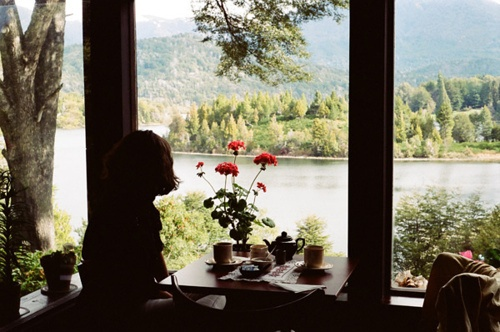
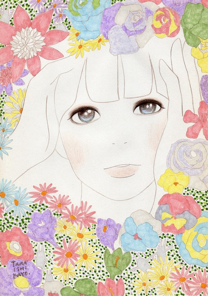

# ＜天璇＞ 速溶春天

**其实，春天可否做成速溶的粉末呢，封在小小的袋子里，每当格外想念春天的时候，便拿一包出来冲出春天的味道。这是我一个人的速溶春天，自斟自饮。**

### ** **

### 

** **

# 速溶春天

### 

## 文/麦静（中山大学）

### 

### 

拂去新落在单车坐垫上的嫩绿芽苞，才意识到这已是春天了。有路过的女孩子轻轻和身边的友人感叹，真是一场春雨一场寒呵。正是春寒料峭的时候，春天里最好的一段，没有春日迟迟的那种近于喧闹的明艳。没有阳光，没有花朵，连雀鸟的唧唧啾啾也甚少，有的只是湿重的苍白雾气，以及清冷的孤独。

这个时节常常有卖鸡蛋芒，胖乎乎的小小一个，恰好可以握在手里。最喜欢买一袋子回来，倚在阳台的栏杆上，对半切开，再慢慢地用刀划菱格，带点微微辛辣的清甜汁水淌了一手，在湿漉漉的空气里直涌上来，这是春天里必定要做的事情。差不多每次我都要想起“纤手破新橙”的句子，有时也走走神，想想普鲁斯特把小玛德莱娜点心扔到椴花茶里的样子，我想那种兴味大约也不外如是。

今年我却几乎再也不做这种闲得发慌又美好得发指的事情。生活像我每天必定要冲的若干种速溶粉末一样瞬间消逝在时间里，然后变成一杯味道不好也不坏，没有享受也没有折磨的即溶饮品。我过上了规律的生活，每天早上起来冲一杯即溶咖啡，然后再冲一包燕麦片做早餐，吃过午饭以后冲一个立顿的茶包，午觉起来以后再放一片维他命C泡腾片冲水喝，吃过晚饭以后冲一个另一种口味的立顿茶包，晚上临睡前再冲一杯板蓝根或者夏桑菊冲剂。从我的精神到身体，都差不多被消解成一些相同的粉末，我空空荡荡，等待着被时间的洪流彻底冲调而后消失。

### 

### 

“生活的艺术，有一部分我不是不能领略……在没有人与人交接的场合，我充满了生活的欢悦。”然而我却颓然地发现，我正逐渐失却这种能力。在拉丁文课上，我激赏一个句子，“Rotam fortunae non timent”（他们并不惧怕命运的巨轮），然而我自己呢，却为自己装上了可笑的轮子，在无比笨拙而慌乱地匆匆向前赶路。“为了这个世界，你可笑地为自己套上了挽具。”这个我曾经最爱引用的句子，现在读来真是一个绝妙的讽刺。

最近我对自己说，没有多少时间可以浪费了。巨大的变故与灾难常常让人产生一种不确定感，不知道生命还可以被握在手里多久。我想，在大学里我几乎把所有事情都做了一遍，从逃课，逃考试，偷偷跑去旅行，恋爱和失恋，钻大门翻进宿舍，通宵狂欢，劈酒，大笑大喊大哭大叫，偏偏我没有做过的事是静下心来读一次书。如果明天要死的话怎么办呢，我还有那么多想做的事，我还远远不是我想成为的自己。

前几天去看了《观音山》，比期待的要平淡，但还是有一些镜头值得回味。平淡的青春，平淡的生活，这当中隐含着一种无法言说的恐惧，即使是最简单的贫瘠的生活仍然可以美好得让我们执迷不休。然而最后的镜头逐渐地远去，青绿的群山，黑暗的隧道，寂静的风声，苍白的阳光打在年轻的脸上，一切的执着终于归向永恒的孤独与安息。

有时我想，有天我心爱的男人死在我面前，那时我们也许都已年老，或许尚且年轻。我会悲恸不已吗，还是只是安静地抱着他，想着，我们始终还会在一起的，我从来没有后悔过所有与你一起花费的日子。有什么是值得执着的，有什么是不可以浪费的？我为什么要介意不能成为完美的自己，我从未完美过，也永远不会完美。只要每一天我都在做我想做的事，生命就应该这样被浪费，被挥霍一空，一去不返。

想起小时候的春天，那时小孩子们喜欢玩一种用胶棒吹的薄膜泡泡，五毛钱一支，可以吹出很大的、泛着梦幻光泽的泡泡来。而我却总是学不会，只好一个人蹲在地上玩。那时每逢春天，泥地上总会开一种紫白色的小花，只有约莫半个指甲盖的大小，白色中透出一种带点病态的幽蓝，异常的纤弱和美丽。我喜欢看这些小花，一看可以看许久，其他孩子却说，它叫人头花，只有下面埋了人头的地方才能长出来，让我不要靠近。但我还是喜欢看它们，一看就是大半天。有时我想，也许是从那个时候开始喜欢初春，喜欢那种清冷的孤独感。世界如此美好，亦不必与谁分享，只是静静地独自欣赏一些值得欣赏的事情，足够了。

### 

### 

其实，春天可否做成速溶的粉末呢，封在小小的袋子里，每当格外想念春天的时候，便拿一包出来冲出春天的味道。这是我一个人的速溶春天，自斟自饮。

不过想想，还是算了吧。春天始终会来临，又终将过去，每一个昨天，今天，明天，亦复如是，那些我遇过的人，爱过的人，恨过的人，他们也将渐行渐远。我又何必抱着一包速溶的记忆，念念不忘呢。

“远在远方的风比远方更远……我把这远方的远归还草原。”

### 

(采编: 黄理罡 责编：黄理罡)

### 

### 
