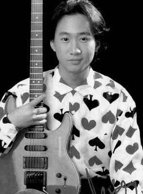
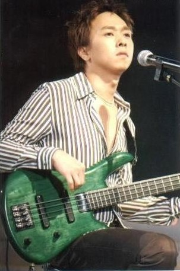
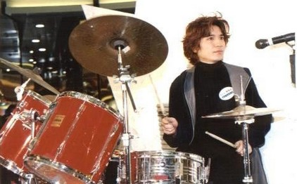

# ＜天璇＞BEYOND ,BEYOND BEYOND

**只能说，这一切都是如此自然，世界其实一直是那么复杂，只是我们原先的世界很小，才会觉得简单。你在长大，你的世界也在长大，并慢慢和那个复杂世界融合，所以，最终我们都会变得复杂。虽然有时候你很想说纯真是最好的，但这复杂之后的纯真，又和最开始混沌未开的纯真悬殊不同。** **所以，后来你开始听金属乐，你想：好像BEYOND真的没那么“摇滚”，挺“流行”的。** **但你还是对他存有一份特殊的情感，因为那是你聆听经验的开始。**  

# BEYOND ,BEYOND BEYOND

## 文/董泽宇（中国传媒大学）

#### 1.

前些天去唱K，我正和初中同学聊着天，突然他们戳着我，说：轮到你了，唱啊。

我抬头一看，是BEYOND的《不再犹豫》，奇怪，这歌我没点啊。

他们笑着说：我们帮你点的，你不是初中的时候老唱BEYOND，还成天推荐给我们么。

我一想，是有这么回事儿，便拿起话筒，唱了起来。可唱着唱着，又觉得怪怪的，真像是在唱一首从未听过的歌一般，甚至当年丝毫未觉山寨的生硬粤语模仿，也在不断暗中提醒我：算了，别唱了。

后来回了家，我翻箱倒柜地寻找旧物，终于从床底下翻出了已然落满灰尘的旧CD，那是一张BEYOND的精选集。

真是快啊，我想，就连CD这玩意儿，也像是上个时代的东西了。第一次见这CD，第一次听BEYOND，差不多是十年前了，那会儿我半只脚已经踏入了成长的门槛，还不太明白世界上有这么多的烦恼和忧愁，是BEYOND，伴我度过了可被称作“青春”的那段时光的第一章节。

是的，第一章节，而不是全部。

因为后来，我开始听枪花，开始听涅槃，开始听Metallica，开始听……

这么一想，Axl Rose电锯一般的嗓音，Kurt Cobain暴戾不安的怒吼，Metallica工整流畅的Riff，也很久很久没听了呢。

“很久”是多久呢？好像也没多久。不过，多少算是已经翻过去的章节了吧。

“已经翻过去”的意思是：回首相望，既熟悉，又陌生，仿佛现在的自己在看从前的自己一般。

说起来，当年我既在网上搜索过“黄贯中 老五 谁更厉害”，也搜索过“TOSHI 黄家驹 谁更厉害”，还在网上搜索过“BEYOND到底是不是摇滚”，因为那会儿模模糊糊知道有个乐队叫唐朝，主音吉他刘义军亦即老五，被称为是“中国最好的吉他手”，还模模糊糊知道有个乐队叫X-Japan，主唱Toshi被称为是“亚洲第一主唱”，同时也知道在一些人心中，BEYOND根本不是“摇滚”，是“流行”。

在那时候的我的心中，BEYOND是当仁不让的天下第一乐团，面对任何质疑家驹唱功，质疑贯中吉他技术，质疑BEYOND是不是“摇滚”的疑问，我都想找出逻辑清晰证据确凿的反驳，去说服他。

后来我才知道，我的目的不是“说服”，而是“保护”，保护自己内心的某些东西。

当时我还不知道，在青春的另外一些章节中，“唐朝”和“X-Japan”也成了章节名。

这么一想，也已经很久没有听唐朝和X-Japan了。

#### 2.

总有人说“金属乐好吵，听不下去”，可单从音乐的编排以及演奏难度上来说，金属乐的平均水平肯定是超过流行歌的，不至于是因为技术水平低而“吵”，而且真正听金属乐的人，也不会说它“吵”，而是会说它“重”。

所以，很多听惯了“流行歌”的人听不惯“摇滚乐”，其实不是真的“我就是喜欢流行歌”，而是因为他的“聆听经验”不够丰富。

当你觉得金属乐“吵”时，其实是因为你听不出来其中层次丰富的Riff和激荡起伏的SOLO，因为你已经习惯了流行歌卡拉OK伴奏式的简单和声以及主歌副歌不断交替演唱的旋律编排，就算让你去听“不吵”的后摇，估计你也听不太惯，因为你的第一反应，很可能就是“怎么半天都没人唱呢？”。

所以，很容易理解为什么爱听摇滚乐的人很多都不怎么听“流行歌”，因为从他们的听觉感受上来说，那些“流行歌”有点儿千篇一律：旋律上，听来听去就那么几种典型的和弦走向；结构上，主歌，副歌，主歌，副歌，（bridge），副歌X2，结束；内容上，我爱你，你不爱我，青春真好，梦想真美，没了。简直和小孩儿过家家一样没意思。

#### 3.

说“简直和小孩儿过家家一样没意思”的人，大多已经不是小孩儿了，因为小孩子是很喜欢玩过家家的，会觉得“很有意思”。

而“大人”，则有他们自己的“过家家”。

有一年夏天，我拿着一听冰啤酒去见一位老同学，她问我：才从聚会的饭局上出来？

我迷惑地看着她，摇头。

她问：那干嘛喝酒？

我想了想，说：啤酒不是成年人的可乐雪碧么。

她笑了，我也笑了。我们俩好像都突然发现了一个“秘密”：我们已经成年了。

后来我暗中琢磨过一个问题：小孩子喜欢的东西，如奶糖，巧克力，甜甜的，很直接的“好吃”，而大人喜欢的东西，香烟，酒精，咖啡，味道则比较复杂，单说第一口的温觉，很难说是“好吃”，这是为什么呢？

一般的答案是因为这些东西里面有能刺激神经系统的成分，甚或让人成瘾。但我想，这种干巴巴的生物学解释实在是太过枯燥，也许有些别的因素。

是“复杂”。

大人瘾品的味道都比较复杂，由此提供了一种“丰富”的感觉，让人沉浸其中，难以自拔。就比如啤酒，直到今天，我都不觉得啤酒很直接的“好喝”，但入口后那种“说不清楚”的味道却很吸引我。

而这种体会，并不是生来就有的。说起来，我小时候真觉得啤酒是世界上最难喝的东西，每逢家人聚会逗小孩儿，让我喝上一口，我都要在地上耍赖半天，硬是不愿意触碰。可后来，忘了是什么时候，慢慢地开始喝了起来，等到我反应过来时，已经喜欢上那种感觉了。难怪村上春树笔下的那些男性都喜欢没事干喝点儿啤酒呢。

#### 4.

深入一些，可以说，其实听歌和和喝饮品是一样的。一开始，大家都喜欢简单直白地表达，流行歌直抒胸臆的“我喜欢你”，让我们感到自己的心里话被说了出来。可后来，随着生活经验的丰富，我们的耳朵对“聆听经验”也有了更多的要求，具体点说，就是希望其能随着生活经验的丰富而丰富。

所以，不管你是听摇滚乐，爵士乐，还是听古典乐，什么乐，可能最开始是走向音乐形式的复杂，以及技巧性的提高，或所谓的“重”。但最后，很可能一切反而变“简单”了，形式上的“简单”，或者你会走向摒弃“人声”的方向，亦即开始迷恋乐器的演奏。因为真正复杂的情感，是语言无法表达的，叔本华就认为音乐可以让我们直接领悟意志的发展变化，因为音乐不以概念为中介。

这就是所谓的“看山是山，看水是水”，“看山不是山，看水不是水”，最后则是“看山是山，看水是水”。

因此，你很难看到一个大人戴着耳机，哼着旋律，像小孩子唱儿歌一样欢快地蹦来跳去，他听摇滚乐，听爵士乐，不是为了很直接的“欢快”，而是有其自身“复杂”的感受，那感受带来的享受，你若非要逼问，他可能憋了半天，也说不出一个所以然来，可能只是淡淡的，“喜欢”。

至于当年还在听流行歌的我们，虽然自己觉得感受挺复杂的，但其实是简单的，不过是《开不了口》的《简单爱》。而现如今，就算是流行歌，我和我周围的朋友也不听周杰伦了，都跑去听陈奕迅了。因为陈奕迅更加“复杂”，因为林夕更加“复杂”。

我们毕竟都难以挽回地长大了。

不过，却又觉得还好。虽然我们常说“小孩子真幸福”，可你端起酒杯或烟蒂的时候，其实很少会去想：手里拿的要是巧克力或大白兔就好了。

只能说，这一切都是如此自然，世界其实一直是那么复杂，只是我们原先的世界很小，才会觉得简单。你在长大，你的世界也在长大，并慢慢和那个复杂世界融合，所以，最终我们都会变得复杂。虽然有时候你很想说纯真是最好的，但这复杂之后的纯真，又和最开始混沌未开的纯真悬殊不同。

所以，后来你开始听金属乐，你想：好像BEYOND真的没那么“摇滚”，挺“流行”的。

但你还是对他存有一份特殊的情感，因为那是你聆听经验的开始。

所以，后来你开始和一个化着彩妆踩着高跟鞋的姑娘约会，你想：那个所谓“初恋女友”，现在看来倒不太像“谈恋爱”，倒是懵懵懂懂地自导自演居多。

但你还是对她存有一份特殊的情感，因为那是你爱情经验的开始。

你总忘不了自己的最初，即使忘了也是假装忘了，因为一切“如今”和“未来”都是从“最初”中生发出来的。你不断超越着最初，也不断被未来超越。

BEYOND的一种翻译就是：超越。

BEYOND ,BEYOND BEYOND.

 

（采编：麦静；责编：麦静）

 
