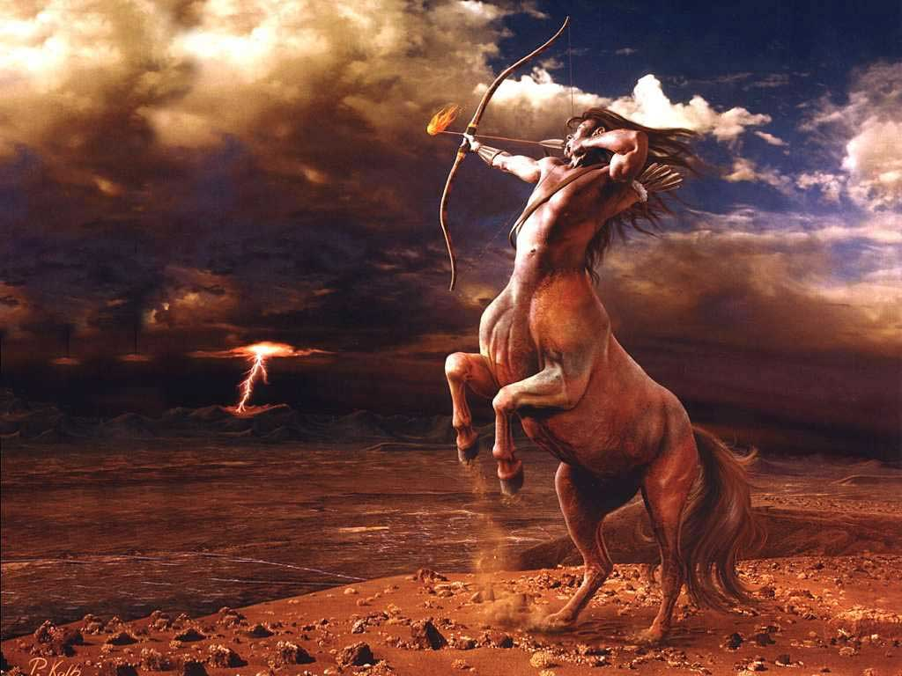
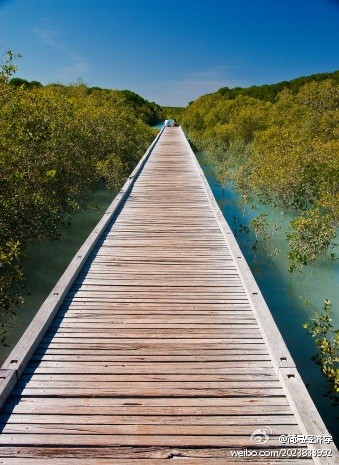

# ＜天璇＞Quarter Life Crisis

**我们小心翼翼行走的人生路上，一侧是平庸怯懦的泥潭，而另一侧是孤独艰辛的深渊；一不留神或者稍有紧张就会不可避免落入痛苦。于是每天向前迈出的每一步其紧张风险程度都不亚于一场战争。人所能做的也许就只有对自己负责，对每一个战役负责，对自己的回忆和睡眠负责，对一个故事负责。**

# **Quarter Life Crisis**

## **文/韩赟儒(Columbia University）******

1.

如果某天早上睡梦中，忽然听见一个不大不小的声音叫你，迷迷糊糊地翻了个身它却还在不厌其烦地喊着你的名字，最终你不胜其扰怒从心起准备一掀被子跳起来发火的时候突然清清楚楚听见了这么一句：

——快醒醒吧。25啦！

你会作何反应呢？

是愕然惊醒，迅速睁眼打量一下这个世界还有自己，确认一切和昨天的情形不可分辨之后有那么一点悲从中来？还是没轻没重地挥挥手拍拍脑袋骂上一句“你丫疯了吧”，继续该干嘛干嘛昏沉睡去？

或者像我一样，慢腾腾坐起来低头找拖鞋，趿拉着去摸索昨天放在哪的杯子，灌两大口水下肚之后悻悻地对它说：行啦，

——早就知道啦。

2.

关于四分之一生命危机这事，在我生日那天，有人和我争论。他们的说法很简单：哪能拿一百年作为生命的期限呢？虽然不可靠信息源Wiki说了这个危机“ranging from the late teens to the early thirties”，我也应该提供一个稍微明确点的理由说明为啥突然把它拎出来说事。

我想了想，决定或者说发现自己一直以来其实是选择了睡在对面的姥姥作为了生命标尺。就在那之前不久，家人大摆宴席为我姥姥庆祝了她本命年96周岁的生日。此前，我一直在“奔向姥姥生命四分之一”的大路上撒丫奋跑，现在终于算是追上了。

姥姥这个人有什么神奇的呢？我从小就跟她在一间屋睡觉，从来没好好想过。那时候我最不能理解的就是，某些天的早上听姥姥抱怨，跟我妈跟我们似乎也是跟她自己说：“唉，昨天晚上一夜没睡着！” （这怎么可能呢？我好像还听见您打呼噜了呢…）问她原因，回答就更令人不能理解：“唉，胡思乱想，一点也睡不着。”（您身体健康儿女孝顺吃嘛嘛香，有什么可想的啊？）再问，就是“唉，乱七八糟，都是些过去的事情…不提也罢。”（过去？过去的事有什么好想的？真是怪哉…）

然后一转眼二十年就过去了，高中后期我就不再和姥姥一起睡觉，后来外出读书每次回家还总要陪她一段。过去那日上三竿也照旧一副死猪不怕太阳照的睡相随之一去不返。大学时常常在寝室里幸福的“睡眠交响曲”中默默注视黑暗的天花板；来美后独居一室更怕失眠，无论是夜深难寐还是三更梦回，那似眠非醒、与所有已逝的快乐和未尽的酸楚打交道的滋味真是难以言说。

直到有一次，我突然想起了姥姥，想起她那些“睡不着”的日子，感到十分害怕。她那四倍于我的、毫不平凡的生命，历经襁褓丧父、两度丧夫、战乱随军、运动斗争、饥荒、洪水、地震、寡居…充斥无数动荡的生命，一个很善良爱的很深、很坚强从不服输的女人的近百年的生命，每个日日夜夜的味道，投射在一个失眠的夜里，会是怎样一种孤独无力的挣扎呢？我突然不敢想象。

而令我害怕的是，我也还要再活很久呢。慢慢地，慢慢地，活很久。

3.

有时候真的想要不劳而获，想要省略解答过程翻到最后一页去偷看人生的答案，想要在某天早上一觉醒来发现自己已经老了，七八十岁吧，一生的苦乐都发了芽开了花结了籽，安安稳稳地收获了记忆储在仓里，不用害怕也不会着急。

于是，突然很想要知道老太太们对这个世界的看法。

我看了《一个人的好天气》，觉得自己和知寿很像，或者大概很多人都这样。

“真羡慕你，吟子没有烦恼。因为痛苦的事都做完了，几十年前的事都忘了，所以每天都特别快乐。”

“我想象着在那些猫的照片边上挂上吟子的遗像的画面。早晚吟子也会成为没了名字的死者中的一员，失去个性吧。谁也不会再谈起她，她吃过什么穿过什么，这些日常琐事就像原本不存在似的，会消失得无影无踪。 ”

“我这么下去行吗？”

“外面的世界很残酷吧。我这样的人会很快堕落的吧？”

但是吟子说：

“这种事并不像想象的那么好，也没有那么坏。”

“（空虚）可不能在年轻时都用光了，要是只留下愉快的事，上了年纪，就怕死了。"

“是啊，怕死呀。什么年龄的人都害怕难过和痛苦的。”

“世界不分内外的呀。这世界只有一个。”

就像很多年长人的话，在我听来似乎有些明白又不那么足以令人信赖。

我又看了The Iron Lady。

我不是很在意那些张力不足的事件描绘，也不是很在意缺乏内涵的政治立场。

当梅姑扮演的铁娘子，面对战争端坐在大厅中央的椅子上一字一顿地说出 “I have done battle every single day of my life” 的时候，就觉得其他无论对电影或者人物的褒贬都不再重要。这句话出口没有骄矜炫耀也没有诉苦抱怨，一个会win big也会lose big的女人，在生命的最末一站仍旧要日日夜夜与死亡、孤独和回忆斗争，让我想到96岁的姥姥仍然每天努力不把饭粒撒在衣服或者地上，尽管这件事对于她已经变得越来越难。

我们小心翼翼行走的人生路上，一侧是平庸怯懦的泥潭，而另一侧是孤独艰辛的深渊；一不留神或者稍有紧张就会不可避免落入痛苦。于是每天向前迈出的每一步其紧张风险程度都不亚于一场战争。人所能做的也许就只有对自己负责，对每一个战役负责，对自己的回忆和睡眠负责，对一个故事负责。

长大所带来的这种心理感受也许就像老去所带来的生理感受，当你对身边的人抱怨关节不灵活了、眼睛模糊了、听力也衰退了，他们的安慰更像是一种敷衍：人老了，这些是正常的。仿佛年龄增长就标志着对亚健康状态的妥协和长期共生，任何企图索回一个新生儿一般清新的、轻松的、自由的躯体的念头都像“癞蛤蟆想吃天鹅肉”成为一个不切实际的奢望遭人背后耻笑。 

4.

莎士比亚写麦克白，被野心驱使扼抑良知杀害无辜，当他发现自己已经一步步走入血泊深处时，无论是继续向前还是回头赎罪，都要趟着鲜血行走同样的距离，内心煎熬一时无两。

我没有伤害过他人的生命，可我残忍地杀害过很多个无辜的、简单的、天真的我。 当生命航行至人生的深处，再回望故乡出发的港口，就和那传说中的彼岸同样遥远不可见了。

这茫茫无际的海面没有人知道该向哪一个方向。狂风暴雨和暗潮深涌看似最为骇人，然而沉默的海面时常可见随波逐流的沉舟残骸和云雾后突然闪现亦真亦幻的丰美岛屿，伴随着那些长得像永恒一样、除了大海一无所见的行驶，才更加令人痛苦。

总有船想要再出发，想要走得更远，期待更神奇的陆地或者更刺激人心的航程。一次又一次离开一片片陆地港口时，也许才发现这所谓彼岸其实也没有人知道是否存在，而我们出发时的港口也不过是祖先流浪的最后一站罢了。

你看这些讲故事的人的花招，他们把那些最难以传达、最需要亲历也最动人心魄的部分偷偷地省略，只把开头和结尾凑成一句话告诉你。就像张贤科老师讲高代的时候说过，书中所有写着“易证”和“显然”的地方正是写书人留的陷阱，恰恰是最不平凡、最需要读书人亲自验证一番，只有做过的人才晓得其中的妙处。

这人生的无意义和有意义仿佛都在其中了，像是同一回事。

 

（采编：何凌昊 责编：尹桑）

 
